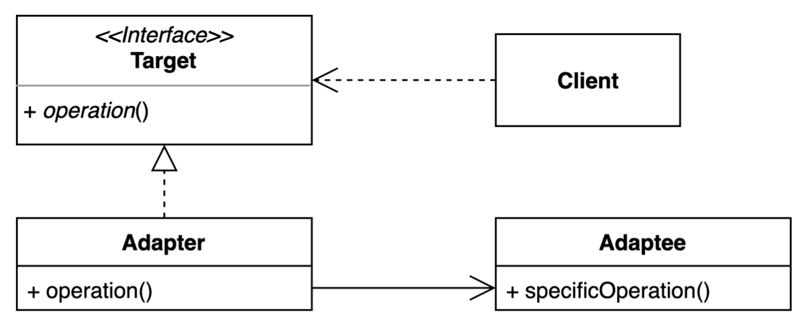

# 멤버 클래스는 되도록 static으로 만들라


# 1 중첩 클래스(Nested Class)

* 중첩 클래스란 다른 **클래스 안에 정의된 클래스**를 말한다
* 중첩 클래스는 자신 바깥 클래스에서만 쓰여야하며, 그 외의 쓰임새가 있다면 톱레벨 클래스로 만들어야한다


## 1.1 중첩클래스의 종류

* static의 유무로 static nested class 클래스와 non-static nested class로 나누어진다
* non-static nested class는 이너 클래스라고 한다
  * 이너 클래스의 특별한 경우로 익명 클래스와 지역 클래스가 있다


**중첩클래스의 종류**

1. 정적 멤버 클래스(static member classes, static nested classes)
2. 이너 클래스(inner class, non-static nested class)
   1. 멤버 클래스(nonstatic member classes): 클래스 내부에 선언된 클래스
   2. 지역 클래스(local class): 메서드의 바디 내에서 선언된 이너 클래스
   3. 익명 클래스(anonymous class): 이름이 없는 지역 클래스


# 2 정적 멤버 클래스(static member classes)

*  static nested classes라고도 불린다
* `static` 키워드로 선언된 중첩 클래스를 말한다.
* 정적 멤버 클래스는 바깥쪽 클래스와 연결되어있다.


**바깥 클래스의 private 멤버에도 접근할수 있다**

```java
@NoArgsConstructor
public class OuterClass {
  private static int outerClassStaticField = 10;
  private static int getOuterClassStaticField(){
    return outerClassStaticField;
  }

  @NoArgsConstructor
  public static class StaticMemberClass {

    public int getOuterClassStaticField() {
      return outerClassStaticField;
    }

    public int callGetOuterClassStaticField() {
      return getOuterClassStaticField();
    }
  }
}
```

```java
@Test
@DisplayName("Static Nested Class는 바깥 클래스의 private static field 접근 가능")
void accessPrivateStaticField() {
  // when
  int result = OuterClass.StaticNestedClass.getOuterClassStaticField();

  // then
  assertThat(result).isEqualTo(10);
}

@Test
@DisplayName("Static Nested Class는 바깥 클래스의 private static Method 접근 가능")
void accessPrivateStaticMethod() {
  // when
  int result = OuterClass.StaticNestedClass.callGetOuterClassStaticField();

  // then
  assertThat(result).isEqualTo(10);
}
```


**정적 멤버 클래스가 private인 경우 바깥 클래스만 접근할 수 있다**

```java
@NoArgsConstructor
public class OuterClass {
  private static int outerClassStaticField = 10;
  private static int getOuterClassStaticField(){
    return outerClassStaticField;
  }

  @NoArgsConstructor
  private static class StaticMemberClass {

    public static int getOuterClassStaticField() {
      return outerClassStaticField;
    }

    public static int callGetOuterClassStaticField() {
      return getOuterClassStaticField();
    }
  }
}
```


## 2.1 public 정적 멤버 클래스(도우미 클래스)

**정적 멤버 클래스는 흔히 바깥 클래스와 함께 쓰일 때만 유용한 public 도우미 클래스로 쓰인다**

* Calculator: 계산기
* Operation: 계산기가 지원하는 연산 종류를 정의하는 열거 타입
* Operation은 Calculator 클래스의 public 정적 멤버 클래스가 되어야한다
* 그러면 Calculator.Operation.PLUS, Calculator.Operation.MINUS 같은 형태로 원하는 연산을 참조할 수 있다


**Calculator.java**

* enum 은 기본적으로 static
* Calculator의 도우미 클래스 Operation

```java
public class Calculator {

  @AllArgsConstructor
  public enum Operation {
    PLUS((x, y) -> x + y),
    MINUS((x, y) -> x - y);

    private BiFunction<Integer, Integer, Integer> expression;

    public int calculate(int x, int y) {
      return this.expression.apply(x, y);
    }
  }

  public static int calculate(int x, int y, Operation operation) {
    return operation.calculate(x, y);
  }
}
```

```java
@Test
void helperPlus() {
  // when
  int result = Calculator.calculate(10, 20, Calculator.Operation.PLUS);

  // then
  assertThat(result).isEqualTo(30);
}

@Test
void helperMinus() {
  // when
  int result = Calculator.calculate(10, 20, Calculator.Operation.MINUS);

  // then
  assertThat(result).isEqualTo(-10);
}
```


**도우미 클래스가 없다면?**

```java
public class CalculatorNoHelper {
  public static int calculate(int x, int y, BiFunction<Integer, Integer, Integer> expression) {
    return expression.apply(x, y);
  }
}
```

```java
@Test
void noHelperPlus() {
  // when
  int result = CalculatorNoHelper.calculate(10, 20, (x, y) -> x + y);

  // then
  assertThat(result).isEqualTo(30);
}

@Test
void noHelperMinus() {
  // when
  int result = CalculatorNoHelper.calculate(10, 20, (x, y) -> x - y);

  // then
  assertThat(result).isEqualTo(-10);
}
```


## 2.2 private 정적 멤버 클래스

* **private 정적 멤버 클래스는 흔히 바깥 클래스가 표현하는 객체의 한 부분(구성요소)을 나타낼 때 쓴다.**
* key-value를 매칭시키는 Map 인스턴스에서 키-값 쌍을 나타내는 엔트리(Entry)는 맵과 연관이 있지만 엔트리의 메서드(getKey, getValue, setValue)은 맵을 직접 사용하지 않는다.
* 따라서, 엔트리를 비정적 멤버 클래스로 표현하는 것은 낭비고, private 정적 멤버 클래스가 가장 알맞는다.
* 엔트리를 선언할 때 실수로 static을 빠뜨려도 맵은 여전히 동작하겠지만, 모든 엔트리가 바깥 맵으로의 참조를 갖게 되어 공간과 시간을 낭비할 것이다.


**Map.java**

```java
package java.util;

public interface Map<K, V> {
  interface Entry<K, V> {
    K getKey();
    V getValue();
    V setValue(V value);
    ...
  }
}
```


**HashMap.java**

```java
package java.util;

public class HashMap<K,V> extends AbstractMap<K,V>
  implements Map<K,V>, Cloneable, Serializable {

  transient Node<K,V>[] table;

  static class Node<K,V> implements Map.Entry<K,V> {
    final int hash;
    final K key;
    V value;
    Node<K,V> next;

    Node(int hash, K key, V value, Node<K,V> next) {
      this.hash = hash;
      this.key = key;
      this.value = value;
      this.next = next;
    }

    public final K getKey()        { return key; }
    public final V getValue()      { return value; }
    public final String toString() { return key + "=" + value; }

    public final int hashCode() {
      return Objects.hashCode(key) ^ Objects.hashCode(value);
    }

    public final V setValue(V newValue) {
      V oldValue = value;
      value = newValue;
      return oldValue;
    }

    public final boolean equals(Object o) {
      if (o == this)
        return true;
      if (o instanceof Map.Entry) {
        Map.Entry<?,?> e = (Map.Entry<?,?>)o;
        if (Objects.equals(key, e.getKey()) &&
            Objects.equals(value, e.getValue()))
          return true;
      }
      return false;
    }
  }
}
```


# 3 멤버 클래스(nonstatic member classes)

* **멤버 클래스는의 인스턴스는 바깥 클래스의 인스턴스와 암묵적으로 연결된다**
* 따라서 멤버 클래스의 인스턴스 메서드에서 정규화된 this를 사용해 바깥 인스턴스의 메서드를 호출하거나 바깥 인스턴스의 참조를 가져올 수 있다
* 정규화된 this란?
  * `정규화된 this == 클래스명.this`
  * 바깥 클래스의 이름을 명시하는 용법
* 멤버 클래스의 인스턴스와 바깥 클래스의 인스턴스 사이의 관계는 멤버 클래스가 인스턴스화될 때 확립된다
  * 이 관계는 변경할 수 없다
  * 멤버 클래스의 생성자를 호출할 때 자동으로 관계가 만들어진다


**바깥 인스턴스 참조**

```java
public class Outer {
    private int out;

    public static class StaticMemberClass {
        private int in;
    }

    public class NonStaticMemberClass {
        private int in;
    }
}
```

* 위 클래스를 컴파일해서 class파일로 변환한 뒤 Disassemble 해보면
* 비정적 멤버 클래스가 바깥 인스턴스의 참조를 가진것을 확인할 수 있다

```bash
javap -p build/classes/java/main/com/example/Outer\$NonStaticMemberClass.class

Compiled from "Outer.java"
public class com.example.Outer$NonStaticMemberClass {
  private int in;
  final com.example.Outer this$0;
  public com.example.Outer$NonStaticMemberClass(com.example.Outer);
}

```


## 3.1 어댑터 패턴



* 멤버 클래스는 어댑터 패턴을 정의할 때 자주 쓰인다
  * 어댑터 패턴: 어떤 클래스의 인스턴스를 감싸 마치 다른 클래스의 인스턴스처럼 보이게하는 프로그래밍 기법
* [Adapter.md](../../../../../Design-Pattern/Adapter/Adapter.md) 참고


## 3.2 어댑터 패턴 예시

* Client: HashMap
* Target: Set
* Adaptee: HashMap의 키
* Adapter: KeySet

**HashMap.java**

```java
public Set<K> keySet() {
  Set<K> ks = keySet;
  if (ks == null) {
    ks = new KeySet();
    keySet = ks;
  }
  return ks;
}
```


**HashMap의 비정적 멤버 클래스 KeySet**

```java
final class KeySet extends AbstractSet<K> {
  public final int size()                 { return size; }
  public final void clear()               { HashMap.this.clear(); }
  public final Iterator<K> iterator()     { return new KeyIterator(); }
  public final boolean contains(Object o) { return containsKey(o); }
  public final boolean remove(Object key) {
    return removeNode(hash(key), key, null, false, true) != null;
  }
  public final Spliterator<K> spliterator() {
    return new KeySpliterator<>(HashMap.this, 0, -1, 0, 0);
  }
  public final void forEach(Consumer<? super K> action) {
    Node<K,V>[] tab;
    if (action == null)
      throw new NullPointerException();
    if (size > 0 && (tab = table) != null) {
      int mc = modCount;
      for (Node<K,V> e : tab) {
        for (; e != null; e = e.next)
          action.accept(e.key);
      }
      if (modCount != mc)
        throw new ConcurrentModificationException();
    }
  }
}
```

> **비정적 멤버 클래스 KeySet을 톱레벨 클래스로 만들면 안될까?**
>
> 어댑터 패턴을 이용하는 경우 비정적 내부 클래스는 내부 클래스가 바깥 클래스 밖에서 사용되지 않는다. 내부에서는 `KeySet`이라는 객체로 생성되었지만 반환될 때는 `Set`으로 반환되기 때문에 `KeySet`이 직접적으로 노출이 되지 않는다. 따라서 일반 클래스 만들어서 사용하게 된다면 이는 논리적으로 군집화를 하지 않는 것이고 캡슐화를 해치게 된다고 볼 수 있다.


# 4 static vs nonstatic

* **중첩 클래스의 인스턴스가 바깥 인스턴스와 독립적으로 존재할 수 있다면 정적 멤버 클래스로 만들어야한다.**
  * 멤버 클래스는 바깥 인스턴스 없이는 인스턴스를 생성할 수 없다
* **멤버 클래스에서 바깥 클래스에 접근할 일이 없으면 무조건 static을 붙여서 정적 멤버 클래스로 만들자**
  * static을 생략하면 바깥 인스턴스의 숨은 외부 참조를 갖게된다
  * 이 참조를 저장하려면 시간과 공간이 소비된다
  * 가비지 컬렉션이 바깥 클래스의 인스턴스를 수거하지 못하는 메모리 누수가 생길 수 있다
  * 참조가 눈에 보이지 않아 원인을 찾기도 어렵다


# 5 익명 클래스(anonymous classes)

* 메서드의 바디 내에서 선언된 이름이 없는 이너 클래스


## 5.1 예시

* `List<Integer> list = Arrays.asList(10, 5, 6, 7, 1, 3, 4);` 를 Collections.sort 메서드를 이용해 정렬해보자


**Collections의 sort 메소드**

```java
public static <T> void sort(List<T> list, Comparator<? super T> c) {
    list.sort(c);
}
```


**버전1**

* Comparator 인터페이스를 직접 구현한 ComparatorImpl 클래스를 작성
* 하지만 애플리케이션 안에서 한번만 사용되는 ComparatorImpl 클래스를 자바 파일로 만들었다

```java
public class ComparatorImpl implements Comparator<Integer> {
  @Override
  public int compare(Integer o1, Integer o2) {
    return Integer.compare(o1, o2);
  }
}
```

```java
@Test
void anonymousClassesV1() {
  List<Integer> list = Arrays.asList(10, 5, 6, 7, 1, 3, 4);
  Collections.sort(list, new ComparatorImpl());
  Assertions.assertThat(list).isEqualTo(Arrays.asList(1, 3, 4, 5, 6, 7, 10));
}
```


**버전2(Anonymous Classes)**

* 쓰이는 시점에 클래스 선언과 동시에 인스턴스가 만들어진다
* 버전1과 다르게 ComparatorImpl.java를 따로 만들지 않아도 된다
* 하지만 코드가 장황하다

```java
@Test
void anonymousClassesV2() {
  List<Integer> list = Arrays.asList(10, 5, 6, 7, 1, 3, 4);
  Collections.sort(list, new Comparator<Integer>() {
    @Override
    public int compare(Integer o1, Integer o2) {
      System.out.println("outerClassField = " + outerClassField);
      return Integer.compare(o1, o2);
    }
  });
  Assertions.assertThat(list).isEqualTo(Arrays.asList(1, 3, 4, 5, 6, 7, 10));
}
```


**버전3(Lambda)**

* Comparator가 Functional Interface이기 때문에  람다식을 이용해서 익명 구현 객체를 생성할 수 있다.

```java
@FunctionalInterface
public interface Comparator<T> {
  int compare(T o1, T o2);
}
```

```java
@Test
void anonymousClassesV3() {
  List<Integer> list = Arrays.asList(10, 5, 6, 7, 1, 3, 4);
  Collections.sort(list, (o1, o2) -> Integer.compare(o1, o2));
  Assertions.assertThat(list).isEqualTo(Arrays.asList(1, 3, 4, 5, 6, 7, 10));
}
```


**버전4(Lambda 메소드 참조)**

* 람다를 직접 정의하지 않고 이미 정의된 메소드를 참조해서 사용한다.

```java
@Test
void anonymousClassesV4() {
  List<Integer> list = Arrays.asList(10, 5, 6, 7, 1, 3, 4);
  Collections.sort(list, Integer::compare);
  Assertions.assertThat(list).isEqualTo(Arrays.asList(1, 3, 4, 5, 6, 7, 10));
}
```

```java
public final class Integer extends Number implements Comparable<Integer> {
  public static int compare(int x, int y) {
    return (x < y) ? -1 : ((x == y) ? 0 : 1);
  }
}
```


# 6 지역 클래스(local classes)

* 지역 클래스는 네 가지 중첩 클래스중 가장 드물게 사용된다
* 지역 클래스는 지역변수를 선언할 수 있는 곳이면 어디서든 선언 가능하다
  * 유효범위도 지역변수와 같다
* 멤버클래스 처럼 이름이 있고 반복 사용이 가능하다
* 익명 클래스처럼 비정적 문맥에서 사용될 때만 바깥 인스턴스를 참조할 수 잇다
* 정적 멤버는 가질 수 없다
* 가독성을 위해 짧게 작성해야 한다


# 7 정리

1. Method 밖에서 사용한다
   * 바깥 인스턴스를 참고한다 -> 멤버 클래스
   * 아니다 -> 정적 멤버 클래스
2. Method 안에서 사용한다
   * 딱 한번 사용하거나 이미 정의된 구조(인터페이스 또는 추상 클래스)가 있다
     * 인터페이스가 Functional Interface이다 -> Lambda 표현식
     * 나머지 -> Anonymous Class
   * 나머지 -> Local Class


참고

* [이펙티브 자바 3/E](http://www.kyobobook.co.kr/product/detailViewKor.laf?mallGb=KOR&ejkGb=KOR&barcode=9788966262281)
* [정적, 비정적 내부 클래스 알고 사용하기](https://tecoble.techcourse.co.kr/post/2020-11-05-nested-class/)s
