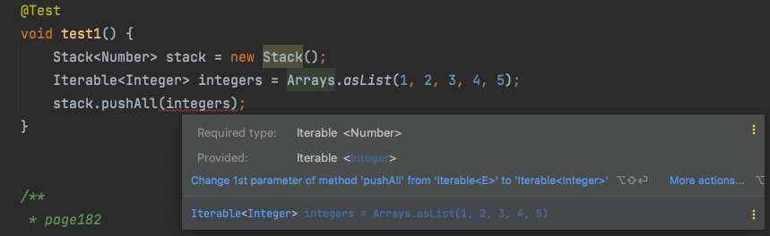

# 한정적 와일드카드를 사용해 API 유연성을 높이라


# 1 개요

* 매개변수화 타입은 불공변이다
  * [Item28.md](../Item28/Item28.md) 참고
  * 즉 서로 다른 타입 Type1과 Type2가 있을 때 `List<Type1>`은 `List<Type2>` 의 하위 타입도 상위 타입도 아니다


**불공변 예시**

* `String`은 `Object`의 하위 타입이다
* `List<String>`은 `List<Object>`의 하위타입이 아니다
  * 이것이 불공변
* `List<Object>`은 어떤 객체든 넣을 수 있지만 `List<String>`은 문자열만 넣을 수 있다 
* 즉 `List<String>`은 `List<Object>`가 하는 일을 제대로 수행하지 못하니 하위 타입이 될 수 없다
* 리스코프 치환 원칙에 어긋난다
  * [SOLID.md](../../../../../OOP/SOLID/SOLID.md)의 리스코프 치환 원칙 참고


# 2 유연성의 필요성

* [Item29.md](../Item29/Item29.md)의 Stack에 일련의 원소를 스택에 넣는 메소드를 추가해보자


## 2.1 문제

**Stack.java**

이 메소드는 컴파일되지만 완벽하지 않다

```java
// 와일드카드 타입을 사용하지 않은 pushall 메서드 - 결함이 있다
public void pushAll(Iterable<E> src) {
  for (E e : src) {
    push(e);
  }
}
```

아래와 같이 Iterable src의 원소 타입이 스택의 원소 타입과 일치하면 잘 작동한다

```java
Stack<Integer> stack = new Stack();
Iterable<Integer> integers = Arrays.asList(1, 2, 3, 4, 5);
stack.pushAll(integers);
```

하지만 `Stack<Number>` 로 선언한 후 pushAll(intVal) 을 호출하면 어떻게 될까?

* intVal은 Integer 타입



* `Integer`가 `Number`의 하위 타입이라 잘 동작할거 같지만 그렇지않다
* 매개변수화 타입은 불공변 이기 때문에  `Iterable<Integer>`가  `Iterable<Number>` 의 하위 타입이 아니다
* 따라서 아래와 같은 오류 메시지가 뜬다

```
error: incompatible types: Iterable<Integer> cannot be converted to Iterable<Number>
        stack.pushAll(integers);
                      ^
```


## 2.2 해결책

* 이런 상황에 대처할 수 있는 한정적 와일드카드 타입이라는 특별한 매개변수화 타입을 지원한다
* pushAll 메소드의 입력 매개변수 타입은 `E의 Iterable` 이 아니라 `E의 하위 타입의 Iterable` 이다
  * `E의 Iterable` 이란 정확히  `E의 Iterable`만 아규먼트로 받는다는 의미이다  `E의 하위 타입의 Iterable`은 `E의 Iterable`의 하위 타입이 아니라서 아규먼트로 받을 수 없다
* `E의 하위 타입의 Iterable` 을 의미는 와일드카드 타입을 사용해  `Iterable<? extends E>` 로 나타낼 수 있다
