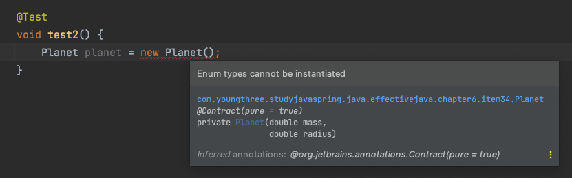

# int 상수 대신 열거 타입을 사용하라


# 1 개요

* 열거 타입은 일정 개수의 상수 값을 정의한 다음 그 외의 값은 허용하지 않는 타입이다
* 사계절, 태양계의 행성, 카드게임의 카드 종류 등이 좋은 예다
* 자바가 열거 타입을 지원하기 전에는 정수 열거 패턴으로 정수 상수를 한 묶음 선언해 사용했다


# 2 정수 열거 패턴

* 정수 열거 패턴은 단점이 많으므로 열거 타입을 사용하자


**정수 열거 패턴 예시**

```java
public static final int APPLE_FUJI = 0;
public static final int APPLE_PIPPIN = 1;
public static final int APPLE_GRANNY_SMITH = 2;

public static final int ORANGE_NAVEL = 0;
public static final int ORANGE_TEMPLE = 1;
public static final int ORANGE_BLOOD = 2;
```


## 2.1 단점

**타입 안전을 보장할 수 없다**

* 오렌지를 건네야 할 메서드에 사과를 보내고 동등 연산자(==)로 비교해도 컴파일러는 아무런 경고 메시지를 출력하지 않는다
* `APPLE_FUJI == ORANGE_NAVEL` -> `true`


**표현력이 좋지 않다**

* 자바가 정수 열거 패턴을 위한 별도 이름공간(namespace)를 지원하지 않기 때문에 어쩔 수 없이 접두어를 써서 이름 충돌을 방지한다
* 예를 들면 영어로 둘다 mercury인 수은과 수성의 이름을 각각 ELEMENT_MERCURY와 PLANET_MERCURY로 지어 구분한다


**클라이언트 의존성**

* 정수 열거 패턴을 사용한 프로그램은 깨지기 쉽다
* 평범한 상수를 나열한 것뿐이라 컴파일 하면 그 값이 클라이언트 파일에 그대로 새겨진다
* 따라서 상수의 값이 바뀌면 클라이언트도 반드시 다시 컴파일해야한다
* 다시 컴파일 하지 않으면 클라이언트가 실행이 되더라도 엉뚱하게 동작할 것이다


**문자열 출력**

* 정수 상수는 문자열로 출력하기 까다롭다
* 그 값을 출력하거나 디버거로 살펴보면 단지 숫자로만 보여서 썩 도움이 되지 않는다
* 같은 정수 열거 그룹에 속한 모든 상수를 순회하는 방법도 마땅치 않다
* 같은 정수 열거 그룹에 속한 상수가 몇 개인지도 알 수 없다


# 3 열거 타입

* 자바의 열거 타입은 완전한 형태의 클래스라서 다른 언어의 열거 타입보다 훨씬 강력하다
* **상수 하나당 자신의 인스턴스를 하나씩 만들어 public static final 필드로 공개한다**
* 열거 타입은 **밖에서 접근할 수 있는 생성자를 제공하지 않으므로** 사실상 final이다
  * 따라서 클라이언트가 인스턴스를 직접 생성하거나 확장할 수 없다
  * 따라서 열거 타입 선언으로 만들어진 인스턴스는 딱 하나씩만 존재한다
  * 따라서 열거 타입은 인스턴스 통제된다
* 아래와 같이 밖에서 접근할 수 있는 생성자가 없다



> **인스턴스 통제란?**
>
> 언제 어느 인스턴스를 살아 있게 할지를 철저히 통제할 수 있다는 것을 의미한다. 예를들어 생성자를 private으로 만들고 정적 팩토리 메소드를 제공하면 해당 클래스가 인스턴를 온전히 통제할 수 있게된다.


## 3.1 정수 열거 패턴의 단점을 보완

**컴파일 타임 타입 안정성**

* Apple 열거 타입을 매개변수로 받는 메소드를 선언했다면 건네받은 참조는 null이 아니라면 Apple의 세 가지 값중 하나임이 확실하다
* 다른 타입의 값을 넘기려 하면 컴파일 오류가 난다
* 정수 열거 패턴을 사용해 상수를 비교하면 `APPLE_FUJI == ORANGE_NAVEL` -> `true`
* 열거 타입을 사용해 상수를 비교하면 `Apple.FUJI` ==  `Orange.NAVEL` -> 타입이 달라 컴파일 에러

```java
public enum Apple { FUJI, PIPPIN, GRANNY_SMITH }
```

```java
public enum Orange { NAVEL, TEMPLE, BLOOD}
```

**네임스페이스**

* 열거 타입에는 각자의 이름공간이 있어서 이름이 같은 상수도 평화롭게 공존한다

**클라이언트 의존성**

* 열거 타입에 새로운 상수를 추가하거나 순서를 바꿔도 다시 컴파일하지 않아도 된다
* 정수 열거 패턴과 달리 상수 값이 클라이언트로 컴파일되어 각인되지 않기 때문이다

**문자열 출력**

* 열거 타입에 toString 메소드가 출력하기 좋은 문자열을 내어준다
* 기본 toString 메소드는 상수 이름을 문자열로 반환한다


## 3.2 추가적인 장점

* 열거 타입에는 임의의 메서드나 필드를 추가할 수 있고 임의의 인터페이스를 구현하게 할 수도 있다
* 언제 열거 타입에 메소드나 필드를 추가할까?


# 4 데이터와 메소드를 갖는 열거 타입

* 태양계의 여덟 행성은 거대한 열거 타입을 설명하기 좋은 예다
* 각 행성에는 질량과 반지름이 있고 이 두 속성을 이용해 표면중력을 계산할 수 있다
* 따라서 어떤 객체의 질량이 주어지면 그 객체가 행성 표면에 있을 때의 무게를 계산할 수 있다
  * `MERCURY(3.302e+23, 2.439e6)` 괄호 안 숫자는 생성자에 넘겨지는 매개변수로 각각 행성의 질량과 반지름을 뜻한다


**Planet.java**

* 데이터와 메소드를 갖는 열거 타입
* **열거 타입 상수 각각을 특정 데이터와 연결지으려면 생성자에서 데이터를 받아 인스턴스 필드에 저장하면 된다**
* 열거 타입은 근본적으로 불변이라 모든 필드는 final이어야한다 ([Item17.md](../../Chapter4/Item17/Item17.md) 참고)
* 필드는 private으로 두고 별도의 public 접근자 메서드를 두는게 낫다([Item16.md](../../Chapter4/Item16/Item16.md) 참고)
* Planet 생성자에 표면중력을 계산해 저장한 이유는 최적화를 위해서다
  * 사실 질량과 반지름이 있으니 언제든 표면중력을 계산할 수 있다
* surfaceWeight 메소드는 대상 객체의 질량을 입력받아 그 객체가 행성 표면에 있을 때의 무게를 반환한다

```java
package effectivejava.chapter6.item34;

// 코드 34-3 데이터와 메서드를 갖는 열거 타입 (211쪽)
public enum Planet {
  MERCURY(3.302e+23, 2.439e6),
  VENUS  (4.869e+24, 6.052e6),
  EARTH  (5.975e+24, 6.378e6),
  MARS   (6.419e+23, 3.393e6),
  JUPITER(1.899e+27, 7.149e7),
  SATURN (5.685e+26, 6.027e7),
  URANUS (8.683e+25, 2.556e7),
  NEPTUNE(1.024e+26, 2.477e7);

  private final double mass;           // 질량(단위: 킬로그램)
  private final double radius;         // 반지름(단위: 미터)
  private final double surfaceGravity; // 표면중력(단위: m / s^2)

  // 중력상수(단위: m^3 / kg s^2)
  private static final double G = 6.67300E-11;

  // 생성자
  Planet(double mass, double radius) {
    this.mass = mass;
    this.radius = radius;
    surfaceGravity = G * mass / (radius * radius);
  }

  public double mass()           { return mass; }
  public double radius()         { return radius; }
  public double surfaceGravity() { return surfaceGravity; }

  public double surfaceWeight(double mass) {
    return mass * surfaceGravity;  // F = ma
  }
}
```


**사용예시**

```java
double earthWeight = 70;
double mass = earthWeight / Planet.EARTH.surfaceGravity();
for (Planet p : Planet.values()) {
  System.out.printf("%s에서의 무게는 %f이다 \n", p, p.surfaceWeight(mass));
}
```

```
MERCURY에서의 무게는 26.453469이다 
VENUS에서의 무게는 63.353571이다 
EARTH에서의 무게는 70.000000이다 
MARS에서의 무게는 26.572280이다 
JUPITER에서의 무게는 177.077561이다 
SATURN에서의 무게는 74.585988이다 
URANUS에서의 무게는 63.339884이다 
NEPTUNE에서의 무게는 79.538446이다 
```


## 4.1 열거 타입에서 상수를 제거한다면?

* 열거 타입에서 상수를 제거한다면 어떻게 될까?
  * 실제로 명왕성은 2006년 이후로 행성에서 제거되었다
* 열거 타입에서 상수를 제거하면 제거한 상수를 참조하지 않는 클라이언트에는 아무런 영향이 없다
* 제거된 상수를 참조하는 클라이언트를 컴파일 시 디버깅에 유용한 메시지를 담은 컴파일 오류가 발생할 것이다
* 정수 열거 패턴과 다르게 컴파일 시점에 오류가 발생하여 대응하기 쉬워진다


참고

* [이펙티브 자바 3/E](http://www.kyobobook.co.kr/product/detailViewKor.laf?mallGb=KOR&ejkGb=KOR&barcode=9788966262281)