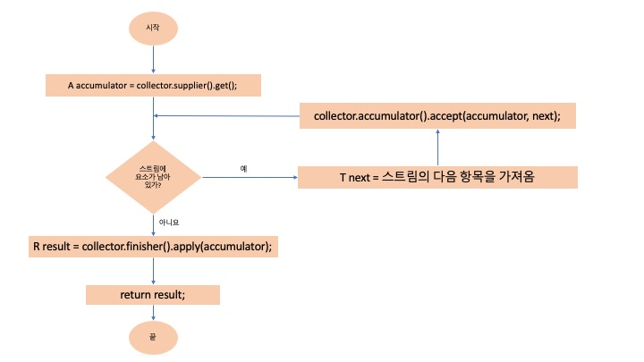

# 스트림에서는 부작용 없는 함수를 사용하라


# 1 개요

* 스트림은 처음 봐서는 이해하기 어렵다
* **스트림은 함수형 프로그래밍에 기초한 패러다임**이기 때문에 스트림이 제공하는 표현력, 속도, 병렬성을 얻으려면 API는 말할 것도 없고 이 패러다임을 함께 받아들여야 한다


# 2 스트림 패러다임

* 스트림 패러다임의 핵심은 계산을 일련의 변환으로 재구성하는 부분이다
* **각 변환 단계는** 가능한 한 이전 단계의 결과를 받아 처리하는 **순수 함수**여야 한다
* **순수 함수**란 오직 입력만이 결과에 영향을 주는 함수를 말한다
  * 다른 **가변 상태를 참조하지 않고** 함수 스스로도 **다른 상태를 변경하지 않는다**. 즉 부작용이 없어야한다


**스트림 패러다임을 이해하지 못한 스트림 사용 예시**

* 단어별 빈도표를 만드는 예시
* 스트림의 foreach를 잘못 사용하고 있다
* foreach에 전달된 람다는 순수 함수가 아니다
  * 외부 상태 `freq` 를 변경시키는 부작용이 있기 때문에 순수 함수가 아니다
* foreach 연산은 스트림 계산 결과를 보고할 때만 사용하고 계산하는 데는 쓰지 말자

```java
@Test
void bad_ex() {
  // given
  List<String> words = Arrays.asList("apple", "banana", "apple", "avocado", "durian", "lemon", "durian");
  HashMap<String, Long> freq = new HashMap<>();

  // when
  words.forEach(word -> {
    freq.merge(word.toLowerCase(), 1L, Long::sum);
  });

  // then
  assertThat(freq.get("apple")).isEqualTo(2);
  assertThat(freq.get("banana")).isEqualTo(1);
  assertThat(freq.get("avocado")).isEqualTo(1);
  assertThat(freq.get("durian")).isEqualTo(2);
  assertThat(freq.get("lemon")).isEqualTo(1);
}
```


**스트림을 제대로 활용한 사용 예시**

* 위에 코드를 올바르게 작성한 모습을 보자
* 아래 코드는 collector를 사용하는데 스트림을 사용하려면 꼭 배워야하는 개념이다
* collector를 사용하면 스트림의 원소를 손쉽게 컬렉션으로 모을 수 있다

```java
import static java.util.stream.Collectors.counting;
import static java.util.stream.Collectors.groupingBy;

@Test
void good_ex() {
  // given
  List<String> words = Arrays.asList("apple", "banana", "apple", "avocado", "durian", "lemon", "durian");

  // when
  Map<String, Long> freq = words.stream().collect(groupingBy(String::toLowerCase, counting()));

  // then
  assertThat(freq.get("apple")).isEqualTo(2);
  assertThat(freq.get("banana")).isEqualTo(1);
  assertThat(freq.get("avocado")).isEqualTo(1);
  assertThat(freq.get("durian")).isEqualTo(2);
  assertThat(freq.get("lemon")).isEqualTo(1);
}
```


# 3 collect 메소드

* 스트림의 최종 연산 collect는 다양한 요소 누적 방식을 인수로 받아서 스트림을 최종 결과로 도출하는 리듀싱 연산을 수행한다
* 스트림의 요소를 어떤식으로 도출할지 그 방식을 Collector 인터페이스 구현에 명시하고 이를 Stream의 collect 메소드에 넘겨준다


# 4 Collector 인터페이스

**Collector.java**

* T는 수집될 스트림 항목의 제네릭 형식이다
* A는 누적자, 즉 수집 과정에서 중간 결과를 누적하는 객체의 형식이다
* R은 수집 연산 결과 객체의 형식(항상 그런 것은 아니지만 대개 컬렉션 형식)이다
  * 일반적으로 컬렉션이며 그래서 컬렉터라고 부른다


```java
public interface Collector<T, A, R> {
  Supplier<A> supplier();
  BiConsumer<A, T> accumulator();
  Function<A, R> finisher();
  BinaryOperator<A> combiner();
  Set<Characteristics> characteristics();
}
```


## 6.1 supplier 메소드

* supplier 메소드는 Supplier를 반환한다
* Supplier는 mutable한 결과 컨테이너다
* 스트림 요소에 리듀싱 연산을 하고 그 결과를 누적하는 컨테이너


## 6.2 accumulator 메소드

* accumulator는 리듀싱 연산을 수행하는 함수를 반환한다


## 6.3 finisher 메소드

* finisher 메소드 스트림 탐색을 끝내고 누적자 객체를 최종 결과로 변환하면서 누적 과정을 끝낼 때 호출할 함수를 반환해야한다


## 6.4 순차 리듀싱 과정의 논리적 순서



* supplier 메소드를 통해 스트림 요소에 리듀싱 연산을 하고 그 결과를 누적하는 컨테이너(accmulator)를 얻는다
* accumulator 메소드로 리듀싱 연산을 수행하는 함수를 얻고 이 함수에 accmulator와 리듀싱 연산을 적용할 요소를 넘긴다
* 스트림에 요소가 남지 않을 때까지 위 과정을 반복한다
* 스트림에 요소가 남지 않으면 finisher 메소드를 통해 accmulator를 최종 결과로 변환한다
* 변환된 결과를 반환한다


# 5 Collectors 클래스

* Collectors 클래스는 팩토리 메서드를 통해 미리 정의된 컬렉터(Collector 인터페이스의 구현체)를 제공한다
* Collectors 클래스에는 수십개의 팩토리 메서드가 있지만 그 중 가장 중요한 toList, toSet, toMap,groupingBy, joining 메서드를 사용해보자
* Collectors 제공하는 메서드의 기능은 크게 3 가지로 구분한다
  * 스트림 요소를 하나의 값으로 리듀싱
  * 요소 그룹화
  * 요소 분할


**예시를 위한 요리 리스트**

```java
public static final List<Dish> menu = asList(
  new Dish("pork", false, 800, Dish.Type.MEAT),
  new Dish("beef", false, 700, Dish.Type.MEAT),
  new Dish("chicken", false, 400, Dish.Type.MEAT),
  new Dish("french fries", true, 530, Dish.Type.OTHER),
  new Dish("rice", true, 350, Dish.Type.OTHER),
  new Dish("season fruit", true, 120, Dish.Type.OTHER),
  new Dish("pizza", true, 550, Dish.Type.OTHER),
  new Dish("prawns", false, 400, Dish.Type.FISH),
  new Dish("salmon", false, 450, Dish.Type.FISH)
);
```


## 5.1 toList

* 스트림의 모든 요소를 리스트로 수집한다

```java
import static java.util.stream.Collectors.*;

@Test
void test_toList() {
  List<String> collect = menu.stream()
    .map(Dish::getName)
    .collect(toList());

  System.out.println("collect = " + collect);
}
```

```
collect = [pork, beef, chicken, french fries, rice, season fruit, pizza, prawns, salmon]
```


**Collectors.java**

* supplier: 결과를 담을 컨테이너를 만든다 여기선 비어있는 ArrayList를 만든다
* accumulator: 스트림의 요소를 처리하고 그 결과를 컨테이너에 담는 함수
  * `(list, item) -> list.add(item)` 을 메서드 참조를 이용해 간결하게 `List::add`

```java
public static <T> Collector<T, ?, List<T>> toList() {
  return new CollectorImpl<>((Supplier<List<T>>) ArrayList::new, 
                             List::add,
                             (left, right) -> { left.addAll(right); return left; },
                             CH_ID);
}
```


**CollectorImpl의 생성자**

```java
CollectorImpl(Supplier<A> supplier,
              BiConsumer<A, T> accumulator,
              BinaryOperator<A> combiner,
              Set<Characteristics> characteristics) {
    this(supplier, accumulator, combiner, castingIdentity(), characteristics);
}
```


## 5.2 toSet

* 스트림의 모든 요소를 셋으로 수집한다

```java
@Test
void test_toSet() {
  Set<Dish.Type> collect = menu.stream()
    .map(Dish::getType)
    .collect(toSet());

  System.out.println("collect = " + collect);
}
```

```
collect = [OTHER, MEAT, FISH]
```


## 5.3 toMap

* 스트림의 모든 요소를 맵으로 수집한다
* keyMapper: 스트림 원소를 키에 매핑하는 함수
* valueMapper: 스트림 원소를 값에 매핑하는 함수
* 스트림 원소가 다수가 같은 키를 사용한다면 `IllegalStateException` 예외 발생
  * 이러한 경우를 충돌이라 하며 충돌을 처리하는 mergeFunction을 인자로 전달해 해결 가능하다

```java
public static <T, K, U>
  Collector<T, ?, Map<K,U>> toMap(Function<? super T, ? extends K> keyMapper,
                                  Function<? super T, ? extends U> valueMapper) {
  return new CollectorImpl<>(HashMap::new,
                             uniqKeysMapAccumulator(keyMapper, valueMapper),
                             uniqKeysMapMerger(),
                             CH_ID);
}
```

* 위에 toMap 함수와 오버로드된 또 다른 함수로 mergeFunction이 추가되었다
* mergeFunction: 키 충돌이 발생한 경우 이를 처리하는 BinaryOperator

```java
public static <T, K, U>
  Collector<T, ?, Map<K,U>> toMap(Function<? super T, ? extends K> keyMapper,
                                  Function<? super T, ? extends U> valueMapper,
                                  BinaryOperator<U> mergeFunction) {
  return toMap(keyMapper, valueMapper, mergeFunction, HashMap::new);
}
```

**키 충돌 예외 발생**

```java
@Test
void test_toMap() {
  // given
  List<String> words = Arrays.asList("apple", "banana", "apple", "avocado", "durian", "lemon", "durian");

  // when
  Throwable throwable = catchThrowable(() -> words.stream().collect(toMap(String::toLowerCase, w -> w)));

  // then
  assertThat(throwable).isInstanceOf(IllegalStateException.class);
}
```

**키 충돌 해결**

```java
@Test
void test_toMap2() {
  // given
  List<Album> albums = Arrays.asList(
    new Album("a", 100),
    new Album("a", 200),
    new Album("b", 100),
    new Album("b", 300),
    new Album("c", 100),
    new Album("c", 400)
  );

  // when
  Map<String, Integer> result = albums.stream()
    .collect(toMap(Album::getArtist,
                   Album::getSales,
                   BinaryOperator.maxBy(Comparator.comparing(Integer::valueOf))));

  // then
  assertThat(result.get("a")).isEqualTo(200);
  assertThat(result.get("b")).isEqualTo(300);
  assertThat(result.get("c")).isEqualTo(400);
}
```


## 5.4 groupingBy

* `Collectors.groupingBy`의 메소드 인자로 **분류 함수**를 넘긴다
* 스트림 요소에 분류 함수를 적용해서 키를 만들어 낸다
* 그리고 각 키에 대응하는 스트림의 모든 항목 리스트를 값으로 갖는 맵이 반환된다


**groupingBy 사용 예시**

```java

Map<Dish.Type, List<Dish>> dishesByType = menu.stream()
  .collect(groupingBy(Dish::getType));

System.out.println("dishesByType = " + dishesByType);
```

```
dishesByType = {OTHER=[french fries, rice, season fruit, pizza], FISH=[prawns, salmon], MEAT=[pork, beef, chicken]}
```


**그룹화 후 필터링 하기**

```java
@Test
void 그룹화후_filtering() {
  Map<Dish.Type, List<Dish>> dishesByType = menu.stream()
    .collect(groupingBy(Dish::getType,
                        filtering(dish -> dish.getCalories() > 500,
                                  toList())));
  System.out.println("dishesByType = " + dishesByType);
}
```

```
dishesByType = {FISH=[], MEAT=[pork, beef], OTHER=[french fries, pizza]}
```

**Collectors.java**

```java
public static <T, K, A, D>
  Collector<T, ?, Map<K, D>> groupingBy(Function<? super T, ? extends K> classifier,
                                        Collector<? super T, A, D> downstream) {
  return groupingBy(classifier, HashMap::new, downstream);
}
```


**그룹화 후 매핑하기**

```java
@Test
void groupDishNamesByType() {
  Map<Dish.Type, List<String>> dishNameByType = menu.stream()
    .collect(groupingBy(Dish::getType, mapping(Dish::getName, toList())));
  System.out.println("dishNameByType = " + dishNameByType);
}
```

```
dishNameByType = {FISH=[prawns, salmon], OTHER=[french fries, rice, season fruit, pizza], MEAT=[pork, beef, chicken]}
```


## 5.5 joining

* 스트림 각 객체에 toString 메서드를 호출해서 추출한 모든 문자열을 하나의 문자열로 연결해서 반환한다

```java
@Test
void testJoining() {
  String shortMenu = menu.stream().map(Dish::getName).collect(joining(", "));
  System.out.println("shortMenu = " + shortMenu);
}
```

```
shortMenu = pork, beef, chicken, french fries, rice, season fruit, pizza, prawns, salmon
```
