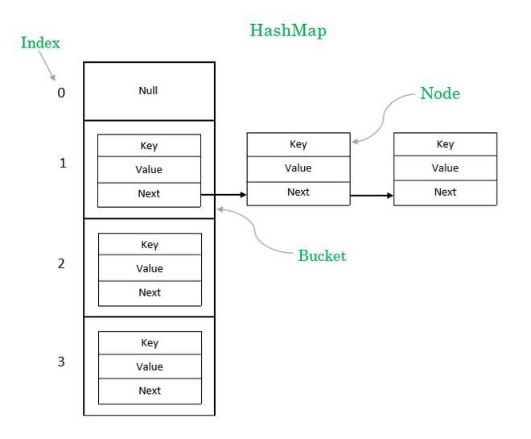
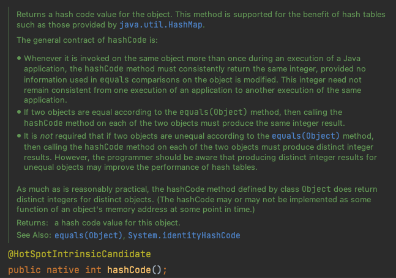
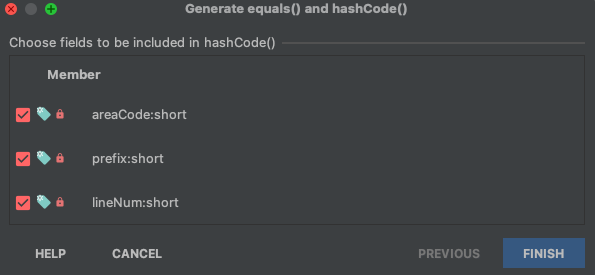

# equals를 재정의하려거든 hashCode도 재정의하라


# 1 개요

* equals를 재정의한 클래스 모두에서 hashCode도 재정의해야한다
* 그렇지 않으면 hashCode 일반 규약을 어기게 되어 해당 클래스의 인스턴스를 HashMap이나 HashSet과 같은 컬렉션의 원소로 사용하지 못함


> #### HashMap
>
> 
>
> `Index = hashcode(key) & (ArraySize – 1)`


## 1.1 Object 명세 규약



* equals 비교에 사용되는 정보가 변경되지 않았다면, 애플리케이션이 실행되는 동안 그 객체의 hashCode 메서드는 몇 번을 호출해도 일관되게 항상 같은 값을 반환해야 한다.
  * 단, 애플리케이션을 다시 실행한다면 이 값이 달라져도 상관없다.
* **equals(Object)가 두 객체를 같다고 판단했다면, 두 객체의 hashCode는 똑같은 값을 반환해야 한다.**
* equals(Object)가 두 객체를 다르다고 판단했더라도, 두 객체의 hashCode가 서로 다른 값을 반환할 필요는 없다. 
  * 단, 다른 객체에 대해서는 다른 값을 반환해야 해시테이블의 성능이 좋아진다.


## 1.2 주된 문제

* hashCode 재정의를 잘못했을 때 크게 문제가 되는 조항은 두 번째다


**PhoneNumber.java**

* equals를 재정의 했지만 hashCode는 재정의하지 않았다

```java
public final class PhoneNumber {
  private final short areaCode, prefix, lineNum;

  public PhoneNumber(int areaCode, int prefix, int lineNum) {
    this.areaCode = rangeCheck(areaCode, 999, "area code");
    this.prefix   = rangeCheck(prefix,   999, "prefix");
    this.lineNum  = rangeCheck(lineNum, 9999, "line num");
  }

  private static short rangeCheck(int val, int max, String arg) {
    if (val < 0 || val > max)
      throw new IllegalArgumentException(arg + ": " + val);
    return (short) val;
  }

  @Override 
  public boolean equals(Object o) {
    if (o == this)
      return true;
    if (!(o instanceof PhoneNumber))
      return false;
    PhoneNumber pn = (PhoneNumber)o;
    return pn.lineNum == lineNum && pn.prefix == prefix
      && pn.areaCode == areaCode;
  }
}
```


**Test**

```java
@DisplayName("equals 메서드 일반 규약 5가지 만족")
@Test
void test() {
  PhoneNumber x = new PhoneNumber(707, 867, 5309);
  PhoneNumber y = new PhoneNumber(707, 867, 5309);
  PhoneNumber z = new PhoneNumber(707, 867, 5309);

  // 반사성(reflexivity)
  Assertions.assertThat(x.equals(x)).isTrue();

  // 대칭성(symmetry)
  Assertions.assertThat(x.equals(y)).isTrue();
  Assertions.assertThat(y.equals(x)).isTrue();

  // 추이성(transitivity)
  Assertions.assertThat(x.equals(y)).isTrue();
  Assertions.assertThat(y.equals(z)).isTrue();
  Assertions.assertThat(x.equals(y)).isTrue();

  // 일관성(consistency)
  Assertions.assertThat(x.equals(y)).isTrue();
  Assertions.assertThat(x.equals(y)).isTrue();
  Assertions.assertThat(x.equals(y)).isTrue();

  // non-null
  Assertions.assertThat(x.equals(null)).isFalse();
}
```

* PhoneNumber의 equals 메서드는 일반 규약 5가지를 모두 만족한다


```java
@DisplayName("hashCode 재정의를 잘못햇을 때")
@Test
void test2() {
  PhoneNumber x = new PhoneNumber(707, 867, 5309);
  PhoneNumber y = new PhoneNumber(707, 867, 5309);

  Assertions.assertThat(x.equals(y)).isTrue();
  Assertions.assertThat(x.hashCode()).isNotEqualTo(y.hashCode());
}
```

* Object 명세 규약 중 두 번째 규약을 위반
* equals(Object)가 두 객체를 같다고 판단했다면, 두 객체의 hashCode는 똑같은 값을 반환해야 한다.


```java
@DisplayName("hashCode 재정의를 잘못하고 클래스의 인스턴스를 HashMap의 원소로 사용할 때")
@Test
void test3() {
  // given
  Map<PhoneNumber, String> map = new HashMap<>();
  map.put(new PhoneNumber(707, 867, 5309), "제니");

  // when
  String value = map.get(new PhoneNumber(707, 867, 5309));

  // then
  Assertions.assertThat(value).isNull();
}
```

* Object 명세 규약 중 두 번째 규약을 위반채로 클래스의 인스턴스를 HashMap의 원소로 사용할 때 문제점
* get 메소드는 엉뚱한 해시 버킷에 가서 객체를 찾으려 한다
* 설사 두 인스턴스를 같은 버킷에 담았더라고 get 메소드는 null을 반환하는데 HashMap은 해시코드가 다른 엔트리끼리는 동치성 비교를 시도조차 안하도록 최적화 되어있기 때문

**Object의 hashCode**

>  실용적인 이유로, Object 클래스의 hashCode 메소드는 다른 객체에 대해 각기 다른 integer 값을 리턴하도록 정의되었습니다. (일반적으로 객체의 내부 주소를 integer 값으로 변환하는 방식으로 구현되지만, 그러한 구현 기법은 Java(TM) 프로그래밍 언어에서는 필수적인 것은 아닙니다)

# 2 올바른 hashCode 작성하기


## 2.1 hashCode란?

* `hashCode()`는 hashing algorithm를 통해 해시 값(`int` )를 반환한다
* Map 인터페이스의 구현은 해시 테이블로 되어있다
* 해시 테이블은 키의 해시 값을 이용해 빠르게 밸류를 저장하고 검색한다


## 2.2 최악의 적법한 hashCode 구현

```java
@Override public int hashCode() { return 42; }
```

* Object의 hashcode 명세 규약을 모두 만족한다
* 모든 객체가 해시테이블의 버킷 하나에 담겨 LinkedList 처럼 동작하게 된다.
* 평균 수행 시간이 O(n)으로 느려져서 객체가 많아지면 쓸 수 없게 된다.


## 2.3 좋은 hashCode 구현

* 해시 함수 값 충돌의 최소화
* 쉽고 빠른 연산
* 해시 테이블 전체에 해시 값이 균일하게 분포
* 사용할 키의 모든 정보를 이용하여 해싱


**좋은 hashCode 구현 요령**

1. int 변수 result를 선언한 후 값 c로 초기화한다. 이때 c는 해당 객체의 첫번째 핵심 필드를 다음 소개하는 2.a 방식으로 계산한 해시코드이다. 참고로 여기 소개되는 핵심 필드는 equals 비교에 사용되는 필드이다. **equals에서 사용되지 않는 필드는 반드시 hashCode에서도 제외해야한다.** 이를 어기면 hashCode의 두번째 규약을 어기기 때문이다.

2. 해당 객체의 나머지 핵심 필드 f에 대해 각각 다음 작업을 수행한다.

   a. 필드의 해시코드 c를 계산한다.

   - 기본 필드라면 Type.hashCode(f)를 수행한다. 이때 Type은 기본 타입에 매핑되는 래퍼 타입이다.
   - 참조 필드이면서 클래스의 equals가 이 필드의 equals를 재귀적으로 호출해 비교한다면 이 필드의 hashCode가 재귀적으로 호출한다. 만약 필드의 값이 `null`이면 0을 반환한다.
   - 배열이라면 핵심 원소 각각을 별도의 필드로 나눈다. 별도로 나눈 필드를 위 규칙을 적용하여 해시코드를 계산한 후 다음 소개되는 2.b 방식으로 갱신한다. 모든 원소가 핵심이라면 `Arrays.hashCode`를 이용한다.

   b. 2.a로 계산한 해시코드 c로 result를 갱신한다.

   ```java
   result = 31 * result + c
   ```

3. result를 반환한다.


**PhoneNumber.java**

```java
@Override public int hashCode() {
  int result = Short.hashCode(areaCode);
  result = 31 * result + Short.hashCode(prefix);
  result = 31 * result + Short.hashCode(lineNum);
  return result;
}
```


## 2.4 Intellij 사용해서 hashCode 구현




**PhoneNumber.java**

```java
@Override
public int hashCode() {
  return Objects.hash(areaCode, prefix, lineNum);
}
```

* Intellj가 만들어준 hashCode
* 위에 작성한 hashCode 보다 속도는 더 느리다
  * 입력 인수를 담기위한 배열 생성
  * 기본 타입이 있다면 박싱과 언박싱 필요
* 성능에 민감하지 않은 경우 사용하자


**Objects.java**

```java
public static int hash(Object... values) {
  return Arrays.hashCode(values);
}
```


**Arrays.java**

```java
public static int hashCode(Object a[]) {
  if (a == null)
    return 0;

  int result = 1;

  for (Object element : a)
    result = 31 * result + (element == null ? 0 : element.hashCode());

  return result;
}
```


## 2.5 Lombok 사용해서 hashCode 구현


**PhoneNumber.java**

```java
@EqualsAndHashCode
public final class PhoneNumber {
  private final short areaCode;
  private final short prefix;
  private final short lineNum;
}
```


**PhoneNumber.java**

* 특정 필드만 선택

```java
@EqualsAndHashCode(onlyExplicitlyIncluded = true)
public final class PhoneNumber {
  @EqualsAndHashCode.Include
  private final short areaCode;
  
  @EqualsAndHashCode.Include
  private final short prefix;
  private final short lineNum;
}
```


**EqualsAndHashCodeExample.java**

```java
@EqualsAndHashCode
public class EqualsAndHashCodeExample {
  private transient int transientVar = 10;
  private String name;
  private double score;
  @EqualsAndHashCode.Exclude private Shape shape = new Square(5, 10);
  private String[] tags;
  @EqualsAndHashCode.Exclude private int id;
}
```

```java
@Override public int hashCode() {
  final int PRIME = 59;
  int result = 1;
  final long temp1 = Double.doubleToLongBits(this.score);
  result = (result*PRIME) + (this.name == null ? 43 : this.name.hashCode());
  result = (result*PRIME) + (int)(temp1 ^ (temp1 >>> 32));
  result = (result*PRIME) + Arrays.deepHashCode(this.tags);
  return result;
}
```


# 3 해시 값 캐싱

* 클래스가 불변이고 해시코드를 계산하는 비용이 크다면 매번 계산하지 말고 캐싱을 이용해라
* 이 타입의 객체가 주로 해시의 키로 사용될 것 같다면 인스턴스가 만들어질 때 해시코드를 계산해둬야 한다
* 해시 키로 사용되지 않으면  hashCode가 처음 불릴 때 계산 (지연초기화 전략)


**PhoneNumber.java**

```java
private int hashCode; // Automatically initialized to 0

@Override public int hashCode() {
  int result = hashCode;
  if(result == 0){
    result = Short.hashCode(areaCode);
    result = 31 * result + Short.hashCode(prefix);
    result = 31 * result + Short.hashCode(lineNum);
    hashCode = result;
  }
  return result;
}
```

