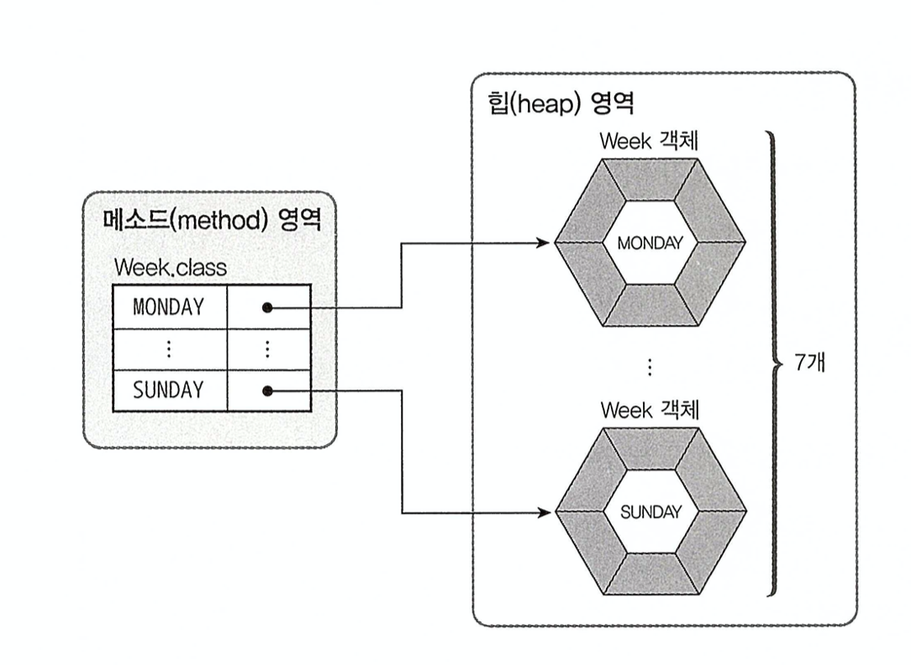
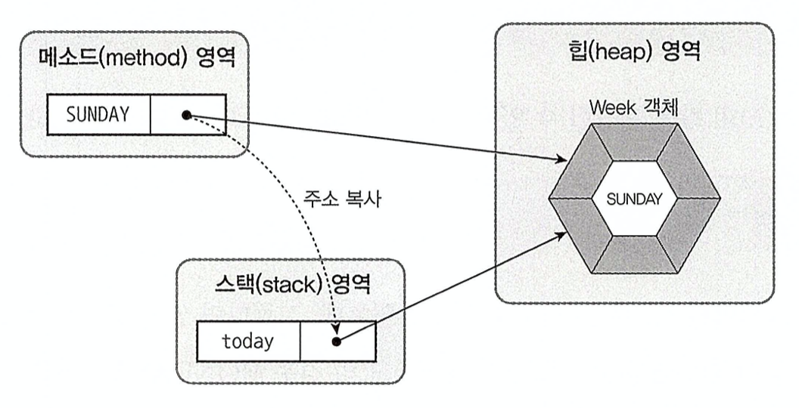

# 1 Enumeration Type

* 데이터 중에는 몇 가지로 한정된 값만을 갖는 경우가 있다
  * 예시) 요일에 대한 데이터는 월, 화, 수, 목, 금, 토, 일이라는 7개의 값만을 가진다
* 이와 같이 한정된 값만을 갖는 데이터 타입이 **Enumeration Type**이다
* **Enumeration Type** 은 몇개의 열거 상수(enumeration constant) 중에서 하나의 상수를 저장하는 데이터 타입이다


# 2 Enumeration Type 선언

```java
public enum Week {
    SUNDAY,
    MONDAY,
    TUESDAY,
    WEDNESDAY,
    THURSDAY,
    FRIDAY,
    SATURDAY
}
```

* `public enum`
  * 열거 타입을 선언하기 위한 키워드
* `Week`
  * 열거 타입 이름
* `SUNDAY,MONDAY,TUESDAY, ...`
  * 열거 상수
  * 관례적으로 모두 대문자로 작성

# 3 Enumeration Type 변수

*  열거 타입도 하나의 데이터 타입이므로 변수를 선언하고 사용해야 한다
* 열거 타입 변수를 선언했다면 아래와 같이 열거 상수를 저장할 수 있다
  * 열거 상수 단독으로 사용이 불가능하다
  * `열거타입.열거상수` 형태로 사용해야 한다
*  참조 타입 변수는 객체를 참조하는 변수이다.

**메소드 영역에 생성된 열거 상수가 해당 Week 객체를 각각 참조한다.**




```java
Week today = Week.SUNDAY
```

* 열거 타입 변수 today는 스택에 생성된다.
* 열거 상수 Week.SUNDAY가 참조하는 객체의 번지를 복사해온다.
  * 따라서 `today == Week.SUNDAY` 는 `true`




```java
//Enumeration Type 변수에 열거 상수 객체의 번지 저장하기
Week today = Week.SUNDAY;

// 열거 타입은 참조 타입이기 때문에 null 값을 저장할 수 있다
Week today = null;
```


참조

* 이것이 자바다(신용권 저)
