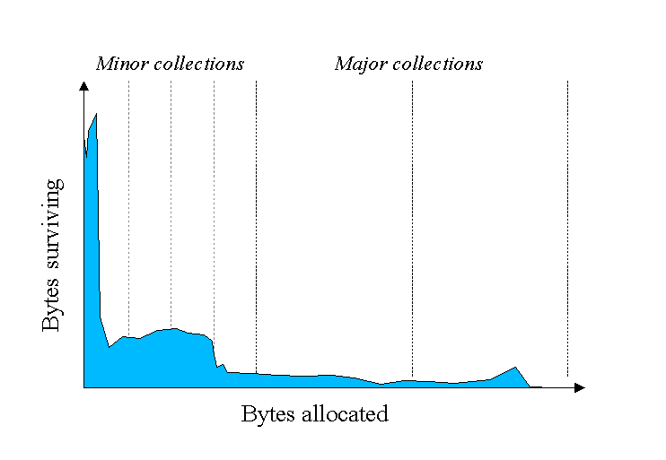
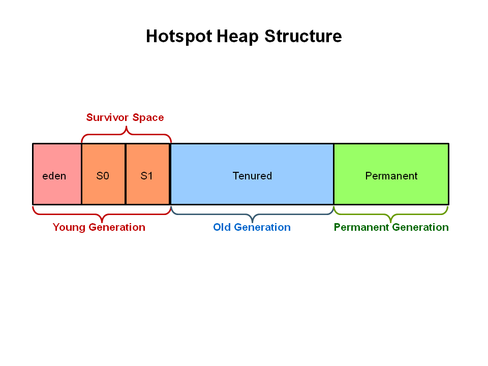
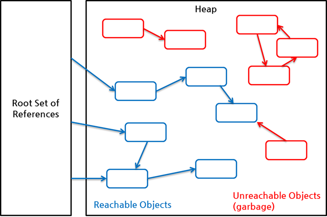

# 1 Garbage Collection

- Java는 프로그램 코드에서 메모리를 명시적으로 지정하여 해제하지 않는다. 
- 개발자가 프로그램 코드로 메모리를 명시적으로 해제하지 않기 때문에 가비지 컬렉터(Garbage Collector)가 더 이상 필요 없는 (쓰레기) 객체를 찾아 지우는 작업을 한다. 

## 1.1 stop-the-world

* GC을 실행하기 위해 JVM이 애플리케이션 실행을 멈추는 것이다.
* stop-the-world가 발생하면 GC를 실행하는 쓰레드를 제외한 나머지 쓰레드는 모두 작업을 멈춘다. 
* GC 작업을 완료한 이후에야 중단했던 작업을 다시 시작한다. 
* 어떤 GC 알고리즘을 사용하더라도 stop-the-world는 발생한다. 
* 대개의 경우 GC 튜닝이란 이 stop-the-world 시간을 줄이는 것이다.

# 2 가비지 컬렉션 과정

## 2.1 Marking

- stack의 모든 변수를 스캔하면서 어떤 객체를 참조하고 있는지 찾아 마킹을한다.
- Reachable Object가 참조하고 있는 객체도 찾아서 마킹한다.

## 2.2 Deletion

- Heap 영역에서 마킹되지 않은 객체를 제거한다.

## 2.3 Deletion with Compacting

- 성능 향상을 위해 마킹되지 않은 객체들을 제거한 뒤 Compacting하는 과정을 거친다.
- 마킹 된 객체를 한 쪽으로 몰아 단편화를 제거해 이후 객체 할당이 빠르고 쉬워진다.

# 3 힙의 구조

* 힙의 모든 객체를 마킹하고 제거한 뒤 컴팩팅 하는 것은 매우 비효율적이다.
  * 더 많은 객체가 할당되면 garbage collection 시간 또한 늘어난다.

## 3.1 객체의 생명

- 대부분의 객체는 금방 접근 불가능 상태(unreachable)가 된다.
- 오래된 객체에서 젊은 객체로의 참조는 아주 적게 존재한다.
- 아래 그래프를 보면 대부분의 객체는 생명이 짧은 것을 볼 수 있다.

## 3.2 힙의 구조

* 대분부의 객체는 생명이 짧다는 것을 사실을 이용해 garbage collection 시간을 최대한 줄이기 위해서 HotSpot VM에서는 크게 3개로 물리적 공간을 나누었다. 

**힙의 구조**

* Young Generation
* Old Generation
* Permanent Generation

**Yong Generation**

* 새롭게 생성한 객체의 대부분이 여기에 위치한다. 
* 대부분의 객체가 금방 접근 불가능 상태가 되기 때문에 매우 많은 객체가 Young 영역에 생성되었다가 사라진다. 
* 이 영역에서 객체가 사라질때 **Minor GC**가 발생한다고 말한다.
* 몇몇의 객체가 gc에서 살아남아 aged되면 old generation으로 승격된다.
* Minor GC도 stop-the-world가 발생한다.

**Old Generation**

* 접근 불가능 상태로 되지 않아 Young 영역에서 살아남은 객체가 여기로 복사된다.
* Yong Generation 객체에 한계점이 설정되어 있으며 객체의 age가 한계점을 충족하면 Old Generation으로 넘어간다.
* 대부분 Young 영역보다 크게 할당하며, 크기가 큰 만큼 Young 영역보다 GC는 적게 발생한다. 
* 이 영역에서 객체가 사라질 때 **Major GC(혹은 Full GC)**가 발생한다고 말한다.

**Permanent Generation**

* Method Area라고도 한다
* 객체나 억류(intern)된 문자열 정보를 저장하는 곳이며, Old 영역에서 살아남은 객체가 영원히 남아 있는 곳은 절대 아니다. 
* 이 영역에서 GC가 발생할 수도 있는데, 여기서 GC가 발생해도 Major GC의 횟수에 포함된다.

## 3.3 Young 영역에 대한 GC 절차

Young 영역은 3개의 영역으로 나뉜다.

* Eden 영역
* Survivor 영역(2개)

1. 새로 생성한 대부분의 객체는 Eden 영역에 위치한다.
2. Eden 영역에서 GC가 한 번 발생한 후 살아남은 객체는 Survivor 영역 중 하나로 이동된다.
3. Eden 영역에서 GC가 발생하면 이미 살아남은 객체가 존재하는 Survivor 영역으로 객체가 계속 쌓인다.
4. 하나의 Survivor 영역이 가득 차게 되면 그 중에서 살아남은 객체를 다른 Survivor 영역으로 이동한다. 
5. 그리고 가득 찬 Survivor 영역은 아무 데이터도 없는 상태로 된다.
6. 이 과정을 반복하다가 계속해서 살아남아 있는 객체는 Old 영역으로 이동하게 된다.

> 이 절차를 확인해 보면 알겠지만 Survivor 영역 중 하나는 반드시 비어 있는 상태로 남아 있어야 한다. 만약 두 Survivor 영역에 모두 데이터가 존재하거나, 두 영역 모두 사용량이 0이라면 여러분의 시스템은 정상적인 상황이 아니라고 생각하면 된다.

## 3.4 Old 영역에 대한 GC 절차

Old 영역은 기본적으로 데이터가 가득 차면 GC를 실행한다. GC 방식에 따라서 처리 절차가 달라지므로, 어떤 GC 방식이 있는지 살펴보면 이해가 쉬울 것이다. GC 방식은 JDK 7을 기준으로 5가지 방식이 있다.

- Serial GC
- Parallel GC
- Parallel Old GC(Parallel Compacting GC)
- Concurrent Mark & Sweep GC(이하 CMS)
- G1(Garbage First) GC 

> 이 중에서 운영 서버에서 절대 사용하면 안 되는 방식이 Serial GC다. Serial GC는 데스크톱의 CPU 코어가 하나만 있을 때 사용하기 위해서 만든 방식이다. Serial GC를 사용하면 애플리케이션의 성능이 많이 떨어진다.

# 4 GC와 Reachability

* Java GC는 객체가 가비지인지 판별하기 위해서 **reachability**라는 개념을 사용한다.
* 어떤 객체에 유효한 참조가 있으면 `reachable`로, 없으면 `unreachable`로 구별하고, `unreachable` 객체를 가비지로 간주해 GC를 수행한다.
* 객체들은 참조 사슬을 이루며 최초의 객체를 객체 참조의 **root set**이라고 한다.

**힙에 있는 객체들에 대한 참조는 다음 4가지 종류 중 하나이다.**

- 힙 내의 다른 객체에 의한 참조
- Java 스택, 즉 Java 메서드 실행 시에 사용하는 지역 변수와 파라미터들에 의한 참조
- 네이티브 스택, 즉 JNI(Java Native Interface)에 의해 생성된 객체에 대한 참조
- 메서드 영역의 정적 변수에 의한 참조

* root set으로부터 시작한 참조 사슬에 속한 객체들은 `reachable` 객체이고, 이 참조 사슬과 무관한 객체들이 `unreachable` 객체로 GC 대상이다.

참조

* https://d2.naver.com/helloworld/1329
* https://d2.naver.com/helloworld/329631
  * Reachability, Soft, Weak, Phantom Reference
* https://d2.naver.com/helloworld/37111
* https://d2.naver.com/helloworld/6043
* https://d2.naver.com/helloworld/184615
* https://www.oracle.com/webfolder/technetwork/tutorials/obe/java/gc01/index.html
* https://developers.redhat.com/articles/2021/11/02/how-choose-best-java-garbage-collector#choosing_a_garbage_collector

