# 1 **ZGC**

- **The Z Garbage Collector**
- JDK 11에서 처음 선보였고 JDK 15부터 Production Ready 상태


## 1.1 ZGC의 목표

**[JEP333](https://openjdk.org/jeps/333)에서 설정한 목표**

1. GC pause time이 10ms를 초과하지 않기
2. 작은 사이즈의 힙(a few hundreds of megabytes)부터 큰 사이즈의 힙(many terabytes)까지 지원하기
3. G1 gc와 비교하여 throughput 저하를 최대 15%까지만 허용하기
   - low-latency을 중시하기 때문에 그만큼 throughput이 희생된다.


**추가적인 목표**

4. 쉬운 튜닝
   - The Java ZGC is **easy to use** and require minimal configuration.


> JEP: JDK Enhancement Proposals


## 1.2 ZGC란?

- `ZGC is a scalable low-latency garbage collector`


**low latency**

- 최대 1ms의 pause times
  - JEP 333에서는 10ms이하지만 JEP 333의 작성자 Per Liden의 영상에서는 1ms이하로 설정
    - [ZGC - The Future of Low-Latency Garbage Collection Is Here](https://www.youtube.com/watch?v=OcfvBoyTvA8&t=1s) 여기 참고
  - JDK 16이후부터 1ms 이하로 목표 설정
    - [Erik Österlund — Concurrent thread-stack processing in the Z Garbage Collector](https://www.youtube.com/watch?v=zsrSUs65xZA&t=821s) 참고


**scalable**

- Pause times **do not** increase with root-set size
- ZGC pause O(1)

- 최소 힙 사이즈 **8MB** 

- 최대 힙 사이즈 **16TB**
  - [JEP 377: ZGC: A Scalable Low-Latency Garbage Collector (Production)](https://openjdk.org/jeps/377)를 통해서 4TB에서 16TB로 상승했다.


> root set
>
> 
>
> - root set으로부터 시작한 참조 사슬에 속한 객체들은 reachable 객체이고, 이 참조 사슬과 무관한 객체들이 unreachable 객체로 GC 대상이다
>
> [출처](https://d2.naver.com/helloworld/329631)


**Ease of use**

- The Java ZGC is **easy to use** and require minimal configuration.


## 1.3 ZGC의 특징 요약

**Concurrent**

- 자바 쓰레드가 실행되는 동시에 GC 쓰레드가 백그라운드에서 실행된다.
- 동기화를 위한 짧은 STW를 제외하고 거의 모든 GC 작업(marking, heap defragmentation)이 자바 쓰레드와 동시에 진행된다.


**Region-based**

- 힙은 3가지 종류의 특정 사이즈의 regions들로 구성된다.


**Compacting**

- 메모리 단편화를 막기위해 주기적으로 살아있는 객체들을 한 region에서 다른 region으로 옮긴다.


**Single Generation(Non-generational)**

-  전체 힙을 대상으로 GC cycle이 진행된다.
   -  기존의 GC 처럼 young generation과 old generation의 구분이 없다.

-  Generational ZGC는 현재 진행중에 있다.
-  [JEP 439: Generational ZGC](https://openjdk.org/jeps/8272979)


**Using colored pointers**


**Using load barriers**


**NUMA-aware**


## 1.4 GC 선정 기준


### 1.4.1 Maximum Pause-Time

- [레퍼런스](https://docs.oracle.com/javase/9/gctuning/ergonomics.htm#JSGCT-GUID-BC516CBE-700D-44DB-8485-3FD5CA9A411B)
- Pause-Time이란 garbage collector가 애플리케이션을 멈추고 가비지를 수집하는 시간이다.
- Maximum Pause-Time은 Pause-Time의 최대치를 제한하는 목적이다.
- Maximum Pause-Time은 `-XX:MaxGCPauseMillis=<nnn>` 옵션으로 설정할 수 있다.
  - 이 옵션을 설정한다고 해서 pause-time 목표가 무조건 달성되는 것은 아니다.
- GC는 해당 목표를 달성하기 위해 힙의 사이즈와 관련된 파라미터를 조절한다.
- 기본 Maximum Pause-Time은 gc의 종류마다 다르다.
- 이러한 조절이 gc가 더 많이 발생하게 할 수도 있고 throughput을 저하시킬수도 있다.


### 1.4.2 Throughput Goal

- 가비지를 수집하는 시간과 애플리케이션 동작하는 시간의 비율이다.
- `-XX:GCTimeRatio=nnn` 옵션으로 비율을 지정할 수 있다.
- 가비지 수집 시간과 애플리케이션이 동작하는 비율이 1 / (1 + nnn)이라는 의미다.
- 예를 들어 `-XX:GCTimeRatio=19` 로 옵션을 지정하면 비율은 1/20으로 애플리케이션 동작 시간의 5%만 가비지 수집 시간으로 사용한다.


### 1.4.3 Footprint

- throughput과 maximum pause-time 목표가 모두 달성되면 gc는 둘 중 하나의 목표가 충족되지 않을 때까지 힙의 사이즈를 줄인다.
  - 주로 throughput이 총족되지 못한다.

- 최소 힙 사이즈를 설정하는 옵션: `-Xms=<nnn>`
- 최대 힙 사이즈를 설정하는 옵션: `-Xmx=<mmm>`


### 1.4.4 비교

- 여러 GC들의 목표를 비교해보자
- 모든 기준을 만족시키는 하나의 GC는 없기 때문에 상황에 맞게 GC를 선택해야한다.

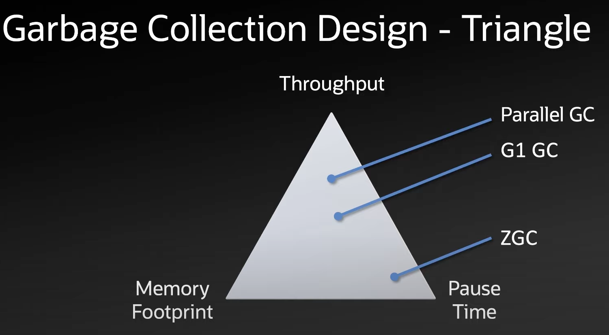

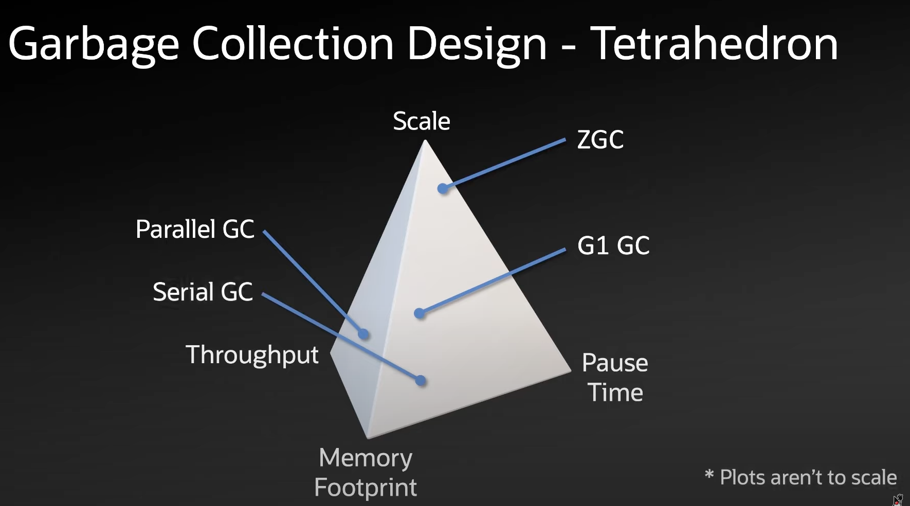

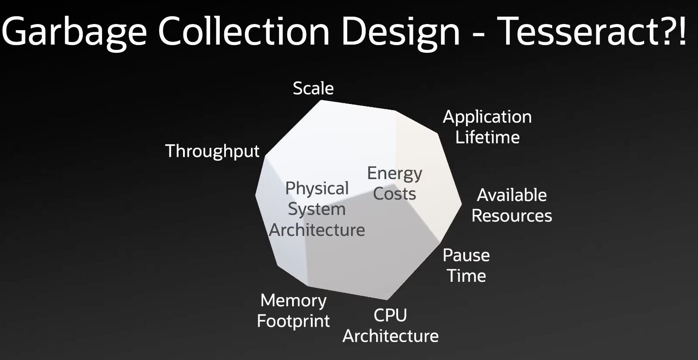

출처: [Java’s Highly Scalable Low-Latency Garbage Collector : ZGC](https://www.youtube.com/watch?v=U2Sx5lU0KM8)


# 2 성능


## 2.1 G1과 비교


**Thoughput과 Lataency 비교**


- Thoughput은 G1이 더 좋다.
- Lataency는 ZGC가 더 좋다.


**GC Pause time 비교**


- ZGC는 1ms 이하라 보이지도 않는다.


- 마이크로 세컨으로 단위 변경 후


## 2.2 JDK 버전과 성능 향상


## 2.3 Non-generation과 Generational ZGC 성능 비교

- Generational ZGC는 아직 개발 중이지만 먼저 Non-generation ZGC와 성능 비교를 해보자.


**메모리 사용량**


**성능**

- Generational ZGC가 메모리를 덜 쓰지만 성능이 더 잘나옴


**CPU 사용량**


# 3 사용하기

Java를 실행할 때 아래의 옵션을 주면 ZGC를 사용할 수 있다.

```bash
-XX:+UseZGC
```


JDK 11에서 JDK 15 까지는 아래의 옵션이 추가적으로 필요하다.

```bash
-XX:+UnlockExperimentalVMOptions -XX:+UseZGC
```


# 4 Tuning

- ZGC의 목표는 쉬운 튜닝이다 따라서 Heap Size 튜닝만을 권장하고 있다.
- 아직 싱글 제네레이션이지만 제네레이션을 도입했을 때 제네레이션의 사이즈도 동적으로 자동 조절되도록 할 예정
  - `-Xmn` 옵션을 사용하지 않음
- Young 객체를 Old 객체로 승격시키는 threshold 설정도 자동으로 설정 됨
  - `-XX:TenuringThreashold` 옵션을 사용하지 않는다.
- [다양한 튜닝 옵션은 Configuration & Tuning 참조](https://wiki.openjdk.org/display/zgc/Main#Main-Overview)


## 4.1 Setting the Heap Size

- [레퍼런스](https://docs.oracle.com/en/java/javase/11/gctuning/z-garbage-collector1.html#GUID-9957D441-A99A-4CF5-9522-393E6DE7D898)
- ZGC 튜닝에서 가장 중요한 옵션이 바로 힙의 최대 크기를 지정하는 것이다.
- `-Xmx` 옵션으로 최대 힙의 크기를 설정한다.
- 일반적으로 메모리 힙 사이즈가 크면 클수록 좋다.
- 메모리 낭비는 바람직하지 않기 때문에 메모리 사용량과 GC의 빈도 사이의 균형을 유지해줄 메모리 힙 사이즈를 찾아야한다.


> GC usually requires a developer to specify the heap space size. The specific value will be greater than the total size of the live objects in the heap. The higher proportion of redundant space, the better the GC performance is. For example, if the total size of estimated objects reaches 32GB, the heap space size is set as Xmx40g, which means 40GB of the heap is enabled.
>
> ZGC differs from traditional GC. While ZGC collects objects, Java threads are also allocating new objects. Therefore, ZGC requires a higher proportion of redundant space than traditional GCs.
>
> The total size of objects allocated during each round of ZGC can be estimated by **allocation speed and single round ZGC time**, so the size of heap space should be greater than **the total size of live objects + the total size of objects allocated during a single ZGC**.
>
> You can find the preceding **allocation speed** and **single round ZGC time** in GC logs.
>
> https://www.alibabacloud.com/blog/alibaba-dragonwell-zgc-part-2-the-principles-and-tuning-of-zgc-%7C-a-new-garbage-collector_598851


## 4.2 Setting Number of Concurrent GC Threads

- `-XX:ConcGCThread` 옵션으로 parallel marking threads의 수를 설정한다.
- JDK 17부터 ZGC는 Concurrent GC 스레드의 수를 동적으로 늘리고 줄인다.
- 따라서 Concurrent GC 스레드의 수를 조정할 필요가 없다.


## 4.3 Logging

- GC 로깅을 활성화 하려면 아래 옵션을 사용한다


**기본 로깅**

```bash
-Xlog:gc:gc.log
```


**자세한 로깅**

- tuning 또는 performance 분석 용

```bash
-Xlog:gc*:gc.log
```


# 5 Problem

**모든 concurrent collector가 풀어야할 문제**

- mutators(애플리케이션 쓰레드)와 GC 쓰레드가 힙에 대한 동일한 뷰를 갖는 것이 concurrent 콜렉터가 반드시 해결해야할 문제다.
- 적절한 조치가 취해지지 않으면 mutators가 오브젝트 그래프를 변경하여 GC의 판단을 의미없게 만들 수 있기 때문이다.


**예시**

- mutators와 GC 쓰레드가 힙에 대한 동일한 뷰를 가지고 있지 않을 때 발생할 수 있는 문제에 대해 그림과 함께 알아보자.


- 초기 상태


- GC가 컴팩팅 과정에서 오브젝트를 From Space에서 To Space로 옮긴다.


- 애플리케이션 쓰레드는 이전 위치에 객체에 쓰기 작업을 진행한다.


- 참조가 갱신되어 이동된 객체로 바뀐다.
- 애플리케이션 쓰레드의 쓰기 작업이 정상적으로 반영되지 않는다. 


**일반적인 해결법**

- 이 문제에 대한 일반적인 해결책은 mutators가 작은 코드 조각을 추가적으로 실행함으로써 해결할 수 있다.
  - 이 코드 조각으로 mutators와 GC가 동일한 힙 뷰를 갖도록 한다.
- mutators가 객체를 읽을 때 read barrier라 불리는 작은 코드 조각을 실행한다.
  - 객체를 읽을 때 read barrier가 실행되어 GC로 부터 뷰에 대한 정보를 받는다.
- mutators가 객체를 쓸 때 write barrier라 불리는 작은 코드 조각을 실행한다.
- ZGC 알고리즘은 특별한 종류의 load barrier라고 불리는 특별한 read barrier를 사용한다.
- `load barrier`는 mutators와 GC가 힙에대한 동일한 뷰를 가지게 한다.


**Load Barriers and Colored Pointers**

- mutators가 GC와 동시에 실행되는 동안에도 mutators가 유효한 포인터만 볼 수 있도록 ZGC는 colored pointers와 load barriers를 사용한다.
- relocation 과정동안 어떤 객체를 가리키는 포인터의 갱신 없이 이 객체를 어느 때나 옮길 수 있다.
  - 실질적으로 dangling pointer를 만들어낸다.

- Load Barrier는 이러한 dangling pointer를 검사해서 재배치된 객체의 주소로 포인터를 갱신해주는 역할을 한다.
- Load Barrier가 해당 포인터가 dangling pointer인지 아닌지 검사하기 위한 메타데이터가 Colored Pointers에 들어있다.
- ZGC는 이런 메타데이터를 colors라고 부르며 모든 포인터는 good (pointer is valid)과 bad (pointer is potentially invalid) 색으로 구분된다.


## 5.1 **Colored Pointers**


- 이는 JDK15의 Colored Pointers의 구조다.
  - JDK17부터 최대 힙 사이즈가 16TB로 늘어 주소로 총 44비트를 사용한다.

- 64비트의 포인터에서 4개의 메타 비트를 사용한다.
- 4개의 메타 비트
  - Finalizable (F)
  - Remapped (R): relocation set을 가리키는 지 여부
  - Marked1 (M1): 마킹된 여부
  - Marked0 (M0): 마킹된 여부
- 포인터의 색은 메타 비트의 상태로 결정된다.
- 포인터의 색은  `good` 또는 `bad`다
- `good`은 R, M1, M0 중 하나의 비트만 1이고 나머지는 0인 상태로 `0100`, `0010`, `0001`이 있다.
- `good` 이외는 모두 `bad`
- there is a globally agreed-upon single good color, and its selection is decided twice during a ZGC cycle
  - in STW1, where it alternates between M1 (0010) or M0 (0001) set
  - in STW3, where it equals R being set, 0100.


## 5.2 **Load Barriers**

- ZGC 알고리즘은 특별한 종류의 `read barrier`를 사용하는데 이를 `load barrier`라고 부른다.
- `load barrier`는 힙에 있는 객체를 참조할 때 작동된다.
- JIT가 삽입하는 코드 조각이다.
- Colored Pointers의 메타 비트를 검사해 bad인 경우 이를 교정하는 작업을 진행한다.
  - 이러한 작업을 slow path라 하며 만약 객체가 이동했다면 객체의 새로운 주소를 찾아 교정한다.


**예시**


# 6 ZGC cycle


## STW1: The Start of the ZGC Cycle

- ZGC cycle은 STW pause와 함께 시작된다.
- STW1에서는 크게 3가지 일을 한다.


1. 모든 쓰레드가 함께 현재 good color를 정한다.
   - 번갈아가며 M0(`0010`) 또는 M1(`0001`)를 good color로 선정된다.
2. 이번 사이클 이전에 할당된 페이지들을 식별하고 해당 페이지들에서만 죽은 객체(dead objects)만 수집한다.
   - 이번 사이클 이전에 할당된 페이지를 `relocatable page`라고 부른다.
     - relocatable page에 있는 객체들은 이동될 수 있기 때문이다.
   - 이번 사이클에 새로 생성된 페이지는 `fresh page`라고 한다.
     - ZGC는 fresh page에 있는 모든 객체는 이번 GC cycle로부터 살아남는다고 가정하기 때문에 `relocatable page`에서만 쓰레기 객체를 수집한다.
   - STW1 이후 이 새로운 페이지에 새로운 객체들이 할당된다.

3. 모든 루트에 mark barrier를 적용하고 mark stack에 넣는다.

   - 모든 루트에 mark barrier를 적용해서 good color로 만든다.

   - 루트에 대해서 mark barrier를 적용하는 이유는 mutator가 루트를 접근할 때 load barrier가 작동하지 않기 때문이다.
     - 스택에 있는 변수를 로딩할 때 load barrier가 동작하지 않기 때문


**mark barrier**

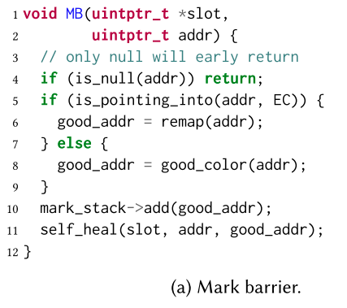


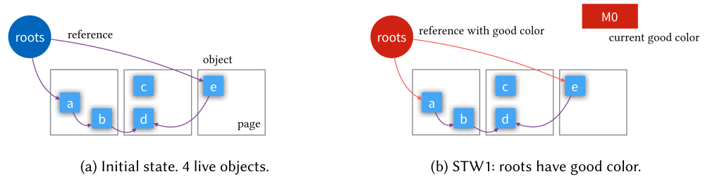


## marking/remapping (M/R)

- GC threads가 mark stack에서 객체를 꺼내고 관련된 page에 liveness information을 갱신한다.
- liveness information은 살아 있는 바이트의 수로 컴팩팅 과정에서 사라질 page를 선택하는데 이용된다.
  - 살아 있는 바이트 수가 적은 page가 제거 되상이 된다.

- marking 단계는 모든 객체가 마킹되면 끝난다.


**M/R phase 과정**


- mark_obj 함수는 해당 객체가 마킹되지 않았고 현재 쓰레드가 성공적으로 해당 객체를 마킹했을 때 `true`를 반환한다.
  - 이 함수는 원자적인 오퍼레이션(CAS)을 내부적으로 사용해서 쓰레드 세이프하다.
- `true`인 경우에만 해당 오브젝트의 레퍼런스 타입 필드들에 대해서 `mark barrier`가 적용된다.


**Mark barrier and load barrier**


- MB는 GC threads가 사용하고 LB는 mutators가 사용한다.
  - 둘다 메인 로직이 같다. 
- MB
  - 포인터가 EC를 가리키고 있다는 것은 해당 오브젝트가 재배치되었다는 뜻이다.
  - 따라서 remap 함수를 통해 새로운 주소로 업데이트 한다.
  - EC(evacuation candidates)는 이전 사이클에서 정해진 해제된 페이지를 말한다.
    - 해당 페이지의 객체들은 이미 다른 페이지로 옮겨간 상태로 remap 함수를 통해 dangling pointer를 다시 재배치된 객체를 가리키게해 good color 포인터로 고친다.
    - 재배치된 객체의 주소는 forwarding table에 조회해서 얻는다.


## STW2: The End of the Marking Phase

- marking phase는 모든 객체가 마킹되면 종료된다.
- 하지만 언제 모든 객체가 마킹되었는지 아는 것이 쉽지는 않다.
- 각각의 mutator와 GC thread가 자신만의 thread-local mark stack을 가지고 있기 때문이다.
- 따라서 모든 마크 스택의 상태를 확인하기 위해서는 STW(stop-the-world) 일시 정지(STW2) 내에서 이 조건을 확인해야 합니다
- 모든 mark stack들이 비어야 M/R phase가 끝난다.
  - 따라서 STW2를 조기에 들어가가거나 한 사이클 동안 여러번의 STW2을 들갈 수 있게된다.
  - 하지만 이는 바람직하지 않은 상황이이다. STW pause는 모든 mutator들과 동기화를 필요로하기 때문에 throughput 저하를 일으킨다.
  - 따라서 mutator와 하나씩 thread-local handshaking을 통해 STW pause를 들어가기 전에 mark stack이 비었는지 확인한다.
  - 이 방식으로 STW2가 조기에 들어가는 가능성을 낮춘다.


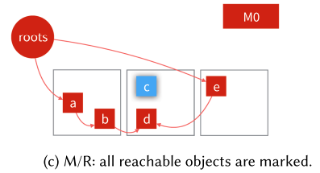


## reference processing (RP)

- The reference processing phase handles Java’s Soft, Weak, and Phantom references


## selection of evacuation candidates (EC)

- evacuation candidate는 객체들이 드문드문 들어있는 페이지들의 모음이다.
  - 쓰레기 객체가 많은 페이지들의 집합

- EC page들에 있는 모든 살아 있는 객체를 재배치하면 모든 EC pages들이 해제될 수 있다.
  - 쓰레기 객체가 많은 페이지들(EC page)에서 살아있는 객체를 새로운 페이지를 옮기고 EC page들을 해제한다.

- evacuation candidates를 선정하기 전에 이전 사이클에서 만들어진 EC set과 forwarding tables을 비운다.
  - M/R phase에서 mutators와 GC threads에 의해서 dangling pointer를 고쳤기 때문에 지워도 안전하다.


- 살아있는 개체가 하나라도 있는 relocatable pages는 임시적으로 EC set에 추가되며 살아있는 객체가 하나도 없는 페이지는 즉시 해제된다.
- EC set을 살아있는 바이트의 수로 정렬한다.
  - M/R 단계에서 페이지마다 기록했던 liveness information을 활용한다.
- 살아 있는 객체가 너무 많은 페이지를 EC set에서 제거한다.


**코드**


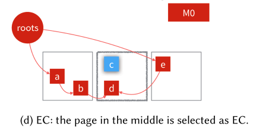


## STW3: Transitioning to Relocation

- 이번 단계에서는 R 비트만 설정된 포인터(`0100`)가 good color다.
- mutators가 멈춰있는 동안 모든 루트를 방문해 만약 루트가 EC page의 객체를 가리키고 있으면 해당 객체를 EC page가 아닌 곳으로 재배치한다.
- 따라서 `0100` 비트를 가진 포인터는 EC Page의 객체를 가리키지 않는 것을 보장된다.
- 이러한 객체 이동이 힙에 있는 모든 포인터를 사실상 무효화하기 때문에 mutators가 load barrier를 통해  slow path를 타게한다.


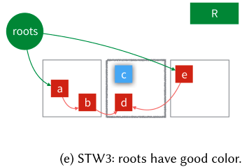


## relocation (RE)

- STW3이 끝나면 concurrent relocation을 시작한다.
- GC threads가 EC에 페이지 단위로 살아있는 객체를 Non EC로 이주시킨다.
- 페이지 마다 존재하는 forwarding tables(old-to-new address mapping)을 페이지 밖에 저장한다.
  - 페이지 밖에 존재하기 때문에 페이지에 존재하는 객체가 없을 때 바로 페이지를 해제할 수 있다.
  - relocatable pages 밖에 forwarding tables을 저장하는 방식은 

- EC page에 모든 객체들이 재배치되면  ZGC cycle이 종료된다.
- 하지만 여전히 EC page의 객체를 가리키는 포인터들이 남아있다.
  - 이러한 포인터는 다음 사이클의 M/R 단계에서 mutator나 GC threads에 의해서 remap된다.


**코드**


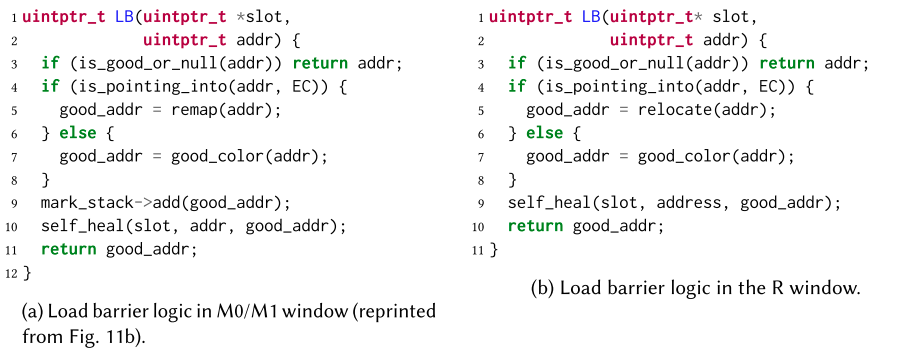 


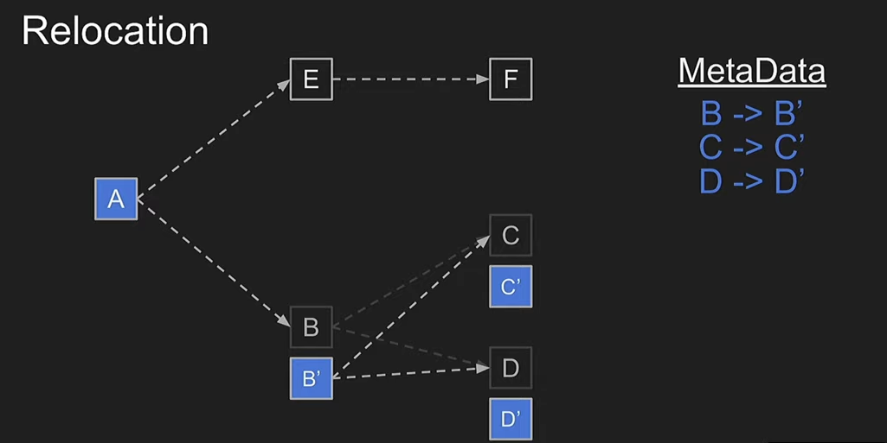

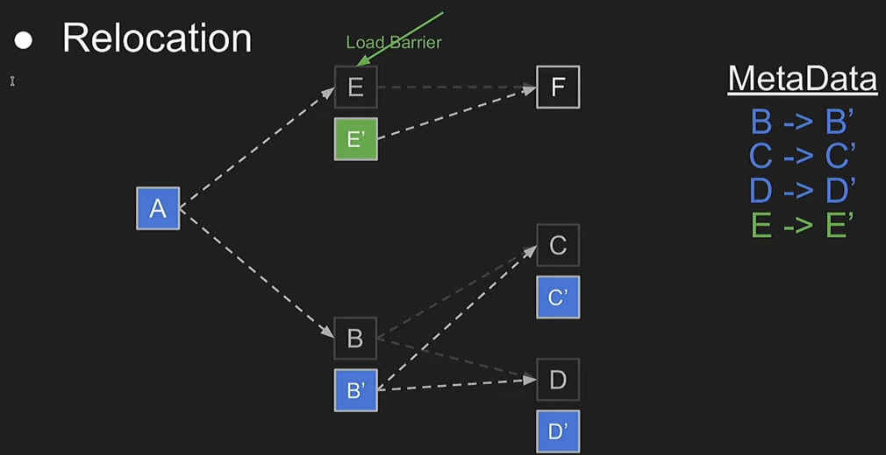

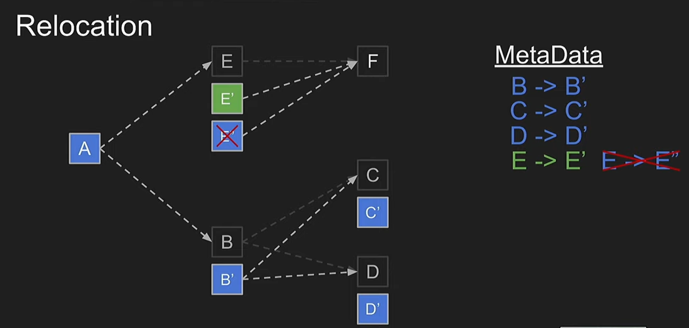

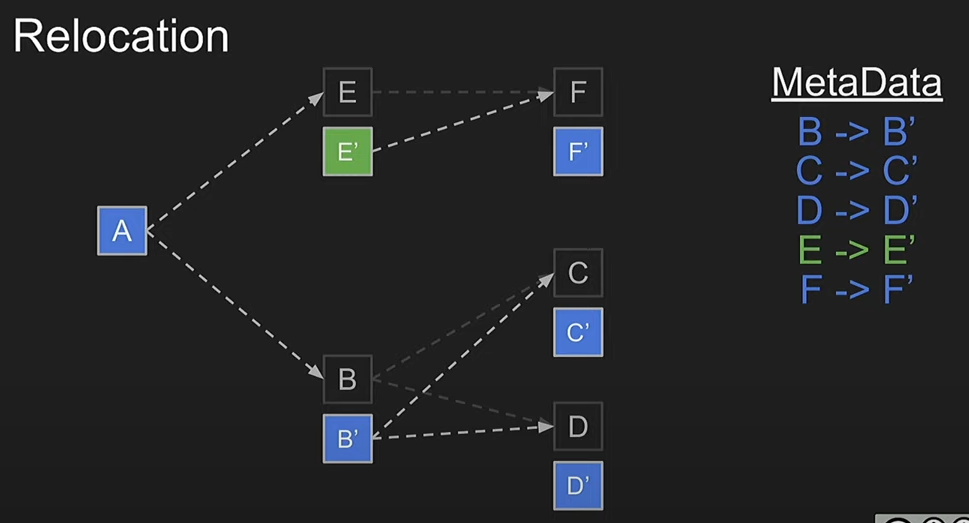

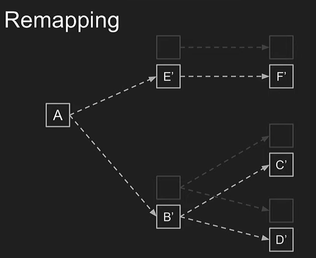


## **전체 다시 보기**

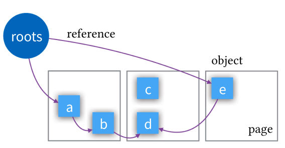

- 초기 힙의 상태로 4개의 살아있는 객체가 있다.

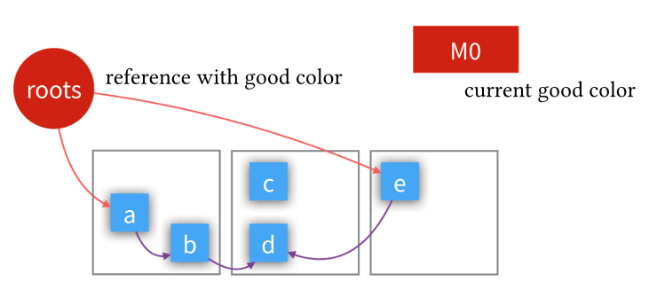

- SWT1
  - M0가 good color로 선정되었다.
  - 모든 루트 포인터는 good color를 가지고 있다.
  - 모든 루트를 mark stack에 넣는다.

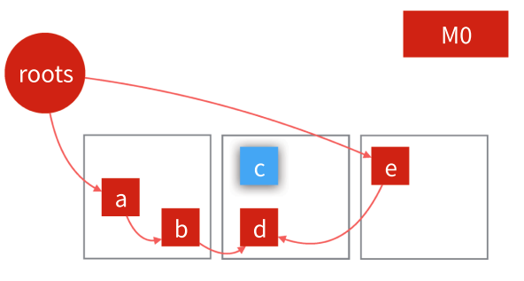

- M/R

  - GC threads는 mark stack에서 객체를 빼서 mark barrier를 적용한다.

  - mutator가 힙에 있는 객체를 참조할 때 loar barrier를 적용한다.

- STW2

  - M/R 단계 끝

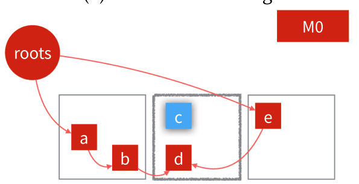

- EC
  - 살아있는 객체가 가장 작은 중간 페이지가 EC로 선정됨

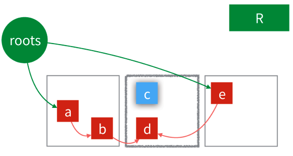

- STW3
  - R이 good color로 선정됨
  - 모든 루트 포인터를 good color로 만든다.
  - 만약 루트가 EC 페이지의 객체를 가리키면 해당 객체를 재배치해서 루트의 주소를 갱신한다.

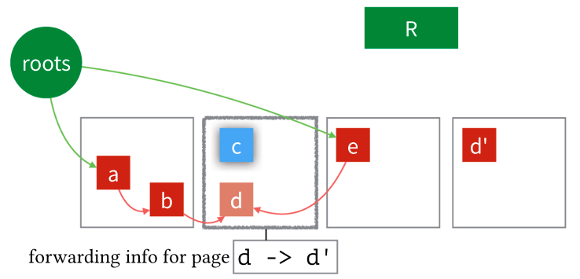

- RE
  - EC에 있는 객체들이 재배치된다.
  - 주소 이동의 정보가 forwarding table에 기록된다.

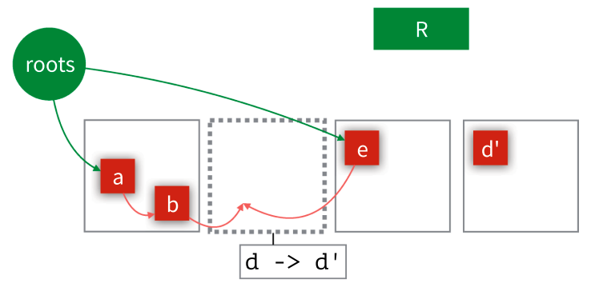

- RE가 끝날 때
  - GC 사이클이 끝냐며 EC page가 해제된다.
  - RE가 끝났는데 여전히 dangling pointer가 존재한다.
  - 이 포인터는 다음 사이클의  M/R phase에서 고쳐진다.

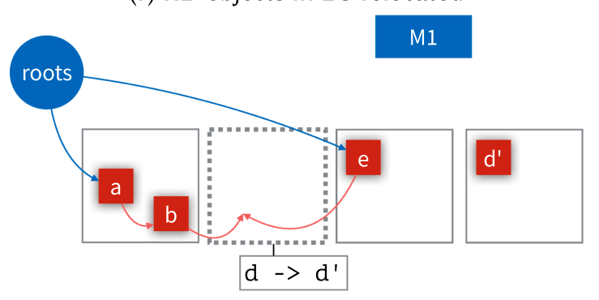

- SWT1
  - M1가 good color로 선정되었다.
  - 모든 루트 포인터는 good color를 가지고 있다.
  - 모든 루트를 mark stack에 넣는다.

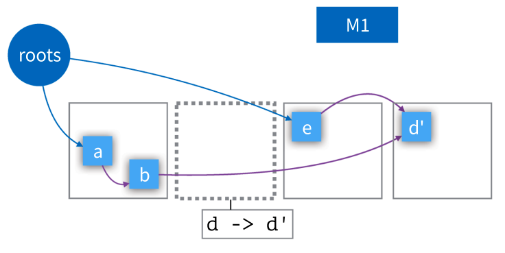

- M/R

  - GC threads는 mark stack에서 객체를 빼서 mark barrier를 적용한다.

  - mutator가 힙에 있는 객체를 참조할 때 loar barrier를 적용한다.
  - 따라서 모든 dangling pointer가 remap된다.
  - 모든 outdated pointers는 연관된 forwarding table 조회를 통해 remap된다.


---


# 7 


## 7.1 regions

- Heap space is broken into memory regions of one of three size classes, small, medium, and large.
- These regions are called **pages** inside OpenJDK
- Pages of small and medium size classes can accommodate multiple objects, but pages of large size classes hold only a single object


## 7.2 live map

- page 마다 가지고 있다.
- 비트맵이다
- 인덱스에 해당하는 오브젝트가  strongly-reachable and/or final-reachable 한지 유무를 표현함


## 7.3 relocation set

- The evacuation candidate set is a collection of sparsely populated relocatable pages
- After relocating all live objects on the EC pages into other pages, all EC pages can be reclaimed
- relocatable pages: allocated prior to the current GC cycle


## 7.4 forwarding table

- To keep track of how objects move so that dangling pointers can be fixed on load
- forwarding tables are used to map pre-relocation (old) to post-relocation (new) addresses.
- either in the load barrier by mutators as a side-effect of accessing those pointers or by GC threads traversing all live objects in the heap (during marking)


**JEP**

- [JEP 333: ZGC: A Scalable Low-Latency Garbage Collector (Experimental)](https://openjdk.org/jeps/333)
- [JEP 376: ZGC: Concurrent Thread-Stack Processing](https://openjdk.org/jeps/376)
- [JEP 377: ZGC: A Scalable Low-Latency Garbage Collector (Production)](https://openjdk.org/jeps/377)
- [JEP 439: Generational ZGC](https://openjdk.org/jeps/8272979)


참고

- https://wiki.openjdk.org/display/zgc/Main
- https://dl.acm.org/doi/pdf/10.1145/3538532
- https://www.alibabacloud.com/blog/alibaba-dragonwell-zgc-part-2-the-principles-and-tuning-of-zgc-%7C-a-new-garbage-collector_598851
- https://dinfuehr.github.io/blog/a-first-look-into-zgc/
- https://www.opsian.com/blog/javas-new-zgc-is-very-exciting


참고 영상

- [ZGC - The Future of Low-Latency Garbage Collection Is Here](https://www.youtube.com/watch?v=OcfvBoyTvA8&t=1s)

- [ZGC: A Scalable Low-Latency Garbage Collector](https://www.youtube.com/watch?v=kF_r3GE3zOo&t=1s)
- [Simone Bordet — Concurrent Garbage collectors: ZGC & Shenandoah](https://www.youtube.com/watch?v=e2lXj_t7ZBc)
- [Java’s Highly Scalable Low-Latency Garbage Collector : ZGC](https://www.youtube.com/watch?v=U2Sx5lU0KM8)
- [ZGC - Low Latency GC for OpenJDK with Stefan Karlsson and Per Liden](https://www.youtube.com/watch?v=tShc0dyFtgw)
- [Erik Österlund — Concurrent thread-stack processing in the Z Garbage Collector](https://www.youtube.com/watch?v=zsrSUs65xZA&t=821s)