# 1 **ZGC**

- **The Z Garbage Collector**
- JDK 11에서 처음 선보였고 JDK 15부터 Production Ready 상태


## 1.1 ZGC의 목표

**[JEP333](https://openjdk.org/jeps/333)에서 설정한 목표**

- GC pause time이 10ms를 초과하지 않기
- 작은 사이즈의 힙(a few hundreds of megabytes)부터 큰 사이즈의 힙(many terabytes)까지 지원하기
- G1 gc와 비교하여 throughput 저하를 최대 15%까지만 허용
  - low-latency을 중시하기 때문에 그만큼 throughput이 희생된다.


**추가적인 목표**

- 쉬운 튜닝
  - The Java ZGC is **easy to use** and require minimal configuration.


> JEP: JDK Enhancement Proposals


## 1.2 ZGC란?

- `ZGC is a scalable low-latency garbage collector`


**low latency**

- 최대 1ms의 pause times
  - JEP 333에서는 10ms이하지만 JEP 333의 작성자 Per Liden의 영상에서는 1ms이하로 설정
    - [ZGC - The Future of Low-Latency Garbage Collection Is Here](https://www.youtube.com/watch?v=OcfvBoyTvA8&t=1s) 여기 참고
  - JDK 16이후부터 1ms 이하로 목표 설정
    - [Erik Österlund — Concurrent thread-stack processing in the Z Garbage Collector](https://www.youtube.com/watch?v=zsrSUs65xZA&t=821s) 참고


**scalable**

- Pause times **do not** increase with root-set size
- ZGC pause O(1)

- 회소 힙 사이즈 **8MB** 

- 최대 힙 사이즈 **16TB**


**Ease of use**

- The Java ZGC is **easy to use** and require minimal configuration.


## 1.3 ZGC의 특징 요약

**Concurrent**

- 자바 쓰레드가 실행되는 동시에 GC 쓰레드가 백그라운드에서 실행된다.
- 동기화를 위한 짧은 STW를 제외하고 거의 모든 GC 작업(marking, heap defragmentation)이 자바 쓰레드와 동시에 진행된다.


**Region-based**

- 힙은 3가지 종류의 특정 사이즈의 regions들로 구성된다.


**Compacting**

- 메모리 단편화를 막기위해 주기적으로 살아있는 객체들이 힙에서
- The active objects are periodically organized in the heap to solve the problem of memory fragmentation.


**Single Generation(Non-generational)**

-  each GC cycle involves marking all live objects in the whole heap
-  Generational ZGC는 현재 진행중에 있다.
-  [JEP](https://openjdk.org/jeps/8272979)


**Using colored pointers**


**Using load barriers**


NUMA-aware


## 1.4 비교

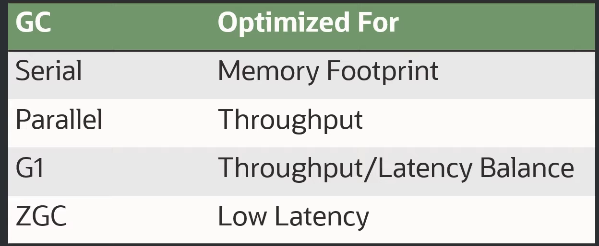

- [출처](https://www.youtube.com/watch?v=OcfvBoyTvA8&t=1s)


## 1.5 Maximum Pause-Time Goal and Throughput Goal

- [레퍼런스](https://docs.oracle.com/javase/9/gctuning/ergonomics.htm#JSGCT-GUID-BC516CBE-700D-44DB-8485-3FD5CA9A411B)
- garbage collectors can be configured to preferentially meet one of two goals: maximum pause-time and application throughput


**Maximum Pause-Time**

- Pause-Time이란 garbage collector가 애플리케이션을 멈추고 가비지를 수집하는 시간이다.
- Maximum Pause-Time은 Pause-Time의 최대치를 제한하는 목적이다.
- Maximum Pause-Time은 `-XX:MaxGCPauseMillis=<nnn>` 옵션으로 설정할 수 있다.
- GC는 해당 목표를 달성하기 위해 힙의 사이즈와 관련된 파라미터를 조절한다.
- 기본 Maximum Pause-Time은 gc의 종류마다 다르다.
- 이러한 조절이 gc가 더 많이 발생하게 할 수도 있고 throughput을 저하시킬수도 있다.
- In some cases, though, the desired pause-time goal can't be met.


**Throughput Goal**

- 가비지를 수집하는 시간과 애플리케이션 동작하는 시간의 비율이다.
- `-XX:GCTimeRatio=nnn` 옵션으로 비율을 지정할 수 있다.
- 가비지 수집 시간과 애플리케이션이 동작하는 비율이 1 / (1 + nnn)이라는 의미다.
- 예를 들어 `-XX:GCTimeRatio=19` 로 옵션을 지정하면 비율은 1/20으로 애플리케이션 동작 시간의 5%만 가비지 수집 시간으로 사용한다.


**Footprint**

- If the throughput and maximum pause-time goals have been met, then the garbage collector reduces the size of the heap until one of the goals (invariably the throughput goal) can't be met. 
- The minimum and maximum heap sizes that the garbage collector can use can be set using `-Xms=`*<nnn>* and `-Xmx=`*<mmm>* for minimum and maximum heap size respectively.


# 2 성능


## 2.1 G1과 비교


**Thoughput과 Lataency 비교**

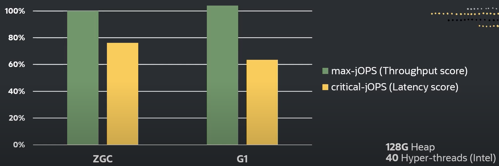

- Thoughput은 G1이 더 좋다.
- Lataency는 ZGC가 더 좋다.


**GC Pause time 비교**

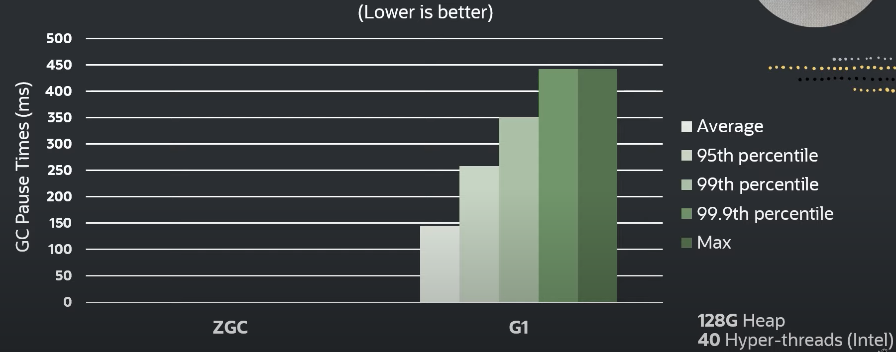

- ZGC는 1ms 이하라 보이지도 않는다.

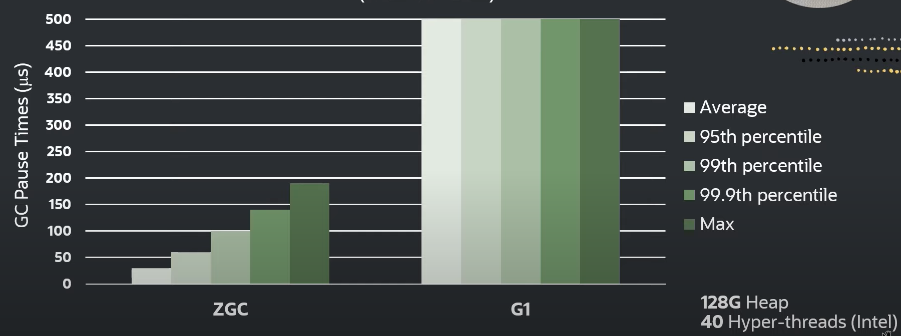

- 마이크로 세컨으로 단위 변경 후


## 2.2 JDK 버전과 성능 향상

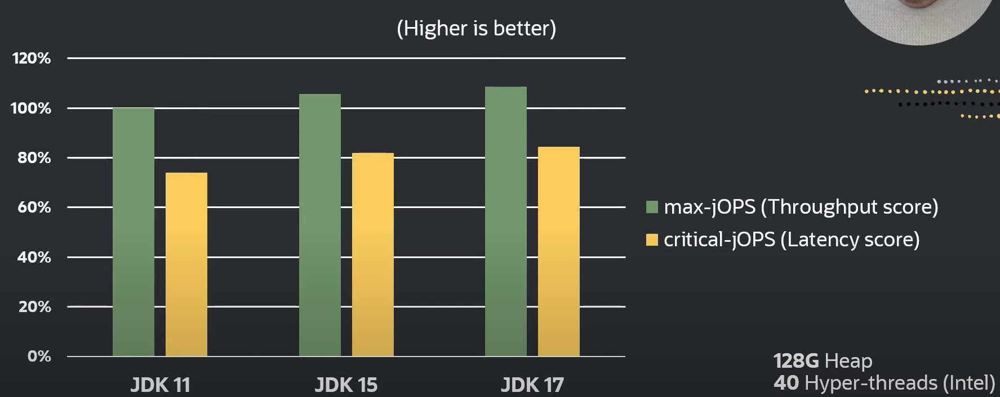

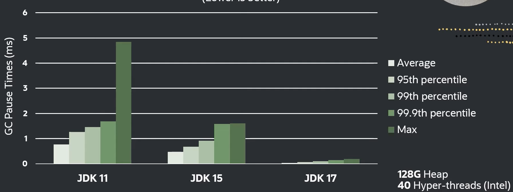

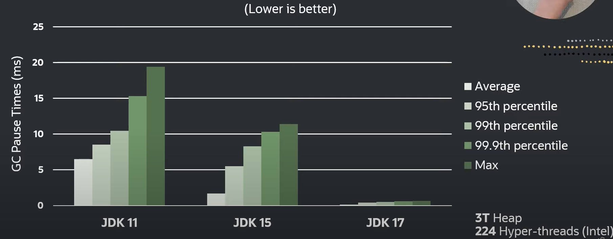


## 2.3 Non-generation과 Generational ZGC 성능 비교

- Generational ZGC는 아직 개발 중이지만 먼저 Non-generation ZGC와 성능 비교를 해보자.


**메모리 사용량**

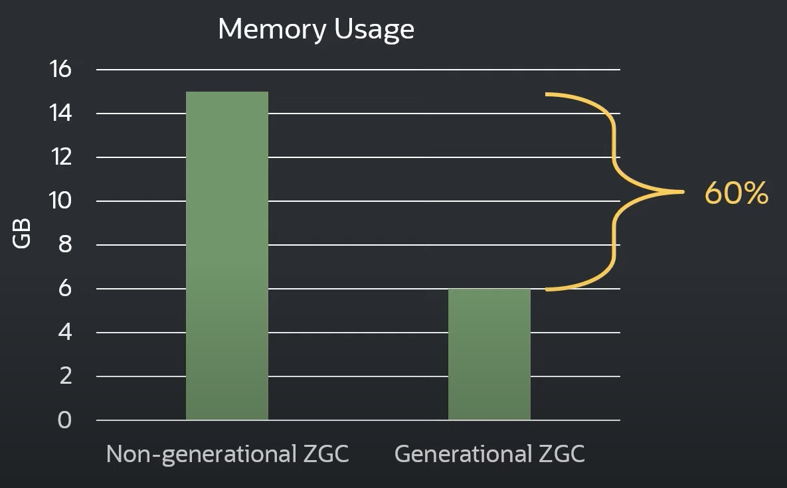


**성능**

- Generational ZGC가 메모리를 덜 쓰지만 성능이 더 잘나옴

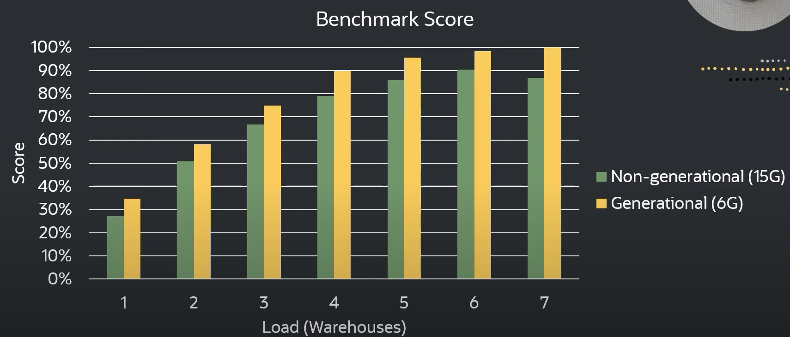


**CPU 사용량**

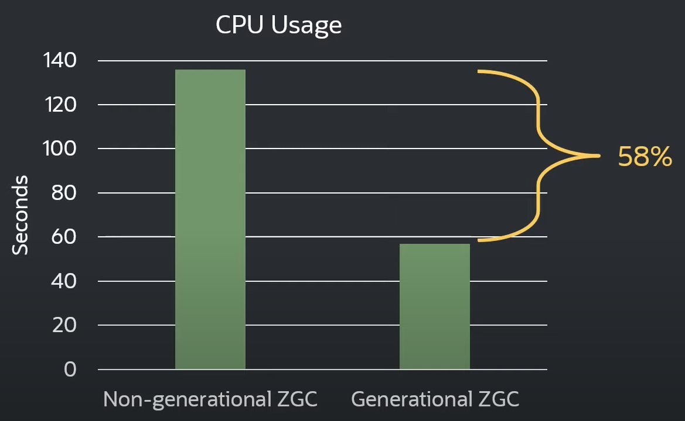


# 3 사용하기

Java를 실행할 때 아래의 옵션을 주면 ZGC를 사용할 수 있다.

```bash
-XX:+UseZGC
```


JDK 11에서 JDK 15 까지는 아래의 옵션이 추가적으로 필요하다.

```bash
-XX:+UnlockExperimentalVMOptions -XX:+UseZGC
```


# 4 Tuning

- ZGC의 목표는 쉬운 튜닝이다 따라서 Heap Size 튜닝만을 권장하고 있다.
- 아직 싱글 제네레이션이지만 제네레이션을 도입했을 때 제네레이션의 사이즈도 동적으로 자동 조절되도록 할 예정
  - `-Xmn` 옵션을 사용하지 않음
- Young 객체를 Old 객체로 승격시키는 threshold 설정도 자동으로 설정 됨
  - `-XX:TenuringThreashold` 옵션을 사용하지 않는다.


## 4.1 Setting the Heap Size

- `-Xmx` 옵션으로 힙의 크기를 설정한다.

> The most important tuning option for ZGC is setting the max heap size `(-Xmx)`. Since ZGC is a concurrent collector a max heap size must be selected such that, 1) the heap can accommodate the live-set of your application, and 2) there is enough headroom in the heap to allow allocations to be serviced while the GC is running. How much headroom is needed very much depends on the allocation rate and the live-set size of the application. In general, the more memory you give to ZGC the better. But at the same time, wasting memory is undesirable, so it’s all about finding a balance between memory usage and how often the GC needs to run.
>
> [레퍼런스](https://docs.oracle.com/en/java/javase/11/gctuning/z-garbage-collector1.html#GUID-9957D441-A99A-4CF5-9522-393E6DE7D898)


> GC usually requires a developer to specify the heap space size. The specific value will be greater than the total size of the live objects in the heap. The higher proportion of redundant space, the better the GC performance is. For example, if the total size of estimated objects reaches 32GB, the heap space size is set as Xmx40g, which means 40GB of the heap is enabled.
>
> ZGC differs from traditional GC. While ZGC collects objects, Java threads are also allocating new objects. Therefore, ZGC requires a higher proportion of redundant space than traditional GCs.
>
> The total size of objects allocated during each round of ZGC can be estimated by **allocation speed and single round ZGC time**, so the size of heap space should be greater than **the total size of live objects + the total size of objects allocated during a single ZGC**.
>
> You can find the preceding **allocation speed** and **single round ZGC time** in GC logs.
>
> https://www.alibabacloud.com/blog/alibaba-dragonwell-zgc-part-2-the-principles-and-tuning-of-zgc-%7C-a-new-garbage-collector_598851


## 4.2 Setting Number of Concurrent GC Threads

- `-XX:ConcGCThread` 옵션으로 parallel marking threads의 수를 설정한다.
- JDK 17부터 ZGC는 Concurrent GC 스레드의 수를 동적으로 늘리고 줄인다. 
- 따라서 Concurrent GC 스레드의 수를 조정할 필요가 없다.


> The second tuning option one might want to look at is setting the number of concurrent GC threads `(-XX:ConcGCThreads)`. ZGC has heuristics to automatically select this number. This heuristic usually works well but depending on the characteristics of the application this might need to be adjusted. This option essentially dictates how much CPU-time the GC should be given. Give it too much and the GC will steal too much CPU-time from the application. Give it too little, and the application might allocate garbage faster than the GC can collect it.
>
> [레퍼런스](https://docs.oracle.com/en/java/javase/11/gctuning/z-garbage-collector1.html#GUID-CD1DF73A-11D2-4478-BE14-20CBF8DA2830)


> The default number of concurrent GC threads in ZGC is one-eighth of the CPU cores, such as a 16-core machine. If ConcGCThreads is not specified, ZGC will use two concurrent GC threads.
>
> In GC logs, if **Allocation Stall** frequently appears, it means the collection cannot keep up with the allocation. Therefore, ConcGCThreads may be required to be increased. However, ConcGCThreads cannot be increased indefinitely because too many concurrent GC threads will occupy CPU resources and affect the normal execution of Java threads.
>
> *Note:* Concurrent GC threads (ConcGCThreads) are different from parallel GC threads (ParallelGCThreads). The former can be executed concurrently with Java threads, and the latter is the GC threads during GC pauses.
>
> https://www.alibabacloud.com/blog/alibaba-dragonwell-zgc-part-2-the-principles-and-tuning-of-zgc-%7C-a-new-garbage-collector_598851


## 4.3 Logging

- GC 로깅을 활성화 하려면 아래 옵션을 사용한다


**기본 로깅**

```bash
-Xlog:gc:gc.log
```


**자세한 로깅**

- tuning 또는 performance 분석 용

```bash
-Xlog:gc*:gc.log
```


# 5 Problem

**모든 concurrent collector가 풀어야할 문제**

- mutators(애플리케이션 쓰레드)와 GC 쓰레드가 힙에 대한 동일한 뷰를 갖는 것이 concurrent 콜렉터가 반드시 해결해야할 문제다.
- 적절한 조치가 취해지지 않으면 mutators가 오브젝트 그래프를 변경하여 GC의 판단을 의미없게 만들 수 있기 때문이다.


**예시**

- mutators와 GC 쓰레드가 힙에 대한 동일한 뷰를 가지고 있지 않을 때 발생할 수 있는 문제에 대해 그림과 함께 알아보자.

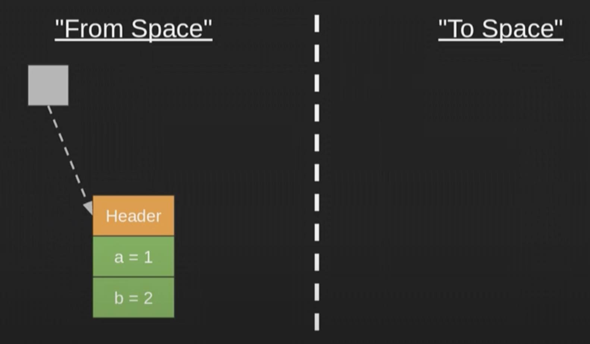

- 초기 상태


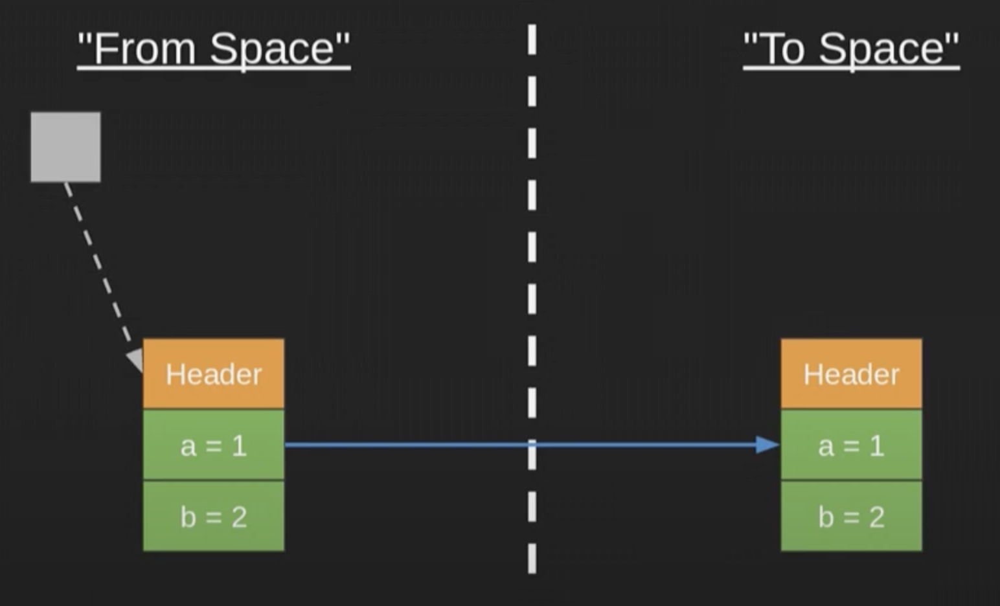

- GC가 컴팩팅 과정에서 오브젝트를 From Space에서 To Space로 옮긴다.


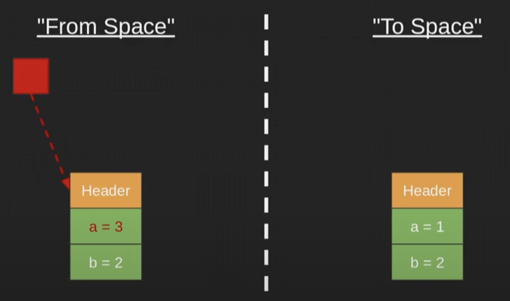

- 애플리케이션 쓰레드는 이전 위치에 객체에 쓰기 작업을 진행한다.


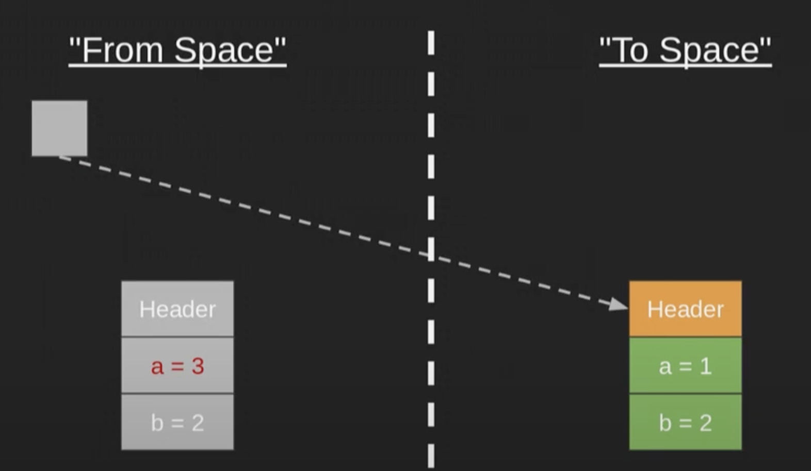

- 참조가 갱신되어 이동된 객체로 바뀐다.
- 애플리케이션 쓰레드의 쓰기 작업이 정상적으로 반영되지 않는다. 


**일반적인 해결법**

- 이 문제에 대한 일반적인 해결책은 mutators가 작은 코드 조각을 추가적으로 실행함으로써 해결할 수 있다.
  - 이 코드 조각으로 mutators와 GC가 동일한 힙 뷰를 갖도록 한다.
- mutators가 객체를 읽을 때 read barrier라 불리는 작은 코드 조각을 실행한다.
  - 객체를 읽을 때 read barrier가 실행되어 GC로 부터 뷰에 대한 정보를 받는다.
- mutators가 객체를 쓸 때 write barrier라 불리는 작은 코드 조각을 실행한다.
  - 객체를 쓸 때 write barrier가 실행되어 GC에게 뷰에 대한 정보를 전달한다.
- ZGC 알고리즘은 특별한 종류의 load barrier라고 불리는 특별한 read barrier를 사용한다.
- `load barrier`는 mutators와 GC가 힙에대한 동일한 뷰를 가지게 한다.


**Load Barriers and Colored Pointers**

- To ensure that mutators see only valid pointers, even with GC running concurrently, ZGC utilizes colored pointers and load barriers
- during relocation, an object may be moved at any time without updating its incoming pointers (which may exist anywhere in the heap), which effectively produces dangling pointers
- load barriers trap loads of such dangling pointers and trigger code that updates the pointers with the new locations of relocated objects, thereby “fixing” the dangling pointers.
- The trapping of dangling pointers is achieved by embedding metadata in pointers, using higherorder bits in addresses
- ZGC denotes such metadata as “colors”, and all pointers mediate between two colors: good (pointer is valid) and bad (pointer is potentially invalid)


## 5.1 **Colored Pointers**

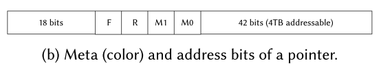

- Pointers are always 64-bit structures, consisting of meta bits (color of the pointer) and address bits. 
- The four meta bits are 
  - Finalizable (F) 
  - Remapped (R): relocation set을 가리키는 지 여부 
  - Marked1 (M1): 마킹된 여부
  - Marked0 (M0): 마킹된 여부
- A pointer’s color is determined by the status of its meta bits: F, R, M1, and M0
- A color can be either “good” or “bad”.
  - Object creation always yields a pointer with the current good color.

- A good color is one of the R, M1, M0 meta bits set and the other three unset
  - three good colors: 0100, 0010, and 0001
  - Once the good color is decided, all other colors are considered bad
- there is a globally agreed-upon single good color, and its selection is decided twice during a ZGC cycle
  - in STW1, where it alternates between M1 (0010) or M0 (0001) set
  - in STW3, where it equals R being set, 0100. 


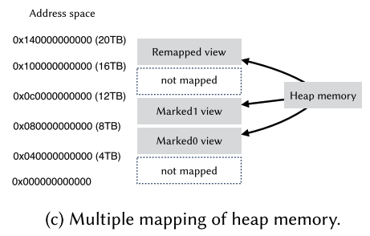

- The same physical heap memory is mapped into the virtual address space three times, resulting in three “views” of the same physical memory


## 5.2 **Load Barriers**

- The ZGC algorithm uses a special kind of read barrier, called a load barrier
- A read barrier is code executed when reading a pointer from the heap
- JIT가 삽입하는 코드 조각이다.
- 힙에 있는 오브젝트 참조할 때 해당 코드가 작동된다.
- 오브젝트 레퍼런스의 색을 검사한다.
  - 만약 잘못되어 있다면 이를 교정한다.
- If the color of the pointer being loaded is good, the fast path of the load barrier is taken, otherwise, the slow path. The fast path is effectively empty, while the slow path contains logic for calculating the corresponding pointer with good color: checking if the object has been (or is about to be) relocated and if so, looking up (or deciding) the new address of the object


**예시**

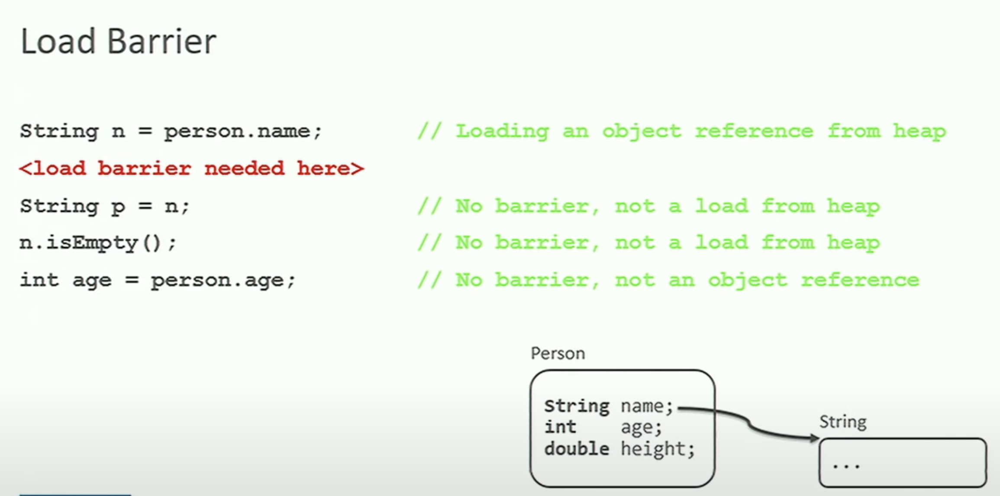

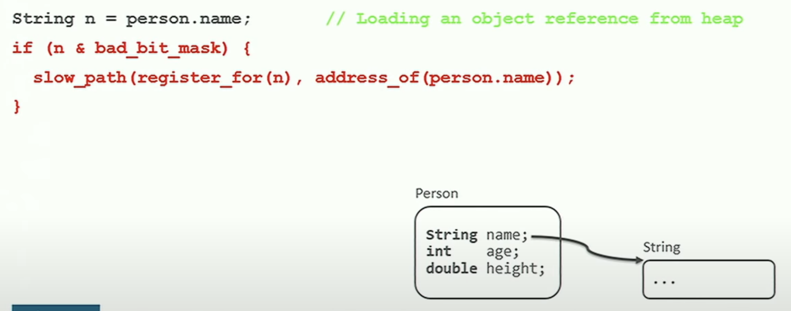

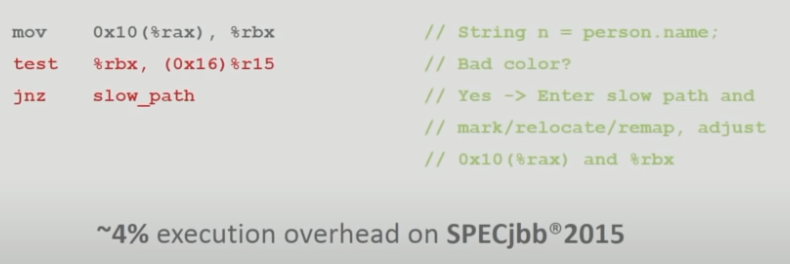


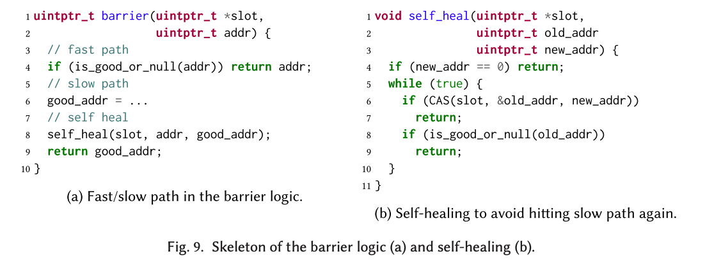


# 6 ZGC cycle

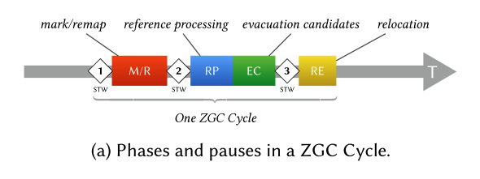


## STW1: The Start of the ZGC Cycle

- The start of the ZGC cycle is a STW pause
- all threads agree on the current good color, meaning either the M0 or M1 bit is set by alternating selection
- pages allocated before this cycle are identified, and the current GC cycle collects only dead objects on those pages
  - fresh pages are created to replace the currently used allocating pages for mutators to use so that future allocations (after STW1) will be placed on those fresh pages.

- all roots have a good color and are pushed to the mark stack for concurrent marking
  - the mark barrier is applied for roots, such as system classes and objects, references on the stack frame, and so on
  - The reason why roots need to have good color is that mutators will not hit the load barrier when accessing roots
  - loading variables on the stack does not trigger the load barrier


## marking/remapping (M/R)

- GC threads consume the mark stack, mark the popped objects, and update the liveness information of the associated page
- The liveness information is the number of live bytes on a page and is used to select pages on which objects will be evacuated, meaning they will be relocated as part of defragmenting the heap.
- The marking phase terminates when all objects are marked


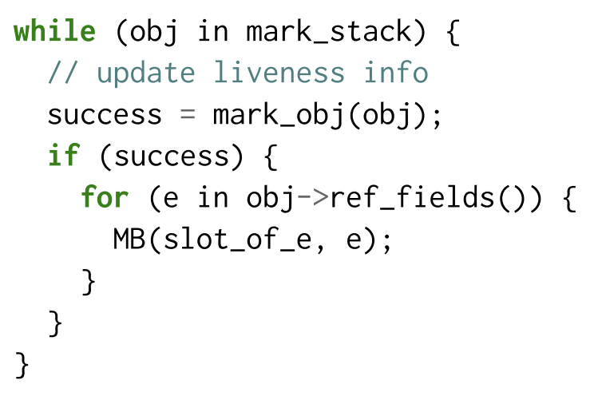

- the main GC loop of the M/R phase. 
- The function mark_obj returns true if and only if the object was not marked and the current thread successfully marked the object. 
- It uses an atomic operation (CAS) internally to set bits in a bitmap, so it is thread-safe.14 
- Finally, in the true case, the mark barrier is applied to this object’s fields of the reference type.


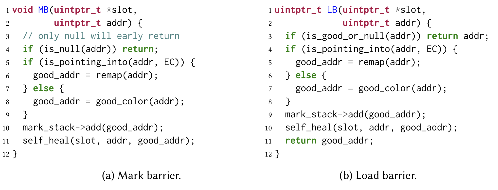


## STW2: The End of the Marking Phase

- The marking phase terminates when all objects are marked
- Checking when this condition becomes true is non-trivial
- each mutator and GC thread have its own thread-local mark stack
- thread-local handshaking with each mutator (one mutator at a time) is performed to check for the presence of any to-be-marked objects before attempting an STW pause
  - this reduces the probability of entering STW2 prematurely.
- after marking, the ZGC heap is guaranteed free of dangling pointers.


## reference processing (RP)

- The reference processing phase handles Java’s Soft, Weak, and Phantom references


## selection of evacuation candidates (EC)

- The evacuation candidate set is a collection of sparsely populated relocatable pages. 
- After relocating all live objects on the EC pages into other pages, all EC pages can be reclaimed
- before selecting evacuation candidates, the EC set from the previous GC cycle is cleared, and forwarding tables (mapping old addresses to new) associated with those pages are dropped.
  - This is safe as there can be no reachable pointers in the heap still pointing into these pages
  - these pointers have been remapped by mutators or GC threads by the end of the M/R phase

- relocatable pages (i.e., allocated prior to the current GC cycle) with at least one live object (page->is_marked() == true) are tentatively added to the EC set, and pages with no live objects are reclaimed right away
- we sort all pages in EC by live bytes
- so that the trailing multiple pages (too many live objects) are dropped from the EC set;

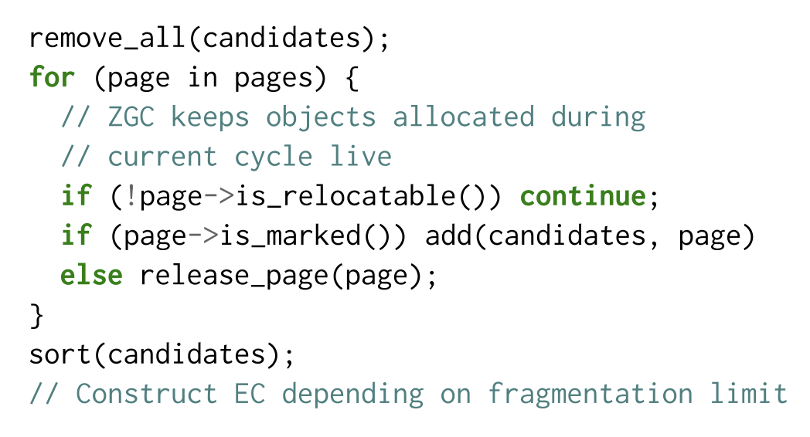


## STW3: Transitioning to Relocation

- the good color is to have the R bit set (0100)
- A pointer of this color is guaranteed not to point to objects on EC pages
- while mutators are stopped, all roots are visited—if a root points into an EC page, the object will be relocated to a non-EC page


## relocation (RE)

- After STW3, the system is ready to perform concurrent relocation
- This happens by GC threads migrating all live objects in the EC, page by page. 

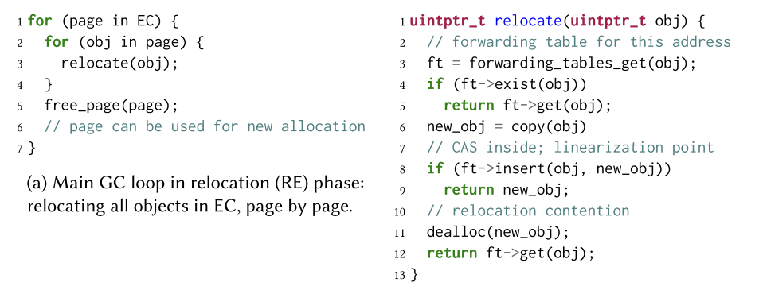

# 

# 7 


## 7.1 regions

- Heap space is broken into memory regions of one of three size classes, small, medium, and large.
- These regions are called **pages** inside OpenJDK
- Pages of small and medium size classes can accommodate multiple objects, but pages of large size classes hold only a single object


## 7.2 live map

- page 마다 가지고 있다.
- 비트맵이다
- 인덱스에 해당하는 오브젝트가  strongly-reachable and/or final-reachable 한지 유무를 표현함


## 7.3 relocation set

- The evacuation candidate set is a collection of sparsely populated relocatable pages
- After relocating all live objects on the EC pages into other pages, all EC pages can be reclaimed
- relocatable pages: allocated prior to the current GC cycle


## 7.4 forwarding table

- To keep track of how objects move so that dangling pointers can be fixed on load
- forwarding tables are used to map pre-relocation (old) to post-relocation (new) addresses.
- either in the load barrier by mutators as a side-effect of accessing those pointers or by GC threads traversing all live objects in the heap (during marking)


**JEP**

- [JEP 333: ZGC: A Scalable Low-Latency Garbage Collector (Experimental)](https://openjdk.org/jeps/333)
- [JEP 376: ZGC: Concurrent Thread-Stack Processing](https://openjdk.org/jeps/376)
- [JEP 377: ZGC: A Scalable Low-Latency Garbage Collector (Production)](https://openjdk.org/jeps/377)


참고

- https://wiki.openjdk.org/display/zgc/Main
- https://dl.acm.org/doi/pdf/10.1145/3538532
- https://www.alibabacloud.com/blog/alibaba-dragonwell-zgc-part-2-the-principles-and-tuning-of-zgc-%7C-a-new-garbage-collector_598851
- https://dinfuehr.github.io/blog/a-first-look-into-zgc/
- https://www.opsian.com/blog/javas-new-zgc-is-very-exciting


참고 영상

- [ZGC - The Future of Low-Latency Garbage Collection Is Here](https://www.youtube.com/watch?v=OcfvBoyTvA8&t=1s)

- [ZGC: A Scalable Low-Latency Garbage Collector](https://www.youtube.com/watch?v=kF_r3GE3zOo&t=1s)
- [Simone Bordet — Concurrent Garbage collectors: ZGC & Shenandoah](https://www.youtube.com/watch?v=e2lXj_t7ZBc)
- [Java’s Highly Scalable Low-Latency Garbage Collector : ZGC](https://www.youtube.com/watch?v=U2Sx5lU0KM8)
- [ZGC - Low Latency GC for OpenJDK with Stefan Karlsson and Per Liden](https://www.youtube.com/watch?v=tShc0dyFtgw)
- [Erik Österlund — Concurrent thread-stack processing in the Z Garbage Collector](https://www.youtube.com/watch?v=zsrSUs65xZA&t=821s)