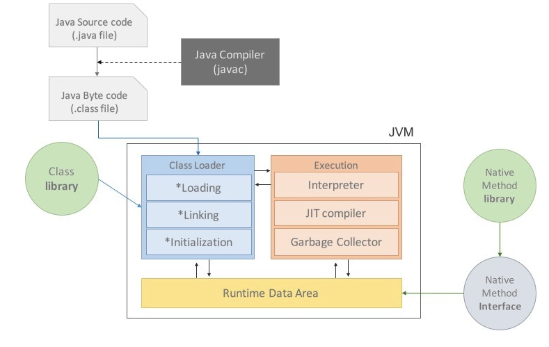

# 1 JVM

> 자바 가상 머신(Java Virtual Machine, JVM)은 자바 바이트코드를 실행할 수 있는 주체이다. 자바 바이트코드는 플랫폼에 독립적이며 모든 자바 가상 머신은 자바 가상 머신 규격에 정의된 대로 자바 바이트코드를 실행한다. 따라서 표준 자바 API까지 동일한 동작을 하도록 구현한 상태에서는 이론적으로 모든 자바 프로그램은 CPU나 운영 체제의 종류와 무관하게 동일하게 동작할 것을 보장한다. 크게 `Class Loader`,  `Runtime Data Area`, `Execution Engine` 로 구성되어 있다.

* **가상 머신**이란 프로그램을 실행하기 위해 물리적 머신(즉, 컴퓨터)와 유사한 머신을 소프트웨어로 구현한 것을 말한다고 할 수 있다.
* JVM의 역할은 자바 애플리케이션을 클래스 로더(Class Loader)를 통해 읽어 들여서 자바 API와 함께 실행하는 것입니다.
* 운영체제별로 프로그램을 실행하고 관리하는 방법이 다르기 때문에 JVM은 운영체제에 종속적이다.
  * 따라서 JVM을  운영체제에 맞게 설치해야한다.
* 자바는 썬 마이크로시스템스가 개발했지만, JVM 명세(The Java Virtual Machine Specification)를 따르기만 하면 어떤 벤더든 JVM을 개발하여 제공할 수 있다
  * 대표적인 오라클 핫스팟 JVM 외에도 IBM JVM을 비롯한 다양한 JVM이 존재한다.


# 2 JVM의 특징

* 스택 기반의 가상 머신
  * 대표적인 컴퓨터 아키텍처인 인텔 x86 아키텍처나 ARM 아키텍처와 같은 하드웨어가 레지스터 기반으로 동작하는 데 비해 JVM은 스택 기반으로 동작한다.
  * 레지스터는 없지만 일부 결과를 스택에 보관하며 이 스택 맨 위에 쌓인 값들을 가져와 계산한다
* 심볼릭 레퍼런스
  * 기본 자료형(primitive data type)을 제외한 모든 타입(클래스와 인터페이스)을 명시적인 메모리 주소 기반의 레퍼런스가 아니라 심볼릭 레퍼런스를 통해 참조한다.
  * 심볼릭 레퍼런스는 실제 물리적 메모리 위치를 가리키는 참조가 아닌 논리적 참조를 뜻한다.
* 가비지 컬렉션(garbage collection)
  * 클래스 인스턴스는 사용자 코드에 의해 명시적으로 생성되고 가비지 컬렉션에 의해 자동으로 파괴된다.


# 3 JVM의 구조

* JVM은 크게 `Class Loader`,  `Runtime Data Area`, `Execution Engine` 로 구성되어 있다.




**Java bytecode(자바 바이트코드)**

> 자바 컴파일러는 C/C++ 등의 컴파일러처럼 고수준 언어를 기계어, 즉 직접적인 CPU 명령으로 변환하는 것이 아니라, 개발자가 이해하는 자바 언어를 JVM이 이해하는 자바 바이트코드로 번역한다.
>
> 자바 바이트코드(Java bytecode)는 자바 가상 머신이 실행하는 명령어의 형태이다. 각각의 바이트코드는 1바이트로 구성되지만 몇 개의 파라미터가 사용되는 경우가 있어 총 몇 바이트로 구성되는 경우가 있다. 256개의 명령코드 모두가 사용되지는 않는다.
>
> 자바 프로그래머가 자바 바이트코드를 꼭 인지하거나 이해할 필요는 없다. 하지만 IBM의 developerWorks journal에서 제안했듯이 "바이트코드를 이해하고 자바 컴파일러에 의해 바이트코드가 어떻게 생성될 것인지를 이해하는 것은 C나 C++ 프로그래머가 어셈블리어를 이해하는 것과 같다" 라고 볼 수 있다.

예시

```java
for (int i = 2; i < 1000; i++) {
    for (int j = 2; j < i; j++) {
        if (i % j == 0)
            continue outer;
    }
    System.out.println (i);
}
```

자바 컴파일러는 위의 자바 코드를 아래와 같은 바이트 코드로 번역한다:

```
0:   iconst_2
1:   istore_1
2:   iload_1
3:   sipush  1000
6:   if_icmpge       44
9:   iconst_2
10:  istore_2
11:  iload_2
12:  iload_1
13:  if_icmpge       31
16:  iload_1
17:  iload_2
18:  irem
19:  ifne    25
22:  goto    38
25:  iinc    2, 1
28:  goto    11
31:  getstatic       #84; // Field java/lang/System.out:Ljava/io/PrintStream;
34:  iload_1
35:  invokevirtual   #85; // Method java/io/PrintStream.println:(I)V
38:  iinc    1, 1
41:  goto    2
44:  return
```


**JAR**

> JAR(Java Archive, 자바 아카이브)는 여러개의 자바 클래스 파일과, 클래스들이 이용하는 관련 리소스(텍스트, 그림 등) 및 메타데이터를 하나의 파일로 모아서 자바 플랫폼에 응용 소프트웨어나 라이브러리를 배포하기 위한 소프트웨어 패키지 파일 포맷이다. JAR 파일은 실제로 ZIP 파일 포맷으로 이루어진 압축 파일로서, 파일 확장자는 .jar이다. 


참조

* https://d2.naver.com/helloworld/1230
* https://d2.naver.com/helloworld/1329
* https://docs.oracle.com/javase/specs/jvms/se8/html/jvms-2.html#jvms-2.5.4
* Java Performance Fundamental"(김한도, 서울, 엑셈, 2009) 읽기를 추천