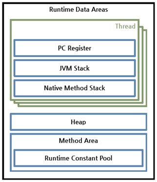
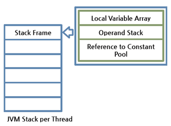
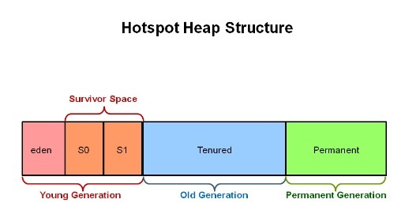

# 1 Runtime Data Area

* 런타임 데이터 영역은 JVM이라는 프로그램이 운영체제 위에서 실행되면서 할당받는 메모리 영역이다. 
* 런타임 데이터 영역은 6개의 영역으로 나눌 수 있다.
* 6개의 영역 중 일부는 스레드마다 별도로 존재하고 일부는 스레드 끼리 공유해서 사용한다.
  * 별도 존재: PC 레지스터(PC Register), JVM 스택(JVM Stack), 네이티브 메서드 스택(Native Method Stack)
  * 공유: 힙(Heap), 메서드 영역(Method Area), 런타임 상수 풀(Runtime Constant Pool)

# 2 PC 레지스터

* PC(Program Counter) 레지스터는 각 스레드마다 하나씩 존재하며 스레드가 시작될 때 생성된다.
* PC 레지스터는 현재 수행 중인 JVM 명령의 주소를 갖는다.
* PC는 사실상 메소드 영역의 주소를 가리킨다

# 3 JVM 스택

* JVM 스택은 각 스레드마다 하나씩 존재하며 스레드가 시작될 때 생성된다. 
* JVM 스택은 스택 프레임을 저장하는 스택이며 스택 프레임을 추가하거나 제거하는 동작만 수행한다
* 메소드를 호출 할 때마다 프레임을 추가하고 메소드가 종료되면 해당 프레임을 제거하는 동작을 수행한다. 
* 예외 발생 시 printStackTrace() 등의 메서드로 보여주는 Stack Trace의 각 라인은 하나의 스택 프레임을 표현한다.

## 3.1 스택 프레임

* JVM 내에서 메서드가 수행될 때마다 하나의 스택 프레임이 생성되어 해당 스레드의 JVM 스택에 추가되고 메서드가 종료되면 스택 프레임이 제거된다. 
* 스택 프레임의 구성
  * **지역 변수 배열**(Local Variable Array)
  * **피연산자 스택**(Operand Stack)
  * 현재 실행 중인 메서드가 속한 클래스의 런타임 상수 풀에 대한 레퍼런스를 갖는다. 
  * Return value

* 지역 변수 배열, 피연산자 스택의 크기는 컴파일 시에 결정되기 때문에 스택 프레임의 크기도 메서드에 따라 크기가 고정된다.
  * 따라서 가변 길이의 객체와 배열을 스택 프레임에 저장할 수 없다.

## 3.2 지역 변수 배열(Local Variable Array)

* `this` 에 대한 참조와 Method의 Parameter Value 와 Local Variable을 저장한다
  * 저장 순서는 this, Parameter Value, Local Variable 순이다
  * static method는 첫 번째 슬롯부터 메소드의 파라미터가 시작
  * instance method의 경우 첫 번째 슬롯에 this에 대한 참조값이 있다.
* 기본 타입 변수와 참조 타입 변수가 추가(push)되거나 제거(pop)된다.(stack 구조)
* 변수가 이 영역에 생성되는 시점은 변수에 최초로 값이 저장될 때이다
* 기본 타입 변수는 스택 영역에 직접 값을 가지고 있지만 참조 타입 변수는 값이 아니라 힙 영역이나 메소드 영역의 객체의 주소를 갖는다.

## 3.3 Operand Stack

* Operand Stack 은 JVM 의 작업 공간이다 . 
* JVM 이 연산에 필요한 데이터와 연산 결과를 Operand Stack에 넣고 처리한다 . 
* 작동 방식은 하나의 Instruction이 연산을 위해 Operand Stack에 값을 넣으면 다음 Instruction에서는 이 값을 빼서 사용하게 된다 
* 연산의 결과 역시 Operand Stack에 저장된다 . Operand Stack 역시 Array 로 구성되어 있으며 Stack의 구조로 Push, Pop 작업을 수행한다

# 4 **네이티브 메서드 스택**

* 자바 외의 언어로 작성된 네이티브 코드를 위한 스택이다. 
* 즉, JNI(Java Native Interface)를 통해 호출하는 C/C++ 등의 코드를 수행하기 위한 스택으로, 언어에 맞게 C 스택이나 C++ 스택이 생성된다.

# 5 메서드 영역

* 논리적으론 힙의 한 부분이지만 물리적으론 떨어져 있다. 
* 메서드 영역은 모든 스레드가 공유하는 영역으로 JVM이 시작될 때 생성된다.
* 메서드 영역은 OS의 주소 공간 중 code(text) 영역과 비슷하다
* JVM이 읽어 들인 각각의 클래스와 인터페이스에 대한 런타임 상수 풀, 필드 데이터, 메소드 데이터, 메소드 코드, 생성자 코드 등을 보관한다. 
* 메서드 영역은 JVM 벤더마다 다양한 형태로 구현할 수 있으며, 오라클 핫스팟 JVM(HotSpot JVM)에서는 흔히 Permanent Area, 혹은 Permanent Generation(PermGen)이라고 불린다. 
* 메서드 영역에 대한 가비지 컬렉션은 JVM 벤더의 선택 사항이다.

# 6 런타임 상수 풀

* 클래스와 인터페이스의 런타임 상수 풀은 해당 클래스나 인터페이스가 생성될 때 JVM에 의해서 만들어진다
* 클래스 파일 포맷에서 constant pool 테이블에 해당하는 영역이다.
* 메서드 영역에 포함되는 영역이긴 하지만, JVM 동작에서 가장 핵심적인 역할을 수행하는 곳이기 때문에 JVM 명세에서도 따로 중요하게 기술한다.
* 각 클래스와 인터페이스의 상수뿐만 아니라, 메서드와 필드에 대한 모든 레퍼런스까지 담고 있는 테이블이다.
* 즉, 어떤 메서드나 필드를 참조할 때 JVM은 런타임 상수 풀을 통해 해당 메서드나 필드의 실제 메모리상 주소를 찾아서 참조한다.

# 7 힙

* **쓰레드간 공유**가 가능하고 **객체와 배열**이 생성되는 영역이다. 
* 힙 영역에 생성된 객체와 배열은 JVM 스택 영역의 변수나 다른 객체의 필드에서 참조한다. 
* 참조하는 변수나 필드가 없다면 의미 없는 객체가 되기 때문에 JVM은 가비지 컬렉션을 실행해 힙 영역에서 제거한다. 
* JVM 성능 등의 이슈에서 가장 많이 언급되는 공간이다. 
* 힙 구성 방식이나 가비지 컬렉션 방법 등은 JVM 벤더의 재량이다.

**힙의 구조**

