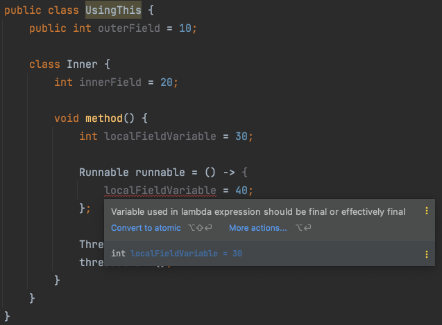

# 1. Lambda

* 하나의 메소드를 가진 인터페이스를 구현할 때 별도의 클래스 파일을 만들어서 구현해야 될까?

**FunctionalInterface Runnable**

* 추상 메소드를 하나만 가진 인터페이스를 `FunctionalInterface`라고 한다
* 아래의 인터페이스를 구현해보자

```java
@FunctionalInterface
public interface Runnable {
       public abstract void run();
}
```


## 1.1 별도 클래스 작성

* Runnable 인터페이스를 구현하는 별도의 클래스 파일 작성하고 사용하기
* 우리는 메소드 하나 실행하고 싶은데 별도의 클래스를 만들어서 사용하기 불편하다.

**Runnable 인터페이스 구현 클래스**

```java
class RunnableImpl implements Runnable {
  @Override
  public void run() {
    System.out.println("hello");
  }
}
```

```java
@Test
void testRunnableImpl() {
  Runnable runnable = new RunnableImpl();
  runnable.run();
}
```


## 1.2  Anonymous Class 이용

* [Anonymous-Class.md](../Anonymous-Class/Anonymous-Class.md)
* 별도 클래스 파일 생성 없이 익명 클래스 사용

**Runnable 인터페이스의 익명 구현 객체를 생성하는 코드**

```java
@Test
void testRunnableAnonymousClass() {
  Runnable runnable = new Runnable() {
    @Override
    public void run() {
      System.out.println("hello");
    }
  };
  runnable.run();
}
```


## 1.3 람다 사용

* 만약 FunctionalInterface라면 Anonymous Class보다 람다식을 이용하는 것이 훨씬 간편하다

**Runnable 인터페이스의 익명 구현 객체를 람다식으로 생성하는 코드**

```java
@Test
void testRunnableLambda() {
  Runnable runnable = () -> System.out.println("hello");
  runnable.run();
}
```

* 람다식은 `(매개변수) -> {실행코드}` 형태로 작성되며 런타임시에 인터페이스의 익명 구현 객체로 생성된다.
* 위 코드는 Runnable 변수에 대입되므로 람다식은 Runnable의 익명 구현 객체를 생성하게 된다.


# 2. Lambda의 기본 문법

```java
(타입 매개변수, ...) -> {실행문; ...}
```

**타입 매개변수**

* 인자가 없을 때: () 
* 인자가 한개일 때: (one) 또는 one
* 인자가 여러개 일 때: (one, two) 
* 인자의 타입은 생략 가능
  * 컴파일러가 추론하지만 명시할 수도 있다. (Integer one, Integer two)

**실행문**

* 화살표 오른쪽에 함수 본문을 정의한다.
* 여러 줄인 경우에 `{ }`를 사용해서 묶는다.
* 한 줄인 경우: `{ }`생략 가능, `return`도 생략 가능.
  * 예) `(x, y) -> x + y` 
  * 중괄호 `{ }` 안에 return문만 있을 경우 위와 같이 생략하는 것이 정석이다.


# 3. Functional Interface

* 모든 인터페이스를 람다식의 타겟 타입으로 사용할 수 없다
  * 두 개 이상의 추상 메서드가 선언된 인터페이스는 람다식을 이용해서 구현 객체를 생성할 수 없다.
* 하나의 추상 메서드가 선언된 인터페이스만이 람다식의 타켓 타입이 될 수 있다
  * 이러한 인터페이스를 함수적 인터페이스(functional interface)라고 한다.
* `@FunctionalInterface` 를 인터페이스에 적용하면 두 개 이상의 추상 메서드가 선언되지 않도록 컴파일 시점에 체킹할 수 있다.


**@FunctionalInterface 어노테이션이 사용된 예시**

* `@FunctionalInterface` 어노테이션은 선택사항이다.
* 이 어노테이션이 없더라도 하나의 추상 메서드를 가진다면 모두 Functional Interface이다.
* 그러나 실수로 두 개 이상의 추상메서드를 선언하는 것을 방지하기 위해 이 어노테이션을 사용한다.

```java
@FunctionalInterface
public interface Runnable {
       public abstract void run();
}
```

# 4. 표준 API의 함수형 인터페이스

* Java가 기본으로 제공하는 함수형 인터페이스
* java.lang.funcation 패키지
  * 자바에서 미리 정의해둔 자주 사용할만한 함수 인터페이스
  * Function, BiFunction, Consumer, Supplier, Predicate, UnaryOperator, BinaryOperator이 있다
* 구분 기준은 인터페이스에 선언된 추상 메서드의 매개값과 리턴값의 유무이다.


## 4.1 Function

```java
@FunctionalInterface
public interface Function<T, R> {
  R apply(T t);

  default <V> Function<V, R> compose(Function<? super V, ? extends T> before) {
    Objects.requireNonNull(before);
    return (V v) -> apply(before.apply(v));
  }

  default <V> Function<T, V> andThen(Function<? super R, ? extends V> after) {
    Objects.requireNonNull(after);
    return (T t) -> after.apply(apply(t));
  }
}
```

* `R apply(T t)`: T 타입을 받아서 R 타입을 리턴하는 함수 인터페이스
  * 주로 매개값을 리턴값으로 매핑(타입변환)하는데 사용


**Function의 순차적 연결**

* Function 함수적 인터페이스는 먼저 실행한 함수적 인터페이스의 결과 값을 다음 함수적 인터페이스의 매개값으로 넘겨주고 최종 결과를 리턴한다.
* Function<Member, Address>와 Function<Address, String>을 순차적으로 연결하면 Function<Member, String>을 만들 수 있다.

```java
public class FunctionAndThenTest {
  public static void main(String[] args) {
    Function<Member, Address> memberToAddress = (member) -> member.getAddress();
    Function<Address, String> addressToCityString = (address) -> address.getCity();
    
    Address address = new Address("경기도", "탄천상로");
    Member member = new Member("노영삼", address);

    // Function<Member, Address> andThen Function<Address, String> = Function<Member, String>
    Function<Member, String> memberToCityString = memberToAddress.andThen(addressToCityString);
    String city = memberToCityString.apply(member);
    System.out.println("city: " + city);

    // Function<Address, String> compose Function<Member, Address> = Function<Member, String>
    memberToCityString = addressToCityString.compose(memberToAddress);
    city = memberToCityString.apply(member);
    System.out.println("city: " + city);
  }
}
```


## 4.2 BiFunction

```java
@FunctionalInterface
public interface BiFunction<T, U, R> {
  R apply(T t, U u);
  ...
}
```

* `R apply(T t, U u)` : 두 개의 값(T, U)를 받아서 R 타입을 리턴하는 함수 인터페이스


## 4.3 Consumer

```java
@FunctionalInterface
public interface Consumer<T> {
  void accept(T t);
  
   default Consumer<T> andThen(Consumer<? super T> after) {
        Objects.requireNonNull(after);
        return (T t) -> { accept(t); after.accept(t); };
    }
}
```

* `void Accept(T t)`: T 타입을 받아서 아무값도 리턴하지 않는 함수 인터페이스


**Consumer의 순차적 연결**

* Consumer는 리턴이 없기 때문에 andThen()은 함수적 인터페이스의 호출 순서만 정한다.

```java
public class ConsumerAndThenTest {
    public static void main(String[] args) {
        @Setter
        @Getter
        class Student {
            String name;
            int score;
        }

        Student student1 = new Student();
        student1.setName("노영삼");
        student1.setScore(100);

        Student student2 = new Student();
        student2.setName("김영삼");
        student2.setScore(85);

        Student[] students = {student1, student2};

        Consumer<Student> studentName = (student) -> {
            System.out.println("이름: " + student.getName());
        };

        Consumer<Student> studentScore = (student) -> {
            System.out.println("점수: " + student.getScore());
        };

      	// Consumer 인테페이스의 호출 순서를 이름 먼저 출력하고 점수를 출력하도록
        Consumer<Student> studentNameAndScore = studentName.andThen(studentScore);

        for (Student student : students) {
            studentNameAndScore.accept(student);
        }
    }
}
```

```
이름: 노영삼
점수: 100
이름: 김영삼
점수: 85
```


## 4.4 Supplier

```java
@FunctionalInterface
public interface Supplier<T> {
    T get();
}
```

* `T get()` : T 타입의 값을 제공하는 함수 인터페이스 


## 4.5 Predicate

```java
@FunctionalInterface
public interface Predicate<T> {
  boolean test(T t);
  
  default Predicate<T> and(Predicate<? super T> other) {
    Objects.requireNonNull(other);
    return (t) -> test(t) && other.test(t);
  }

  default Predicate<T> or(Predicate<? super T> other) {
    Objects.requireNonNull(other);
    return (t) -> test(t) || other.test(t);
  }

  default Predicate<T> negate() {
    return (t) -> !test(t);
  }
  
  ...
}
```

* `boolean test(T t)`:  타입을 받아서 boolean을 리턴하는 함수 인터페이스


**Predicate의 순차적 연결**

```java
import org.assertj.core.api.Assertions;
import org.junit.jupiter.api.Test;

import java.util.function.IntPredicate;

public class PredicateTest {
  IntPredicate isMultipleOfTwo = (num) -> num % 2 == 0;
  IntPredicate isMultipleOfThree = (num) -> num % 3 == 0;

  @Test
  void testAnd() {
    IntPredicate isMultipleOfTwoAndThree = isMultipleOfTwo.and(isMultipleOfThree);
    boolean result = isMultipleOfTwoAndThree.test(6);
    Assertions.assertThat(result).isTrue();
  }

  @Test
  void testOr() {
    IntPredicate isMultipleOfTwoOrThree = isMultipleOfTwo.or(isMultipleOfThree);
    boolean result = isMultipleOfTwoOrThree.test(5);
    Assertions.assertThat(result).isFalse();
  }

  @Test
  void testNegate() {
    IntPredicate isNotMultipleOfTwo = isMultipleOfTwo.negate();
    boolean result = isNotMultipleOfTwo.test(5);
    Assertions.assertThat(result).isTrue();
  }
}
```


## 4.6 UnaryOperator 

```java
@FunctionalInterface
public interface UnaryOperator<T> extends Function<T, T> {
  ...
}
```

* Function의 특수한 형태로, 입력값 하나를 받아서 동일한 타입을 리턴하는 함수 인터페이스 


## 4.7 BinaryOperator 

```java
@FunctionalInterface
public interface BinaryOperator<T> extends BiFunction<T,T,T> {
  ...
}
```

* BiFunction의 특수한 형태로, 동일한 타입(T)의 입렵값 두개를 받아 T 타입을 리턴하는 함수 인터페이스


# 5 클래스 멤버와 로컬 변수 사용


## 5.1 클래스의 멤버 사용

- 클래스 멤버인 필드와 메소드를 제약없이 사용할 수 있다.
- 단,`this`의 사용에 주의해야 한다.
  - 람다식 내부의 `this` 는 내부적으로 생성되는 익명 객체의 참조가 아니라 람다식을 실행한 객체의 참조이다 
  - 외부 객체의 `this`를 사용하고 싶다면, `외부 객체명.this`를 이용하면 된다.

```java
@FunctionalInterface
public interface MyFunctionalInterface {
  void method();
}

public class UsingThis {
  public int outerField = 10;

  class Inner {
    int innerField = 20;

    void method() {
      MyFunctionalInterface mfi = () -> {
        // 람다식 내부에서 this는 Inner 클래스의 객체를 의미한다.
        System.out.println("outerField: " + outerField);
        // System.out.println("outerField: " + this.outerField); 컴파일 에러
        // 바깥 객체의 참조를 얻기 위해서는 클래스명.this를 사용한다.
        System.out.println("outerField: " + UsingThis.this.outerField);

        System.out.println("innerField: " + innerField);
        System.out.println("innerField: " + this.innerField);
      };
      mfi.method();
    }
  }
}
```


## 5.2 로컬 변수 사용

* 람다식은 메소드 내부에 작성되기 때문에 이름이 없는 Local Class라고 생각할 수 있다.
* 따라서  Local Class 같이 바깥 클래스의 모든 멤버(인스턴스, static 멤버)에 접근이 가능하다
* 또한 람다식은 로컬 변수와 메소드의 파라미터에 접근도 가능하다
  * 다만 로컬 변수와 매개변수는 final로 선언되거나 `effectively final`이어야 한다.
  * `effectively final`: 변수 혹은 파라미터가 초기화 이후 변하지 않은 경우


**로컬 변수와 매개변수는 final로 선언되거나 `effectively final`이어야 하는 이유**

* 로컬 클래스의 객체는 메소드 실행이 끝나도 힙 메모리에 존재해서 계속 사용할 수 있다. 
* 그러나 로컬 변수와 매개 변수는 메소드 실행이 끝나면 스택 메모리에서 사라져 로컬 객체에서 사용할 경우 문제가 된다.
* 로컬 클래스에서 사용하는 매개 변수나 로컬 변수의 값을 로컬 클래스 내부에 복사해 두고 사용한다.
* 매개 변수나 로컬 변수가 수정되어 값이 변경되면 로컬 클래스에 복사해둔 값과 달라지는 문제를 해결하기 위해 매개 변수나 로컬 변수를 final로 선언해서 수정을 막는다.
* 자바 8이후 final로 선언하지 않아도 로컬 변수가 `effectively final`이라면 접근 가능하다.
  * `effectively final`: 변수 혹은 파라미터가 초기화 이후 변하지 않은 경우
  * final 키워드가 있다면 로컬 클래스의 메소드 내부에 지역 변수로 복사
  * final 키워드가 없다면 로컬 클래스의 필드로 복사된다.


**effectively final 예시**

* 아래의 코드와 같이 람다식 에서 참조하는 지역변수 `localFieldVariable`이 final키워드 없이 선언되었기 때문에 `effectively final`해야한다.
* 그런데 람다식 안에서 `localFieldVariable`를 변경하면 더 이상  `effectively final` 하지 않기 때문에 컴파일 에러가 발생한다.

.


**로컬 변수 사용 예시**

* `localFieldVariable` 은 초기화 이후 변하지 않았기 때문에 `effectively final`하다
* 따라서 `localFieldVariable`은 클래스의 필드로 복사되어 참조가 가능하다.
* 아래의 코드에서 메소드가 끝난 이후에도 `thread`는 계속 실행되며`localFieldVariable`을 계속 참조한다. 

```java
public class UsingThis {
  public int outerField = 10;

  class Inner {
    int innerField = 20;

    void method() {
      int localFieldVariable = 11;

      Runnable runnable = () -> {
        for (int i = 0; i < 10; i++) {
          try {
            Thread.sleep(1000);
            System.out.println("thread implemented by lambda expression is running");
            System.out.println("localFieldVariable is " + localFieldVariable);
          } catch (InterruptedException e) {
            e.printStackTrace();
          }
        }
      };

      Thread thread = new Thread(runnable);
      thread.start();

      System.out.println("Method is already over");
    }
  }
}
```


# 6 메소드 참조

* 메소드 참조란 말 그대로 메소드를 참조해서 매개 변수의 정보 및 리턴 타입을 알아내어 람다식에서 불필요한 변수를 제거하는 것이 목적이다.
* 이미 정의된 메소드를 참조해서 사용한다.
* 메소드 참조에는 아래와 같이 4가지의 종류가 있다.


## 6.1 정적 메소드 참조

* `ContainingClass::staticMethodName`


## 6.2 인스턴스 메소드 참조

* `containingObject::instanceMethodName`


## 6.3 임의 인스턴스 메소드 참조

* `ContainingType::methodName`
* 람다식에 매개변수로 주어진 객체의 메소드를 참조하는 것


## 6.4 생성자 참조

* `ClassName::new`


## 6.5 예시

```java
import java.util.function.BiFunction;

public class MethodReferencesExamples {
    
    public static <T> T mergeThings(T a, T b, BiFunction<T, T, T> merger) {
        return merger.apply(a, b);
    }
    
    public static String appendStrings(String a, String b) {
        return a + b;
    }
    
    public String appendStrings2(String a, String b) {
        return a + b;
    }

    public static void main(String[] args) {
        
        MethodReferencesExamples myApp = new MethodReferencesExamples();

        // Calling the method mergeThings with a lambda expression
        System.out.println(MethodReferencesExamples.
            mergeThings("Hello ", "World!", (a, b) -> a + b));
        
        // Reference to a static method
        System.out.println(MethodReferencesExamples.
            mergeThings("Hello ", "World!", MethodReferencesExamples::appendStrings));

        // Reference to an instance method of a particular object        
        System.out.println(MethodReferencesExamples.
            mergeThings("Hello ", "World!", myApp::appendStrings2));
        
        // Reference to an instance method of an arbitrary object of a particular type
        System.out.println(MethodReferencesExamples.
            mergeThings("Hello ", "World!", String::concat));
    }
}
```


참고

* 이것이 자바다(이상민 저)
* https://docs.oracle.com/javase/tutorial/java/javaOO/methodreferences.html
