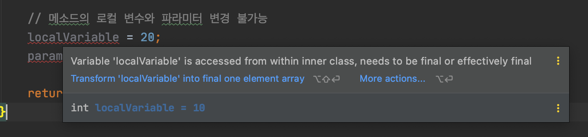

# 1 Nested Class

* 클래스가 여러 클래스와 관계를 맺는 경우 독립적으로 선언하는 것이 좋으나 특정 클래스와 관계를 맺는 경우에는 관계 클래스를 클래스 내부에 선언하는 것이 좋다. 
* **중첩 클래스란(Nested Class)란 클래스 내부에 선언한 클래스를 말한다.**
* 중첩 클래스를 사용하면 두 클래스의 멤버들은 서로 쉽게 접근 할 수 있다는 장점과 외부에는 불필요한 관계 클래스를 감춤으로서 코드의 복잡성을 줄일 수 있다.


## 1.1 중첩 클래스의 용도

* **클래스 그룹화**

  * **한 곳에서만 사용되는 클래스를 논리적으로 그룹화하는데 사용된다.**
  * 하나의 클래스가 오직 다른 하나의 클래스에만 유용한 경우 해당 클래스에 클래스를 내장하고 두 클래스를 함께 유지하는 것이 좋다. 
  * 이러한 "helper class"를 중첩하면 패키지가 더 간소화된다.

* **캡슐화 강화**

  * >  두 개의 최상위 클래스, A와 B를 고려해보자. 여기서 B는 privated으로 선언될 A의 멤버에 대한 액세스가 필요하다. 클래스 A 내에서 클래스 B를 숨김으로써 A의 멤버는 private으로 선언되고 B가 액세스할 수 있다. 게다가, B 자체는 외부로부터 숨겨질 수 있다.

* **읽기 쉽고 유지보수가 쉬운 코드**

  * 최상위 클래스 내에 작은 클래스를 중첩하면  중첩 클래스의 코드가 사용되는 위치에 더 가깝게 배치되고 읽기가 쉬워진다.


## 1.2 Nested Class의 종류

* Nested Class는 `static` 키워드의 유무로 두 가지의 종류가 있다.
  * **Non-static nested class(inner class)**: `static` 키워드 없음
  * **static nested class**: `static` 키워드 있음


**이너 클래스의 종류**

* **이너 클래스**: 클래스 내부에 선언된 클래스
* **로컬 클래스**: 메서드의 바디 내에서 선언된 이너 클래스
  * 로컬 클래스를 한번만 사용하는 경우 익명 클래스를 사용하는 것이 좋다
* **익명 클래스**: 클래스 이름을 지정하지 않고 메서드 본문에 이너 클래스를 선언
  * [Anonymous-Class.md](../Anonymous-Class/Anonymous-Class.md)
  * 하나의 추상 메소드를 가진 인터페이스를 구현하는 경우 익명 클래스보다 람다식을 사용하는 것이 간결하다.


# 2 inner class(non-static nested class)

* `static` 키워드 없이 선언된 중첩 클래스를 말한다.
* 이너 클래스는 **외부 클래스의 인스턴스와 연결**되어 있다
* 이너 클래스는 인스턴스와 연관되어 있기 때문에 정적 멤버를 선언할 수 없다.

  * 인스턴스 필드와 메서드만 선언 가능함
* 이너 클래스의 인스턴스 객체는 반드시 외부 클래스의 인스턴스와 함께 존재한다.

  * 이너 클래스의 인스턴스는 외부 클래스의 인스턴스의 메소드와 인스턴스 필드에 집적 접근이 가능하다
  * 이너 클래스는 private로 선언된 경우에도 바깥쪽 클래스의 다른 멤버에 액세스할 수 있다.


**이너 클래스 객체 생성하기**

* 이너 클래스의 인스턴스를 만들기 위해선 먼저 외부 클래스의 인스턴스를 생성해야한다.

```java
OuterClass outerObject = new OuterClass();
OuterClass.InnerClass innerObject = outerObject.new InnerClass();
```


**Inner Classes 셍성**

* InnerClass는 바깥 클래스의 인스턴스와 연결되어 있다.
* 따라서 InnerClass에는 static 키워드 사용 불가

```java
public class OuterClass {
  public class InnerClass {
    // 생성자
    public InnerClass() { }
    // 인스턴스 멤버
    public int instanceField;
    public int instanceMethod() { return 10; }

    // static 멤버 선언 불가능
    // public static int staticField;
    // public static void staticMethod() {}
  }
}
```


**사용 예시**

* 바깥 클래스의 인스턴스를 만들어야만 Inner Class의 인스턴스를 만들 수 있다.

```java
public class InnerClassTest {

    @Test
    void testInnerClass() {
        //given
        OuterClass outerClass = new OuterClass();
        OuterClass.InnerClass innerClass = outerClass.new InnerClass();

        //when
        innerClass.instanceField = 10;
        int result = innerClass.instanceMethod();

        // then
        assertThat(innerClass.instanceField).isEqualTo(10);
        assertThat(result).isEqualTo(10);
    }
}
```


# 3 Local Class

* **메소드 내부**에 선언되는 중첩 클래스를 **로컬 클래스**라고 한다.
* 메소드 실행 시에만 사용되고, 메소드가 종료되면 없어진다.
* 로컬 클래스는 접근 제한자 및 static을 붙일 수 없다.
  * 메소드 내부에서만 사용하므로 접근을 제한할 필요가 없다.

```java
class OuterClass {
    void method(){
        class LocalClass{
            LocalClass() {}
            int instanceField;
            void instanceMethod() {}

            // static int staticField; 정적 필드 선언 불가능
            // static void staticMethod(){} 정적 메소드 선언 불가능
        }
      
       // method 내에서 로컬 클래스를 사용한다.
      LocalClass localClass = new LocalClass();
      localClass.instanceField = 3;
      localClass.instanceMethod();
    }
}
```


## 3.1 외부 클래스 멤버 접근

* 로컬 클래스는 외부 클래스 멤버에 접근이 가능하다
* 로컬 클래스는 로컬 변수와 메소드의 파라미터에 접근도 가능하다
  * 로컬 클래스의 객체는 메소드 실행이 끝나도 힙 메모리에 존재해서 계속 사용할 수 있다. 그러나 로컬 변수와 매개 변수는 메소드 실행이 끝나면 스택 메모리에서 사라져 로컬 객체에서 사용할 경우 문제가 된다.
  * 이 문제를 해결하기 위해 컴파일 시 로컬 클래스에서 사용하는 매개 변수나 로컬 변수의 값을 로컬 클래스 내부에 복사해 두고 사용한다.
  * 매개 변수나 로컬 변수가 수정되어 값이 변경되면 로컬 클래스에 복사해둔 값과 달라지는 문제를 해결하기 위해 매개 변수나 로컬 변수를 final로 선언해서 수정을 막는다.
  * 즉 final로 선언된 로컬 변수와 매개변수를 사용할 수 있다.

* 자바 8이후 final로 선언하지 않아도 로컬 변수가 `effectively final`이라면 접근 가능하다.
  * `effectively final`: 변수 혹은 파라미터가 초기화 이후 변하지 않은 경우
  * final 키워드가 있다면 로컬 클래스의 메소드 내부에 지역 변수로 복사
  * final 키워드가 없다면 로컬 클래스의 필드로 복사된다.


**로컬 클래스 예시**

```java
class OuterClass {
  // 바깥 클래스의 인스턴스 멤버과 static 멤버 선언
  int outerInstanceField = 10;
  int outerInstanceMethod() { return 10; }
  static int outerStaticField = 10;
  static int outerStaticMethod() { return 10; }

  int method(int parameter) {
    int localVariable = 10;

    // 로컬 클래스 선언
    class LocalClass {
      int localInstanceMethod() {
        int total = 0;

        // 바깥 클래스의 모든 멤버(인스턴스, static 멤버) 접근 가능
        total += outerInstanceField;
        total += outerStaticField;
        total += outerInstanceMethod();
        total += outerStaticMethod();

        // 메소드의 로컬 변수와 파라미터 접근 가능
        total += localVariable;
        total += parameter;
        
        // 메소드의 로컬 변수와 파라미터 변경 불가능 값을 변경하면 effectively final하지 않아 컴파일 에러
        // localVariable = 20;
        // parameter = 20;

        return total;
      }
    }

    LocalClass localClass = new LocalClass();
    return localClass.localInstanceMethod();
  }


}
```




# 3 static nested class

* `static` 키워드로 선언된 중첩 클래스를 말한다.
* static nested class는 바깥쪽 클래스와 연결되어있다.
  * A 클래스로 바로 접근할 수 있는 B 중첩 클래스
* 클래스 메소드와 마찬가지로 바깥쪽 클래스에 정의된 인스턴스 변수 또는 메서드를 직접 참조할 수 없다
  * 객체 참조를 통해서만 사용할 수 있다.
* 이너 클래스와 달리 모든 종류의 필드와 메서드를 선언할 수 있다

```java
class OuterClass {
    public static class StaticClass {
        // 생성자, 인스턴스 멤버, static 멤버 모두 선언 가능
        public StaticClass() {}
        public int instanceField;
        public int instanceMethod() { return 10; }
        public static int staticField;
        public static int staticMethod() { return 10; }
    }
}
```


**테스트**

```java
class StaticNestedClassTest {

    @Test
    void testInstanceMember() {
        // given
        OuterClass.StaticClass staticClass = new OuterClass.StaticClass();

        // when
        staticClass.instanceField = 10;
        int result = staticClass.instanceMethod();

        // then
        assertThat(staticClass.instanceField).isEqualTo(10);
        assertThat(result).isEqualTo(10);
    }

    @Test
    void testStaticMemberByInstance() {
        // given
        OuterClass.StaticClass staticClass = new OuterClass.StaticClass();

        // when
        // 객체 참조를 통해 static 멤버 접근 가능 그러나 클래스 이름으로 직접 접근하는 것이 좋다
        staticClass.staticField = 10;
        int result = staticClass.staticMethod();

        // then
        assertThat(staticClass.staticField).isEqualTo(10);
        assertThat(result).isEqualTo(10);
    }

    @Test
    void testStaticMemberByClass() {
        // when
        OuterClass.StaticClass.staticField = 10;
        int result = OuterClass.StaticClass.staticMethod();

        // then
        assertThat(OuterClass.StaticClass.staticField).isEqualTo(10);
        assertThat(result).isEqualTo(10);
    }

}
```


# 4 중첩 클래스 접근 제한


## 4.1 바깥 클래스에서 내부 클래스 접근 제한

* 바깥 클래스에서 내부 클래스에 대한 접근 제한을 알아보자
* 바깥 클래스 -> 이너 클래스
  * 바깥 클래스에서 인스턴스 필드나 인스턴스 메소드에서 이너 클래스 객체 생성 가능
  * 바깥 클래스에서 static 필드나 static 메소드에서 이너 클래스 객체 생성 불가능
* 바깥 클래스 -> static 클래스
  * 외부 클래스에서 인스턴스 필드나 인스턴스 메소드에서 static 클래스 객체 생성 가능
  * 외부 클래스에서 정적 필드나 정적 메소드에서 static 클래스 객체 생성 가능

```java
public class A {
  // 인스턴스 필드 
  B f1 = new B();	// 이너 클래스 클래스 객체 생성 가능
  C f2 = new C(); // static 클래스 객체 생성 가능
  
  // 인스턴스 메소드
  void method1(){
    B var1 = new B(); // 이너 클래스 클래스 객체 생성 가능
    C var2 = new C(); // static 클래스 객체 생성 가능
  }
 	
  // static 필드 
  static B f3 = new B(); // 이너 클래스 클래스 객체 생성 불가능
  static C f4 = new C(); // static 클래스 객체 생성 가능
  
  // static 메소드
  static void method2(){
    B var1 = new B();	// 이너 클래스 클래스 객체 생성 불가능
    C var2 = new C(); // static 클래스 객체 생성 가능
  }
  
  class B {}
  
  static class C {}
}
```


## 4.2 내부 클래스에서 바깥 클래스 접근 제한

* 내부 클래스에서 바깥 클래스의 필드와 메소드에 대한 접근 제한을 알아보자

**Inner class -> 바깥 클래스**

* 모든 필드와 메소드 접근가능

```java
class OuterClass2 {
    private int outerInstanceField = 10;
    private static int outerStaticField = 10;
    public int outerInstanceMethod() { return 10; }
    public static int outerStaticMethod() { return 10; }

    class InnerClass {
        int getTotal() {
            int total = 0;
            // 바깥 클래스의 모든 멤버 접근 가능
            total += outerInstanceField;
            total += outerStaticField;
            total += outerInstanceMethod();
            total += outerStaticMethod();
            return total;
        }
    }
}
```

```java
@Test
void testInnerClass() {
  // given
  OuterClass2 outerClass2 = new OuterClass2();
  OuterClass2.InnerClass innerClass = outerClass2.new InnerClass();

  // when
  int result = innerClass.getTotal();

  // then
  assertThat(result).isEqualTo(40);
}
```


**static class -> 바깥 클래스**

* 바깥 클래스의 static 필드와 static 메소드 접근 가능
* 바깥 클래스의 인스턴스 필드와 인스턴스 메소드 접근 불가능

```java
class OuterClass2 {
  private int outerInstanceField = 10;
  private static int outerStaticField = 10;
  public int outerInstanceMethod() { return 10; }
  public static int outerStaticMethod() { return 10; }

  static class StaticClass {
    int getTotal() {
      int total = 0;
      total += outerStaticField;
      total += outerStaticMethod();
      // 바깥 클래스의 인스턴스 멤버 접근 불가능
      // total += outerInstanceField;
      // total += outerInstanceMethod();
      return total;
    }
  }
}
```

```java
@Test
void testStaticClass() {
  // when
  int result = OuterClass2.StaticClass.getTotal();

  // then
  assertThat(result).isEqualTo(20);
}
```


참조

* [이것이 자바다](http://www.kyobobook.co.kr/product/detailViewKor.laf?mallGb=KOR&ejkGb=KOR&barcode=9788968481475)
* https://docs.oracle.com/javase/tutorial/java/javaOO/nested.html
* https://docs.oracle.com/javase/tutorial/java/javaOO/localclasses.html