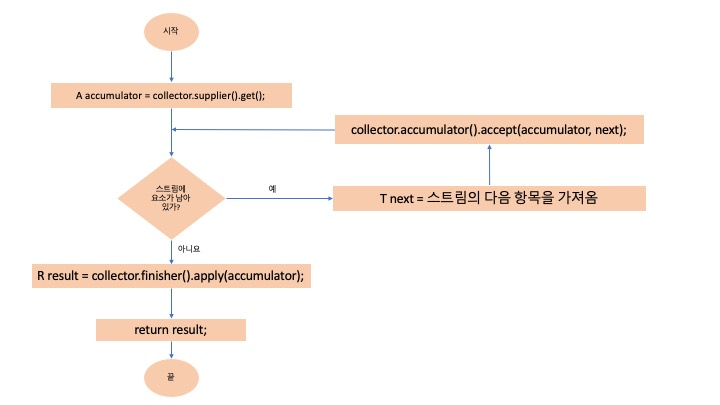

# 1 컬렉터

* 스트림의 최종 연산  collect는 다양한 요소 누적 방식을 인수로 받아서 스트림을 최종 결과로 도출하는 리듀싱 연산을 수행한다
  * 다양한 요소 누적 방식은 Collector 인터페이스에 정의가 되어있다
  * 즉 Collector 인터페이스란 스트림의 요소를 어떤식으로 도출할지에 대한 명세서이다

* 컬텍터란 Collector 인터페이스 구현체를 말한다
* 스트림의 요소를 어떤식으로 도출할지 그 방식을 Collector 인터페이스 구현에 명시하고 이를 Stream의 collect 메소드에 넘겨준다
* Stream의 collect를 호출하면 스트림의 요소에 컬렉터로 파라미터화된 리듀싱 연산이 수행된다


# 2 Collectors 클래스

* Collectors 클래스는 팩토리 메서드를 통해 미리 정의된 컬렉터(Collector 인터페이스의 구현체)를 제공한다
* Collectors에서 제공하는 메서드의 기능은 크게 세 가지로 구분
  * 스트림 요소를 하나의 값으로 리듀스하고 요약
  * 요소 그룹화
  * 요소 분할


## **예시 코드**

```java
public static final List<Dish> menu = asList(
  new Dish("pork", false, 800, Dish.Type.MEAT),
  new Dish("beef", false, 700, Dish.Type.MEAT),
  new Dish("chicken", false, 400, Dish.Type.MEAT),
  new Dish("french fries", true, 530, Dish.Type.OTHER),
  new Dish("rice", true, 350, Dish.Type.OTHER),
  new Dish("season fruit", true, 120, Dish.Type.OTHER),
  new Dish("pizza", true, 550, Dish.Type.OTHER),
  new Dish("prawns", false, 400, Dish.Type.FISH),
  new Dish("salmon", false, 450, Dish.Type.FISH)
);
```


## 2.1 counting

```java
@Test
void testCounting() {
  Long howManyDishes = menu.stream().collect(Collectors.counting());
  assertThat(howManyDishes).isEqualTo(9);
}
```

**reducing으로 같은 동작**

```java
@Test
void testCountingUsingReducing() {
  Long howManyDishes = menu.stream().collect(Collectors.reducing(0L, e -> 1L, Long::sum));
  assertThat(howManyDishes).isEqualTo(9);
}
```


## 2.2 maxBy

```java
@Test
void testMaxBy() {
  Dish mostCaloriesDish = menu.stream().collect(Collectors.maxBy(Comparator.comparingInt(Dish::getCalories))).get();
  assertThat(mostCaloriesDish.getName()).isEqualTo("pork");
}
```


## 2.3 minBy

```java
@Test
void testMinBy() {
  Dish leastCaloriesDish = menu.stream().collect(Collectors.minBy(Comparator.comparingInt(Dish::getCalories))).get();
  assertThat(mostCaloriesDish.getName()).isEqualTo("season fruit");
}
```


## 2.4 summingInt

* summingInt는 객체를 int로 매핑하는 함수를 인수로 받는다
  * 변환 함수라고 한다

```java
@Test
void testSummingInt() {
  int totalCalories = menu.stream().collect(Collectors.summingInt(Dish::getCalories));
  assertThat(totalCalories).isEqualTo(4300);
}
```


## 2.5 averagingInt

```java
@Test
void testAveragingInt() {
  Double avgCalories = menu.stream().collect(Collectors.averagingInt(Dish::getCalories));
  System.out.println("avgCalories = " + avgCalories);
}
```

```
avgCalories = 477.77777777777777
```


## 2.6 summarizingInt

```java
@Test
void testSummarizingInt() {
  IntSummaryStatistics menuStatistics = menu.stream()
    .collect(Collectors.summarizingInt(Dish::getCalories));
  System.out.println("menuStatistics = " + menuStatistics);
}
```

```
menuStatistics = IntSummaryStatistics{count=9, sum=4300, min=120, average=477.777778, max=800}
```


## 2.7 joining

```java
@Test
void testJoining() {
  String shortMenu = menu.stream().map(Dish::getName).collect(joining(", "));
  System.out.println("shortMenu = " + shortMenu);
}
```

```
shortMenu = pork, beef, chicken, french fries, rice, season fruit, pizza, prawns, salmon
```


## 2.8 reducing

* 위에 모든 컬렉터는 reducing 팩토리 메서드로 정의할 수 있다
* reducing은 모든 상황에 범용적으로 사용가능하나 프로그래밍 편의성을 위해 위에 명시된 컬렉터를 사용한다
* reducing은 세 개의 인자를 받는다
  * 첫 번째 인수는 리듀싱 연산의 **시작값** 또는 스트림의 요소가 없을 경우 반환값
  * 두 번째 인수는 **변환 함수**(요리를 칼로리 정수로 변환)
  * 세 번째 인수는 같은 종류의 두 항목을 하나의 값으로 더하는 BinaryOperator다
* reducing은 한 개의 인자를 받을 수 있다
  * 리듀싱 연산의 시작값은 reducing 메서드에 스트림의 첫 번째 요소
  * 자기 자신을 그대로 반환하는 항등 함수를 사용
  * 한 개의 인수를 갖는 reducing을 호출하면  스트림의 요소가 없을 경우을 대비해 Optional 객체를 반환한다

```java
@Test
public void testReducing() {
  Optional<Dish> dish = menu.stream()
    .collect(reducing((d1, d2) -> d1.getCalories() > d2.getCalories() ? d1 : d2));
  Dish mostCalorieDish = dish.get();
  assertThat(mostCalorieDish.getName()).isEqualTo("pork");
}
```


**예시**

* 아래의 코드는 모두 같은 결과를 반환
* `menu.stream().collect(summingInt(Dish::getCalories));`
* 위에 코드를 reducing으로 아래와 같이 표현
* `menu.stream().collect(reducing(0, Dish::getCalories, (Integer i, Integer j) -> i + j));`

```java
import static java.util.stream.Collectors.reducing;
import static java.util.stream.Collectors.summingInt;

// reducing 사용
menu.stream().collect(reducing(0, Dish::getCalories, (Integer i, Integer j) -> i + j));
menu.stream().collect(reducing(0, Dish::getCalories, Integer::sum));
// 컬렉터 없이
menu.stream().map(Dish::getCalories).reduce(Integer::sum).get();
menu.stream().mapToInt(Dish::getCalories).sum();
// 컬렉터 사용
menu.stream().collect(summingInt(Dish::getCalories));
```


# 3 collect와 reduce

* collect(reducing)와 reduce 메서드는 무엇이 다를까?


# 4 그룹화

* 명령형으로 그룹화를 구현하려면 까다롭다. 하지만 자바 8의 함수형을 이용하면 가독성 있는 할 줄의 코드로 그룹화를 구현할 수 있다.
* 팩토리 메서드 `Collectors.groupingBy`를 이용해 쉽게 그룹화할 수 있다.


## 4.1 그룹화 명령형과 함수형 비교

```java
import static java.util.stream.Collectors.groupingBy;

// 그룹화 명령형 코드
Map<Currency, List<Transaction>> transactionsByCurrencies = new HashMap<>();
for (Transaction transaction : transactions) {
  Currency currency = transaction.getCurrency();
  List<Transaction> transactionsForCurrency = transactionsByCurrencies.get(currency);
  if (transactionsForCurrency == null) {
    transactionsForCurrency = new ArrayList<>();
    transactionsByCurrencies.put(currency, transactionsForCurrency);
  }
  transactionsForCurrency.add(transaction);
}

// 그룹화 함수형 코드
Map<Currency, List<Transaction>> transactionsByCurrencies = transactions.stream()
  .collect(groupingBy(Transaction::getCurrency));

System.out.println(transactionsByCurrencies);
```


## 4.2 Dish 클래스

* 예시를 위한 클래스

**Dish.java**

```java
public class Dish {

  private final String name;
  private final boolean vegetarian;
  private final int calories;
  private final Type type;

  public Dish(String name, boolean vegetarian, int calories, Type type) {
    this.name = name;
    this.vegetarian = vegetarian;
    this.calories = calories;
    this.type = type;
  }

  public String getName() {
    return name;
  }

  public boolean isVegetarian() {
    return vegetarian;
  }

  public int getCalories() {
    return calories;
  }

  public Type getType() {
    return type;
  }

  @Override
  public String toString() {
    return name;
  }

  public enum Type {
    MEAT,
    FISH,
    OTHER
  }

  public static final List<Dish> menu = asList(
      new Dish("pork", false, 800, Dish.Type.MEAT),
      new Dish("beef", false, 700, Dish.Type.MEAT),
      new Dish("chicken", false, 400, Dish.Type.MEAT),
      new Dish("french fries", true, 530, Dish.Type.OTHER),
      new Dish("rice", true, 350, Dish.Type.OTHER),
      new Dish("season fruit", true, 120, Dish.Type.OTHER),
      new Dish("pizza", true, 550, Dish.Type.OTHER),
      new Dish("prawns", false, 400, Dish.Type.FISH),
      new Dish("salmon", false, 450, Dish.Type.FISH)
  );

  public static final Map<String, List<String>> dishTags = new HashMap<>();
  static {
    dishTags.put("pork", asList("greasy", "salty"));
    dishTags.put("beef", asList("salty", "roasted"));
    dishTags.put("chicken", asList("fried", "crisp"));
    dishTags.put("french fries", asList("greasy", "fried"));
    dishTags.put("rice", asList("light", "natural"));
    dishTags.put("season fruit", asList("fresh", "natural"));
    dishTags.put("pizza", asList("tasty", "salty"));
    dishTags.put("prawns", asList("tasty", "roasted"));
    dishTags.put("salmon", asList("delicious", "fresh"));
  }
}
```


## 4.3 groupingBy

* `Collectors.groupingBy`의 메소드 인자로 **분류 함수**를 넘긴다
* 스트림 요소에 분류 함수를 적용해서 키를 만들어 낸다
* 그리고 각 키에 대응하는 스트림의 모든 항목 리스트를 값으로 갖는 맵이 반환된다


**Dish.Type으로 Dish 그룹화하기**

```java
Map<Dish.Type, List<Dish>> dishesByType = menu.stream().collect(groupingBy(Dish::getType));
System.out.println("dishesByType = " + dishesByType);
// dishesByType = {OTHER=[french fries, rice, season fruit, pizza], FISH=[prawns, salmon], MEAT=[pork, beef, chicken]}
```

* `Dish::getType`: 분류 함수(각 요소에 분류 함수를 적용해 키를 뽑아낸다)
  * 요리의 type으로 그루핑( MEAT, FISH, OTHER)
* 따라서 키는 요리 종류(Dish.Type)고 값은 해당 종류에 포함되는 모든 요리이다


**복잡한 분류 함수 직접 정의해서 그룹화하기**

```java
Map<CaloricLevel, List<Dish>> dishesByCaloricLevel = menu.stream().collect(
  groupingBy(dish -> {
    if (dish.getCalories() <= 400) {
      return CaloricLevel.DIET;
    } else if (dish.getCalories() <= 700) {
      return CaloricLevel.NORMAL;
    } else {
      return CaloricLevel.FAT;
    }
  })
);
```

* Dish에는 더 복잡한 분류 함수가 없기 때문에 람다 표현식으로 필요한 로직을 구현할 수 있다.
* 복잡한 분류 기준
  * 400 칼로리 이하는 DIET
  * 400~700 칼로리 : NORMAL
  * 700 칼로리 초과: FAT


## 4.3 그룹화된 요소 조작

* 요소를 그룹화 한 다음 각 결과 그룹의 요소를 조작하는 연산을 해보자
* 예를 들면 그룹화 다음 필터링


### 4.3.1 그룹화 후 필터링 하기

* filtering 후 그룹화하면 필터 프레디케이드를 만족하는 FISH 종류 요리는 없으므로 맵에서 해당 키 자체가 사라진다

```java
@Test
void filtering_후_그룹화() {
  Map<Dish.Type, List<Dish>> dishesByType = menu.stream()
    .filter(dish -> dish.getCalories() > 500)
    .collect(groupingBy(Dish::getType));
  System.out.println("dishesByType = " + dishesByType);
}
```

```
dishesByType = {MEAT=[pork, beef], OTHER=[french fries, pizza]}
```

* 키 자체가 사라지지 않기 위해 그룹화 후 filtering을 해보자

```java
@Test
void 그룹화후_filtering() {
  Map<Dish.Type, List<Dish>> dishesByType = menu.stream()
    .collect(groupingBy(Dish::getType,
                        filtering(dish -> dish.getCalories() > 500,
                                  toList())));
  System.out.println("dishesByType = " + dishesByType);
}
```

```
dishesByType = {FISH=[], MEAT=[pork, beef], OTHER=[french fries, pizza]}
```


### 4.3.2 그룹화 후 매핑하기

```java
@Test
void groupDishNamesByType() {
  Map<Dish.Type, List<String>> dishNameByType = menu.stream()
    .collect(groupingBy(Dish::getType, mapping(Dish::getName, toList())));
  System.out.println("dishNameByType = " + dishNameByType);
}
```

```
dishNameByType = {FISH=[prawns, salmon], OTHER=[french fries, rice, season fruit, pizza], MEAT=[pork, beef, chicken]}
```


## 4.4 다수준 그룹화

```java
@Test
void groupDishedByTypeAndCaloricLevel() {
    Map<Dish.Type, Map<Grouping.CaloricLevel, List<Dish>>> groupDishedByTypeAndCaloricLevel = menu.stream().collect(
            groupingBy(Dish::getType,
                    groupingBy((Dish dish) -> {
                        if (dish.getCalories() <= 400) {
                            return Grouping.CaloricLevel.DIET;
                        } else if (dish.getCalories() <= 700) {
                            return Grouping.CaloricLevel.NORMAL;
                        } else {
                            return Grouping.CaloricLevel.FAT;
                        }
                    })
            ));
    System.out.println("groupDishedByTypeAndCaloricLevel = " + groupDishedByTypeAndCaloricLevel);
}
```

```
groupDishedByTypeAndCaloricLevel = {MEAT={FAT=[pork], NORMAL=[beef], DIET=[chicken]}, OTHER={NORMAL=[french fries, pizza], DIET=[rice, season fruit]}, FISH={NORMAL=[salmon], DIET=[prawns]}}
```


## 4.5 서브그룹으로 데이터 수집

```java
@Test
void typesCount() {
  Map<Dish.Type, Long> typesCount = menu.stream().collect(groupingBy(Dish::getType, counting()));
  System.out.println("typesCount = " + typesCount);
  assertThat(typesCount.get(Dish.Type.MEAT)).isEqualTo(3);
  assertThat(typesCount.get(Dish.Type.FISH)).isEqualTo(2);
  assertThat(typesCount.get(Dish.Type.OTHER)).isEqualTo(4);
}
```

```
typesCount = {OTHER=4, MEAT=3, FISH=2}
```


**Type 별로 가장 칼로리가 높은 요리 찾기**

```java
@Test
void mostCaloricByType() {
  Map<Dish.Type, Dish> mostCaloricByType = menu.stream()
    .collect(groupingBy(Dish::getType, 
                        collectingAndThen(                                                              maxBy(Comparator.comparingInt(Dish::getCalories)),
                                          Optional::get)));

  System.out.println("mostCaloricByType = " + mostCaloricByType);

  assertThat(mostCaloricByType.get(Dish.Type.FISH).getName()).isEqualTo("salmon");
  assertThat(mostCaloricByType.get(Dish.Type.OTHER).getName()).isEqualTo("pizza");
  assertThat(mostCaloricByType.get(Dish.Type.MEAT).getName()).isEqualTo("pork");
}
```


**각 Type 별로 CaloricLevel 구하기**

```java
@Test
void caloricLevelsByType() {
    Map<Type, Set<CaloricLevel>> caloricLevelsByType = menu.stream().collect(groupingBy(Dish::getType,
            mapping(dish -> {
                if (dish.getCalories() <= 400) return CaloricLevel.DIET;
                else if (dish.getCalories() <= 700) return CaloricLevel.NORMAL;
                else return CaloricLevel.FAT;
            }, toSet()))
    );
    System.out.println("caloricLevelsByType = " + caloricLevelsByType);
    assertThat(caloricLevelsByType.get(Type.MEAT)).containsExactly(CaloricLevel.DIET, CaloricLevel.NORMAL, CaloricLevel.FAT);
    assertThat(caloricLevelsByType.get(Type.OTHER)).containsExactly(CaloricLevel.DIET, CaloricLevel.NORMAL);
    assertThat(caloricLevelsByType.get(Type.FISH)).containsExactly(CaloricLevel.DIET, CaloricLevel.NORMAL);
}
```

```
caloricLevelsByType = {MEAT=[DIET, NORMAL, FAT], OTHER=[DIET, NORMAL], FISH=[DIET, NORMAL]}
```


# 5 분할

* 분할은 분할 함수라 불리는 프레디케이트를 **분류 함수**로 사용하는 특수한 그룹화 기능이다
* 분할 함수가 불리언을 반환하므로 맵의 키 형식은 Boolean이며 결과적으로 그룹화 맵은 최대 두 개의 그룹으로 분류된다


## 5.1 분할의 장점

* 분할 함수가 반환하는 참, 거짓 두 가지 요소의 스트림 리스트를 모두 유지한다는 장점이 있다


**채식인 요라와 채식이 아닌 요리로 요리 분할하기**

* filter를 두번 적용하는 대신 분할을 사용하면 참, 거짓 두 가지 요소를 한번에 얻을 수 있다

```java
@Test
void partitionedMenu() {
  // given
  List<Dish> vegetarianDishes = menu.stream()
    .filter(Dish::isVegetarian).collect(toList());
  
  List<Dish> notVegetarianDishes = menu.stream()
    .filter(Predicate.not(Dish::isVegetarian)).collect(toList());

  // when
  Map<Boolean, List<Dish>> partitionedMenu = menu.stream().collect(partitioningBy(Dish::isVegetarian));

  // then
  System.out.println("partitionedMenu = " + partitionedMenu);
  assertThat(partitionedMenu.get(true)).isEqualTo(vegetarianDishes);
  assertThat(partitionedMenu.get(false)).isEqualTo(notVegetarianDishes);
}
```

```
partitionedMenu = {false=[pork, beef, chicken, prawns, salmon], true=[french fries, rice, season fruit, pizza]}
```


**채식인 요리 중에 가장 칼로리가 높은 요리와 채식이 아닌 요리 중에 가장 칼로리가 높은 요리로 분할하기**

```java
@Test
void mostCaloricPartitionedByVegetarian() {
  Map<Boolean, Dish> mostCaloricPartitionedByVegetarian = menu.stream()
    .collect(partitioningBy(Dish::isVegetarian,
                            collectingAndThen(maxBy(Comparator.comparingInt(Dish::getCalories)),
                                              Optional::get)));

  System.out.println("mostCaloricPartitionedByVegetarian = " + mostCaloricPartitionedByVegetarian);
  assertThat(mostCaloricPartitionedByVegetarian.get(false).getName()).isEqualTo("pork");
  assertThat(mostCaloricPartitionedByVegetarian.get(true).getName()).isEqualTo("pizza");
}
```

```
mostCaloricPartitionedByVegetarian = {false=pork, true=pizza}
```


# 6 Collector 인터페이스

* Collector 인터페이스는 리듀싱 연산(즉, 컬렉터)를 어떻게 구현할지 제공하는 메서드 집합으로 구성된다
* 일상에서 자주 사용하는 toList를 통해 Collector 인터페이스를 알아보자


**Collector.java**

* T는 수집될 스트림 항목의 제네릭 형식이다
* A는 누적자, 즉 수집 과정에서 중간 결과를 누적하는 객체의 형식이다
* R은 수집 연산 결과 객체의 형식(항상 그런 것은 아니지만 대개 컬렉션 형식)이다

```java
public interface Collector<T, A, R> {
  Supplier<A> supplier();
  BiConsumer<A, T> accumulator();
  Function<A, R> finisher();
  BinaryOperator<A> combiner();
  Set<Characteristics> characteristics();
}
```


## 6.1 supplier 메소드

* supplier 메소드는 Supplier를 반환한다
* Supplier는 mutable한 결과 컨테이너다
* 스트림 요소에 리듀싱 연산을 하고 그 결과를 누적하는 컨테이너


## 6.2 accumulator 메소드

* accumulator는 리듀싱 연산을 수행하는 함수를 반환한다


## 6.3 finisher 메소드

* finisher 메소드 스트림 탐색을 끝내고 누적자 객체를 최종 결과로 변환하면서 누적 과정을 끝낼 때 호출할 함수를 반환해야한다


## 6.4 순차 리듀싱 과정의 논리적 순서



* supplier 메소드를 통해 스트림 요소에 리듀싱 연산을 하고 그 결과를 누적하는 컨테이너(accmulator)를 얻는다
* accumulator 메소드로 리듀싱 연산을 수행하는 함수를 얻고 이 함수에 accmulator와 리듀싱 연산을 적용할 요소를 넘긴다
* 스트림에 요소가 남지 않을 때까지 위 과정을 반복한다
* 스트림에 요소가 남지 않으면 finisher 메소드를 통해 accmulator를 최종 결과로 변환한다
* 변환된 결과를 반환한다


## 6.5 combiner 메소드

* 두 결과 컨테이너 병합
* combiner는 스트림의 서로 다른 서브파트를 병렬로 처리할 때 누적자가 이 결과를 어떻게 처리할지 정의한다
* toList의 combiner는 비교적 쉽게 구현할 수 있다
  * 두 전째 서브 파트에서 수집한 항목 리스트를 첫 번째 서브파트 결과 리스트의 추가하면 된다

```java
public BinaryOperator<List<T>> combiner() {
  return (list1, list2) -> {
    list1.addAll(list2);
    return list1;
  };
}
```


## 6.6 characteristics 메소드s

* 

# 7 커스텀 컬렉터 구현


**참고**

* [모던 자바 인 액션](http://www.kyobobook.co.kr/product/detailViewKor.laf?mallGb=KOR&ejkGb=KOR&barcode=9791162242025)