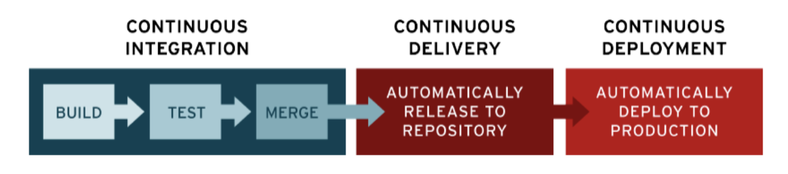

## Antifragile

* Auto Scaling
* Microservices
* Chaos Engineering
* Continuous Deployments

## Cloud Native Architecture

> Cloud Native란?
>
> 처음부터 클라우드에서 운영하는 것을 전제로 설계된 시스템이 등장하면서 기존 시스템들과의 구분을 위해 “클라우드 네이티브”라는 용어를 사용하고 있습니다. Cloud Native 개발은 애플리케이션을 신속하게 구축하고 업데이트하면서 품질을 개선하고 위험을 낮추는 접근 방식입니다. 구체적으로 말하자면, 이 접근 방식을 활용하여 대응 능력, 확장성, 내결함성을 갖춘 애플리케이션을 퍼블릭, 프라이빗 또는 하이브리드 클라우드 환경이든 어디에나 구축할 수 있습니다.
>
> Cloud Native란?
>
> 애플리케이션의 각 부분은 자체 컨테이너에 패키징되고 동적 오케스트레이션을 통해 각 부분이 적극적으로 스케줄링 및 관리되어 리소스 사용률을 최적화하며, 마이크로서비스 지향성을 통해 애플리케이션의 전체적인 민첩성과 유지 관리 편의성을 높이는 것입니다.

* 확장 가능한 아키텍쳐
  * 시스템의 수평적 확장에 유연
  * 확장된 서버로 시스템의 부하 분산, 가용성 보장
  * 시스템 또는 서비스 애플리케이션 단위의 패키지
  * 모니터링
* 탄련적 아키텍쳐
  * 서비스 생성, 통합, 배포 비즈니스 환경 변화에 대응 시간 단축
  * 분할된 서비스 구조
  * 무상태 통신 프로토콜
  * 서비스의 추가와 삭제 자동으로 감지
  * 변경된 서비스 요청에 따라 사용자 요청 처리
* 장애 격리
  * 특정 서비스에 오류가 발생해도 다른 서비스에 영향을 주지 않음

## 왜 클라우드 네이티브일까요?

> 소프트웨어 애플리케이션을 통해 빠르고 지속적으로 새로운 기능을 제공할 수 있어야 고객을 확보하고, 유지하며, 고객에게 서비스를 제공할 수 있습니다

## Cloud Native Application

* Cloud Native Architecture 위에 설계되고 구현되는 Application을 말한다.
* Cloud Native Application의 특징은 아래와 같다.

마이크로서비스 아키텍처

> 클라우드 네이티브 개발은 아키텍처의 모듈성, 탄력적인 결합, 그리고 독립적인 서비스에 중점을 둡니다. 각 마이크로서비스는 비즈니스 역량을 구현하고 자체 프로세스를 실행하고 애플리케이션 프로그래밍 인터페이스(Application Programming Interfaces, API) 또는 메시징을 통해 커뮤니케이션합니다. 이러한 커뮤니케이션은 서비스 메쉬 레이어를 통해 관리할 수 있습니다.

CI/CD(지속적인 통합과 제공)

> 많은 조직이 실용적인 서비스 기반 아키텍처를 이용하여 계속해서 레거시 애플리케이션을 최적화할 수 있습니다. 이러한 최적화는 지속적인 통합(Continuous Integration, CI)과 지속적인 제공(Continuous Delivery, CD) 및 완전히 자동화된 배포 운영 같은 DevOps 워크플로우를 통해 지원됩니다.
>
> 
>
> **Continuous Integration(지속적 통합)**
>
> * 여러 개발자들이 동일한 애플리케이션의 각기 다른 기능을 동시에 작업할 수 있도록 자동화된 빌드 및 테스트가 수행된 후, 개발자가 코드 변경 사항을 중앙 리포지토리에 정기적으로 병합하는 데브옵스 소프트웨어 개발 방식입니다
> * 대표적인 CI 툴에는 젠킨스(Jenkins)가 있다.
>
> **Continuous Delivery(지속적 제공/전달)**
>
> * 애플리케이션에 적용한 변경 사항이 버그 테스트를 거쳐 리포지토리에 자동으로 업로드되는 것
> * 예: GitHub 또는 컨테이너 레지스트리
>
> **Continuous Deployment(지속적 배포)**
>
> * 개발자의 변경 사항을 리포지토리에서 고객이 사용 가능한 프로덕션 환경까지 자동으로 릴리스하는 것을 의미한다
> * 프로덕션 배포 전에 여러 개의 병렬 테스트 단계가 있을 수 있습니다. 지속적 전달과 지속적 배포의 차이점은 프로덕션에 업데이트에 대한 수동 승인 존재 여부입니다. 지속적 배포의 경우 명시적 승인 없이 자동으로 프로덕션이 일어납니다. 

데브옵스 ( DevOps )

> 클라우드 네이티브 애플리케이션은 조직 내 인력과 이들의 협업 프로세스를 자동화하는 것에서 시작합니다. 즉, DevOps를 도입하여 공통의 목적과 주기적인 피드백을 통해 개발팀과 운영팀의 협업을 지원할 수 있습니다.
>
> DevOps 및 컨테이너 접근 방식에서는 하나의 대규모 릴리스 및 업데이트를 기다리는 것이 아니라 마이크로서비스처럼 여러 서비스가 탄력적으로 결합된 하나의 컬렉션으로 애플리케이션을 쉽게 출시할 수 있습니다.

쿠버네티스 및 도커와 같은 컨테이너

> 컨테이너를 도입하면 이상적인 애플리케이션 배포 유닛 및 독립적인 실행 환경을 제공하여 이러한 프랙티스를 지원할 수 있습니다.

# Sotfware Architecture

## 모놀리식 아키텍처

> 모놀리식 아키텍처의 경우 모든 프로세스가 긴밀하게 결합되고 단일 서비스로 실행됩니다. 

### 모놀리식 아키텍처의 장점

**간단한 개발 및 배포**

모든 작업이 하나의 디렉터리에서 수행되므로 배포가 더 쉽습니다. 

**cross-cutting concerns이 적다.**

대부분의 애플리케이션은 트랜잭션, 로깅, 속도 제한 등과 같은 많은 교차 문제가 존재합니다. 모놀리식 앱은 단일 코드 기반으로 인해 이러한 문제를 훨씬 쉽게 통합합니다. 모든 것이 동일한 앱에서 실행될 때 이러한 문제에 구성 요소를 연결하는 것이 더 쉽습니다.

**더 좋은 성능**

예를 들어 마이크로 서비스 아키텍처가있는 앱은 각 화면을로드하기 위해 40 개의 서로 다른 마이크로 서비스에 40 개의 API 호출을 수행해야 할 수 있으며, 이는 분명히 성능 저하를 초래합니다. 결과적으로 모놀리식 앱은 공유 코드 및 메모리로 인해 소프트웨어 구성 요소 간의 통신 속도를 높일 수 있습니다.

### 모놀리식 아키텍처의 단점

**큰 규모의 코드 베이스**

코드 베이스가 증가하게 되면 모놀리식 애플리케이션의 기능을 추가하거나 개선하기가 더 복잡해집니다. 

**민첩성 결여**

모놀리식 앱에서 모든 소규모 업데이트에는 전체 재배포가 필요합니다. 따라서 모든 개발자는 완료 될 때까지 기다려야합니다. 여러 팀이 동일한 프로젝트에서 작업하는 경우 민첩성이 크게 저하 될 수 있습니다.

**확장성 결여**

애플리케이션의 한 프로세스에 대한 수요가 급증하면 해당 아키텍처 전체를 확장해야 합니다. 

---

##  서비스 지향 아키텍처

> 애플리케이션을 별개의 재사용 가능한 서비스 단위로 분할하며 이 서비스들은 엔터프라이즈 서비스 버스(ESB)를 통해 통신합니다. 서비스의 구축, 테스트, 수정을 동시에 수행할 수 있기 때문에 더 이상의 모놀리식 개발 주기는 필요가 없습니다.

> ESB란 미즈니스 내에서 서비스 ,애플리케이션, 자원을 연결하고 통합하는 미들웨어라고 할 수 있으며, 이를 통해 분산된 서비스 컴포넌트를 쉽게 통합 연동할 수 있어 신뢰성 있는 메시지 통신이 가능하다.

###  서비스 지향 아키텍처의 장점

**재사용성**
서비스 지향 응용 프로그램에서 기능 구성 요소의 독립적이고 느슨하게 결합된 특성으로 인해 이러한 구성 요소는 다른 서비스에 영향을주지 않고 여러 응용 프로그램에서 재사용 할 수 있습니다.

**유지 보수성**
각 소프트웨어 서비스는 독립적인 단위이므로 다른 서비스를 손상시키지 않고 쉽게 업데이트하고 유지 관리 할 수 있습니다. 

**더 높은 신뢰성**
서비스는 모 놀리식 접근 방식과 같이 막대한 코드 덩어리보다 디버그 및 테스트하기가 더 쉽습니다. 결과적으로 SOA 기반 제품의 안정성이 향상됩니다.

**병렬 개발**
서비스 지향 아키텍처는 계층으로 구성되므로 개발 프로세스에서 병렬 처리를 옹호합니다. 독립 서비스는 병렬로 개발하고 동시에 완료 할 수 있습니다.

### 서비스 지향 아키텍처의 단점

**복잡한 관리**
서비스 지향 아키텍처의 주요 단점은 복잡성입니다. 각 서비스는 메시지가 제 시간에 전달되도록해야합니다. 이러한 메시지의 수는 한 번에 백만 개를 초과 할 수 있으므로 모든 서비스를 관리하는 데 큰 어려움이 있습니다.

**높은 투자 비용**
SOA 개발에는 인적 자원, 기술 및 개발에 대한 막대한 선행 투자가 필요합니다.

**시스템의 단일 장애점**

ESB는 전체 시스템의 단일 장애점(single point of failure)을 나타내기 때문에 이러한 방식에서 모놀리식 제거는 새로운 모놀리식을 만들어낼 뿐이며, 잠재적으로 ESB가 전체 조직의 자체적인 장애 요소로 작용할 수 있는 것입니다.

---

## 마이크로서비스 아키텍처

* 마이크로서비스는 소프트웨어가 잘 정의된 API를 통해 통신하는 소규모의 독립적인 서비스로 구성되어 있는 경우의 소프트웨어 개발을 위한 아키텍처 및 조직적 접근 방식입니다.
* 마이크로서비스 아키텍처는 애플리케이션의 확장을 용이하게 하고 개발 속도를 앞당겨 혁신을 실현하고 새로운 기능의 출시 시간을 단축할 수 있게 해 줍니다.
* 애플리케이션이 독립적인 구성 요소로 구축되어 각 애플리케이션 프로세스가 서비스로 실행됩니다.
* 서비스는 비즈니스 기능을 위해 구축되며 서비스마다 한 가지 기능을 수행합니다. 
* 서비스가 독립적으로 실행되기 때문에 애플리케이션의 특정 기능에 대한 수요를 충족하도록 각각의 서비스를 업데이트, 배포 및 확장할 수 있습니다.

### 마이크로서비스의 이점

**자율성**

> 마이크로서비스 아키텍처의 각 구성 요소 서비스는 다른 서비스의 기능에 영향을 주지 않으면서 개발, 배포, 운영하고 확장할 수 있습니다. 서비스가 해당 코드 또는 구현을 다른 서비스와 공유할 필요는 없습니다. 개별 구성 요소 간의 통신은 잘 정의된 API를 통해 이루어집니다.

**전문성**

> 각 서비스는 일련의 기능을 위해 설계되며 특정 문제를 해결하는 데 중점을 둡니다. 개발자가 시간이 지남에 따라 서비스에 더 많은 코드를 제공하여 서비스가 복잡해지면 더 작은 서비스로 분할할 수 있습니다.

**민첩성**

> 마이크로 서비스는 독립적으로 배포되기 때문에 버그 수정 및 기능 릴리스를 관리하기가 더 쉽습니다. 전체 애플리케이션을 다시 배포하지 않고 서비스를 업데이트할 수 있고, 문제가 발생하면 업데이트를 롤백할 수 있습니다. 기존의 많은 애플리케이션의 경우, 버그가 애플리케이션의 한 부분에서 발견되면 전체 릴리스 프로세스를 차단할 수 있습니다. 버그 수정이 통합, 테스트 및 게시될 때까지 새로운 기능은 보류될 수 있습니다.

**유연한 확장성**

> 마이크로서비스의 경우 각 서비스가 지원하는 애플리케이션 기능의 수요를 충족하도록 해당 서비스를 독립적으로 확장할 수 있습니다. 따라서 팀은 필요한 인프라의 규모를 적절히 조절하고, 기능의 비용을 정확하게 측정하고, 서비스의 수요가 급증하는 경우에도 가용성을 유지할 수 있습니다.

**손쉬운 배포**

> 마이크로서비스 기반 애플리케이션은 전통적인 모놀리식 애플리케이션에 비해 더욱 모듈화되고 규모가 작아졌기 때문에 배포에 따르는 우려 사항들이 사라졌습니다. 마이크로서비스는 지속적 통합 및 지속적 전달을 통해 새로운 아이디어를 손쉽게 시험하고 문제가 발생할 경우 간단히 롤백할 수 있게 해 줍니다. 이처럼 저렴한 실패 비용 덕분에 실험을 진행할 수 있어 더 쉽게 코드를 업데이트하고 새로운 기능의 출시 시간을 앞당길 수 있습니다.

**기술적 자유**

> 마이크로서비스 아키텍처는 “모든 규모에 부합하는” 접근 방식을 추구하지 않습니다. 팀은 특정한 문제를 해결하는 데 가장 적합한 도구를 자유롭게 선택할 수 있습니다. 따라서 마이크로서비스를 구축하는 팀은 작업별로 가장 적합한 도구를 선택할 수 있습니다.

**재사용 가능한 코드**

> 소프트웨어를 잘 정의된 소규모 모듈로 분할하면 팀이 기능을 여러 용도로 사용할 수 있게 됩니다. 특정 기능을 위해 구축된 서비스를 다른 기능의 빌딩 블록으로 사용할 수 있는 것입니다. 이를 통해 개발자가 코드를 처음부터 작성하지 않고도 새 기능을 생성할 수 있어 애플리케이션이 자체적으로 부트스트랩 작업을 생성할 수 있습니다.

**복원성**

> 서비스가 독립적이므로 실패에 대한 애플리케이션의 저항성이 증가합니다. 모놀리식 아키텍처에서는 단일 구성 요소가 실패하는 경우 전체 애플리케이션이 실패하게 될 수 있습니다. 마이크로서비스에서는 모놀리식 애플리케이션 모델과는 달리 한 부분에 장애가 발생하더라도 전체 애플리케이션이 다운되지 않습니다.

**소규모 코드 베이스**

> 모놀리식 애플리케이션의 경우 시간이 경과하면서 코드 종속성이 얽히는 경향이 있습니다. 새 기능을 추가하려면 여러 지점의 코드를 손봐야 합니다. 마이크로 서비스 아키텍처는 코드나 데이터 저장소를 공유하지 않으므로 종속성이 최소화되며 그 결과 새로운 기능을 추가하기 쉽습니다.

### 마이크로서비스의 단점

**복잡성** 

>  마이크로 서비스 애플리케이션에는 동등한 모놀리식 애플리케이션보다 작동 부분이 더 많습니다. 각 서비스는 더 단순하지만 전체 시스템이 더 복잡합니다.

**개발 및 테스트**

> 다른 종속 서비스에 의존하는 소규모 서비스를 작성하려면 기존의 모놀리식 또는 계층화된 애플리케이션을 작성하는 것과 다른 접근 방식이 필요합니다. 기존 도구는 항상 서비스 종속성 작업에 맞게 설계되지 않습니다. 서비스 경계를 벗어난 리팩터링은 어려울 수 있습니다. 특히 애플리케이션이 빠르게 발전하는 경우 서비스 종속성을 테스트하기도 어렵습니다.

**통제 부족**

> 마이크로 서비스 빌드에 대한 분산 접근 방법에는 장점이 있지만 문제가 발생할 수도 있습니다. 언어와 프레임워크가 너무 많아서 애플리케이션 유지 관리가 어려워질 수 있습니다. 팀의 유연성을 지나치게 제한하지 않고 몇 가지 프로젝트 전체 표준을 적용하는 것이 유용할 수 있습니다. 특히 로깅과 같은 교차 기능에 해당합니다.

**네트워크 정체 및 대기 시간**.

>  다수의 작고 세분화된 서비스를 사용하면 서비스 간 통신이 증가할 수 있습니다. 또한 서비스 종속성 체인이 너무 길어질 경우(서비스 A가 B를 호출하고, B가 C를 호출하고...) 추가 대기 시간이 문제가 될 수 있습니다. API를 신중하게 디자인해야 합니다. 통신량이 과도한 API를 피하고, 직렬화 형식을 고려하고, 큐 기반 부하 평준화와 같은 비동기 통신 패턴을 사용할 영역을 찾아보세요.

**데이터 무결성**

>  각 마이크로 서비스가 자체 데이터 지속성을 담당합니다. 그 결과, 데이터 일관성이 과제가 될 수 있습니다. 가능한 경우 결과적 일관성을 수용합니다.

**관리**

>  마이크로 서비스에 성공하려면 성숙한 DevOps 문화가 필요합니다. 전체 서비스의 상관관계 로깅이 까다로울 수 있습니다. 일반적으로 로깅은 단일 사용자 작업에 대한 여러 서비스 호출을 상호 연결해야 합니다.

**버전 관리**

>  서비스 업데이트로 인해 종속된 서비스가 손상되지 않아야 합니다. 언제든지 여러 서비스가 업데이트될 수 있으므로 신중하게 디자인하지 않으면 이전 버전 또는 이후 버전과의 호환성 문제가 발생할 수 있습니다.

**기술 수준** 

>  마이크로 서비스는 고도로 분산된 시스템입니다. 팀이 성공을 위한 기술과 경험을 가지고 있는지 신중하게 평가합니다.

**배포**

>  배포를 쉽게 하려면 우선 상당한 정도의 자동화에 투자해야 합니다. 마이크로서비스의 복잡성 때문에 사람이 수동으로 배포하는 것이 버거워지기 때문입니다. 서비스 롤 아웃을 어떻게, 어떤 순서로 할지 고민해야한다

**로그 관리**

> 분산 시스템에서는 모든 내용을 한 곳에 모을 수 있는 중앙집중식 로그가 필요합니다. 그렇지 않으면 확장 시에 이를 관리하기가 불가능해집니다.

### 마이크로서비스 아키텍처의 필요성

- 다양한 환경에서 재사용되는 독립 실행형 비즈니스 애플리케이션
- 최신 프로그래밍 언어로 다시 작성해야 하는 레거시 애플리케이션
- 빠른 혁신과 제공을 요구하는 민첩한 애플리케이션
- 확장성과 유연성이 필요한 모놀리식 애플리케이션

참고

* http://www.opennaru.com/cloud/cloud-native/
* https://www.redhat.com/ko/topics/devops/what-is-ci-cd
* https://aws.amazon.com/ko/devops/continuous-integration/
* https://www.redhat.com/ko/topics/microservices/what-are-microservices
* https://www.samsungsds.com/kr/insights/msa.html
* https://docs.microsoft.com/ko-kr/azure/architecture/guide/architecture-styles/microservices
* https://rubygarage.org/blog/monolith-soa-microservices-serverless#article_title_0