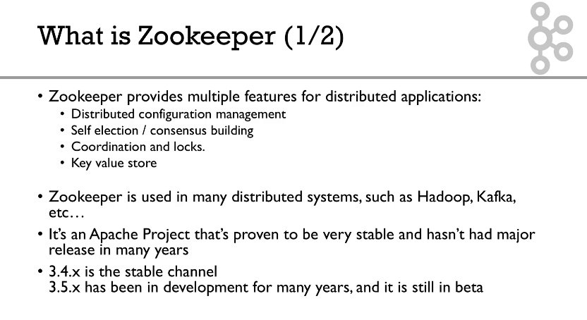
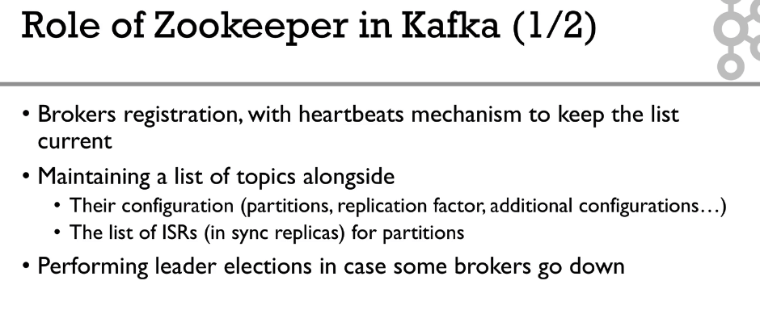
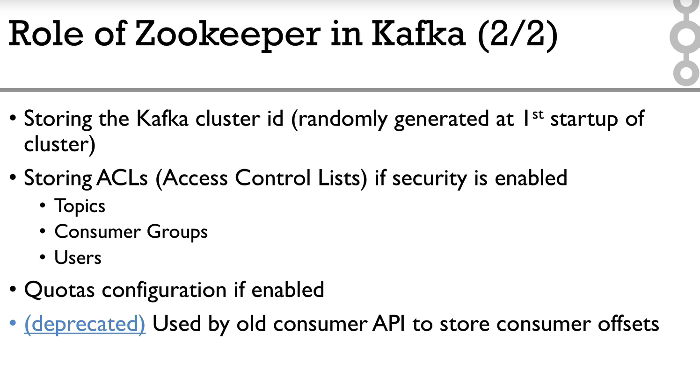
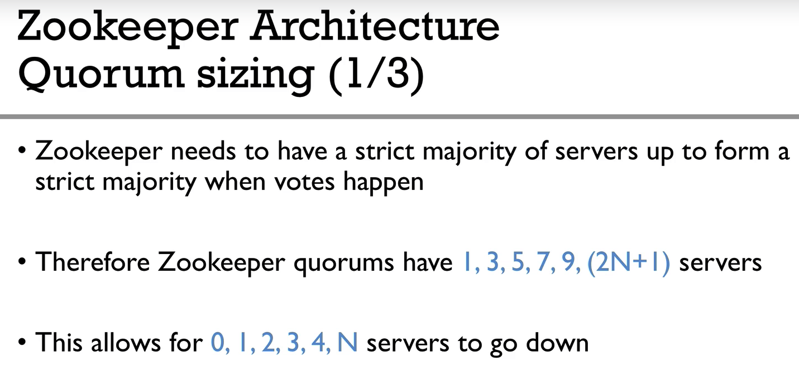
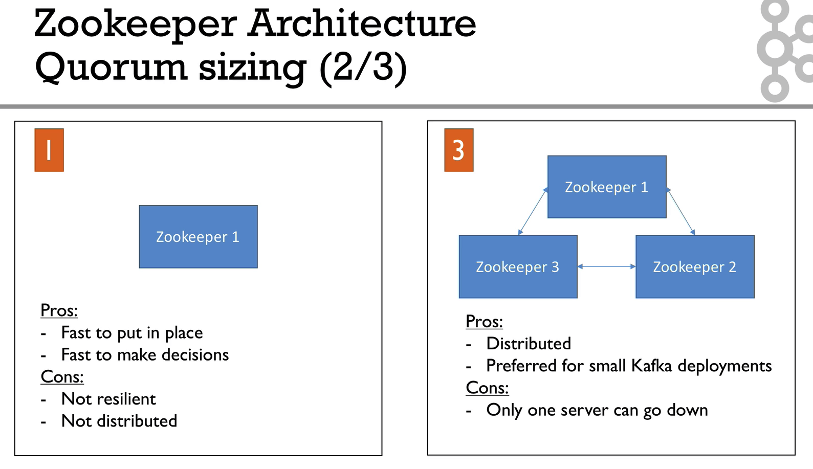
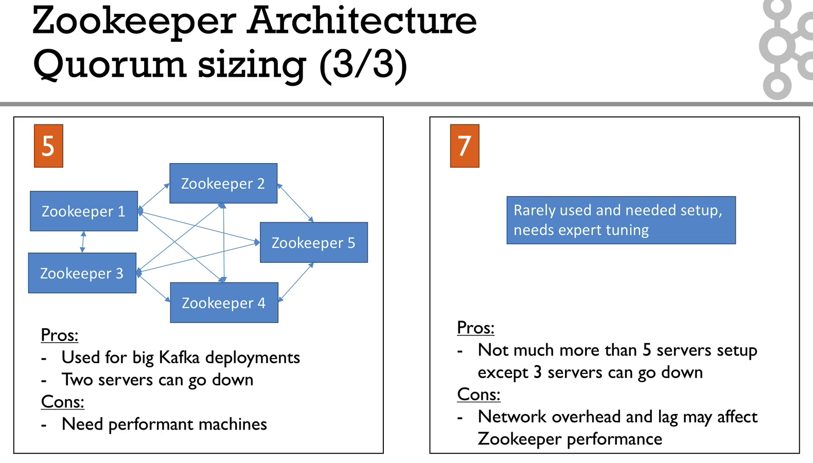

## Zookeeper 설정

`tickTime`

* 주키퍼가 사용하는 시간에 대한 단위(밀리초)

`initLimit`

* 팔로워가 리더와 초기 연결하는 시간에 대한 타임 아웃

`sysLimit`

* 팔로워가 리더와 동기화 하는 시간에 대한 타임 아웃
* 주키퍼에 저장된 데이터가 크면 수를 늘려야 한다.

`dataDir`

* 주키퍼 트랜잭션 로그와 스냅샷이 저장되는 데이터 저장 경로

`clientPort`

* 주키퍼 사용 TCP 포트

`server.x`

* 주키퍼 앙상블을 구성을 위한 서버 설정
* `server.myid` 형식
