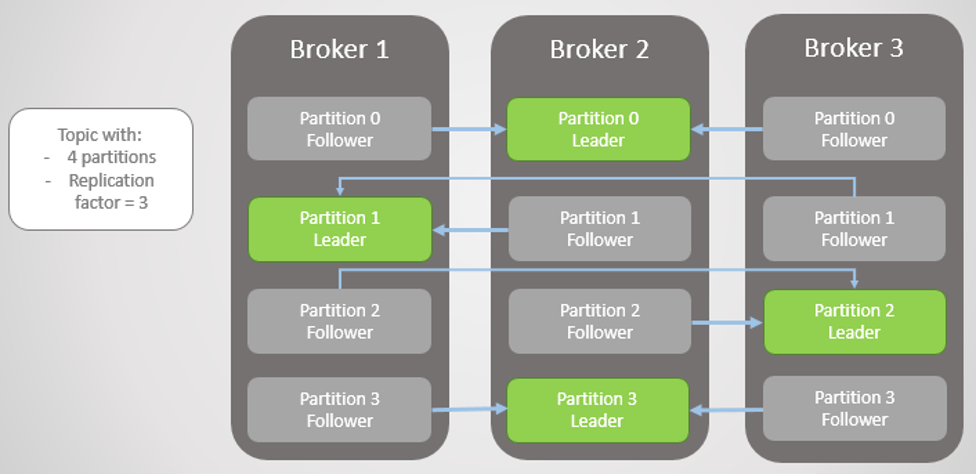

# 1 Kafka

* 대용량, 대규모 메시지 데이터를 빠르게 처리하도록 개발된 메시지 플랫폼


# 2 주요 특징


## 2.1 높은 처리량과 낮은 지연시간

- 카프카를 사용하는 가장 큰 이유가 높은 처리량과 낮은 지연시간이다


| Kafka                  | Pulsar               | **RabbitMQ** (Mirrored) |                              |
| ---------------------- | -------------------- | ----------------------- | ---------------------------- |
| Peak Throughput (MB/s) | 605 MB/s             | 305 MB/s                | 38 MB/s                      |
| p99 Latency (ms)       | 5 ms (200 MB/s load) | 25 ms (200 MB/s load)   | 1 ms* (reduced 30 MB/s load) |

- 컨플루언트가 진행한 메시징 시스템 간의 성능 비교 표
- 가장 높은 처리량을 보여준는 건 카프카다
- 가장 빠른 응답 속도를 보여주는 것은 RabbitMQ지만 처리량과 응답 속도를 같이 비교하면 카프카가 단연 독보적인 성능을 보여준다.


**페이지 캐시**

- 카프카가 높은 처리량을 얻기 위한 사용한 기능
- 페이지 캐시는 디스크에 읽고 쓰는 대신 물리 메모리 중 애플리케이션이 사용하지 않는 일부 잔여 메모리를 활용한다.
- 카프카가 직접 디스크에서 읽고 쓰기를 하지 않고 페이지 캐시를 통해 읽기 쓰기를 하므로 디스크 I/O 접근을 줄여 성능을 높인다.


**배치 전송 처리**

- 카프카는 프로듀서, 컨슈머 클라이언트들과 서로 통신하며 수많은 메시지를 주고받는다.
- 이때 통신을 묶어서 처리하면 단건으로 통신할 때에 비해 네트워크 오버헤드를 줄일 수 있다


**압축 전송**

- 카프카는 메시지 전송 시 성능이 높은 압축 전송을 사용하는 것을 권장한다.
- gzip, snappy, lz4, zesty 압축 타입을 지원한다.
- 앞서 설명한 배치 전송 처리와 결합해 사용하면 더욱 성능을 높일 수 있다.


## 2.2 높은 확장성

- 분산 시스템은 네트워크상에서 연결된 컴퓨터들의 그룹을 말하며 단일 시스템이 갖지 못한 높은 성능을 목표로 한다.
- 카프카는 분산 시스템으로 최초 구성한 클러스터의 리소스가 한계치의 도달하면 브로커를 추가하는 방식으로 확장이 가능하다.
- 카프카에서 브로커는 온라인 상태에서 매우 간단하게 추가할 수 있다.


## 2.3 고가용성

- 서버 또는 노드에 장애가 발생할 때 다른 서버 또는 노드가 처리하므로 장애 대응이 탁월하다.
- 카프카는 2013년 클러스터 내 리플리케이션 기능을 추가해 카프카 클러스터의 고가용성을 확보했다.


## 2.4 내구성

- 프로듀서가 카프카로 메시지를 전달할 때 프로듀서의 acks라는 옵션을 조정하여 메시지의 내구성을 강화할 수 있다.
- 강력한 메시지의 내구성을 원하면 acks=all로 사용하면 된다.
- 프로듀서가 전송한 메시지는 카프카의 로컬 디스크에 안전하게 저장된다.
- 전통적인 메시징 시스템의 경우 컨슈머가 메시지를 가져감과 동시에 저장소에서 메시지를 삭제하지만 카프카에서는 삭제되지 않고 지정된 설정 시간 또는 로그의 크기만큼 로컬 디스크에 보관하여 장애가 발생해도 복구가 가능하다


## 2.5 개발 편의성

- 카프카는 메시지를 전송하는 역할을 하는 프로듀서와 메시지를 가져오는 역할을 하는 컨슈머가 완변하게 분리되어 서로 영향을 주지 않는다.


# 3 카프카 브로커

* 카프카 브로커는 카프카 클라이언트와 데이터를 주고 받기위해 사용되는 주체이자 데이터를 분산 저장하여 장애가 발생하더라도 안전하게 사용할 수 있도록 도와주는 애플리케이션이다.

* 하나의 서버에는 한 개의 카프카 브로커 프로세스가 실행된다.
* 카프카 브로커 서버 1대로도 기본 기능이 실행되지만 데이터를 안전하게 보관하기 위해 최소 3대 이상의 브로커를 1개의 클러스터로 묶어서 운영한다.
* 카프카 클러스터로 묶인 브로커들은 프로듀서가 보낸 데이터를 안전하게 분산 저장하고 복제하는 역할을 한다.


## 3.1 데이터 저장 전송

* 프로듀서로부터 데이터를 전달 받으면 카프카 브로커는 프로듀서가 요청한 토픽의 파티션에 데이터 저장한다.
  * 메모리가 아닌 파일 시스템에 데이터를 저장한다.
  * `log.dir` 옵션에 지정한 디렉토리에 데이터를 저장한다.
* 컨슈머가 데이터를 요청하면 파티션에 저장된 데이터를 전달한다.


## 3.2 컨트롤러

* 클러스터 중 한 대의 브로커가 컨트롤러 역할을 한다.
* 컨트롤러는 다른 브로커들의 상태를 체크하고 브로커가 클러스터에서 빠지는 경우 해당 브로커에 존재하는 리더 파티션을 재분배한다.
* 컨트롤러 역할을 하는 브로커가 장애가 생기면 다른 브로커가 컨트롤러 역할을 한다.


## 3.3 ISR(In Sync Replica)

* 리더 파티션이 다운되는 경우 팔로워 파티션이 새로운 리더로 승격할 때 데이터의 정합성을 지키기 위해 ISR이라는 개념을 도입했다.
  * 팔로워 파티션에 문제가 있어 리더 파티션으로 부터 데이터를 가져오지 못하면 데이터가 일치하지 않으므로 해당 팔로워 파티션이 리더가 되면 데이터 손실이 발생한다.
* ISR이란 현재 리플리케이션되고 있는 리플리케이션 그룹이다.
* ISR에 속해 있는 구성원만이 리더 파티션이 될 수 있다.
* 팔로워 파티션은 매우 짧은 주기로 리더 파티션의 새로운 메세지를 가져온다.
* 리더 파티션이 팔로원 파티션들이 주기적으로 데이터를 가져가고 있는지 확인해서 일정 주기(`replica.lag.time.max`)동안 요청이 오지 않는다면 리더 파티션은 해당 팔로워 파티션을 ISR 그룹에서 추방한다. 


## 3.4 데이터 삭제

* 컨슈머가 데이터를 가져가더라도 토픽의 데이터는 삭제되지 않는다.
* 컨슈머나, 프로듀서가 데이터 삭제를 요청할 수 없다.
* 브로커만이 데이터를 삭제할 수 있다.
* 데이터 삭제는 로그 세그먼트라는 파일 단위로 이루어지며 이 세그먼트에는 다수의 데이터가 들어있어 특정 데이터를 선별해서 삭제할 수 없다.
* 세그먼트는 데이터가 쌓이는 동안 파일 시스템으로 열려있다.
  * `log.segment.bytes` 또는 `log.segment.ms` 옵션 값에 따라 세그먼트 파일이 닫힌다.
  * `log.segment.bytes` 의 기본값은 1GB 해당 용량에 도달하면 세그먼트 파일이 닫힌다.
  * 닫힌 세그먼트 파일은 `log.retention.bytes` 또는 `log.retention.ms` 옵션 설정값이 넘으면 삭제된다.


## 3.5 컨슈머 오프셋 저장

* 컨슈머 그룹은 토픽의 특정 파티션으로부터 데이터를 가져가서 처리하고 파티션의 어느 레코드까지 가져갔는지 확인을 위해 오프셋을 커밋한다.
* 커밋한 오프셋은 `__consumser_offsets` 토픽에 저장된다.
* 컨슈머 그룹은 `__consumser_offsets` 토픽에 저장된 오프셋을 확인하고 다음 레코드를 가져가서 처리한다.


## 3.6 코디네이터

* 클러스터 중 한 대의 브로커가 코디네이터의 역할을 한다.
* 코디네이터는 컨슈머 그룹의 상태를 체크하고 파티션을 컨슈머와 매칭되도록 분배하는 역할을 한다.
  * 컨슈머가 그룹에서 빠지면 매칭되지 않는 파티션을 정상 작동하는 컨슈머에게 할당한다.
  * 이렇게 파티션을 컨슈머로 재할당하는 과정을 리밸런스(rebalance)라고 한다.


### 3.6.1 Rebalancing

* `broker중` 하나가 `group coordinator` 역할을 한다.
* `group coordinator`는 `rebalancing`을 발동시키는 역할을 한다.

**컨슈머 그룹의 컨슈머에게 장애가 발생한다면**

* 장애간 발생한 `consumer`에 할당된 `partition`은 정상 작동하는 `consumer`에 소유권이 넘어간다.
* 이를 `rebalancing`이라 한다.

**`rebalancing`은 두가지 상황에서 발생한다.**

1. 그룹에  `consumer`가 추가되는 상황
2. 그룹에  `consumer`가 제외되는 상황

**`rebalancing` 은 자주 일어나서는 안 된다.**

* `rebalancing`이 발생 할 때 `consumer` 그룹의 `consumer`들이 `topic`의 데이터를 읽을 수 없기 때문

**그룹에  `consumer`가 추가되는 상황 예시**

* Library-events 토픽에 3개의 파티션이 존재함
* 아래 그림과 같이 컨슈머 인스턴가 하나인 경우 3개 파티션 모두가 하나에 컨슈머에 할당됨


* 잠시후 같은 그룹인 컨슈머 인스턴스 하나가 추가됨
* `rebalancing` 이 발생하여 `group coordinator`가 파티션1을 새로운 인스턴스에 할당함


## 3.7 브로커 설정

**필수 옵션**

`broker.id`

* 카프카 브로커의 ID를 설정한다.
* id는 유일해야한다.
  * 다른 브로커와 동일한 id를 가지면 비정상적인 동작이 발생할 수 있다.

`zookeeper.connect`

* 카프카 브로커와 연동할 주키퍼의 IP와 port를 설정한다.

`log.dir`

* 로그가 저장되는 위치

**선택 옵션**

`listeners`

* 카프카 브로커가 통신을 위해 열어둘 인터페이스 IP, port, 프로토콜을 설정한다.
* 설정하지 않으면 모든 IP와 port에서 접속할 수 있다.

`advertised.listeners`

* 카프카 클라이언트 또는 커맨드 라인 툴을 브로커와 연결할 때 사용하는 IP와 port정보를 설정한다.

`default.replication.factor`

* 리플리케이션 팩터 옵션을 주지 않았을 경우 기본 값을 설정
* 2~3을 권장

`min.insync.replicas`

* 브로커에 데이터를 적재할 때 최소 `min.insync.replicas` 개수에 해당되는 리더 파티션과 팔로워 파티션에 데이터가 저장되면 성공된 것으로 판단한다.
* 프로듀서의 `acks` 설정과 함꼐 쓰인다.
  * 손실 없는 데이터 전송을 원한다면 `acks=all` 과 `min.insync.replicas=2` 토픽의 리플리케이션 팩터를 3으로 설정하는 것을 권장한다.

`auto.create.topics.enable`

* 존재하지 않는 토픽을 퍼블리셔가 메세지를 보냈을 때 자동으로 토픽을 만드는 설정
* 프로덕션에선 `auto.create.topics.enable=false`

`delete.topic.enable`

* 토픽을 삭제 가능하게 설정

`num.partition`

* 파티션 개수를 명시하지 않고 토픽을 생성할 때 지정되는 파티션 개수를 설정한다.

`offsets.retention.minutes`

* 오프셋이 유지되는 시간을 설정한다
* 기본값 1일
* 독립적인 소비자의 경우 마지막 커밋 시간 후 이 보존 기간이 지나면 오프셋이 만료됩니다.


# 4. 토픽(topic)

## 4.1 토픽의 개념

* `topic`이란 카프카에서 데이터를 구분하기 위해 사용하는 단위이다. 
* `topic`은 1개 이상의 `partition`을 소유하고 있다.


# 5 파티션(partition)


## 5.1 파티션의 개념

* `partition` 이란 `topic`을 분할한 것이며 이를 이용해 병렬처리를 제공한다.
* 그룹으로 묶인 `consumer`들이 `record`를 병렬로 처리함
* `consumer`의 처리량이 한계치에 도달했다면  `consumer`의 개수를 늘리고 `partition`도 늘리면 처리량이 증가하는 효과를 볼 수 있다.
* `partition`에는 `producer`가 보낸 데이터가 저장되어있다. 이 데이터를 `record`라고 한다.
* `record` 가 저장될 때`partition` 내에서 순차적으로 증가하는 숫자를 부여받는데 이를 `offset`이라 한다.
  * `offset`은 순차적으로 증가하는 숫자 형태로 되어 있다.


## 5.2 적정 파티션 수

**피티션 개수 고려사항**

* 데이터 처리량
* 메세지 키 사용 여부
* `broker`, `consumer` 영향도


**파티션은 카프카의 병렬처리의 핵심이다.**

*  파티션의 개수가 늘리면 1:1 매핑되는 컨슈머 개수가 늘어난다.


**데이터 처리 속도를 올리는 방법**

1. 컨슈머의 처리량을 올리는 것
   * 스케일 업
   * GC 튜닝
   * 이 방식으로 일정 수준 이상의 처리량을 올리는 것이 어렵다.
2. 파티션을 늘리고 컨슈머를 늘려 병렬 처리량을 올리는 것


**적정 파티션 수**

* `프로듀서 전송 데이터량 < 컨슈머 데이터 처리량 * 파티션 개수`
* 전체 컨슈머 데이터 처리량이 프로듀서가 보낸 데이터보다 작다면 컨슈머 랙이 생기고 데이터 처리 지연이 발생한다.
* 그렇기 때문에 컨슈머 전체 데이터 처리량이 프로듀서 데이터 처리량보다 많아야 한다.


**파티션 수를 결정하는 팁**

* 적절한 파티션 수를 측정하기 어려운 경우 일단 적은 수의 파티션으로 운영하고 병목현상이 생기면 파티션 수와 프로듀서 또는 컨슈머를 늘려가는 방법으로 할당한다
* 카프카에선 파티션 수의 증가는 아무때나 가능하지만 줄이는 방법은 없기 때문


## 5.3 데이터 복제(리플리케이션)



**리플리케이션**

* 데이터 복제를 통해 카프카는 장애 허용 시스템으로 동작한다.
  * 장애 허용 시스템 -> 클러스터로 묶인 브로커 중 일부에 장애가 발생해도 데이터가 유실되지 않는다.
* 카프카의 데이터 복제는 파티션 단위로 이루어진다.
* 복제된 파티션은 리더와 팔로워로 구성된다.


**리더 파티션**

* 프로듀서 또는 컨슈머와 직접 통신하는 파티션
* 모든 읽기 쓰기가 리더를 통해서만 일어난다.


**팔로워 파티션** 

* 복제 데이터를 가지고있는 파티션
* 리더 파티션의 오프셋을 확인하여 자신의 오프셋과 차이가 있는 경우 리더로부터 데이터를 가져온다. 
* 이 과정을 복제(replication)이라 한다.


**리플리케이션 팩터**

* 토픽 생성시 리플리케이션 팩터를 설정할 수 있는데 이는 파티션의 복제 개수를 의미한다.
* 토픽 별로 리플리케이션 팩터 값을 설정할 수 있다.
  * `최소 1 ~ 최대 브로커의 개수`만큼 설정 가능
* 클러스터 내 모든 브로커에 동일하게 설정해야한다.
* 리플리케이션 팩터의 값은 변경할 수 있다.


**리플리케이션의 단점**

* 리플리케이션으로 인해 다른 브로커에도 파티션의 데이터가 복제되므로 복제 개수만큼 저장 용량이 증가한다.
* 예) 토픽의 사이즈가 만약 100GB 이고  리플리케이션 팩터가 3인 경우 브로커 1에도 100GB의 디스크를 사용하고, 브로커2 에도 100GB 사용하고, 브로커3에더 100GB 사용해서 총 300GB로 원래 토픽 사이즈에 3배 크기의 저장소가 필요합니다.
* 리플리케이션을 보장하기 위한 작업으로 브로커의 리소스 사용량이 증가한다.


**리플리케이션 팩터 결론**

* 모든 토픽에 리플리케이션 팩터 3을 적용해서 운영하기 보다 토픽에 저장되는 데이터의 중요도에 따라 팩터를 달리 설정하는 것이 필요하다.
* 테스트나 개발 환경에서는 팩터 수를 1로 설정하자
* 로그성 메시지로 약간의 유실을 허용하는 운영환경 이라면 팩터 수를 2로 설정하자
* 유실을 허용하지 않는 운영 환경이라면 팩터 수를 3으로 설정하자


# 6 레코드(record)

**레코드**

* `record`는 타임스탬프, 메시지 키, 메시지 값, 오프셋으로 구성되어 있다.
* `broker`에 한번 적재된 `record`는 수정할 수 없고 로그 리텐션 기간 또는 용량에 따라서만 삭제된다.


**메시지 키**

* 메시지 키는 메시지 값을 순서대로 처리하거나 메시지 값의 종류를 나타내기 위해 사용된다.
* `producer`가 `topic`에 `record`를 전송할 때 메시지 키의 해시값을 토대로 `partition`을 지정한다.
  * 즉 동일한 메시지 값이라면 동일한 `partition` 에 들어간다.
* 메시지 키를 사용하지 않으면 레코드는 프로듀서 기본 설정 파티셔너에 따라 `partition` 에 분배되어 적재된다.


**메시지 값**

* 실질적으로 처리할 데이터가 들어가 있다.
* 메시지 키와 메시지 값은 직렬화되어 브로커로 전송되기 때문에 컨슈머가 동일한 형태로 역직렬화를 수행해야한다.


**타임스탬프**

* `producer`가 생성한 `record`가 `broker`로 전송되면 타임스탬프가 지정되어 저장된다.
* 타임스탬프는 `broker` 기준 유닉스 시간이 설정된다.
* 프로듀서가 레코드를 생성할 때 임의의 타임스탬프 값을 설정할 수 있다.


**오프셋**

* `producer`가 생성한 `record`가 `broker`로 전송되면 오프셋이 지정되어 저장된다.
* `record` 의 오프셋은 0이상의 숫자이며 `partition` 내에서 유일하다.
* `record`  의 오프셋은 직접 지정할 수 없고 브로커에 저장될 때  `이전 전송된 레코드 오프셋 + 1` 값이 설정된다.
  * 즉 아래의 그림과 같이 0부터 시작하여 순차적으로 증가한다.
* 오프셋은 `consumer` 가 데이터를 가져갈 때 사용한다. 
  * 오프셋을 이용해 그룹으로 이루어진 컨슈머들이 파티션의 데이터를 어디까지 가져갔는지 알 수 있다.
* 오프셋을 이용해 파티션 내에서 메세지의 순서를 보장합니다.
  * 허나 서로 다른 파티션의 동일한 값의 오프셋끼리의 순서는 보장하지 않는다.


# 8 세그먼트(segment)

- 프로듀서가 보낸 메시지는 토픽의 파티션에 저장된다.
- 각 메시지들은 세그먼트라는 `로그 파일`의 형태로 브로커의 로컬 디스크에 저장됩니다.
- 각 파티션은 N개의 세그먼트로 구성된다.
- 브로커 세그먼트에 저장된 메시지는 컨슈머가 읽어갈 수 있다.


# 7 카프카 설치

원본

```yml
version: '2'
services:
  zookeeper:
    image: wurstmeister/zookeeper
    container_name: zookeeper
    ports:
      - 2181:2181
    networks:
      - ai-networks
    restart: always
  kafka:
    image: wurstmeister/kafka
    container_name: kafka
    ports:
      - 9092:9092
    environment:
      KAFKA_CREATE_TOPICS: "slack:1:1,sms:1:1,email:1:1"
      KAFKA_ADVERTISED_HOST_NAME: kafka-service
      KAFKA_ADVERTISED_LISTENERS: PLAINTEXT://139.150.75.240:9092
      KAFKA_ZOOKEEPER_CONNECT: zookeeper:2181
      KAFKA_ADVERTISED_PORT: 9092
    volumes:
      - /var/run/docker.sock:/var/run/docker.sock
    networks:
      - ai-networks
    restart: always
    depends_on:
      - zookeeper

networks:
  ai-networks:
    driver: bridge

```


```yml
version: '2'
services:
  zookeeper:
    image: wurstmeister/zookeeper
    container_name: zookeeper
    ports:
      - 2181:2181
    networks:
      - ai-network
    restart: always
  kafka:
    image: wurstmeister/kafka
    container_name: kafka
    ports:
      - 9000:9000
      - 9092:9092
    environment:
      KAFKA_CREATE_TOPICS: "slack:1:1,sms:1:1,email:1:1"
      KAFKA_LISTENERS: INSIDE_CONTAINER://localhost:9000
      KAFKA_ADVERTISED_LISTENERS:INSIDE_CONTAINER://localhost:9000
      KAFKA_LISTENER_SECURITY_PROTOCOL_MAP=INTERNAL_LISTENER:PLAINTEXT,EXTERNAL_LISTENER:PLAINTEXT
      KAFKA_ZOOKEEPER_CONNECT: zookeeper:2181
    volumes:
      - /var/run/docker.sock:/var/run/docker.sock
    networks:
      - ai-network
    restart: always
    depends_on:
      - zookeeper

networks:
  ai-network:
    name: ai-network
    driver: bridge
```


```yml
version: '2'
services:
  zookeeper:
    image: wurstmeister/zookeeper
    container_name: zookeeper
    ports:
      - 2181:2181
    networks:
      - ai-network
    restart: always
  kafka:
    image: wurstmeister/kafka
    container_name: kafka
    ports:
      - 9000:9000
      - 9092:9092
    environment:
      KAFKA_CREATE_TOPICS: "slack:1:1,sms:1:1,email:1:1"
      KAFKA_LISTENERS: EXTERNAL_LISTENER://139.150.75.240:9092, INTERNAL_LISTENER://localhost:9000
      KAFKA_ADVERTISED_LISTENERS: EXTERNAL_LISTENER://139.150.75.240:9092, INTERNAL_LISTENER://localhost:9000
      KAFKA_LISTENER_SECURITY_PROTOCOL_MAP: INTERNAL_LISTENER:PLAINTEXT,EXTERNAL_LISTENER:PLAINTEXT
      KAFKA_ZOOKEEPER_CONNECT: zookeeper:2181
    volumes:
      - /var/run/docker.sock:/var/run/docker.sock
    networks:
      - ai-network
    restart: always
    depends_on:
      - zookeeper

networks:
  ai-network:
    name: ai-network
    driver: bridge
```

```yml
version: '2'
services:
  zookeeper:
    image: wurstmeister/zookeeper
    container_name: zookeeper
    ports:
      - 2181:2181
    networks:
      - ai-network
    restart: always
  kafka:
    image: wurstmeister/kafka
    container_name: kafka
    ports:
      - 9000:9000
      - 9092:9092
    environment:
      KAFKA_CREATE_TOPICS: "slack:1:1,sms:1:1,email:1:1"
      KAFKA_LISTENERS: PLAINTEXT://:9092
      KAFKA_ADVERTISED_LISTENERS: PLAINTEXT://localhost:9092
      KAFKA_ZOOKEEPER_CONNECT: zookeeper:2181
    volumes:
      - /var/run/docker.sock:/var/run/docker.sock
    networks:
      - ai-network
    restart: always
    depends_on:
      - zookeeper

networks:
  ai-network:
    name: ai-network
    driver: bridge
```

```yml
version: '3.5'

networks:
  kafka-network:
    name: kafka-network

services:
  zookeeper:
    image: confluentinc/cp-zookeeper:5.5.0
    container_name: zookeeper
    networks:
      - kafka-network
    environment:
      ZOOKEEPER_CLIENT_PORT: 2181
  
  broker01:
    image: confluentinc/cp-kafka:5.5.0
    container_name: broker01
    networks:
      - kafka-network
    ports:
      - "9092:9092"
      - "19092:19092"
    depends_on:
      - zookeeper
    environment:
      KAFKA_BROKER_ID: 1
      KAFKA_ZOOKEEPER_CONNECT: zookeeper:2181
      KAFKA_ADVERTISED_LISTENERS: CONNECTIONS_OUTSIDE://139.150.75.240:9092:9092,PLAINTEXT://broker01:19092
      KAFKA_LISTENER_SECURITY_PROTOCOL_MAP: PLAINTEXT:PLAINTEXT,CONNECTIONS_OUTSIDE:PLAINTEXT
      KAFKA_OFFSETS_TOPIC_REPLICATION_FACTOR: 1
```

```yml
version: '3.5'

networks:
  kafka-network:
    name: kafka-network

services:
  zookeeper:
    image: confluentinc/cp-zookeeper:5.5.0
    container_name: zookeeper
    networks:
      - kafka-network
    environment:
      ZOOKEEPER_CLIENT_PORT: 2181

  broker01:
    image: confluentinc/cp-kafka:5.5.0
    container_name: broker01
    networks:
      - kafka-network
    ports:
      - "9092:9092"
      - "19092:19092"
    depends_on:
      - zookeeper
    environment:
      KAFKA_BROKER_ID: 1
      KAFKA_ZOOKEEPER_CONNECT: zookeeper:2181
      KAFKA_LISTENERS: CONNECTIONS_OUTSIDE://:9092,PLAINTEXT://broker01:19092
      KAFKA_ADVERTISED_LISTENERS: CONNECTIONS_OUTSIDE://139.150.75.240:9092,PLAINTEXT://broker01:19092
      KAFKA_LISTENER_SECURITY_PROTOCOL_MAP: PLAINTEXT:PLAINTEXT,CONNECTIONS_OUTSIDE:PLAINTEXT
      KAFKA_OFFSETS_TOPIC_REPLICATION_FACTOR: 1
  broker02:
    image: confluentinc/cp-kafka:5.5.0
    container_name: broker02
    networks:
      - kafka-network
    ports:
      - "9093:9093"
      - "19093:19093"
    depends_on:
      - zookeeper
    environment:
      KAFKA_BROKER_ID: 2
      KAFKA_ZOOKEEPER_CONNECT: zookeeper:2181
      KAFKA_LISTENERS: CONNECTIONS_OUTSIDE://:9093,PLAINTEXT://broker02:19093
      KAFKA_ADVERTISED_LISTENERS: CONNECTIONS_OUTSIDE://139.150.75.240:9093,PLAINTEXT://broker02:19093
      KAFKA_LISTENER_SECURITY_PROTOCOL_MAP: PLAINTEXT:PLAINTEXT,CONNECTIONS_OUTSIDE:PLAINTEXT
      KAFKA_OFFSETS_TOPIC_REPLICATION_FACTOR: 1
  broker03:
    image: confluentinc/cp-kafka:5.5.0
    container_name: broker03
    networks:
      - kafka-network
    ports:
      - "9094:9094"
      - "19094:19094"
    depends_on:
      - zookeeper
    environment:
      KAFKA_BROKER_ID: 3
      KAFKA_ZOOKEEPER_CONNECT: zookeeper:2181
      KAFKA_LISTENERS: CONNECTIONS_OUTSIDE://:9094,PLAINTEXT://broker03:19094
      KAFKA_ADVERTISED_LISTENERS: CONNECTIONS_OUTSIDE://139.150.75.240:9094,PLAINTEXT://broker03:19094
      KAFKA_LISTENER_SECURITY_PROTOCOL_MAP: PLAINTEXT:PLAINTEXT,CONNECTIONS_OUTSIDE:PLAINTEXT
      KAFKA_OFFSETS_TOPIC_REPLICATION_FACTOR: 1
```

```bash

//카프카가를 실행할 리모트 서버(139.150.75.240)에서 실행
docker-compose up -d

//아래부터 로컬에서 명령어 입력

//토픽 리스트 확인
./kafka-topics.sh --bootstrap-server 139.150.75.240:9093 --list
__confluent.support.metrics


//토픽 생성
./kafka-topics.sh --bootstrap-server 139.150.75.240:9093 --create --topic email --partitions 3 --replication-factor 3
./kafka-topics.sh --bootstrap-server 139.150.75.240:9093 --create --topic slack --partitions 3 --replication-factor 2
./kafka-topics.sh --bootstrap-server 139.150.75.240:9094 --create --topic sms --partitions 3 --replication-factor 2

//토픽 리스트 재확인
./kafka-topics.sh --bootstrap-server 139.150.75.240:9093 --list
__confluent.support.metrics
email
slack
sms

//email 토픽 상세 정보 확인
./kafka-topics.sh --bootstrap-server 139.150.75.240:9093 --describe --topic email
Topic: email    PartitionCount: 3       ReplicationFactor: 3    Configs:
        Topic: email    Partition: 0    Leader: 2       Replicas: 2,3,1 Isr: 2,3,1
        Topic: email    Partition: 1    Leader: 3       Replicas: 3,1,2 Isr: 3,1,2
        Topic: email    Partition: 2    Leader: 1       Replicas: 1,2,3 Isr: 1,2,3
 
//sms 토픽 상세 정보 확인
./kafka-topics.sh --bootstrap-server 139.150.75.240:9093 --describe --topic sms
Topic: sms      PartitionCount: 3       ReplicationFactor: 2    Configs:
        Topic: sms      Partition: 0    Leader: 2       Replicas: 2,1   Isr: 2,1
        Topic: sms      Partition: 1    Leader: 3       Replicas: 3,2   Isr: 3,2
        Topic: sms      Partition: 2    Leader: 1       Replicas: 1,3   Isr: 1,3
        
// 컨슈머 그룹 목록 확인
./kafka-consumer-groups.sh --bootstrap-server 139.150.75.240:9093 --list

//컨슈머 상태와 오프셋 확인
./kafka-consumer-groups.sh --bootstrap-server 139.150.75.240:9093 --group email --describe

// email 토픽으로 레코드 프로듀싱하기
./kafka-console-producer.sh --bootstrap-server 139.150.75.240:9093 --topic email


```


참고

- [실전 카프카 개발부터 운영까지](http://www.kyobobook.co.kr/product/detailViewKor.laf?mallGb=KOR&ejkGb=KOR&barcode=9791189909345)
