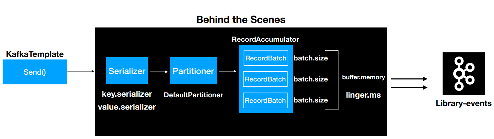

# 1. Producer 개념

* `producer`는 메시지를 생성하여 브로커의 토픽 이름으로 보내는 서버 또는 애플리케이션을 말한다.
* `producer`는 데이터를 전송할 때 리더 `partition`을 가지고 있는 `broker`와 직접 통신을 한다.
* `producer`는 카프카 `broker`로 데이터를 전송할 때 내부적으로 `partitioner`, 배치 생성 단계를 거친다.
* `producer`의 주요 기능은 각각의 메시지를 토픽 파티션에 매핑하고 파티션 리더에 요청을 보내는 것
  * 키 값을 정해 해당 키를 가진 모든 메세지를 동일한 파티션으로 전송한다.


## 1.1 Partitioner & Batch



* `partitioner`는 `record`를`topic`의 어느 `partition`으로 전송할 것인지 결정하는 역할을 한다.
* `partitioner`에 의해 구분된 `record`는 데이터 전송을 위해 어큐뮬레이터에 버퍼에 쌓이고 sender 스레드가 어큘뮬레이터에 쌓인 배치 데이터를 카브카 브로커로 전송한다.
* 카프카 클라이언트 라이브러리 2.5.0 버전에서 `partitioner`를 지정하지 않으면 `UniformStickyPartitioner`가 기본 `partitioner`로 지정된다.
* 사용자 지정 파티셔너를 사용하기 위해선 `Partitioner` 인터페이스를 구현하면 된다.

# 2. Producer API

* 프로듀서를 구현하기위해 카프카 클라이언트를 라이브러리로 추가하여 자바 애플리케이션을 만들어보자


## 2.1 자바 프로듀서 애플리케이션

* 간단한 자바 프로듀서 애플리케이션을 만들어보자


**디펜던시 추가**

```groovy
compile 'org.apache.kafka:kafka-clients:2.8.0'
```

```xml
<dependency>
	<groupId>org.apache.kafka</groupId>
	<artifactId>kafka-clients</artifactId>
	<version>2.8.0</version>
</dependency>
```


**SimpleProducer.java 작성**

```java
import org.apache.kafka.clients.producer.KafkaProducer;
import org.apache.kafka.clients.producer.ProducerConfig;
import org.apache.kafka.clients.producer.ProducerRecord;
import org.apache.kafka.common.serialization.StringSerializer;
import org.slf4j.Logger;
import org.slf4j.LoggerFactory;

import java.util.Properties;

public class SimpleProducer {
    private final static Logger logger = LoggerFactory.getLogger(SimpleProducer.class);
    private final static String TOPIC_NAME = "test";
    private final static String BOOTSTRAP_SERVERS = "my-kafka:9092";

    public static void main(String[] args) {

        Properties configs = new Properties();
        configs.put(ProducerConfig.BOOTSTRAP_SERVERS_CONFIG, BOOTSTRAP_SERVERS);
        configs.put(ProducerConfig.KEY_SERIALIZER_CLASS_CONFIG, StringSerializer.class.getName());
        configs.put(ProducerConfig.VALUE_SERIALIZER_CLASS_CONFIG, StringSerializer.class.getName());

        KafkaProducer<String, String> producer = new KafkaProducer<>(configs);

        String messageValue = "testMessage";
        ProducerRecord<String, String> record = new ProducerRecord<>(TOPIC_NAME, messageValue);
        producer.send(record);
        logger.info("{}", record);
        producer.flush();
        producer.close();
    }
}
```

`Properties configs = new Properties();`

* `KafkaProducer` 인스턴스를 생성하기 위한 프로듀서 옵션들을 key, value 값으로 선언한다.

`configs.put(ProducerConfig.BOOTSTRAP_SERVERS_CONFIG, BOOTSTRAP_SERVERS);`

* 전송하고자 하는 카프카 클러스터 서버의 host와 IP주소를 지정한다.

 `configs.put(ProducerConfig.KEY_SERIALIZER_CLASS_CONFIG, StringSerializer.class.getName());` 

* 메시키 키를 직렬화하기 위한 직렬화 클래스를 선언한다.

`configs.put(ProducerConfig.VALUE_SERIALIZER_CLASS_CONFIG, StringSerializer.class.getName());`

* 메시지 값을 직렬화하기 위한 직렬화 클래스를 선언한다.

 `KafkaProducer<String, String> producer = new KafkaProducer<>(configs);`

* Properties를 `KafkaProducer` 의 생성 파라미터를 추가하여 인스턴스 생성
* `KafkaProducer` 인스턴스는 `ProducerRecord`를 전송할 때 사용된다.

 `ProducerRecord<String, String> record = new ProducerRecord<>(TOPIC_NAME, messageValue);`

* 카프카 브로커로 데이터를 보내기위해 ProducerRecord를 생성한다.
* ProducerRecord의 생성자로 메시지 키, 메시지값, 토픽이름을 전달할 수 있다.

`producer.send(record);`

* 생성한 ProducerRecord를 전송한다.
* 1프로듀서에서 send()는 즉각적인 전송이 아니라 record들을 프로듀서 내부에 가지고 있다가 배치 형태로 묶어서 브로커에 전송한다.

`producer.flush();`

* 프로듀서 내부 버퍼에 저장된 레코드 배치를 브로커로 전송한다.


## 2.2 프로듀서 설정

**필수 옵션**

`bootstrap.servers` 

* 카프카 클러스터에 처음 연결하기 위한 호스트와 포트 정보로 구성된 리스트를 설정한다.
  * 카프카 클러스터는 마스터라는 개념이 없기 때문에 클러스터 내 모든 서버가 클라이언트의 요청을 받을 수 있다.
* 2개 이상 브로커 정보를 입력하여 일부 브로커에 이슈가 발생하더라도 접속하는 데에 이슈가 없도록 설정 가능하다.
  * 명시된 서버 중 하나에서 장애가 발생해도 자동으로 다른 서버로 재접속을 시도하기 때문에 모든 브로커를 입력하는 것을 권장한다.

`key.serializer`

* 레코드의 메시지 키를 직렬화하는 클래스를 지정한다.

`value.serializer`

* 레코드의 메시지 값을 직렬화하는 클래스를 지정한다.


**선택 옵션**

`acks`

* 프로듀서가 전송한 데이터가 브로커들에 정상적으로 적재되었는지 전송 성공 여부를 확인하는데 사용된다.
* `0`, `1`, `-1` 중 하나로 설정할 수 있다.
  * 숫자가 작으면 성능이 좋아지지만, 메시지 손실 가능성이 높아진다.
* `acks=1`
  * 리더 파티션에 데이터가 저장되면 전송 성공으로 판단
  * 모든 팔로워는 확인하지 않기 때문에 일부 데이터의 손실이 발생할 수도 있다.
* `acks=0`
  * 프로듀서가 전송한 즉시 브로커에 데이터 저장 여부와 상관없이 성공으로 판단
  * 클라이언트는 전송 실패에 대한 결과를 알지 못하기 때문에 재요청 설정도 적용되지 않는다.
  * 메시지가 손실될 수 있지만 높은 처리량을 얻을 수 있다.
* `acks=-1 or acks=all`
  * 리더는 ISR의 팔로워로부터 데이터에 대한 ack를 기다립니다.
  * 카프카 브로커 설정 `min.insync.replicas` 개수에 해당되는 리더 파티션과 팔로워 파티션에 데이터가 저장되면 성공된 것으로 판단한다.
  * 손실 없는 데이터 전송을 원한다면 `acks=all` 과 `min.insync.replicas=2` 토픽의 리플리케이션 팩터를 3으로 설정하는 것을 권장한다.

`buffer.memory`

* 브로커로 전송할 데이터를 배치로 모으기 위해 설정할 버퍼 메모리양을 지정한다.

`retries`

* 프로듀서가 브로커로부터 에러를 받고 난 뒤 재전송을 시도하는 횟수를 지정한다.

`batch.size`

* 배치로 전송할 레코드 최대 용량을 지정한다.
  * 프로듀서는 같은 파티션으로 보내는 여러 데이터를 묶어 배치로 보낸다.
* 너무 작게 설정하면 프로듀서가 브로커로 더 자주 보내기 떄문에 네트워크 부담이있다.
* 너크 크게 설정하면 메모리를 더 많이 사용한다.
* 배치를 보내기전 클라이언트 장애가 발생하면 배치 내에 있던 메시지는 전달되지 않는다.

`linger.ms`

* 배치를 전송하기 전까지 기다리는 최소 시간
* 기본 값 0

`partitioner.class`

* 레코드를 파티션에 전송할 때 적용하는 파티셔너 클래스를 지정한다.
* 기본값 `org.apache.kafka.clients.producer.internals.DefaultPartitioner`

`enable.idempotence`

* 멱등성 프로듀서로 동작할지 여부를 설정한다.
* 기본값  `false`

`transactional.id`

* 프로듀서가 레코드를 전송할 때 레코드를 트랙잰션 단위로 묶을지 여부를 설정한다.
* 프로듀서의 고유한 트랙잭션 아이디를 설정할 수 있다.
* 이 값을 설정하면 트랜잭션 프로듀서로 작동한다.
* 기본값 `null`


## 2.3 브로커 정상 전송 여부 확인하기

* `KafkaProducer`의 `send()` 메서드는 `Future`객체를 반환한다. 
* `Future`객체는 ProducerRecord가 브로커에 정상적으로 적재되었는지에 대한 데이터가 포함되어 있다.
  * 포함된 데이터 : 적재된 토픽 이름, 파티션 번호, 오프셋


### 2.3.1 동기방식 전송 여부 확인 

* `RecordMetadata metadata = producer.send(record).get()` 을 이용하면 프로듀서로 보낸 데이터의 결과를 동기적으로 가져올 수 있다.
* 동기적으로 전송 결과를 확인하는 것은 성능상 문제가 있다.

```java
public class ProducerWithSyncCallback {
    private final static Logger logger = LoggerFactory.getLogger(ProducerWithSyncCallback.class);
    private final static String TOPIC_NAME = "test";
    private final static String BOOTSTRAP_SERVERS = "my-kafka:9092";

    public static void main(String[] args) {

        Properties configs = new Properties();
        configs.put(ProducerConfig.BOOTSTRAP_SERVERS_CONFIG, BOOTSTRAP_SERVERS);
        configs.put(ProducerConfig.KEY_SERIALIZER_CLASS_CONFIG, StringSerializer.class.getName());
        configs.put(ProducerConfig.VALUE_SERIALIZER_CLASS_CONFIG, StringSerializer.class.getName());

        KafkaProducer<String, String> producer = new KafkaProducer<>(configs);

        ProducerRecord<String, String> record = new ProducerRecord<>(TOPIC_NAME, "Pangyo", "23");
        try {
            RecordMetadata metadata = producer.send(record).get();
            logger.info(metadata.toString());
        } catch (Exception e) {
            logger.error(e.getMessage(),e);
        } finally {
            producer.flush();
            producer.close();
        }
    }
}
```


### 2.3.2 비동기방식 전송 여부 확인

* 프로듀서는 비동기로 결과를 확인할 수 있도록 Callback 인터페이스를 제공한다.
  * `org.apache.kafka.clients.producer.Callback`
* 사용자 정의 Callback 클래스를 생성하여 비동기로 전송 결과를 확인할 수 있다.


**사용자 정의 Callback 클래스**

```java
import org.apache.kafka.clients.producer.Callback;
import org.apache.kafka.clients.producer.RecordMetadata;
import org.slf4j.Logger;
import org.slf4j.LoggerFactory;

public class ProducerCallback implements Callback {
    private final static Logger logger = LoggerFactory.getLogger(ProducerCallback.class);

    @Override
    public void onCompletion(RecordMetadata recordMetadata, Exception e) {
        if (e != null)
            logger.error(e.getMessage(), e);
        else
            logger.info(recordMetadata.toString());
    }
}
```

* onCompletion 메서드는 비동기 결과를 받기위해 사용된다
* 적재시 에러가 발생할 경우 e 객체에 담겨서 메서드가 실행된다.
* 에러가 발생하지 않으면 recordMetadata에 해당 레코드가 적재된 토픽 이름과 파티션 번호, 오프셋을 알 수 있다.


**비동기식으로 전송 여부를 확인하는 프로듀서**

* `producer.send(record, new ProducerCallback());`
  * 사용자 정의 Callback 클래스를 넘겨주어 Callback의 onCompletion메서드를 통해 전송 여부를 확인할 수 있다.

```java
public class ProducerWithAsyncCallback {
    private final static Logger logger = LoggerFactory.getLogger(ProducerWithAsyncCallback.class);
    private final static String TOPIC_NAME = "test";
    private final static String BOOTSTRAP_SERVERS = "my-kafka:9092";

    public static void main(String[] args) {

        Properties configs = new Properties();
        configs.put(ProducerConfig.BOOTSTRAP_SERVERS_CONFIG, BOOTSTRAP_SERVERS);
        configs.put(ProducerConfig.KEY_SERIALIZER_CLASS_CONFIG, StringSerializer.class.getName());
        configs.put(ProducerConfig.VALUE_SERIALIZER_CLASS_CONFIG, StringSerializer.class.getName());

        KafkaProducer<String, String> producer = new KafkaProducer<>(configs);

        ProducerRecord<String, String> record = new ProducerRecord<>(TOPIC_NAME, "Pangyo", "23");
        producer.send(record, new ProducerCallback());

        producer.flush();
        producer.close();
    }
}
```

