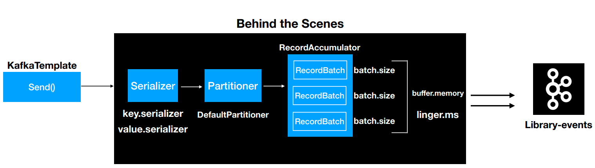

# 1 Producer 개념

* `producer`는 메시지를 생성하여 브로커의 토픽 이름으로 보내는 서버 또는 애플리케이션을 말한다.
* `producer`는 데이터를 전송할 때 리더 `partition`을 가지고 있는 `broker`와 직접 통신을 한다.
* `producer`는 카프카 `broker`로 데이터를 전송할 때 내부적으로 `partitioner`, 배치 생성 단계를 거친다.
* `producer`의 주요 기능은 각각의 메시지를 토픽 파티션에 매핑하고 파티션 리더에 요청을 보내는 것
	* 키 값을 정해 해당 키를 가진 모든 메세지를 동일한 파티션으로 전송한다.

<br>

## 1.1 Producer의 동작 과정

- 레코드는 토픽, 파티션, 키, 밸류로 구성된다.
- 레코드는 시리얼라이저, 파티셔너, 배치를  거치게된다.

<br>

**Producer의 동작 과정**



1. 시리얼라이저가 레코드를 직렬화한다.
2. 파티셔너가 레코드 키의 해시값을 토대로 `partition`을 지정한다.
3. 배치 전송을 위해 어큐뮬레이터에 파티션으로 구분된 버퍼에 레코드를 쌓는다
4. sender 스레드가 어큘뮬레이터에 쌓인 배치 데이터를 카브카 브로커로 전송한다.
5. 전송이 실패하면 재시도한다.
	- 지정된 횟수만큼 재시도하며 최종 실패 결과를 보여준다.
6. 전송이 성공하면 메타데이터를 리턴한다.

<br>

# 2 Partitioner

* 카프카의 토픽은 병렬 처리가 가능하도록 최소 하나 이상의 파티션으로 구성된다.
* 프로듀서가 카프카로 전송한 메시지는 해당 토픽 내 각 파티션의 로그 세그먼트에 저장된다.
	* [[Broker]] 로그 세그먼트 참고 
* 따라서 프로듀서는 메시지를 보낼 때 토픽의 어느 파티션으로 메시지를 보낼지 결정해야 하며 이때 사용하는 것이 `Partitioner`다
* `partitioner`는 `record`를 `topic`의 어느 `partition`으로 전송할 것인지 결정하는 역할을 한다.
* partitioner는 메시지(레코드)의 키를 해시해 파티션을 결정한다.
	* 따라서 메시지 키 값이 동일하면 같은 파티션으로 전송된다.
* 토픽의 파티션을 추가하는 경우 메시지의 키와 매핑된 해시 테이블도 변경된다.
	* 따라서 동일한 메시지 키를 이용해 메시지를 전송해도 다른 파티션으로 전송될 수 있다.
	* 되도록 파티션 수를 변경하지 않을 것을 권장

<br>

## 2.1 라운드 로빈 전략

- 프로듀서의 레코드 키값은 필수가 아니다
- 만약 키값을 지정하지 않는다면 라운드 로빈 알고리즘을 사용해 랜덤한 파티션으로 레코드를 전송한다.
- 파티셔너를 거친 후의 레코드는 배치 처리를 위해 프로듀서의 메모리 버퍼 영역에서 잠시 대기한다.
- 라운드 로빈 전략은 모든 파티션 버퍼에 레코드를 고르게 분산해 버퍼의 최소 레코드 수를 충족시키지 못해 성능이 좋지 못하다
- 물론 특정 시간을 초과하면 즉시 전송하도록 설정할 수 있지만 배치와 압축의 효과를 얻지 못한채 소수의 레코드만 전송해 비효율 적이다.

<br>

## 2.2 스티키 파티셔닝 전략

- 라운드 로빈 전략을 보완하기 위해 카프카 2.4 버전부터 스티키 파티셔닝 전략을 사용한다.
- 스티키 파티셔닝은 하나의 파티션에 레코드 수를 먼저 채워서 카프카로 빠르게 배치 전송하는 전략이다.
- 배치를 위한 레코드 수에 도달할 때까지 다른 파티션으로 보내지않고 동일한 파티션 버퍼에 레코드를 담는다.

<br>

# 3 Batch

- 카프카는 프로듀서의 처리량을 높이기 위해 배치 전송을 권장한다.
- 단건의 메시지를 전송하는 것이 아니라 다량의 메시지를 묶어서 전송해 불필요한 I/O를 줄일 수 있어 매우 효율적이다.
- 프로듀서는 `partitioner`에 의해 구분된 `record`를 파티션마다 별도의 버퍼에 쌓아놓고 버퍼의 최소 레코드 개수를 충족하거나 설정된 시간이이 지나면 카프카로 버퍼에 담긴 레코드들을 한번에 전송한다.

<br>

## 3.1 Batch 사이즈 조절

- 카프카를 사용하는 목적에 따라 처리량을 높일지 지연 시간을 줄일지 선택해야 한다.
- 처리량을 높이려면 `batch.size` 와 `linger.ms` 를 크게 설정해 한번에 많은 레코드를 전송하고 지연 시간을 줄일려면 `batch.size` 와 `linger.ms`를 작게 사용해야 한다.

<br>

# 4 메시지 전송 방식

- 일부 서비스는 메시지 중복을 허용하지만 특정 서비스에서 메시지가 중복 처리된다면 치명적인 상황이 발생할 수 있다.
- 메시지 시스템들의 메시지 전송 방식은 아래와 같다.
	- 적어도 한 번 전송
	- 최대 한 번 정송
	- 정확히 한 번 전송

<br>

## 4.1 적어도 한 번 전송

- 프로듀서가 메시지를 브로커에 전송하면 메시지를 받은 브로커는 잘 받았다는 뜻으로 ACK를 프로듀서에게 응답한다.
- 프로듀서는 메시지를 보내고 브로커에게 ACK를 받지 못하면 브로커가 메시지를 받지 못했다고 판단하고 메시지를 재전송한다.
- 브로커가 메시지를 잘 받아 기록하고 ACK만 전송하지 못했다면 프로듀서는 메시지를 재전송해 메시지가 브로커에 중복저장 될 수 있다.
- 즉 적어도 한 번 전송 방식은 네트워크 회선 장애나 기타 장애 상황에 따라 `일부 메시지가 중복`될 수 있다.
- `메시지 손실 가능성이 없어` 카프카는 기본적으로  적어도 한 번 전송 방식으로 동작한다.

<br>

## 4.2 최대 한 번 전송

- 최대 한번 전송은 방식은 메시지를 전송한 후 ACK를 확인하지 않는다.
- 프로듀서는 메시지의 중복 가능성을 회피하기 위해 메시지를 재전송하지 않는다.
- 이는 `일부 메시지의 손실을 감안`한다는 의미다
- 예) 일부 메시지가 손실되더라도 높은 처리량을 필요로 하는 대량 로그 수집이나 IOT 같은 환경에서 사용한다.

<br>

## 4.3 중복 없는 전송

- 카프카 0.11 버전에서는 프로듀서가 메시지를 중복 없이 브로커로 전송하는 기능이 추가되었다.
- 프로듀서는 고유한 PID를 가지고 있습니다.
	- PID는 사용자가 지정하는 것이 아닌 프로듀서에 의해 자동 생성됨
- 프로듀서는 메시지를 전송할 때 PID와 메시지의 시퀀스 번호를 메시지 헤더에 포함해 전송합니다.
	- 메시지 시퀀스 번호는 메시지 마다 부여되면 0번부터 시작해 순차적으로 증가한다.
- 브로커는 기록된 시퀀스 번호보다 정확히 하나 큰 시퀀스 번호를 가진 메시지만 저장한다.

<br>

**중복 없는 전송 과정**

1. 프로듀서가 브로커에게 메시지 A를 전송한다.
   - 메시지 A의 PID는 0 시퀀스 번호는 0
2. 브로커는 메시지 A를 저장하고 PID와 시퀀스 번호를 메모리에 기록하고 ACK를 응답한다
3. 네트워크 장애로 프로듀서가 ACK를 받지 못해 메시지 A를 다시 전송한다.
4. 브로커는 메시지 A의 헤더를 확인 이미 같은 PID와 시퀀스 번호의 메시지가 있다는 것을 확인하여 중복 저장하지 않고 ACK 응답.

<br>

## 4.4 정확히 한 번 전송

<br>

# 5 Producer API

* 프로듀서를 구현하기위해 카프카 클라이언트를 라이브러리로 추가하여 자바 애플리케이션을 만들어보자

<br>

## 5.1 자바 프로듀서 애플리케이션

* 간단한 자바 프로듀서 애플리케이션을 만들어보자

<br>

**디펜던시 추가**

```groovy
compile 'org.apache.kafka:kafka-clients:2.8.0'
```

```xml
<dependency>
	<groupId>org.apache.kafka</groupId>
	<artifactId>kafka-clients</artifactId>
	<version>2.8.0</version>
</dependency>
```

<br>

**SimpleProducer.java 작성**

```java
import org.apache.kafka.clients.producer.KafkaProducer;
import org.apache.kafka.clients.producer.ProducerConfig;
import org.apache.kafka.clients.producer.ProducerRecord;
import org.apache.kafka.common.serialization.StringSerializer;
import org.slf4j.Logger;
import org.slf4j.LoggerFactory;

import java.util.Properties;

public class SimpleProducer {
    private final static Logger logger = LoggerFactory.getLogger(SimpleProducer.class);
    private final static String TOPIC_NAME = "test";
    private final static String BOOTSTRAP_SERVERS = "my-kafka:9092";

    public static void main(String[] args) {

        Properties configs = new Properties();
        configs.put(ProducerConfig.BOOTSTRAP_SERVERS_CONFIG, BOOTSTRAP_SERVERS);
        configs.put(ProducerConfig.KEY_SERIALIZER_CLASS_CONFIG, StringSerializer.class.getName());
        configs.put(ProducerConfig.VALUE_SERIALIZER_CLASS_CONFIG, StringSerializer.class.getName());

        KafkaProducer<String, String> producer = new KafkaProducer<>(configs);

        String messageValue = "testMessage";
        ProducerRecord<String, String> record = new ProducerRecord<>(TOPIC_NAME, messageValue);
        producer.send(record);
        logger.info("{}", record);
        producer.flush();
        producer.close();
    }
}
```

`Properties configs = new Properties();`
* `KafkaProducer` 인스턴스를 생성하기 위한 프로듀서 옵션들을 key, value 값으로 선언한다.

`configs.put(ProducerConfig.BOOTSTRAP_SERVERS_CONFIG, BOOTSTRAP_SERVERS);`
* 전송하고자 하는 카프카 클러스터 서버의 host와 IP주소를 지정한다.

`configs.put(ProducerConfig.KEY_SERIALIZER_CLASS_CONFIG, StringSerializer.class.getName());` 
* 메시키 키를 직렬화하기 위한 직렬화 클래스를 선언한다.

`configs.put(ProducerConfig.VALUE_SERIALIZER_CLASS_CONFIG, StringSerializer.class.getName());`
* 메시지 값을 직렬화하기 위한 직렬화 클래스를 선언한다.

`KafkaProducer<String, String> producer = new KafkaProducer<>(configs);`
* Properties를 `KafkaProducer` 의 생성 파라미터를 추가하여 인스턴스 생성
* `KafkaProducer` 인스턴스는 `ProducerRecord`를 전송할 때 사용된다.

`ProducerRecord<String, String> record = new ProducerRecord<>(TOPIC_NAME, messageValue);`
* 카프카 브로커로 데이터를 보내기위해 ProducerRecord를 생성한다.
* ProducerRecord의 생성자로 메시지 키, 메시지값, 토픽이름을 전달할 수 있다.

`producer.send(record);`
* 생성한 ProducerRecord를 전송한다.
* 1프로듀서에서 send()는 즉각적인 전송이 아니라 record들을 프로듀서 내부에 가지고 있다가 배치 형태로 묶어서 브로커에 전송한다.

`producer.flush();`
* 프로듀서 내부 버퍼에 저장된 레코드 배치를 브로커로 전송한다.

<br>

## 5.2 브로커 정상 전송 여부 확인하기

* `KafkaProducer`의 `send()` 메서드는 `Future`객체를 반환한다. 
* `Future`객체는 ProducerRecord가 브로커에 정상적으로 적재되었는지에 대한 데이터가 포함되어 있다.
	* 포함된 데이터 : 적재된 토픽 이름, 파티션 번호, 오프셋

<br>

### 5.2.1 동기방식 전송 여부 확인 

* `RecordMetadata metadata = producer.send(record).get()` 을 이용하면 프로듀서로 보낸 데이터의 결과를 동기적으로 가져올 수 있다.
* RecordMetadata를 통해 적재된 토픽 이름과 파티션 번호, 오프셋을 알 수 있다.
* 동기적으로 전송 결과를 확인하는 것은 성능상 문제가 있다.

```java
public class ProducerWithSyncCallback {
    private final static Logger logger = LoggerFactory.getLogger(ProducerWithSyncCallback.class);
    private final static String TOPIC_NAME = "test";
    private final static String BOOTSTRAP_SERVERS = "my-kafka:9092";

    public static void main(String[] args) {

        Properties configs = new Properties();
        configs.put(ProducerConfig.BOOTSTRAP_SERVERS_CONFIG, BOOTSTRAP_SERVERS);
        configs.put(ProducerConfig.KEY_SERIALIZER_CLASS_CONFIG, StringSerializer.class.getName());
        configs.put(ProducerConfig.VALUE_SERIALIZER_CLASS_CONFIG, StringSerializer.class.getName());

        KafkaProducer<String, String> producer = new KafkaProducer<>(configs);

        ProducerRecord<String, String> record = new ProducerRecord<>(TOPIC_NAME, "Pangyo", "23");
        try {
            RecordMetadata metadata = producer.send(record).get();
            logger.info(metadata.toString());
        } catch (Exception e) {
            logger.error(e.getMessage(),e);
        } finally {
            producer.flush();
            producer.close();
        }
    }
}
```

<br>

### 5.2.2 비동기방식 전송 여부 확인

* 프로듀서는 비동기로 결과를 확인할 수 있도록 Callback 인터페이스를 제공한다.
	* `org.apache.kafka.clients.producer.Callback`
* 사용자 정의 Callback 클래스를 생성하여 비동기로 전송 결과를 확인할 수 있다.

<br>

**사용자 정의 Callback 클래스**

```java
import org.apache.kafka.clients.producer.Callback;
import org.apache.kafka.clients.producer.RecordMetadata;
import org.slf4j.Logger;
import org.slf4j.LoggerFactory;

public class ProducerCallback implements Callback {
    private final static Logger logger = LoggerFactory.getLogger(ProducerCallback.class);

    @Override
    public void onCompletion(RecordMetadata recordMetadata, Exception e) {
        if (e != null)
            logger.error(e.getMessage(), e);
        else
            logger.info(recordMetadata.toString());
    }
}
```

* onCompletion 메서드는 비동기 결과를 받기위해 사용된다
* 적재시 에러가 발생할 경우 e 객체에 담겨서 메서드가 실행된다.
* 에러가 발생하지 않으면 recordMetadata에 해당 레코드가 적재된 토픽 이름과 파티션 번호, 오프셋을 알 수 있다.

<br>

**비동기식으로 전송 여부를 확인하는 프로듀서**

* `producer.send(record, new ProducerCallback());`
	* 사용자 정의 Callback 클래스를 넘겨주어 Callback의 onCompletion메서드를 통해 전송 여부를 확인할 수 있다.

```java
public class ProducerWithAsyncCallback {
    private final static Logger logger = LoggerFactory.getLogger(ProducerWithAsyncCallback.class);
    private final static String TOPIC_NAME = "test";
    private final static String BOOTSTRAP_SERVERS = "my-kafka:9092";

    public static void main(String[] args) {

        Properties configs = new Properties();
        configs.put(ProducerConfig.BOOTSTRAP_SERVERS_CONFIG, BOOTSTRAP_SERVERS);
        configs.put(ProducerConfig.KEY_SERIALIZER_CLASS_CONFIG, StringSerializer.class.getName());
        configs.put(ProducerConfig.VALUE_SERIALIZER_CLASS_CONFIG, StringSerializer.class.getName());

        KafkaProducer<String, String> producer = new KafkaProducer<>(configs);

        ProducerRecord<String, String> record = new ProducerRecord<>(TOPIC_NAME, "Pangyo", "23");
        producer.send(record, new ProducerCallback());

        producer.flush();
        producer.close();
    }
}
```

<br>

# 6 프로듀서 설정

- [레퍼런스](https://kafka.apache.org/documentation.html#producerconfigs)
- 카프카의 기본 설정 그대로 사용해도 큰 무리는 없지만 자신이 원하는 형태로 카프카를 이용해 메시지를 전송하려면 프로듀서의 주요 옵션을 잘 파악해야 한다.

<br>

## 6.1 필수 옵션

`bootstrap.servers` 

* 카프카 클러스터에 처음 연결하기 위한 호스트와 포트 정보로 구성된 리스트를 설정한다.
* 카프카 클러스터는 마스터라는 개념이 없기 때문에 클러스터 내 모든 서버가 클라이언트의 요청을 받을 수 있다.
* 2개 이상 브로커 정보를 입력하여 일부 브로커에 이슈가 발생하더라도 접속하는 데에 이슈가 없도록 설정 가능하다.
* 명시된 서버 중 하나에서 장애가 발생해도 자동으로 다른 서버로 재접속을 시도하기 때문에 모든 브로커를 입력하는 것을 권장한다.

<br>

`key.serializer`

* 레코드의 메시지 키를 직렬화하는 클래스를 지정한다.
* `org.apache.kafka.common.serialization.Serializer` 인터페이스를 구현한 클래스를 지정한다.

<br>

`value.serializer`

* 레코드의 메시지 값을 직렬화하는 클래스를 지정한다.
* `org.apache.kafka.common.serialization.Serializer` 인터페이스를 구현한 클래스를 지정한다.

<br>

## 6.2 선택 옵션

`acks`

* 프로듀서가 전송한 데이터가 브로커들에 정상적으로 적재되었는지 전송 성공 여부를 확인하는데 사용된다.
* `0`, `1`, `-1` 중 하나로 설정할 수 있다.
	* 숫자가 작으면 성능이 좋아지지만, 메시지 손실 가능성이 높아진다.
* `acks=1`
	* 리더 파티션에 데이터가 저장되면 전송 성공으로 판단
	* 모든 팔로워는 확인하지 않기 때문에 일부 데이터의 손실이 발생할 수도 있다.
* `acks=0`
	* 프로듀서가 전송한 즉시 브로커에 데이터 저장 여부와 상관없이 성공으로 판단
	* 클라이언트는 전송 실패에 대한 결과를 알지 못하기 때문에 재요청 설정도 적용되지 않는다.
	* 메시지가 손실될 수 있지만 높은 처리량을 얻을 수 있다.
* `acks=-1 or acks=all`
	* 리더는 ISR의 팔로워로부터 데이터에 대한 ack를 기다립니다.
	* 카프카 브로커 설정 `min.insync.replicas` 개수에 해당되는 리더 파티션과 팔로워 파티션에 데이터가 저장되면 성공된 것으로 판단한다.
	* 손실 없는 데이터 전송을 원한다면 `acks=all` 과 `min.insync.replicas=2` 토픽의 리플리케이션 팩터를 3으로 설정하는 것을 권장한다.

<br>

`buffer.memory`

* 브로커로 전송할 데이터를 배치로 모으기 위해 설정할 전체 버퍼 메모리양을 지정한다.
* `buffer.memory`는 `batch.size` 보다 크거나 같아야한다.
* 한 토픽의 파티션이 3개인 경우 `batch.size` 를 16KB라고 한다면 `buffer.memory`는 3배인 48KB 보다는 큰 값으로 설정해야 한다.

<br>

`retries`

* 프로듀서가 브로커로부터 ACK를 받지 못한 경우 재전송을 시도하는 횟수를 지정한다.

<br>

`batch.size`

* [레퍼런스](https://kafka.apache.org/documentation.html#producerconfigs_batch.size)
* 파티션마다 존재하는 버퍼의 최대 용량을 지정한다.
	* 프로듀서는 같은 파티션으로 보내는 여러 데이터를 묶어 배치로 보낸다.
* 너무 작게 설정하면 프로듀서가 브로커로 더 자주 보내기 떄문에 네트워크 부담이있다.
* 너크 크게 설정하면 메모리를 더 많이 사용한다.
* 배치를 보내기전 클라이언트 장애가 발생하면 배치 내에 있던 메시지는 전달되지 않는다.

<br>

`linger.ms`

* [레퍼런스](https://kafka.apache.org/documentation.html#producerconfigs_linger.ms)
* 배치를 전송하기 전까지 기다리는 최소 시간
* 배치 크기에 도달하지 못한 상황에서 `linger.ms`로 설정한 시간에 도달했을 때 메시지를 전송한다.
* 기본 값 0으로 배치 전송을 위해 기다리지 않고 메시지가 즉시 전송된다.

<br>

`partitioner.class`

* 레코드를 파티션에 전송할 때 적용하는 파티셔너 클래스를 지정한다.
* 기본값 `org.apache.kafka.clients.producer.internals.DefaultPartitioner`

<br>

`enable.idempotence`

* [레퍼런스](https://kafka.apache.org/documentation.html#producerconfigs_enable.idempotence)
* 멱등성 프로듀서로 동작할지 여부를 설정한다.
* `true` 로 설정하면 중복 없는 전송이 가능하다.
	* 이 옵션을 `true` 로 설정하면 아래의 옵션도 반드시 변경해야 한다. 아니면 오류가 발생
	* `max.in.flight.requests.per.connection`은 5 이하로 설정한다.
	* `retries`는 0 이상으로 설정한다.
	* `acks`는 all로 설정한다.
* 기본값  `false`

<br>

`max.in.flight.requests.per.connection`

- [레퍼런스](https://kafka.apache.org/documentation.html#producerconfigs_max.in.flight.requests.per.connection)
- 하나의 커넥션에서 프로듀서가 최대한 ack 없이 전송할 수 있는 요청 수
- 메시지의 순서가 중요하면 `1`로 설정해야 한다.
	- 다만 성능이 다소 떨어진다.

<br>

`transactional.id`

* `정확히 한 번 전송`을 위해 사용하는 옵션이다.
	* 동일한 transactionalId에 한해 정확히 한 번을 보장한다.
	* 옵션을 사용하기 전 `enable.idempotence`을 `true`로 설정해야 한다.
* 프로듀서가 레코드를 전송할 때 레코드를 트랙잰션 단위로 묶을지 여부를 설정한다.
* 프로듀서의 고유한 트랙잭션 아이디를 설정할 수 있다.
* 이 값을 설정하면 트랜잭션 프로듀서로 작동한다.
* 기본값 `null`

<br>

`compression.type`

- [레퍼런스](https://kafka.apache.org/documentation.html#topicconfigs_compression.type)
- 프로듀서가 메시지 전송 시 선택할 수 있는 압축 타입이다.
	- uncompressed, zstd, lz4, snappy, gzip, producer를 지정할 수 있다.

<br>

참고

- [실전 카프카 개발부터 운영까지](http://www.kyobobook.co.kr/product/detailViewKor.laf?mallGb=KOR&ejkGb=KOR&barcode=9791189909345)
