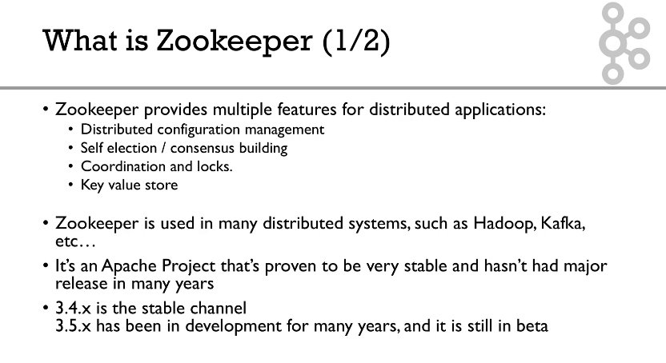
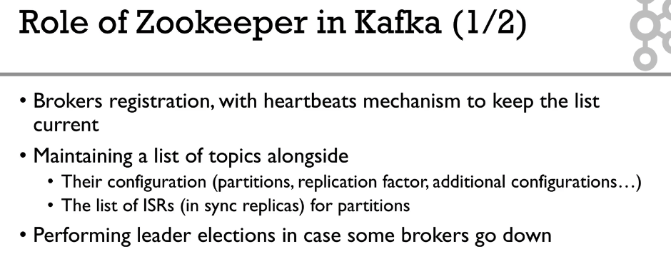
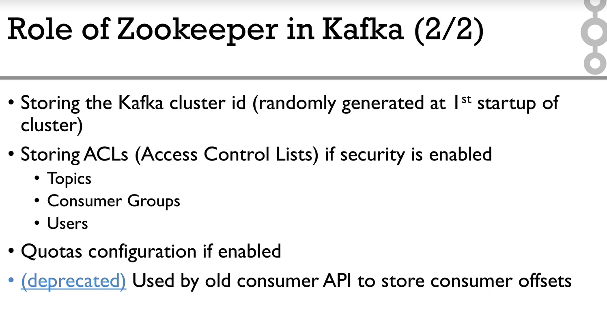
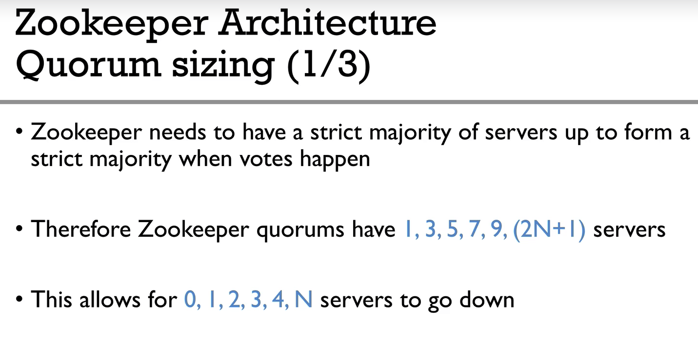
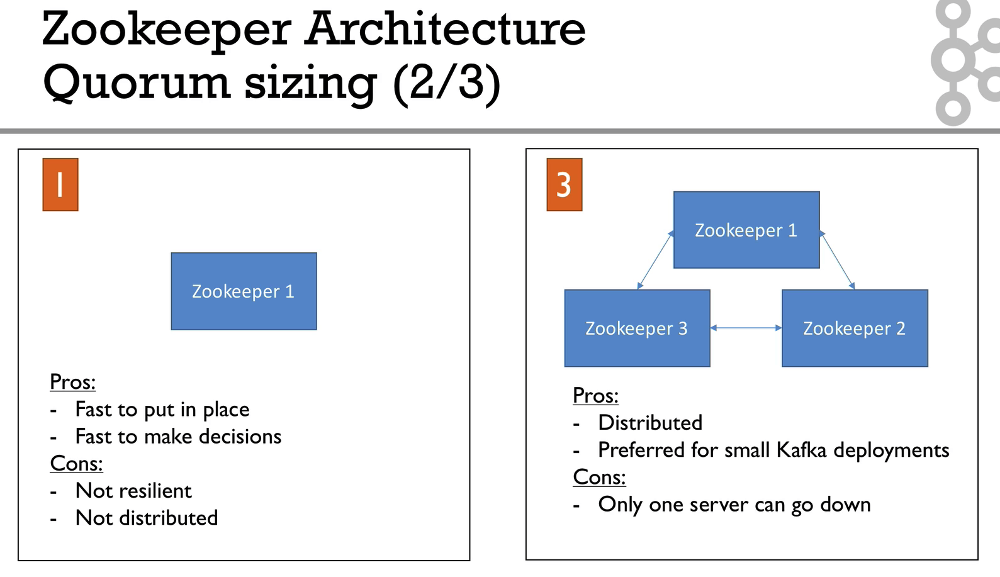
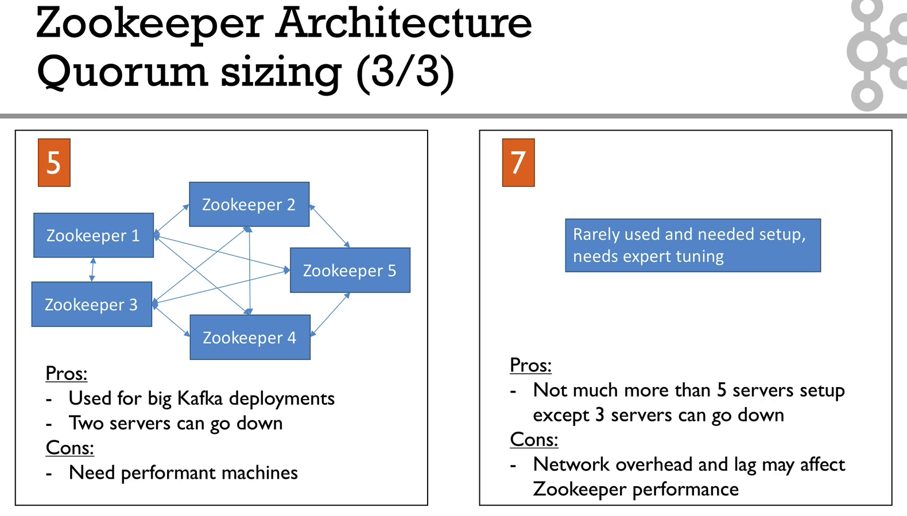

## Zookeeper 클러스터 구성

```bash
sudo mkdir -p /data/zookeeper
echo "1" > /data/zookeeper/myid
```

```properties
# the location to store the in-memory database snapshots and, unless specified otherwise, the transaction log of updates to the database.
dataDir=/data/zookeeper
# the port at which the clients will connect
clientPort=2181
# disable the per-ip limit on the number of connections since this is a non-production config
maxClientCnxns=0
# the basic time unit in milliseconds used by ZooKeeper. It is used to do heartbeats and the minimum session timeout will be twice the tickTime.
tickTime=2000
# The number of ticks that the initial synchronization phase can take
initLimit=10
# The number of ticks that can pass between
# sending a request and getting an acknowledgement
syncLimit=5
# zoo servers
server.1=zookeeper1:2888:3888
server.2=zookeeper2:2888:3888
server.3=zookeeper3:2888:3888

```


## Zookeeper 설정

`tickTime`

* 주키퍼가 사용하는 시간에 대한 단위(밀리초)

`initLimit`

* 팔로워가 리더와 초기 연결하는 시간에 대한 타임 아웃

`sysLimit`

* 팔로워가 리더와 동기화 하는 시간에 대한 타임 아웃
* 주키퍼에 저장된 데이터가 크면 수를 늘려야 한다.

`dataDir`

* 주키퍼 트랜잭션 로그와 스냅샷이 저장되는 데이터 저장 경로

`clientPort`

* 주키퍼 사용 TCP 포트

`server.x`

* 주키퍼 앙상블을 구성을 위한 서버 설정
* `server.myid` 형식
