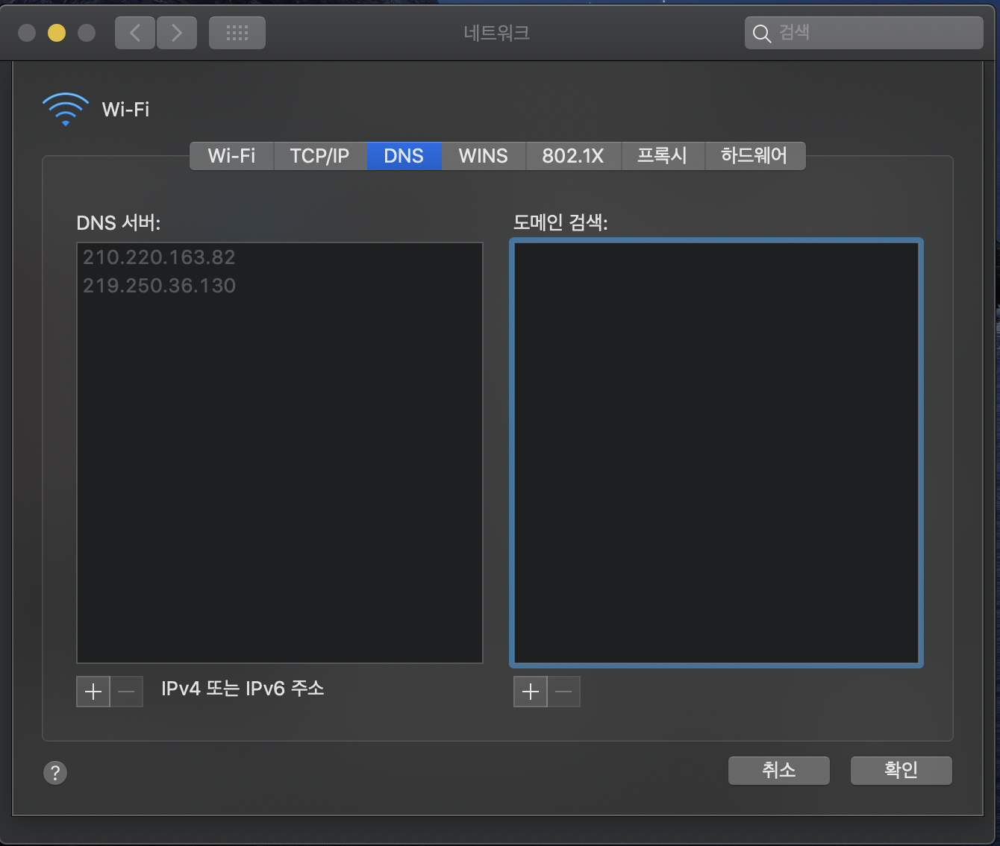

# 1 DNS(Domain Name System)

* DNS는 인터넷 전화번호부라고 할 수 있다
* 사람은 naver.com과 같은 도메인 이름을 통해 온라인으로 정보에 액세스합니다. 
* 웹 브라우저는 인터넷 프로토콜(IP) 주소를 통해 상호작용합니다.
  * 즉 통신을 위해서는 도메인을 IP 주소로 변환해야한다
* DNS는 브라우저가 인터넷 자원을 로드할 수 있도록 도메인 이름을 IP 주소로 변환해주는 역할을 한다

> #### IP 주소
>
> 컴퓨터 네트워크에서 장치들이 서로를 인식하고 통신을 하기 위해서 사용하는 특수한 번호이다. 네트워크에 연결된 장치가 라우터이든 일반 서버이든, 모든 기계는 이 특수한 번호를 가지고 있어야 한다.
>
>  [IP.md](../Protocol/IP/IP.md)(IP 주소 참고)

## 1.1 hosts 파일

* DNS 서버없이 로컬에 도메인과 IP 주소를 직접 설정해 사용할 수 있다
* 로컬에서 도메인과 IP 주소를 관리하는 파일을 hosts 파일이라고 한다
* hosts 파일에 설정된 도메인과 IP 주소는 항상 DNS 캐시에 저장된다.
* 인터넷 상용화 이전 핸드폰에 전화번호를 저장하듯 각 단말에 hosts파일을 넣어두고 도메인과 IP 주소를 직접 관리했다
* 인터넷이 상용화되어 더이상 hosts 파일로 관리할 수 없게되자 DNS가 생겨났다

> #### Host
>
> 네트워크에 연결된 장치(컴퓨터, 서버 등)들에게 부여되는 고유한 이름이다. 도메인과 유사하지만 더 넓은 의미를 가지고 있다. 인터넷에서 호스트 이름은 인터넷에 연결된 호스트(컴퓨터)의 이름으로, 보통 호스트의 지역 이름에 도메인 이름을 붙인 것이다 예를 들면, www.naver.com (웹 서버), mail.naver.com (메일 서버) 와 같이 네이버에서 사용되는 모든 호스트 이름에 naver.com이란 도메인 이름이 붙는다.

# 2 Domain

* IP 주소는 사람이 기억하기 어렵기 때문에 IP 주소에 이름을 부여할 수 있게 했는데, 이것을 도메인이라고 한다.
* 넓은 의미로는 네트워크상에서 컴퓨터를 식별하는 호스트명을 가리키며, 좁은 의미에서는 도메인 레지스트리에게서 등록된 이름을 의미합니다.
* IP 주소 대신 도메인 주소를 이용하면 서비스중인 IP 주소가 변경되더라도 도메인 주소 그대로 유지해 접속 방법 변경없이 서비스를 그대로 유지할 수 있다

**도메인 이름의 구조**

* root domain : `.`

* Top-level domain: `.com`

* Second-level domain: `example`

* Sub domain: `blog`

# 3 DNS 서버

## 3.1 DNS Server

* DNS Server 또는 Local DNS라고 불린다.
* DNS Server는 DNS 쿼리의 첫 단계며 클라이언트와 DNS 네임서버 사이의 중개자 역할을 한다
  * 쿼리: 도메인의 IP 주소를 찾는 행위

**DNS Server의 동작 과정** 

1. 웹 클라이언트로부터 DNS 쿼리를 받은 후 캐시된 데이터로 응답한다
2. 캐시된 데이터가 없는 경우 아래와 같은 동작을 거친다
3. 루트 네임서버에 DNS 쿼리
4. TLD 네임서버에 DNS 쿼리
5. 권한 있는 네임서버에 DNS 쿼리
6. 권한 있는 네임서버로부터 응답에는 도메인의 IP 주소가 있으며 응답을 클라이언트에 보냅니다.
7. 도메인과 매핑되는 IP 주소를 캐싱한다

**DNS Server 설정** 

* 대부분의 인터넷 사용자는 ISP에서 제공하는 DNS server를 사용하지만 아래와 같은 퍼블릭 DNS server를 이용하도록 설정할 수 있습니다.

>   퍼블릭 DNS server
>
>  - [Cisco OpenDNS](https://www.opendns.com/setupguide/): 208.67.222.222 and 208.67.220.220;
>- [Cloudflare 1.1.1.1](http://1.1.1.1/): 1.1.1.1 and 1.0.0.1;
>  - [Google Public DNS](https://dns.google.com/): 8.8.8.8 and 8.8.4.4; and
>- [Quad9](https://www.quad9.net/): 9.9.9.9 and 149.112.112.112.

## 3.2 루트 네임 서버

* 전 세계의 13개의 DNS 루트 네임서버가 있고 모든 DNS Server에 알려져 있다
* 루트 네임 서버는 DNS Server가 DNS 레코드를 요청하는 과정의 첫 단계다. 
* 루트 서버는 도메인 이름을 포함한 DNS Server의 쿼리를 수용하며 루트 네임서버는 해당 도메인의 확장자(.com,. net, .org, etc.)에 따라 DNS Server를 TLD 네임서버에 보내 응답한다
* 루트 네임서버는 비영리 단체인 ICANN(Internet Corporation for Assigned Names and Numbers)이 관리한다

## 3.3 TLD 네임 서버

* Top-level Domain Name Server
* TLD 네임서버는 .com, .net 또는 URL의 마지막 점 뒤에 오는 것 같은 일반적인 도메인 확장자를 공유하는 모든 도메인 이름의 정보를 유지하고 있다
* 예를 들어 TLD 네임서버는 ‘.com’으로 끝나는 모든 웹사이트의 정보를 갖고 있다.
* 사용자가 google.com을 검색하는 경우 DNS Server는 루트 네임서버로부터 응답을 받은 후 쿼리를 .com TLD 네임서버에 보내고, 해당 네임서버는 해당 도메인의 권한 있는 네임서버를 가리켜 응답합니다.

**최상위 도메인의 종류**

* 일반 최상위 도메인
  * 국가별로 고유하지 않은 도메인이다
  * 예) .com, .org, .net, .edu, .gov
* 국가 코드 최상위 도메인
  * 여기에는 국가 또는 주와 관련된 모든 도메인이 포함된다.
  *  예) .uk, .us, .ru, .jp
* TLD 네임 서버는 Registry(등록소)가 관리합니다.
  * .com, .net TLD 네임 서버는 VeriSign Global Registry Services 라는 기업이 관리한다.

## 3.4 권한 있는 네임 서버

* Authoritative Name Server
* DNS Sever가 TLD 네임서버로부터 응답을 받으면, DNS Sever는 해당 응답을 권한 있는 네임서버로 보낸다. 
* 일반적으로 권한 있는 네임서버는 IP 주소를 확인하는 마지막 단계다
* 권한 있는 네임서버는 도메인 이름에 고유한 정보(예: google.com)를 포함하며 DNS A 레코드에서 찾은 도메인의 IP 주소를 DNS Sever에 제공하거나, 도메인에 CNAME 레코드(별칭)가 있는 경우 DNS Sever에 별칭 도메인을 제공하며, 이 때 DNS Sever는 권한 있는 네임서버에서 레코드(종종 IP 주소를 포함하는 A 레코드)를 얻기 위해 완전히 새로운 DNS 조회를 수행해야 한다
* 보통 권한 있는 네임 서버를 직접 구축하지않고 Registrar(등록대행자)가 제공하는 권한 있는 네임 서버를 사용한다.
  * Registrar(등록대행자)로는 가비아가 있다

# 4 DNS 동작 과정

* `example.com` 의 IP 주소를 찾는 과정

1. 클라이언트는 도메인을 쿼리하기 전 로컬에 있는 DNS 캐시 정보에서 도메인(`example.com` )을 찾는다
   * DNS 조회를 통해 확인한 동적 DNS 캐시와 hosts파일에 저장되어 있는 정적 DNS 캐시를 확인한다
2. 도메인이 로컬 캐시에 없으면 클라이언트는 DNS Server에 도메인(`example.com` )을 쿼리한다
3. DNS Server는 `example.com` 이 로컬 캐시와 자체 설정되어 있는지 확인하고 있으면 바로 클라이언트에게 응답한다.
4. DNS Server에 `example.com`이 없다면 해당 도메인을 찾기위해 루트 네임 서버에 `.com`에 대한 TLD 정보를 가진 도메인 주소를 쿼리한다.
5. 루트 네임 서버가 .`com` 을 관리하는 TLD 네임 서버에 대한 정보를 DNS 서버에 응답한다
6. DNS 서버가 다시 `example.com` 을 TLD 네임 서버에 쿼리합니다
7. TLD 네임 서버는 `example.com`에 대한 정보를 가진 권한 있는 네임 서버에 대한 정보를 DNS 서버에 응답한다
8. DNS 서버가 다시 `example.com`을 권한 있는 네임 서버에 쿼리한다
9. 권한 있는 네임 서버는 `example.com`에 대한 정보를 DNS 서버에 응답한다
10. DNS 서버는 `example.com`에 대한 정보를 로컬 캐시에 저장하고 클라이언트에 `example.com`에 대한 정보를 응답한다
11. 클라이언트는 DNS 서버로 부터 받은 `example.com`에 대한 IP 주소 정보를 이용해 사이트에 접속한다

# 5 DNS 주요 레코드

* 도메인에는 다양한 내용을 매핑할 수 있는 레코드가 있다

## 5.1 A 레코드

* A 레코드는 도메인 주소를 IPv4주소로 변환하는 레코드다
* 클라이언트가 DNS에 질의한 도메인 주소를 A 레코드에 설정된 IP 주소로 응답한다
* 한 개의 도메인 주소와 한 개의 IP 주소가 N:M 관계를 가진다
  * 여러 도메인을 동일한 IP 주소로 매핑한 A레코드를 여러개 만든다
  * 여러 IP 주소를 동일한 도메인으로 매핑한 A레코드를 여러개 만든다

## 5.2 CNAME 레코드

* CNAME 레코드는 별칭과 도메인을 매핑해주는 레코드다

**예시**

* `www.example.com`라는 별칭으로  `example.com` 도메인을 확인하고 내부적으로 `example.com`의 IP 주소를 질의해 응답한다

| 레코드(Type)           | 값          |
| ---------------------- | ----------- |
| www.example.com(CNAME) | example.com |
| example.com(A)         | 10.10.10.10 |

**CNAME 레코드를 사용하는 이유**

* `www.example.com`과 `example.com` 도메인을 각각 A 레코드로 등록하면 IP 주소 변경 시 각각의 레코드를 수정해야한다
* CNAME 레코드를 사용해  `example.com`에 `www.example.com` 별칭을 등록하고 `example.com`도메인을 A 레코드 등록하면 IP 주소 변경 시 A 레코드의 값만 변경하면  `www.example.com` 도메인의 IP 주소도 자동으로 변경된다

관련 자료

* [생활코딩](https://www.youtube.com/watch?v=zrqivQVj3JM&list=PLuHgQVnccGMCI75J-rC8yZSVGZq3gYsFp&index=1)
* https://aws.amazon.com/ko/route53/what-is-dns/
* https://www.cloudflare.com/ko-kr/learning/dns/dns-server-types/#authoritative-nameserver