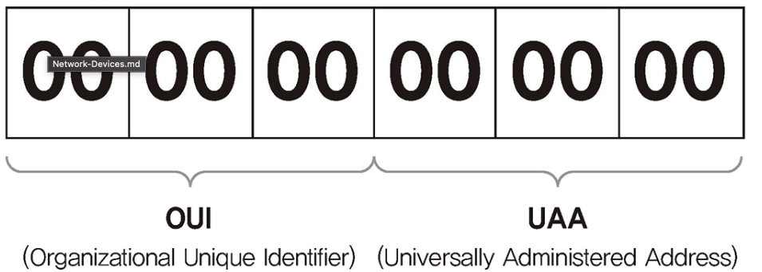

# 1 MAC 주소

* Meadia Access Control
* 네트워크 인터페이스 카드에 할당된 고유 식별자
* 네트워크에 모든 장비는 MAC 주소라는 물리적인 주소가 있어야하고 이 주소를 통해 서로 통신한다
* MAC 주소는 단말에 종속되지 않고 NIC에 종속되므로 단말이 여러개의 NIC를 가질 수 있으므로 MAC주소도 여러개 가질 수 있다

# 2 MAC 주소 체계

* 6byte의 크기를 가짐
* OUI: NIC 제조사마다 고유한 번호를 가지고 있다
* UAA: 각 제조사마다 자체적으로 할당한다

# 3 유일하지 않은 MAC 주소

* 네트워크 장비 제조업체의 실수나 의도적으로 UAA 값을 중복 할당할 수 있다
*  MAC 주소는 동일 네트워크에서만 중복되지 않으면 큰 문제가 없다
* 다른 네트워크와 통신할 때 라우터가 다른 네트워크로 넘겨줄 때 출발지와 도착지 MAC 주소를 변경하므로 기존 출발지와 도착지 주소를 유지하지 않는다