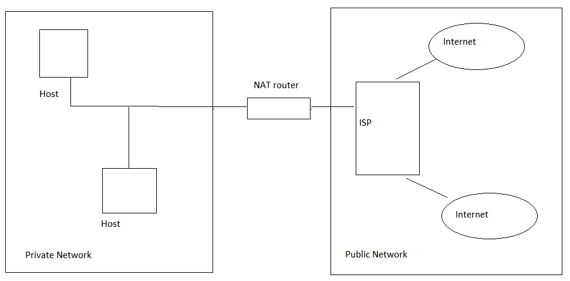
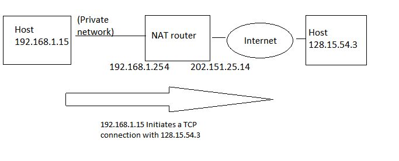
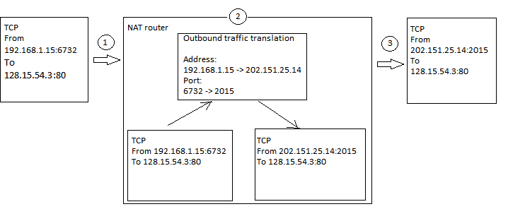
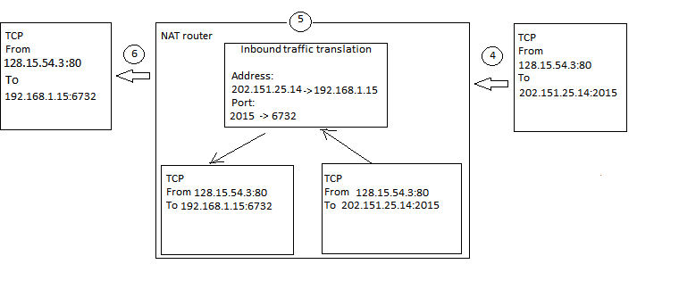

# NAT

* Network Address Translation
* NAT는 원래 제한된 수의 인터넷 IPv4 주소 문제를 해결하기 위해 개발되었다
* 여러 디바이스에서 인터넷에 액세스가 필요할 때 하나의 공인 IPv4 인터넷 주소만 ISP에 발급 받는 경우 NAT가 필요하다
* NAT 지원 라우터는 공용 네트워크와 개인 네트워크 사이에 설치된다

# NAT의 작동 방식

- NAT 지원 라우터의 역할은 사설 IPv4 주소와 할당된 공용 IPv4 주소 간에 변환이다
- 개인 네트워크의 모든 디바이스는 동일한 공용 IPv4 주소를 공유할 수 있다

**NAT 지원 라우터를 사용하는 일반적인 네트워크 설정**

- 일반적으로 NAT 지원 라우터는 두개의 네트워크 인터페이스가 있다
- 한 인터페이스는 공용 인터넷에 연결되고 다른 인터페이스는 개인 네트워크에 연결된다

- 개인 네트워크 인터페이스에서 NAT 라우터는 IP 주소 `192.168.1.254`를 사용
- 공용 네트워크 쪽의 NAT 라우터 인터페이스 IP 주소를 `202.151.25.14`를 사용

- 클라이언트에서 TCP SYN 메시지를 웹 서버로 보낸다 
  - 발신자 주소는 `192.168.1.15`이고 포트 번호는 `6732`다
  - 대상 주소는 `128.15.54.3`이고 포트 번호는 `80`다
- 클라이언트의 패킷은 NAT 라우터에 의해 개인 네트워크 인터페이스에서 수신된다
  - 아웃바운드 트래픽 규칙이 패킷에 적용된다.
  - 즉, 발신자(클라이언트)의 주소는 NAT 라우터의 공용 IP 주소 `202.15.25.14`로 변환되고 발신자(클라이언트) 원본 포트 번호는 공용 인터페이스의 TCP 포트 번호 `2015`로 변환됩니다.
  - 이때 포트 번호는 각기 다르게 할당하여 호스트를 구분한다.
- 그러면 패킷이 인터넷을 통해 전송되고 궁극적으로 대상 호스트인 128.15.54.3에 도달한다
  - 수신 쪽에서는 IP 계층 원본 주소와 TCP 계층 포트 번호를 기반으로, 패킷이 `202.151.24.14`, 포트 번호 `2015`에서 시작된 것으로 나타난다

- 인터넷 호스트 128.15.54.3은 NAT 라우터의 인터넷 주소를 대상으로 하는 응답 패킷을 보낸다
- 패킷이 NAT 라우터에 도달합니다. 
  - 인바운드 패킷이므로 바인딩된 변환 규칙이 적용된다 
  - 대상 주소가 원래 발신자(클라이언트)의 IP 주소(`192.168.1.15`, 대상 포트 번호 `6732`)로 다시 변경된다
- 패킷이 내부 네트워크에 연결된 인터페이스를 통해 클라이언트에 전달된다