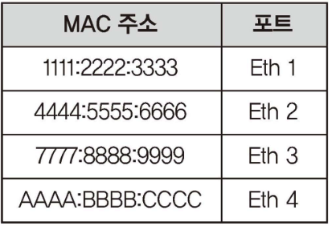

# 1 Network Device

# 2 L1: Physical layer 장비

* Physical layer 장비는 들어온 전기 신호를 그대로 잘 전달하는 것이 목적이다
* 따라서 전기 신호가 들어오면 이 전기 신호를 재생성해서 내보낸다
* Physical layer에는 주소 개념이 없으므로 전기 신호가 들어온 포트를 제외하고 모든 포트에 같은 전기 신호를 보낸다

## 2.1 허브

* 허브는 거리가 멀어질수록 줄어드는 전기 신호를 재생성해준다
* 허브는 다순히 들어온 신호를 모든 포트로 내보내 네트워크에 접속된 모든 단말이 경쟁하게 되므로 전체 네트워크 성능이 줄어드는 문제가 있다
* 패킷이 무한 순환해 네트워크 전체를 마비시키는 루프와 같은 다양한 장애 원인이 되어 현재 거의 사용되지 않는다

## 2.2 리피터

* 네트워크 통신을 중재하는 장비

# 3 L2: Data link layer 장비

* Data link layer에서 동작하는 장비는 모두 MAC 주소를 이해할 수 있다

## 3.1 네트워크 인터페이스 카드(NIC)

* LAN Card, Network Adapter라고도 불린다
* 컴퓨터를 네트워크에 연결하기 위한 하드웨어 장치
* NIC는 고유한 MAC 주소를 가지고 있다

**기능**

* 직렬화 
  * 전기적 신호를 데이터 신호 형태로 또는 데이터 신호 형태를 전기적 신호 형태로 변환한다
* MAC 주소 
  * NIC는 고유한 MAC 주소를 가지고 있다
* 흐름제어
  * 패킷기반 네트워크는 다양한 통신이 하나의 채널을 이용해 이미 통신 중이라면 새로운 데이터를 받지 못할 수 있다
  * 이런 현상으로 인한 데이터 유실을 방지하기 위해 데이터를 받지 못할 떄는 상대방에게 통신 중지를 요청한다

**NIC 동작방식**

1. 전기 신호를 데이터 형태로 만든다
2. 목적지 MAC 주소와 출발지 MAC 주소를 확인한다
3. 네트워크 인터페이스의 MAC 주소를 확인한다
4. 주소가 일치하면 데이터를 처리하고 다르면 데이터를 폐기한다
   * 일치한 경우 데이터를 상위 계층에서 처리할 수 있도록 메모리에 적재한다

## 3.2 스위치

* 스위치에 들어온 프레임의 MAC 주소를 보고 통신해야할 포트로 지정해 데이터를 보내는 기능을 담당
* MAC 주소와 포트를 매핑한 MAC 주소 테이블을 가지고 있다
* 스위치는 아무 설정없이 네트워크에 연결해도 MAC 주소를 기반으로 패킷을 전달하는 기본 동작을 수행한다

**MAC 주소 테이블**

* MAC 주소와 스위치의 인터페이스 정보가 매핑되어 있다
* 스위치는 프레임 헤더의 목적지 MAC 주소를 확인하고 해당 주소가 어떤 포트에 연결되어 있는지 MAC 주소 테이블을 확인하여 프레임을 그 포트로만 전송한다
* 만약 MAC 주소 테이블에서 MAC 주소를 찾지 못한다면 스위치는 전체 포트로 프레임을 전송한다

**스위치 동작 방식**

1. 플러딩
2. 어드레스 러닝
3. 포워딩/필터링

**플러딩**

* 스위치는 부팅하면 네트워크 관련 정보가 없는 상태
* 이때 스위치는 허브처럼 동작해 들어올 프레임을 들어온 포트를 제외한 모든 포트로 전달한다
* 스위치가 허브같이 모든 포트로 프레임을 흘리는 동작 방식을 플러딩이라고 한다

**어드레스 러닝**

* MAC 주소 테이블을 만들고 유지하는 과정을 어드레스 러닝이라고 한다
* 스위치 특정 포트에 프레임이 들어오면 출발지 MAC 주소와 해당 포트를 MAC 주소 테이블에 기록한다

**포워딩/필터링**

* 포워딩이란 프레임이 스위치에 들어오면 목적지 MAC 주소를 MAC 주소 테이블에서 조회에 매칭되는 포트로 프레임을 전송한다
* 이를 포워딩이라고 한다. 이때 다른 포트로는 해당 프레임을 보내지 않으므로 이 동작을 필터링이라고 한다

## 3.3 브릿지

# 4 L3: Network layer 장비

* Network layer에서 동작하는 장비는 모두 IP 주소를 이해할 수 있다

**게이트웨이**

* 초기 네트워크는 모든 단말이 하나의 네트워크에 존재하는 로컬 네트워크(LAN)를 고려해서 설계되었다
* 인터넷 기술의 발달로 LAN 네트워크들이 하나의 큰 네트워크로 묶이면서 먼 거리에 있는 LAN 간의 통신이 중요해졌다
* 로컬 네트워크가 아닌 리모트 네트워크와의 통신에 사용되는 장비를 게이트웨이라고 부르고 라우터와 L3 스위치가 이 역할을 수행한다

## 4.1 라우터

* 패킷의 IP 주소를 이용해 최적의 경로를 찾아주고 해당 경로로 패킷을 전송하는 역할을 담당
* 일반인이 라우터 장비를 접하긴 어려우나 유사한 역할을 하는 L3 스위치와 공유기는 쉽게 볼 수 있다
* 라우터는 브로드캐스트 패킷을 전달하지 않는다

**라우팅 테이블**

* 라우터는 다양한 경로 정보를 수집해 최적의 경로를 라우팅 테이블에 기록한다
* 멀티캐스트 정보를 습득하지 않는다
* 라우팅 테이블에는 다음과 같은 정보를 저장한다
  * 목적지 주소
  * 넥스트 홉 IP 주소, 나가는 로컬 인터페이스(선택 가능)

**경로지정**

* 패킷이 라우터로 들어오면 도착지 IP 주소를 라우팅 테이블과 비교해 최선의 경로로 패킷을 포워딩한다
* 라우터는 단말부터 목적지까지의 경로를 모두 책임지는 것이 아니라 인접한 라우터까지만 경로를 지정하면 인접 라우터에서 최적의 경로를 다시 파악해 패킷을 포워딩한다
* 이 기법을 홉 바이 홉 라우팅이라고 부르고 인접한 라우터를 넥스트 홉이라고 한다
* 따라서 라우터는 패킷이 목적지로 가는 전체 경로를 파악하는 것이 아니라 최적의 넥스트 홉을 선택해 전송한다 

**브로드캐스트 컨트롤**

* 스위치와 반대로 도작치 IP 주소가 라우팅 테이블에 없으면 패킷을 버린다

**프로토콜 변환**

* 라우터는 패킷 포워딩 과정에서 기존 2계층 헤더 정보를 제거한 후 새로운 2계층 헤더를 만든다

## 4.2 L3 스위치

* 스위치는 대표적인 2계층 장비이지만 라우터처럼 3계층에서 동작하는 L3 스위치라고 불리는 장비가 사용되고 있다
* 라우터와 L3 스위치는 구분하기 어려우면 라우터와 동일하다고 생각하면 된다

# 5 L4: Transport layer 장비

## 5.1 로드 밸런서

* 서버나 장비의 부하를 분산하기 위해 사용하는 장비를 로드 밸런서라고 부른다
* 4 계층에 대한 정보로만 분산을 처리하는 경우 L4 로드 밸런싱이라고 한다

## 5.2 방화벽

* 방화벽은 네트워크 중산에 위치해 해당 장비를 통과하는 트래픽을 사전에 주어진 종책 조건에 맞추어 허용하거나 차단하는 장비
* 방화벽은 일반적으로 네트워크 3, 4계층에서 동작하고 세션을 인지하고 관리하는SPI(Stateful Packet Inspection) 엔진을 기반으로 동작하는 장비를 일컫는다
* NAT처럼 세션 정보를 장비 내부에 저장한다
  * 패킷이 외부로 나갈 때 세션 정보를 저장하고 패킷이 들어올 때는 저장했던 세션 정보를 참조해 외부에서 처음 시작된 것인지 내부 사용자의 요청한 응답인지 판단한다

## 5.3 NAT(Network Address Translation)

* [NAT.md](../NAT/NAT.md) 참고

> #### 포트포워딩
>
> * 특정 포트로 들어온 요청을 다른 특정 IP의 특정 포트로 전달한다.
> * 포트 포워딩은 원격 컴퓨터가 근거리 통신망(LAN) 내에 위치한 특정 컴퓨터나 서비스에 연결할 수 있게 한다.
>
> 포트 포워딩(port forwarding) 또는 포트 매핑(port mapping)은 컴퓨터 네트워크에서 패킷이 라우터나 방화벽과 같은 네트워크 게이트웨이를 가로지르는 동안 하나의 IP 주소와 포트 번호 결합의 통신 요청을 다른 곳으로 넘겨주는 네트워크 주소 변환(NAT)의 응용이다. 이 기법은 게이트웨이(외부망)의 반대쪽에 위치한 보호/내부망에 상주하는 호스트에 대한 서비스를 생성하기 위해 흔히 사용되며, 통신하는 목적지 IP 주소와 포트 번호를 내부 호스트에 다시 매핑함으로써 이루어진다.

# 6 L7: Application layer 장비

## 6.1 ADC(Application Delivery Controller)

* 애플리케이션 프로토콜의 특징을 이해하고 동작하는 로드 밸런서를 ADC라고 부른다
* L7 로드 밸런싱이라고도 불린다
* HTTP, FTP, SMTP와 같은 애플리케이션 프로토콜 정보를 기반으로 로드 밸런싱을 수행한다
* HTTP 헤더 정보가  URI와 같은 정보를 기반으로 부하를 분산할 수 있다

# 7 etc

## 7.1 공유기

* 공유기는 스위치, 라우터, NAT, 방화벽 기능을 한곳에 모아놓은 장비

## 7.2 모뎀

* 짧은 거리를 통신하는 기술과 먼 거리를 통신할 수 있는 기술이 달라 이 기술들을 변환해주는 장비
* 공유기의 LAN, WAN 포트는 모두 일반 이더넷이라 100m 이상 먼 거리로 데이터롤 보내지 못하므로 모뎀이 추가적으로 필요하다