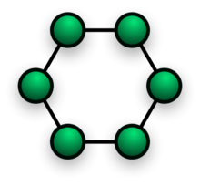

# 1 Network Topology

* 네트워크를 구성하는 노드들의 연결 형태에 따라 네트워크를 구분할 수 있다
* 노드와 노드를 어떻게 연결하는지에 따라 throughput과 reliability에 많은 영향을 미친다
  * reliability: 예를 들면 버스나 스타 네트워크는 단일 노드가 고장 난다면 네트워크 전체가 정상작동하지 못한다
* 일반적으로 상호 연결이 많을수록 네트워크는 더 강건해지지만 설치 비용이 더 많이 든다.
* 따라서 상황에 맞는 적합한 Network topology를 선택해 적용해야 한다

**여러 종류의 Network Topology **

# 2 Bus Network

* 모든 노드가 공통 half-duplex link(Bus)에 연결된 네트워크
* 원래의 이더넷에서 사용된 레이아웃이었다.
* data link layer에서 흔히 사용되는 토폴로지

**장점**

* 간선과 각 단말 장치와의 접속은 간단한 접속장치를 붙이는 것으로 가능
* 통신 부하/비용 대부분이 단말 장치측으로 분산됨
* 소규모에서 대규모까지의 시스템을 비교적 경제적으로 구성 가능
* 특정 노드의 장애가 다른 노드에 영향을 주지 않는다

**단점**

* 장애 발생 시 위치 추적이 어렵다
* 공통 링크의 대역폭을 공유해 노드 수가 증가하면 네트워크 성능이 저하된다
* 주 선로에 고장이 나면 네트워크 전체에 영향을 줌

> 참고
>
> * https://en.wikipedia.org/wiki/Bus_network

# 3 Star Network

* 모든 노드가 중앙 노드에 연결된 형태
* 중앙 노드로 허브, 스위치, 라우터 같은 장비가 배치된다
* switched Ethernet LAN에서 주로 찾아 볼수 있는 토폴로지
  * 집에서 사용하는 공유기가 중앙 노드라고 생각하면 된다

**장점**

* 특정 링크에 문제가 있을 경우에 해당 장비만 영향을 받고 네트워크의 나머지 부분은 정상적으로 작동한다
* 장애 발견이 쉽다

**단점**

* 구축 비용 면에서 Bus Network보다 더 비싸다
* 중앙 노드의 고장이 전체 네트워크에 영향을 미친다

> 참고
>
> * https://en.wikipedia.org/wiki/Star_network

# 4 Ring Network

* 노드는 양 옆의 두 노드와 연결하여 전체적으로 고리와 같이 하나의 연속된 길을 통해 통신을 하는 망 구성 방식이다.
* 각 링크가 단방향이어서 데이타는 한 방향으로만 전송
* 각 노드는 데이타의 송수신을 제어하는 엑세스 제어논리(토큰)을 보유

**장점**

* 모든 장치들이 토큰에 접근할 수 있으며 전송할 수 있는 기회를 갖게 되는 매우 순차적인 네트워크.
* 네트워크의 부하가 심한 경우에 버스 토폴로지보다 성능이 우수함.
* 컴퓨터간의 연결을 관리하기 위한 네트워크 서버가 불필요.

**단점**

* 어떤 두 노드간에 오직 하나의 길을 제공하기 때문에 링 네트워크는 단 하나의 연결 오류만으로도 전체의 연결이 끊기게 된다
* 장치들을 옮길 때나 추가, 변경시 네트워크에 영향을 끼침.
* 노드의 고장이나 케이블의 끊김은 링에 연결된 모든 노드들을 고립시킨다
* 일반적인 부하 환경에서는 이더넷 망보다 느림.

# 5 Tree Network

# 6 Mesh Network

* 각각의 노드가 서로 그물처럼 연결된 형태
* 비록 회선의 효율성이 낮고 비경제적이나, 안전성은 매우 높은 구조

> 참고
>
> * https://en.wikipedia.org/wiki/Mesh_networking