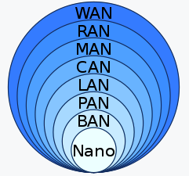

# 1 네트워크 분류(지리학적 규모)

* 지리학적 규모를 기준으로 위 그림과 같이 네트워크를 구분할 수 있다
* LAN, WAN을 주로 사용한다

# 2 LAN(Local Area Network)

* 제한된 구역의 컴퓨터와 기타 장치를 연결한 네트워크다
* 주로 집, 학교, 오피스 빌딩, 가까이 위치한 빌딩들을 단위로 구역을 지정한다
* 이더넷과 와이파이가 LAN을 위해 만들기 위해 많이 사용되는 기술이다
* LAN은 라우터를 통해서 WAN과 연결될 수 있다

>  참고
>
> * https://en.wikipedia.org/wiki/Local_area_network

# 3 WAN(Wide Area Network)

* 넓은 구역의 컴퓨터와 기타 장치를 연결한 네트워크다
* 구역의 크기는 도시, 국가, 여러 국가들 걸쳐있다

> 참고
>
> * https://en.wikipedia.org/wiki/Wide_area_network

