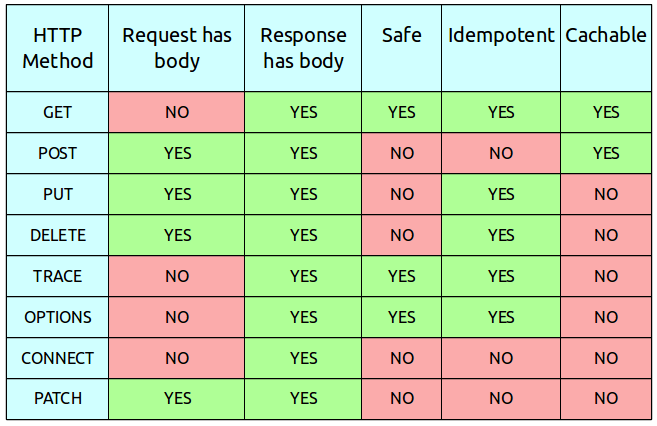

# OSI model

> OSI 모형(Open Systems Interconnection Reference Model)은 국제표준화기구(ISO)에서 개발한 모델로, 컴퓨터 네트워크 프로토콜 디자인과 통신을 계층으로 나누어 설명한 것이다. 일반적으로 OSI 7 계층 모형이라고 한다. 이 모델은 프로토콜을 기능별로 나눈 것이다. 각 계층은 하위 계층의 기능만을 이용하고, 상위 계층에게 기능을 제공한다. '프로토콜 스택' 혹은 '스택'은 이러한 계층들로 구성되는 프로토콜 시스템이 구현된 시스템을 가리키는데, 프로토콜 스택은 하드웨어나 소프트웨어 혹은 둘의 혼합으로 구현될 수 있다. 일반적으로 하위 계층들은 하드웨어로, 상위 계층들은 소프트웨어로 구현된다.

## 1 물리계층(Physical Layer)

* 네트워크의 기본 네트워크 하드웨어 전송 기술을 이룬다. 
* 네트워크의 높은 수준의 기능의 논리 데이터 구조를 기초로 하는 필수 계층이다.
*  다양한 특징의 하드웨어 기술이 접목되어 있기에 OSI 아키텍처에서 가장 복잡한 계층으로 간주된다.
*  리피터나 허브가 이 계층에서 작동한다.

___

## 2 데이터링크 계층(Data-Link Layer)

* 포인트 투 포인트(Point to Point) 간 신뢰성있는 전송을 보장하기 위한 계층으로 CRC 기반의 오류 제어와 흐름 제어가 필요하다. 
* 네트워크 위의 개체들 간 데이터를 전달하고, 물리 계층에서 발생할 수 있는 오류를 찾아 내고, 수정하는 데 필요한 기능적, 절차적 수단을 제공한다.
* 주소 값은 물리적으로 할당 받는데, 이는 네트워크 카드가 만들어질 때부터 **맥 주소(MAC address)**가 정해져 있다는 뜻이다.
* 네트워크 **브릿지**나 **스위치** 등이 이 계층에서 동작한다.
* Ethernet, HDLC, ADCCP

### Ethernet

* OSI 모델의 물리 계층에서 신호와 배선, 데이터 링크 계층에서 MAC(media access control) 패킷과 프로토콜의 형식을 정의한다. 

___

## 3 네트워크 계층(Network Layer)

* 네트워크 계층(Network layer)은 여러개의 노드를 거칠때마다 경로를 찾아주는 역할을 하는 계층이다.
* 라우팅, 흐름 제어, 세그멘테이션(segmentation/desegmentation), 오류 제어, 인터네트워킹(Internetworking) 등을 수행한다. 
* **라우터** 와 L3 Switch가 계층에서 동작한다.
* IP, ICMP, IPsec, ARP, RIP, BGP

### IP   

* 인터넷 프로토콜(IP, Internet Protocol)
* 송신 호스트와 수신 호스트가 패킷 교환 네트워크(패킷 스위칭 네트워크, Packet Switching Network)에서 정보를 주고받는 데 사용하는 정보 위주의 규약(프로토콜, Protocol)이다 
* 호스트의 주소지정과 패킷 분할 및 조립 기능을 담당한다.
* 비신뢰성(unreliability)과 비연결성(connectionlessness)
* 비신뢰성은 흐름에 관여하지 않기 때문에 보낸 정보가 제대로 갔는지 보장하지 않는다는 뜻이다.
* 패킷 전송과 정확한 순서를 보장하려면 TCP 프로토콜과 같은 IP의 상위 프로토콜을 이용해야 한다.

### ARP

* 주소 결정 프로토콜(Address Resolution Protocol, ARP)은 네트워크 상에서 IP 주소를 물리적 네트워크 주소로 대응(bind)시키기 위해 사용되는 프로토콜이다.
* 물리적 네트워크 주소는 이더넷 또는 토큰링의 48 비트 네트워크 카드 주소를 뜻한다.

1. IP 호스트 A가 IP 호스트 B에게 IP 패킷을 전송하려고 할 때 IP 호스트 B의 물리적 네트워크 주소를 모른다면
2. ARP 프로토콜을 사용하여 목적지 IP 주소 B와 브로드캐스팅 물리적 네트워크 주소 FFFFFFFFFFFF를 가지는 ARP 패킷을 네트워크 상에 전송한다.
3. IP 호스트 B는 자신의 IP 주소가 목적지에 있는 ARP 패킷을 수신하면 자신의 물리적 네트워크 주소를 A에게 응답한다.
4. 이와 같은 방식으로 수집된 IP 주소와 이에 해당하는 물리적 네트워크 주소 정보는 각 IP 호스트의 ARP 캐시라 불리는 메모리에 테이블 형태로 저장된 다음, 패킷을 전송할 때에 다시 사용된다. 

### ICMP

* ICMP(Internet Control Message Protocol, 인터넷 제어 메시지 프로토콜)는 인터넷 프로토콜 스위트에 기록된 주요 프로토콜 가운데 하나이다. 
* 네트워크 컴퓨터 위에서 돌아가는 운영체제에서 오류 메시지(Requested service is not available 등)를 전송받는 데 주로 쓰이며 인터넷 프로토콜의 주요 구성원 중 하나로 인터넷 프로토콜에 의존하여 작업을 수행한다.

___

## 4 전송 계층(Transport Layer)

* 양 끝단(End to end)의 사용자들이 신뢰성있는 데이터를 주고 받을 수 있도록 해 주어, 상위 계층들이 데이터 전달의 유효성이나 효율성을 생각하지 않도록 해준다. 
* TCP, UDP, RTP, SCTP

### TCP

### UDP

___

## 5 세션 계층(Session Layer)

* 세션 계층(Session layer)은 양 끝단의 응용 프로세스가 통신을 관리하기 위한 방법을 제공한다.
* TCP/IP 세션을 만들고 없애는 책임을 진다.

___

## 6 표현 계층(Presentation Layer)

* 표현 계층(Presentation layer)은 코드 간의 번역을 담당하여 사용자 시스템에서 데이터의 형식상 차이를 다루는 부담을 응용 계층으로부터 덜어 준다.

___

## 7 응용 계층(Application Layer)

* 응용 계층(Application layer)은 응용 프로세스와 직접 관계하여 일반적인 응용 서비스를 수행한다.
* HTTP, SMTP, SNMP, FTP, NFS, NTP, DHCP

### HTTP

* HTTP는 HTML 문서와 같은 리소스들을 가져올 수 있도록 해주는 프로토콜이다.
* 신뢰 가능한 전송 프로토콜이라면 이론상으로는 무엇이든 사용할 수 있으나 TCP 혹은 암호화된 TCP 연결인 TLS를 통해 전송된다.
* HTTP Request Method
  * 

#### HTTP 상태 코드

* ## 정보 응답

* ## 성공 응답

  * `200 OK`
    * 요청이 성공적으로 되었습니다. 성공의 의미는 HTTP 메소드에 따라 달라집니다:
    * `GET`: 리소스를 불러와서 메시지 바디에 전송되었습니다.
    * `HEAD`: 개체 해더가 메시지 바디에 있습니다.
    * `PUT` 또는 `POST`: 수행 결과에 대한 리소스가 메시지 바디에 전송되었습니다.
    * `TRACE`: 메시지 바디는 서버에서 수신한 요청 메시지를 포함하고 있습니다.
  * `201 Created`
    * 요청이 성공적이었으며 그 결과로 새로운 리소스가 생성되었습니다. 이 응답은 일반적으로 `POST`요청 또는 일부` PUT` 요청 이후에 따라옵니다.

* ## 리다이렉션 메시지

* ## 클라이언트 에러 응답

  * `400 Bad Request`
    * 이 응답은 잘못된 문법으로 인하여 서버가 요청을 이해할 수 없음을 의미합니다.
  * `401 Unauthorized`
    * 비록 HTTP 표준에서는 "미승인(unauthorized)"를 명확히 하고 있지만, 의미상 이 응답은 "비인증(unauthenticated)"을 의미합니다. 클라이언트는 요청한 응답을 받기 위해서는 반드시 스스로를 인증해야 합니다.
  * `403 Forbidden`
    * 클라이언트는 콘텐츠에 접근할 권리를 가지고 있지 않습니다. 예를들어 그들은 미승인이어서 서버는 거절을 위한 적절한 응답을 보냅니다. 401과 다른 점은 서버가 클라이언트가 누구인지 알고 있습니다.
  * `404 Not Found`
    * 서버는 요청받은 리소스를 찾을 수 없습니다. 브라우저에서는 알려지지 않은 URL을 의미합니다. 

* ## 서버 에러 응답

  * `500 Internal Server Error` 
    * 서버가 처리 방법을 모르는 상황이 발생했습니다. 서버는 아직 처리 방법을 알 수 없습니다.

  

