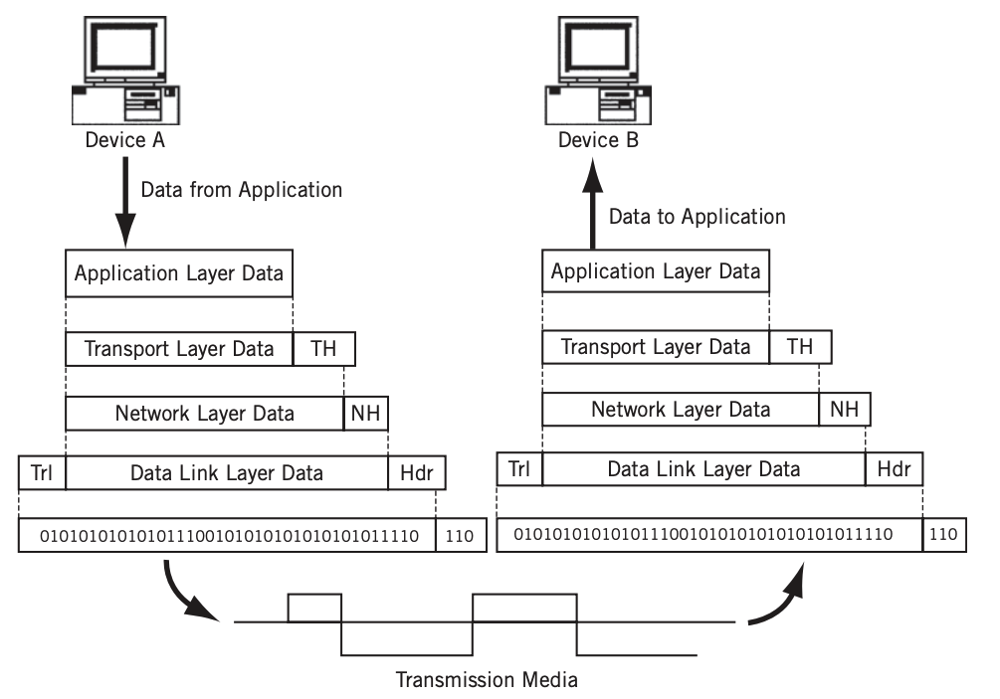

# 1 OSI Model

* 복잡한 데이터 전송 과정을 OSI 7 계층으로 나누어 보면 이해가 쉽다
* 계층별로 표준화된 프로토콜 템플릿을 통해 계층별로 프로토콜 개발이 가능함(모듈화)
* OSI Model은 참조형 모델이고 실제로 사용하는 프로토콜은 TCP-IP 프로토콜 스택으로 구현되어 있다

## 1.1 Encapsulation

* 각 계층은 상위 계층의 페이로드에 헤더를 추가해서 하위 계층으로 전달한다
* 헤더에 포함되는 가장 중요한 두 가지 정보
  * 각 계층에서 정의하는 정보
  * **상위 프로토콜 지시자 정보**
  * Decapsulation 과정에서 헤더에 상위 프로토콜 지시자 정보가 없으면 페이로드를 어떻게 해석해야 되는지 모르기 때문

**Encapsulation**

* 각 계층은 상위 계층의 페이로드에 헤더를 추가하며 Encapsulation한다
* 수신자인 Device B에서는 하위 계층이 Decapsulation을 통해 페이로드를 추출하고 이를 상위 계층으로 전달한다

# 2 Layer7: Application layer

* 애플리케이션 프로세스를 정의하고 

## 2.1 프로토콜

* HTTP, SMTP, IMAP, POP, SNMP, FTP, TELNET, SSH

# 3 Layer6: Presentation layer

* 표현 방식이 다른 애플리케이션이나 시스템 간의 통신을 돕기위해 하나의 통일된 구문 형식으로 변환하는 기능을 수행한다

## 3.1 프로토콜

* SMB, AFP, XDR

# 4 Layer5: Session layer

* 양 끝단의 응용 프로세스가 연결을 성립하도록 도와주고 연결이 안정적으로 유지되도록 관리하고 작업 완료 후에는 연결을 끊는 역할

## 4.1 프로토콜

* NetBIOS

# 5 Layer4: Transport layer

* 송신자의 프로세스와 수신자의 프로세스를 연결하는 통신 서비스를 제공한다
* 하위 계층은 목적지를 정확히 찾아가기 위한 주소 제공이 목적이였지만 Transport layer는 목적지 단말의 여러 프로세스 중 통신해야할 목적지 프로세스를 정확히 찾아가고 패킷 순서가 바뀌지 않도록 조합해 원래 데이터를 만들어내는 역할을 한다

## 5.1 프로토콜

* TCP, UDP, SPX

## 5.2 주소체계

* 특정 프로세스와 특정 프로세스가 통신하기 위해서는 포트 번호가 필요하다
* 하나의 포트는 하나의 프로세스에 할당되고 하나의 프로세스는 여러 개의 포트 번호를 사용할 수 있다
* [Port-Numbers.md](../Port-Numbers/Port-Numbers.md) 참고

## 5.3 장비

* 로드 밸런서, 방화벽
* [Network-Devices.md](../Network-Devices/Network-Devices.md) 참조

# 6 Layer3: Network layer

* 네트워크 계층은 출발지 호스트에서 패킷을 하나 이상의 네트워크를 거쳐 목적지 호스트에 전송하는 기능을 한다 

## 6.1 프로토콜

* IP, ARP, ICMP

## 6.2 주소체계

* 3계층에서 사용하는 주소체계는 IP 주소이다
* [IP.md](../Protocol/IP/IP.md) 참고

## 6.3 장비

* 라우터
* [Network-Devices.md](../Network-Devices/Network-Devices.md) 참조

# 7 Layer2: Data link layer

* Physical Layer에서 발생한 오류를 감지하고 정정하는 기능을 한다
* 과거에는 신뢰할 수 없는 매체를 이용해 통신하는 경우가 많아 에러를 탐지하고 정정하는 기능을 했다
* 현재 이더넷 기반 네트워크의 2계층은 에러를 탐지하는 역할만 수행한다
* 무작정 데이터를 보내는 것이 아니라 받는 사람이 현재 데이터를 받을 수 있는 상황인지 확인 후에 데이터를 보낸다(
  * 이를 Flow Control이라고 한다

## 7.1 프로토콜

* Ethernet, PPP(Point-to-Point Protocol)

## 7.2 주소체계

* 2계층에서 사용하는 주소 체계는 MAC 주소다
* [MAC-Address.md](../MAC-Address/MAC-Address.md) 참고

## 7.3 장비

* 네트워크 인터페이스 카드, 스위치
* [Network-Devices.md](../Network-Devices/Network-Devices.md) 참조

# 8 Layer1: Physical layer

* 물리적 연결과 관련된 정보를 정의한다
* 주로 전기 신호를 전달하는 기능을 담당

## 8.1 주소체계

* Physical layer에는 주소 개념이 없다

## 8.2 장비

* 허브, 리피터
* [Network-Devices.md](../Network-Devices/Network-Devices.md) 참조
