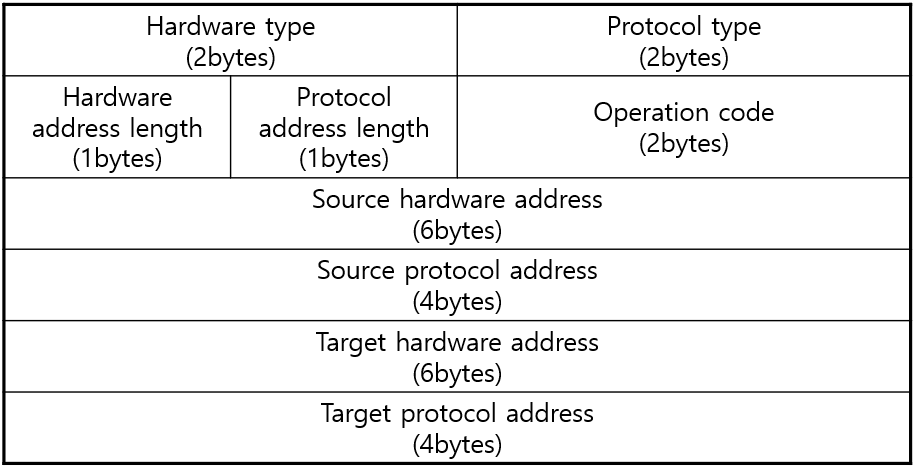

# 1 ARP

* ARP는 LAN의 다른 호스트와 통신하기 위해 필요한 MAC 주소를 찾는 기능을 한다
  * MAC 주소를 찾을 때 IP 주소를 사용한다
* OSI 모델의 3계층 Network layer에 속하는 프로토콜


**ARP 캐시 테이블**

* 발신자는 IP 주소와 MAC 주소를 매핑한 테이블인 ARP 캐시 테이블을 가지고 있다
* 따라서 IP에 대응되는 MAC 주소가 캐싱되어 있다면 이를 이용해 통신에 사용한다
* 캐싱되어 있지 않다면 ARP를 통해 MAC 주소를 찾고 이를 ARP 캐시 테이블에 저장한다
* ARP 테이블의 타임아웃 시간은 20분으로 규정되어 있다


# 2 ARP 패킷 구조



**Hardware Type**

* 하드웨어 주소의 유형을 나타낸다
* 이더넷은 `1`로 설정된다

**Protocol Type**

* 매핑 대상인 프로토콜 주소의 유형을 나타낸다
* IPv4의 경우  `0x0800`으로 설정된다

**Hardware Address Length**

* 하드웨어 주소의 길이를 byte로 나타낸다
* 이더넷의 경우 MAC 주소가 6바이트기 때문에 `6`으로 설정된다

**Protocol Address Length**

* 프로토콜 주소의 길이를 나타낸다
* IPv4의 경우 `4`로 설정된다

**Operation Code**

* 해당 ARP 패킷이 요청인지 응답인지 구분
* `1` : ARP Request
* `2` : ARP Reply

**Source HardWare Address**

* 발신자 MAC 주소

**Source Protocol Address**

* 발신자 IP 주소

**Target HardWare Address**

* 수신자 MAC 주소
* ARP Request의 경우 수신자의 MAC 주소를 모르기 때문에 `0`으로 설정된다
  * 이더넷 헤더에서 Destination의 주소를 브로드캐스팅으로 설정해서 수신자 까지 전달된다

**Target Protocol Address**

* 수신자 IP 주소


# 3 ARP 동작 과정

1. ARP 요청

   * 만일 이전에 전혀 통신한 경험이 없는 LAN(서브네트워크)의 라우터에 외부로부터 데이터 패킷이 전달되어 목적지 호스트를 찾을때
   * 라우터가 최초로 하는 일은 ARP Request packet(ARP 요청 패킷)을 LAN의 전체 노드에 송출함 (브로드캐스트)
   * APP 요청 메세지에는 송신자 자신의 MAC 주소 및 IP 주소, 목적지 IP 주소를 채우고 목적지의 MAC 주소는 0으로 채워넣음

2. ARP 응답

   * ARP 요청 패킷에 포함된 목적지 IP 주소와 일치하는 Host가 응답을 한다.
   * 자신의 IP 주소 및 물리주소 를 채워놓은 ARP Reply packet(ARP 응답패킷)을 해당 라우터에게 송출한다 (유니캐스트)
   * 물리 주소 및 IP 주소 상호간의 관련 정보를 얻게됨

3. ARP 캐쉬

   * 각 노드(node)는 ARP의 효율적 수행을 위해 ARP 캐쉬를 최신으로 유지하는 일이 필수

   * 캐쉬의 각 항목은 새로이 생긴 후로 20분이 지나면 자동적으로 소멸 (RFC 1122)

   * 자주 사용되는 곳은 ARP cache를 통해 즉각적으로 조회가 가능

   * 만약 ARP cache에 조회되는 자료가 없는 경우에만 ARP request packet (ARP 요청 패킷)을 송출하게 되어 전체적으로 LAN 트래픽을 경감시킴


```bash
#ARP 캐쉬 확인 명령어 
arp -a
```