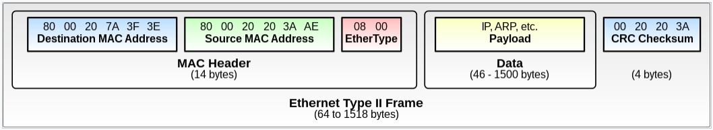

# 1 Ethernet

* 이더넷은 LAN에서 일반적으로 사용되는 유선 컴퓨터 네트워킹 기술이다.
* 2계층(OSI Model)에 속하는 프로토콜이다
* 하나의 네트워크 대역인 LAN에서 통신할 때 사용되며 다른 네트워크 대역과 통신하려면 3계층(OSI Model)이 개입되어야 한다

# 2 Ethernet의 주소 체계

* Ethernet은 MAC 주소를 사용한다
* MAC 주소는 6byte의 크기를 가짐

# 3 Ethernet의 Frame 구조

* Frame은 Header, Payload(Data), Footer로 구성된다

## 3.1 Header

* Header는 목적지 주소, 출발지 주소, EtherType을 가지고 있다

**destination and source MAC addresses**

* 헤더에는 목적지 주소와 출발지 주소 정보를 가지고 있다
* 여기서 주소는 MAC 주소를 말한다
* 주소당 6바이트

**EtherType**

* 인캡슐한 페이로드의 프로토콜이 무엇인지 알려주는 역할을 한다
* 2바이트
* 예시
  * 0800: 페이로드가 IP인 경우
  * 0806: 페이로드가 ARP인 경우