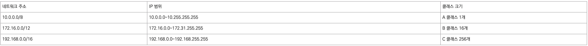
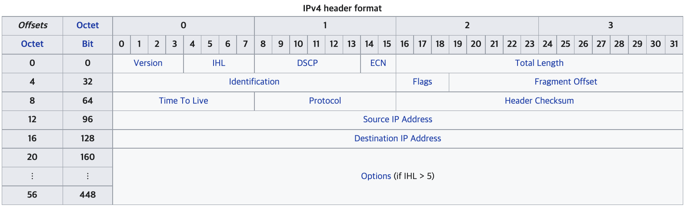

# 1 IPv4

* IP는 패킷 헤더의 IP 주소를 기준으로 소스 호스트에서 목적지 호스트로 패킷을 전달하는 작업을 한다

# 2 IPv4 Address

* 컴퓨터 네트워크에서 장치들이 서로를 인식하고 통신을 하기 위해서 사용하는 특수한 번호이다.
* 네트워크에 연결된 장치가 라우터이든 일반 서버이든, 모든 기계는 이 특수한 번호를 가지고 있어야 한다.
* 3계층인 Network Layer(OSI Model)에서 쓰이는 주소체계
* 주소의 범위는 32비트
* IPv4의 주소체계는 총 12자리이며 네 부분으로 나뉜다. 
  * 각 부분은 0~255까지 3자리의 수로 표현된다
  * 이 표현 방식을 **dotted-decimal format**이라 한다.
  * 예) `192.0.2.1`

## 2.1 Subnet Mask(부분망)

* IP 주소의 `Network Part`와 `Host Part`를 구분하기 위해 사용된다.
* 두개의 장치가 같은 서브넷에 있는지 아닌지 판별하기 위해 사용된다.
  * 네트워크 접두사를 비교해 같으면 같은 서브넷에 있다
  * Remote Network(다른 서브넷)
    * default gateway가 필요함
  * Local Subnet(같은 서브넷)
    * default gateway가 필요없다.

* 이진 형태로 1로 시작해서 연속적으로 1이 있어야한다.

**네트워크 접두사 결정**

|                 |               이진 형태               | 닷 데시멀 노테이션 |
| :-------------: | :-----------------------------------: | :----------------: |
|     IP 주소     | `11000000.10101000.00000101.10000010` |  `192.168.5.130`   |
|  서브넷 마스크  | `11111111.11111111.11111111.00000000` |  `255.255.255.0`   |
| 네트워크 접두사 | `11000000.10101000.00000101.00000000` |   `192.168.5.0`    |
|   호스트 부분   | `00000000.00000000.00000000.10000010` |    `0.0.0.130`     |

## 2.2 게이트웨이

* 다른 서브넷으로 패킷을 전달해야 할 경우 해당 패킷은 게이트웨이으로 전달된다
  * 서브넷 마스크를 통해 같은 서브넷인지 아닌지 알 수 있다
  * 같은 서브넷이라면 게이트웨이를 통해 밖으로 나가지 않고 통신이 가능하다
* 일반적으로 게이트웨이의 호스트 부분 주소는 가장 작은 수로 설정
  * 예) `192.168.0.1`

## 2.3 Private and Public IP addresses

* 인터넷에 접속하려면 Public IP 주소가 필요하고 이 주소는 전세계에서 유일해야 하는 식별자다
* 하지만 인터넷에 연결하지 않고 개인적으로 네트워크를 구성한다면 Public IP 주소를 할당받지 않고 네트워크를 구축할 수 있다
* 이때 사용하는 IP 주소를 Private IP address라고 한다
  * NAT 기술을 사용해 인터넷에 접속할 경우 Private IP 주소를 Public IP 주소로 변경한 후 인터넷에 접속한다
  * 가정에서는 공유기 NAT 기능을 제공한다

**사설 IP 주소**

## 2.4 특수한 주소

**`0.0.0.0`**

**127.0.0.1**

* 호스트 자신을 가리키는 주소

# 3 Packet structure

* IP는 Packet을 source 호스트에서 destination 호스트로 전달하는 기능을 한다
* Packet은 헤더와 페이로드로 구성된다
  * checksum이나 footer를 가지고 있지 않다

## 3.1 Header

* 14개의 필드로 구성되어 있다

**Version**

* IP의 버전을 나타냄
* 본래 버전 업이 되면 Version 필드만 수정해 패킷 구조를 동일하게 가져가는 것이 목표였으나 IPv6는 패킷 구조가 달라졌다

**IHL**

* 헤더의 길이를 나타냄
  * 헤더의 총 바이트를 4로 나눈 값
* 헤더의 총 바이트는 최소 20바이트 옵션이 붙으면 최대 60바이트

**Total Length**

* 헤더와 페이로드를 합친 총 길이를 나타냄

**Identification**

* datagram을 식별하기 위한 ID
* 큰 datagram을 한번에 전송하지 못하기 때문에 여러 조각(Fragment)으로 나누고 패킷에 담아 전송하게 되는데 받는 쪽에서 여러 조각을 다시 큰 datagram으로 합성하기 위해 사용되는 ID

**Flags**

* 마지막 비트
  * `0` : 마지막 Fragment를 의미
  * `1` 중간 Fragment를 의미

**Fragment Offset**

* Fragment의 순서를 의미한다
* IP에서는 발신자가 패킷을 순서대로 보내지만 수신자가 같은 순서로 받는다는 보장이 없다
* 따라서 Fragment를 조합해 원래 datagram을 만들기 위해서는 Fragment 원래 순서가 필요하다

**TTL**

* Time To Live
* 패킷이 라우터를 지나갈 때 마다 1씩 감소한다
* TTL이 `0` 인 패킷을 받은 네트워크 장비는 패킷을 전달하지 않는다
* TTL을 쓰는 이유
  * 라우팅 과정에서 네트워크 노드끼리 사이클이 발생하면 패킷은 사이클에서 빠져나가지 못한다.
  * TTL이 없다면 사이클에는 패킷들이 계속해서 쌓일 수 있다

**Protocol**

* Encapsulation한 페이로드의 프로토콜을 나타낸다
* ICMP, TCP, UDP가 가능하다
  * ICMP: `0x01` 으로 설정
  * TCP: `0x06` 으로 설정
  * UDP: `0x11`으로 설정

**Header Checksum**

* header의 error-checking을 위해 사용된다
* 라우터가 패킷을 받게 되면 Checksum을 계산하고 계산된 Checksum이 Header Checksum 필드와 같은지 비교한다
* 만약 다르다면 라우터는 해당 패킷을 버린다

**Source address**

* packet 발송자의 IPv4 address
* NAT로 인해 전달 중 Source address가 바뀔 수 있다

**Destination address**

* packet 목적지의 IPv4 address 