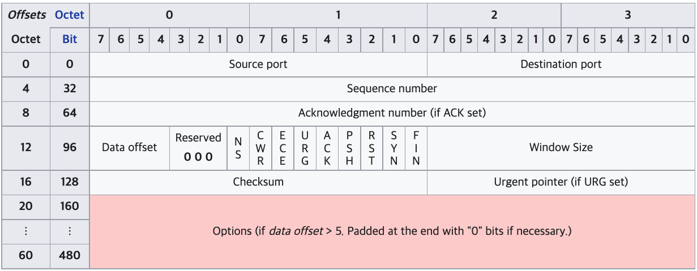
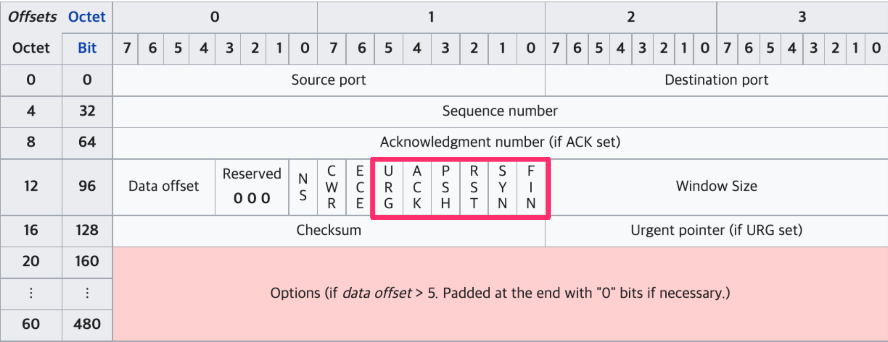

# 1 TCP(Transmission Control Protocol)

* TCP는 신뢰할수 없는 공용망에서도 정보유실 없는 통신을 보장하기 위해 세션을 안전하게 연결하고 데이터를 분할하고 분할된 패킷을 잘 전송되었는지 확인하는 기능이 있다
* 패킷에 번호를 부여하고 잘 전송되었는지에 대한 응답을 받는다
* 수신자가 잘 받아서 처리할 수 있는 전송 크기를 고려해서 통신한다

# 2 TCP segment header

* TCP의 상위 프로토콜 지시자는 포트 번호이다

**Source port**

* 출발지 포트 넘버를 나타낸다

**Destination port**

* 목적지 포트 넘버를 나타낸다

**Sequence number**

* 패킷의 번호

**Acknowledgment number**

* 

**URG**

* 긴급 데이터인 경우 1로 세팅

**ACK**

* ACK번호가 유효할 경우 1로 설정
* 초기 SYN이 아닌 모든 패킷은 기존 메시지에 대한 응답이므로 ACK 플래그가 1로 표기된다

**PSH**

* 서버 측에서 전송할 데이터가 없거나 데이터 버퍼링 없이 응용 프로그램으로 즉시 전달할 것을 지시할 때 사용

**RST**

* 리셋?
* 연결 종료시 1로 표시된다
* 연결을 강제적으로 끊을 때 사용한다

**SYN**

* 연결 시작 용도로 사용
* 연결이 시작될 때 SYN 플래그를 `1`로 설정

**FIN**

* 연결 종료 시 1로 표시된다
* 데이터 전송을 마친 후 정상적으로 양방향 종료 시 사용된다

**Offset**

* 헤더의 길이

**Window size**

* TCP는 일방적으로 패킷 보내는 것이 아니라 상대방이 얼마나 잘 받았는지 확인하기 위해 ACK 번호를 확인하고 다음 패킷 보낸다
* 패킷 전송 여부를 확인하기위해 별도의 패킷 받는 것은 오버헤드가 큰 작업
* 송신자와 수신자가 멀어질수록 왕복 지연지간(Round Trip Time)이 늘어난다
* 그래서 데이터를 보낼 때 패킷 하나만 보내는 것이 아니라 많은 패킷은 한번에 보내고 응답은 하나만 받는다
* 가능한 많은 패킷을 한번에 보내는 것이 효율적이지만 네트워크 상태가 좋지 못하면 패킷 유실 가능성이 커지므로 적절한 송신량을 결정해야한다
* 이 때 네트워크 상태에 따라 한 번에 데이터를 받을 수 있는 크기를 조절하는데 이 크기를 Window size라 한다
  * 크기를 조절하는 것을 슬라이딩 윈도우라고 한다

# 3 3 way handshake

* 유실없는 안전한 통신을 위해 통신 시작 전 사전 연결작업을 진행한다
* 송신자가 일방적으로 수신자에게 데이터를 전송하면 수신자가 정상적으로 처리할 수 없는 경우 데이터가 버려진다
* TCP는 이러한 상황을 방지하기 위해 통신전 데이터를 안전하게 보내고 받을 수 있는지 확인하는 작업을 거치는데 이를 3 way handshake라고 한다

## 3.1 진행과정

1. 서버는 클라이언트의 접속을 받아들일 수 있는 `LISTEN` 상태로 대기
2. 클라이언트가 통신을 시도할 때 Syn 패킷을 보내낸다. 이 상태를 `SYN-SENT`라고 한다
3. 클라이언트의 Syn을 받은 서버는 `SYN-RECEIVE` 상태가 되고 Syn, Ack로 응답한다
4. 이 응답을 받은 클라이언트는 `ESTABLISHED` 상태로 변경하고 그에 대한 응답을 서버로 다시 보낸다
5. 서버는 응답을 받고 `ESTABLISHED` 상태로 변경된다

* `ESTABLISHED` 상태는 서버와 클라이언트 간의 연결이 성공적으로 완료되었음을 나타낸다

## 3.2 TCP segment header

* 3 way handshake 과정에서 사용되는 플래그들
* SYN
  * 연결 시작 용도로 사용
  * 연결이 시작될 때 SYN 플래그를 `1`로 설정
* ACK
  * ACK번호가 유효할 경우 1로 설정
  * 초기 SYN이 아닌 모든 패킷은 기존 메시지에 대한 응답이므로 ACK 플래그가 1로 표기된다
* FIN
  * 연결 종료 시 1로 표시된다
  * 데이터 전송을 마친 후 정상적으로 양방향 종료 시 사용된다
* RST
  * 연결 종료시 1로 표시된다
  * 연결을 강제적으로 끊을 때 사용한다
* URG
  * 긴급 데이터인 경우 1로 표시
* PSH
  * 서버 측에서 전송할 데이터가 없거나 데이터 버퍼링 없이 응용 프로그램으로 즉시 전달할 것을 지시할 때 사용

# 4 UDP와 비교

| TCP              | UDP                                  |
| ---------------- | ------------------------------------ |
| 연결 지향        | 비연결형                             |
| 오류 제어 수행함 | 오류 제어 수행 안 함                 |
| 흐름 제어 수행함 | 흐름 제어 수행 안 함                 |
| 유니캐스트       | 유니캐스트, 멀티캐스트, 브로드캐스트 |
| 전이중           | 반이중                               |
| 데이터 전송      | 실시간 트래픽 전송                   |

