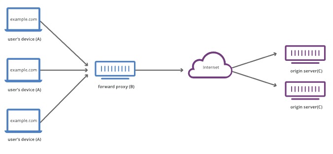
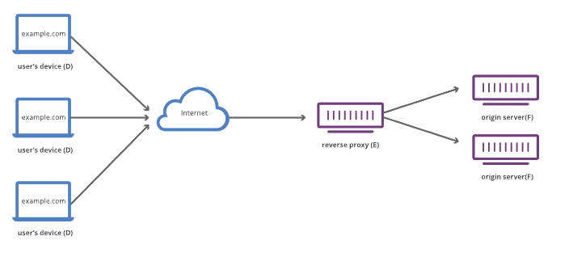

# 1 프록시(Forward Proxy)

> 웹 브라우저와 서버 사이에서는 수많은 컴퓨터와 머신이 HTTP 메시지를 이어 받고 전달합니다. 여러 계층으로 이루어진 웹 스택 구조에서 이러한 컴퓨터/머신들은 대부분은 전송, 네트워크 혹은 물리 계층에서 동작하며, 성능에 상당히 큰 영향을 주지만 HTTP 계층에서는 이들이 어떻게 동작하는지 눈에 보이지 않습니다. 이러한 컴퓨터/머신 중에서도 애플리케이션 계층에서 동작하는 것들을 일반적으로 **프록시**라고 부릅니다. 프록시는 눈에 보이거나 그렇지 않을 수도 있으며(프록시를 통해 요청이 변경되거나 변경되지 않는 경우를 말함) 다양한 기능들을 수행할 수 있습니다:

* Forward Proxy는 클라이언트 머신 앞에 위치한 프록시 서버를 의미한다.
* Proxy에는 프록시의 위치에 따라 Forward Proxy와 Reverse Proxy 둘로 나뉜다.
  * Forward Proxy를 일반적으로 그냥 Proxy라고 부른다.

## 1.1 프록시의 기능

* 캐싱 (캐시는 공개 또는 비공개가 될 수 있습니다 (예: 브라우저 캐시))
* 필터링 (바이러스 백신 스캔, 유해 컨텐츠 차단(자녀 보호) 기능)
* 로드 밸런싱 (여러 서버들이 서로 다른 요청을 처리하도록 허용)
* 인증 (다양한 리소스에 대한 접근 제어)
* 로깅 (이력 정보를 저장)

## 1.2 프록시를 사용하는 이유

* 왜 클라이언트가 오리진 서버와 직접적으로 소통하지 않고 중간에 프록시를 두는가?

1. 제한을 피하기 위해
   * 일부 국가, 학교 및 기타 조직에서는 방화벽을 사용하여 사용자에게 제한된 액세스 권한을 부여합니다. 
   * 사용자가 방문 중인 사이트에 직접 연결하지 않고 프록시에 통해 연결할 수 있으므로 프록시를 사용하여 이러한 제한을 피할 수 있습니다.

2. 특정 컨텐츠에 대한 액세스를 차단하려고

3. 클라이언트의 신원을 숨기기 위해

   * 프록시에 통해 소통하므로 IP 주소의 추적이 어렵다
   * proxy server IP 주소만 노출될 것이다.

   

# 2 Reverse Proxy

* Reverse Proxy서버는 일반적으로 개인 네트워크의 방화벽 뒤에 배치된다.
  * Forward Proxy가 클라이언트 앞에 위치한다면 Reverse Proxy는 웹 서버 앞에 위치한다.
* 클라이언트 요청을 적절한 백엔드 서버로 전달하는 프록시 서버 유형입니다. 
* Reverse Proxy는 클라이언트와 서버 간의 네트워크 트래픽 흐름이 원활하도록 추가적인 추상화 및 제어 수준을 제공합니다.

## 2.1 Forward Proxy와 차이점

> Forward Proxy는 클라이언트들 앞에 위치하여 어떠한 오리진 서버도 이 클라언트들이랑 직접적인 소통을 할 수 없음을 보장한다. 반대로 Reverse Proxy는 오리진 서버들 앞에 위치하여 어떠한 클라이언트도 이 오리진 서버랑 직접적인 소통을 할 수 없음을 보장한다.

**Forward Proxy**

* Forward Proxy 는 클라이언트가 요청하는 End Point 가 실제 서버 도메인
* Forward Proxy 는 클라이언트를 숨긴다.

**Reverse Proxy**

* Reverse Proxy 는 클라이언트가 요청하는 End Point 가 프록시 서버의 도메인이고 실제 서버의 정보는 알 수 없다.
* Reverse Proxy 는 서버를 숨긴다.

## 2.2 Reverse Proxy의 기능

1. 캐싱 (캐시는 공개 또는 비공개가 될 수 있습니다 (예: 브라우저 캐시))
2. 로드 밸런싱 (여러 서버들이 서로 다른 요청을 처리하도록 허용)
3. 웹 서버 인프라를 클라이언트에게 노출시키지 않는다. 보안에 좋다

참고

* https://developer.mozilla.org/ko/docs/Web/HTTP/Overview#%ED%94%84%EB%A1%9D%EC%8B%9C
* https://www.cloudflare.com/ko-kr/learning/cdn/glossary/reverse-proxy/

