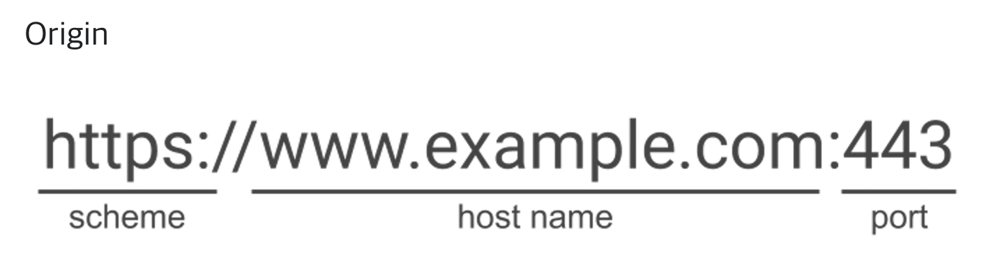

# 1 Same-Origin Policy

* Same-Origin Policy는 보안 메커니즘으로 한 오리진에서 다른 오리진의 리소스를 접근하는 것을 제한한다.
* 동일 출처 정책은 잠재적으로 해로울 수 있는 문서를 분리함으로써 공격받을 수 있는 경로를 줄여준다.

# 2 Same Origin

* URL은 scheme, host, port로 구성되어 있다
* Scheme
  * 사용하는 프로토콜. 일반적으로 HTTP 프로토콜 혹은 보안 버전인 HTTPS를 사용한다.
* host
  * 서버(가상 호스팅)의 이름 또는 IP
* port
  * 서버와 연결을 맺기 위한 TCP 포트 번호. 
  * 포트번호를 입력하지 않으면, 요청한 서비스의 기본 포트(HTTP의 경우 "80")가 사용된다.
* 두 URL의 scheme, host, port가 모두 같으면 동일한 출처(Same Origin)라고 한다.

**예시**

* URL `http://store.company.com/dir/page.html:80`의 Origin비교

| URL                                               | 결과 | 이유                                |
| :------------------------------------------------ | :--- | :---------------------------------- |
| `http://store.company.com/dir2/other.html`        | 성공 | 경로만 다름                         |
| `http://store.company.com/dir/inner/another.html` | 성공 | 경로만 다름                         |
| `https://store.company.com/secure.html`           | 실패 | 프로토콜 다름                       |
| `http://store.company.com:81/dir/etc.html`        | 실패 | 포트 다름 (`http://`는 80이 기본값) |
| `http://news.company.com/dir/other.html`          | 실패 | 호스트 다름                         |

참고

* https://developer.mozilla.org/en-US/docs/Web/Security/Same-origin_policy