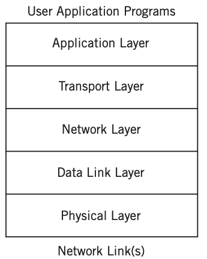
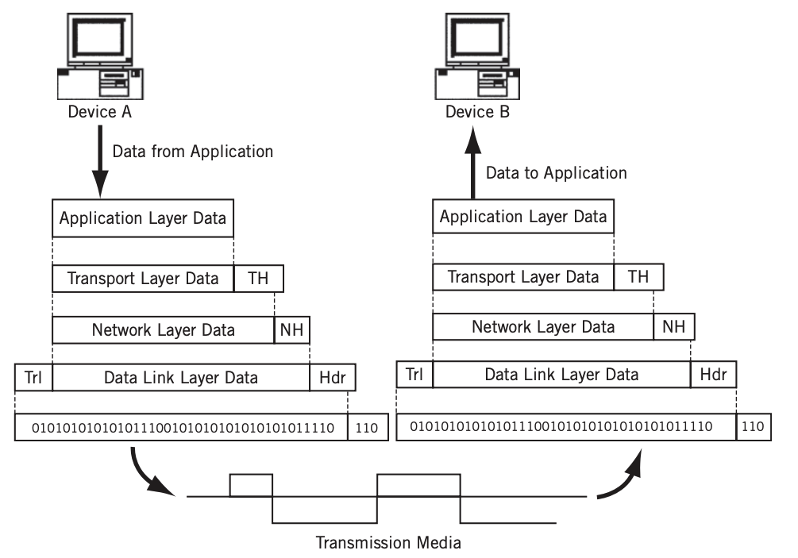
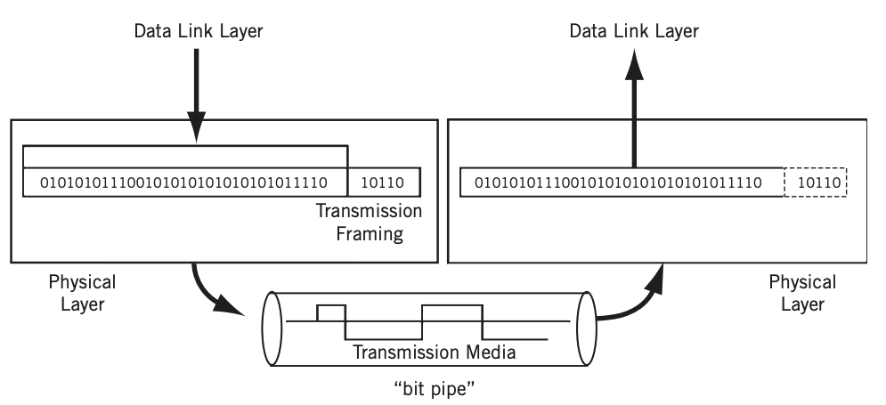

#  1 TCP/IP Model

* TCP/IP Model은 OSI Model이 논리적으로 나눈 네트워크 계층을 축약한 버전이라고 생각하면 쉽다
* 따라서 OSI Model은 7개의 계층을 가지고 있지만 TCP/IP Model 4개의 계층만을 가지고 있다
* TCP/IP Model은 Application Layer, Transport Layer, Internet Layer, Link Layer 총 4개의 계층을 가지고 있다
* Link Layer를 physical, data link 두 레이어로 쪼개 5개의 계층으로 정의하기도 한다
* TCP/IP Model에서는 계층에 번호를 붙이지 않으며 이름만 존재한다.
  * 계층에 번호를 붙이는 방식은 OSI Model이 사용한다

**TCP/IP Model**

* 5개의 계층으로 나누어진 TCP/IP Model

## 1.1 Encapsulation

* 각 계층은 상위 계층의 페이로드에 헤더를 추가해서 하위 계층으로 전달한다
* 헤더에 포함되는 가장 중요한 두 가지 정보
  * 각 계층에서 정의하는 정보
  * **상위 프로토콜 지시자 정보**
  * Decapsulation 과정에서 헤더에 상위 프로토콜 지시자 정보가 없으면 페이로드를 어떻게 해석해야 되는지 모르기 때문

* 예시
  * IP Protocol(Internet Layer)은 Transport Layer에서 받은 페이로드에 헤더를 추가하여 Data Link Layer로 전달한다
  * IP Protocol이기 때문에 헤더에는 받는 노드의 IP 주소와 같은 정보들이 있다

**Encapsulation**

* 각 계층은 상위 계층의 페이로드에 헤더를 추가하며 Encapsulation한다
* 수신자인 Device B에서는 하위 계층이 Decapsulation을 통해 페이로드를 추출하고 이를 상위 계층으로 전달한다

## 1.2 통신 과정

* Intermediate Node에서는 Physical, Data Link, Network까지만 개입한다
  * IP 주소를 통해 DeviceB로 패킷을 전달하는 것이 목표
  * 따라서 IP가 속한 Network Layer까지만 개입해도 DeviceB를 찾을 수 있다 

# 2 Application Layer

## 2.1 프로토콜

* HTTP, HTTPS, DNS, FTP, SMTP, SSH, TLS, SSL 

# 3 Transport Layer

* 송신자의 프로세스와 수신자의 프로세스를 연결하는 통신 서비스를 제공한다

## 3.1 프로토콜

* TCP, UDP

## 3.2 주소체계

* 특정 프로세스와 특정 프로세스가 통신하기 위해서는 `포트 번호`가 필요하다
* 하나의 포트는 하나의 프로세스에 할당되고 하나의 프로세스는 여러 개의 포트 번호를 사용할 수 있다
* [Port-Numbers.md](../Port-Numbers/Port-Numbers.md) 참고

# 4 Internet Layer

* 프레임을 Encapsulation한 packet의 형태로 출발지에 목적지까지 전달한다.

## 4.1 프로토콜

* IP

## 4.2 주소체계

* IP Address
* [IP.md](../Protocol/IP/IP.md) 참고

# 5 Data Link Layer

* 비트 스트림을 조직화하여 프레임으로 만들고 이 프레임을 이웃한 시스템으로 전달하는 기능을 담당한다

## 5.1 주소체계

* 1계층에서 쓰이는 주소체계는 MAC 주소다
* [MAC-Address.md](../MAC-Address/MAC-Address.md) 참고

# 6 Physical Layer

* 비트 스트림을 medium을 통해 다른 시스템으로 전달하는 기능을 담당한다

참고

* https://en.wikipedia.org/wiki/Internet_protocol_suite
* https://www.geeksforgeeks.org/tcp-ip-model/
* https://users.exa.unicen.edu.ar/catedras/comdat1/material/TP1-Ejercicio5-ingles.pdf