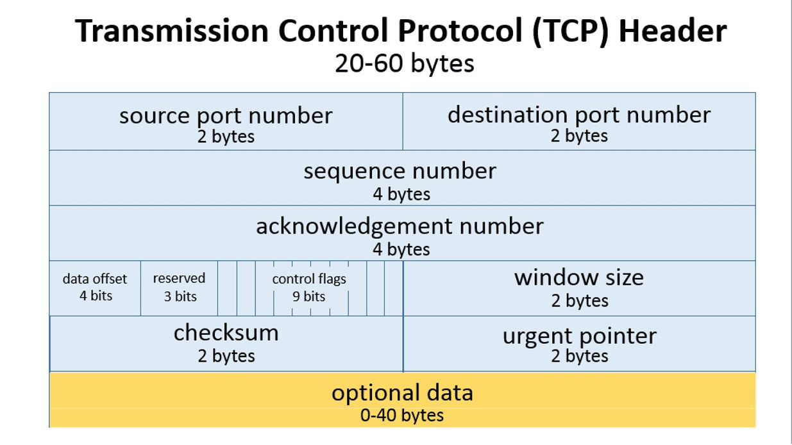
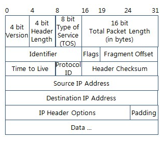
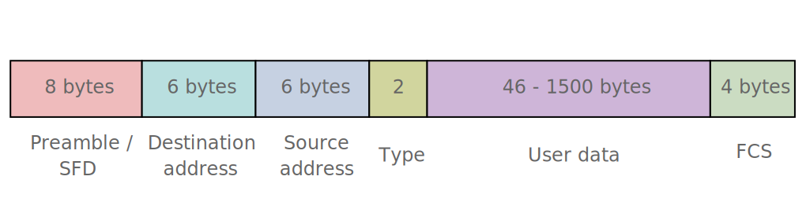

## 왜 계층을 나누었을까?

**Divide-and-conquer**

* 분할정복을 이용하면 해결할 수 없는 하나의 큰 문제를 해결할 수 있는 작은 문제들로 분할하여 큰 문제를 풀 수 있게해준다. 따라서 분할정복을 이용해 네트워크 시스템의 복잡도를 낮출 수 있다.
* 앱 개발자가 physical layer를 통해 어떻게 데이터가 전송되는지 고민할 필요없이 앱 개발에 집중하면 된다.
* 네트워크 종사자는 Transport Layer하위 계층을 전문적으로 다룬다.

**Modularity**

* 모듈성은 각각의 계층에 독립성을 제공한다. 즉 각각의 계층이 독립적이기 때문에 이해하기 쉬우며 설계와 구현이 용이하다.

**Easy to modify**

* 각각의 레이어가 독립적이기 때문에 한 레이어를 변경하더라도 다른 레이어에 영향을 미치지 않으므로 수정에 용이하다.

**Easy to test**

* 레이어가 나누어져 있어 개별적으로 분석과 테스트가 용이하다.

## TCP/IP model vs. OSI model 

차이점

| TCP/IP model                                                 | OSI model                                       |
| ------------------------------------------------------------ | ----------------------------------------------- |
| TCP refers to Transmission Control Protocol.                 | Open Systems Interconnection.                   |
| 4개의 레이어                                                 | 7개의 레이어                                    |
| transport layer에서 connection-oriented와  connectionless 둘다 지원 | layer layer에서 connection-oriented만 지원한다. |

* 가장 큰 차이는 계층의 수이다. `TCP/IP model`은 4계층을 사용하고 있는 반면, OSI 모델은 7계층을 사용한다.
* `TCP/IP Model`의 `Application Layer`에서  `OSI model`의 `Application`, `Presentatiom`, `Session` 계층을 구현한다.

> **계층 모형**
> TCP/IP 모형은 현재의 인터넷에서 컴퓨터들이 서로 정보를 주고받는데 쓰이는 통신규약(프로토콜)의 모음으로 각 계층은 담당하는 위치마다 처리 역할을 구분해 진행함으로 서로 간의 간섭을 최소화하여 사용의 편리성을 높힌다
>
> - 호환성 보장(다른 제조사 장비들끼리도 통신 가능)으로 인한 비용 절감
> - 쉬운 문제 해결(계층별로 문제 확인 가능)
> - 다른 계층끼리는 각 전달 과정을 알 필요없어 데이타의 캡슐화(헤더첨부)와 은닉이 가능
> - 각각의 레이어가 독립적이므로 한 레이어의 변화가 다른 레이어에 영향을 미치지 않는다.

- 국제표준화기구 IOS(International Organization for Standardization)에서는 상호 이질적인 네트워크간의 연결에서 호환성의 결여를 막기위해 OSI(Open Systems Interconnection) 모형을 개발했다.
- 실제 사용되는 TCP/IP는 OSI 참조 모델을 기반으로 상업적이고 실무적으로 이용될 수 있도록 단순화된 모형이다
  - 네트워크 전송 시 데이터 표준을 정리한 것이 OSI 7계층, 이 이론을 실제 사용하는 인터넷 표준이 TCP/IP 4계층이다.
- OSI 7계층을 4-5계층으로 분류하여 적용할 수 있다.

## TCP/IP 4계층

| TCP/IP 4계층                       | 역할                                             | 데이타 단위  | 전송 주소 | 예시                                                    | 장비           |
| ---------------------------------- | ------------------------------------------------ | ------------ | --------- | ------------------------------------------------------- | -------------- |
| 응용 계층(Application)             | 응용프로그램 간의 데이타 송수신                  | Data/Message | -         | 파일 전송, 이메일, FTP, HTTP, SSH, Telnet, DNS, SMTP 등 | -              |
| 전송 계층(Transport)               | 호스트 간의 자료 송수신                          | Segment      | Port      | TCP, UDP, RTP, RTCP 등                                  | 게이트웨이     |
| 인터넷 계층(Internet)              | 데이타 전송을 위한 논리적 주소 지정 및 경로 지정 | Packet       | IP        | IP, ARP, ICMP, RARP, OSPF                               | 라우터         |
| 네트워크 연결 계층(Network Access) | 실제 데이타인 프레임을 송수신                    | Frame        | MAC       | Ethernet, PPP, Token Ring 등                            | 브리지, 스위치 |

## PDU

> **프로토콜 데이터 단위**(Protocol Data Unit)는 데이터 통신에서 상위 계층이 전달한 데이터에 붙이는 제어정보를 뜻한다.

## 계층별 주소 시스템

* Application-Specific address
  * www.google.com
* Port address
* Logical address
* Physical address
  * MAC address

## encapsulation 

## L5-7 Application Layer

* `OSI model` 의 `Application`, `Presentatiom`, `Session` layer를 합친것과 같다.
* PDU: data, message?
* 프로토콜: HTTP, HTTPS, DNS, DHCP, FTP

> `Application Layer` 는 TCP/IP를 사용하는 프로그램에 의해 제공된다. 애플리케이션은 보통 다른 호스트에서 동작하는 프로세스와 소통하는 프로세스를 말한다.

### HTTP

* stateless
  * 서버는 클라이언트의 과거 요청 정보를 보유하지 않는다.

### DNS

> DNS는 편리성을 더욱 강조하는 도구이다. 우리가 인터넷을 통해 특정 호스트에 연결을 하려고 한다면 그 특정 호스트의 주소(IP 주소)를 알고 있어야한다. 그런데 숫자로 된 IP주소를 일일이 기억을 하는 것은 매우 힘들다. 따라서 우리는 이러한 호스트에 접근을 할 때 이름을 사용한다. DNS라고 하는 것은 일반 사용자가 호스트의 이름을 입력하였을 때 그에 해당하는 IP주소 값을 반환하는 장치이다. DNS 시스템은 국가 도메인, 단체 종류, 단체 이름, 호스트라는 네 계층 구조로 나누고 점을 이용하여 구분을 한다. 우리가 일반적으로 사용하는 인터넷 사이트 주소를 입력하는 방식이다. 또한 DNS는 주소와 이름 정보를 자동으로 유지하고 관리하는 분산 데이터베이스 시스템의 형태이기도하다. 네임 서버라는 특정한 관리 호스트가 주소와 이름 정보를 기억하고 클라이언트가 주소 변환을 요청하면 이름을 IP주소로 바꾸어준다.
>
> https://copycode.tistory.com/29?category=740132

___

## L4 Transport Layer

* Process-to-process delivery

  

* Transport Layer는 한 프로세스와 다른 호스트의 프로세스간 커뮤니케이션을 제공한다.

* Transport protocol은 호스트에서 동작하며 다음과 같은 일을 한다.
  * 보내는 쪽: `data`를 `segment`로 쪼개서 `Internet Layer`로 전달한다.
  * 받는 쪽: 쪼개진 `segment`를 다시 `data`로 조립한 후 `Application Layer`로 전달한다.
  
* 장비: 게이트웨이, L4 스위치

* PDU: segment

* 프로토콜: TCP, UDP

* 주소: port numbers

### TCP

> TCP는 네트워크 계층 중 전송 계층에서 사용하는 프로토콜로서, 장치들 사이에 논리적인 접속을 성립(establish)하기 위하여 연결을 설정하여 신뢰성을 보장하는 연결형 서비스 이다. TCP는 네트워크에 연결된 컴퓨터에서 실행되는 프로그램 간에 일련의 옥텟(데이터, 메세지, 세그먼트라는 블록 단위)를 안정적으로, 순서대로, 에러없이 교환할 수 있게 한다.

* reliable transmission
* in-order delivery
* flow control
  * 데이터 처리 속도를 조절해서 수신자의 버퍼 오버플로우를 방지한다.
* congestion control
  * 네트워크 내의 패킷 수가 넘치게 증가하지 않도록 방지한다.
* connection-oriented

**주소 시스템: **Port

* 통신하고자 하는 호스트에는 여러 프로세스가 실행될 수 있기 때문에 올바른 프로세스와 커뮤니케이션을 하기 위해 필요하다.

**TCP 헤더 구조**

**TCP Connection (3-way handshake)**

1. 먼저 open()을 실행한 클라이언트가 `SYN`을 보내고 `SYN_SENT` 상태로 대기한다.
2. 서버는 `SYN_RCVD` 상태로 바꾸고 `SYN`과 응답 `ACK`를 보낸다.
3. `SYN`과 응답 `ACK`을 받은 클라이언트는 `ESTABLISHED` 상태로 변경하고 서버에게 응답 `ACK`를 보낸다.
4. 응답 `ACK`를 받은 서버는 `ESTABLISHED` 상태로 변경한다.

**TCP Disconnection (4-way handshake)**

1. 먼저 close()를 실행한 클라이언트가 FIN을 보내고 `FIN_WAIT1` 상태로 대기한다.
2. 서버는 `CLOSE_WAIT`으로 바꾸고 응답 ACK를 전달한다. 동시에 해당 포트에 연결되어 있는 어플리케이션에게 close()를 요청한다.
3. ACK를 받은 클라이언트는 상태를 `FIN_WAIT2`로 변경한다.
4. close() 요청을 받은 서버 어플리케이션은 종료 프로세스를 진행하고 `FIN`을 클라이언트에 보내 `LAST_ACK` 상태로 바꾼다.
5. FIN을 받은 클라이언트는 ACK를 서버에 다시 전송하고 `TIME_WAIT`으로 상태를 바꾼다. `TIME_WAIT`에서 일정 시간이 지나면 `CLOSED`된다. ACK를 받은 서버도 포트를 `CLOSED`로 닫는다.

### UDP

* User Datagram Protocol
* unreliable data transfer
* unordered delivery
* Connection less
  * 패켓 도착을 보장하지 않는다.
  * 상위 프로토콜에서 이를 처리해야 한다.

### TCP vs. UDP

공통점

* 포트 번호를 이용하여 주소를 지정
* 데이터 오류 검사를 위한 체크섬 존재

| TCP                                                | UDP                                                     |
| -------------------------------------------------- | ------------------------------------------------------- |
| 연결이 성공해야 통신 가능(연결형 프로토콜)         | 비연결형 프로토콜(연결 없이 통신이 가능)                |
| 데이터의 경계를 구분하지 않음(Byte-Stream Service) | 데이터의 경계를 구분함(Datagram Service)                |
| 신뢰성 있는 데이터 전송(데이터의 재전송 존재)      | 비신뢰성 있는 데이터 전송(데이터의 재전송 없음)         |
| 일 대 일(Unicast) 통신                             | 일 대 일, 일 대 다(Broadcast), 다 대 다(Multicast) 통신 |

## L3 Internet Layer

> 다른 네트워크 대역에 존재하는 네트워크까지 데이터를 전달하는 일을 담당

* Host-to-host delivery

  

* 라우팅 기능을 제공한다. 라우팅이란 `packet` 을 출발지에서 목적지까지 전송하는 것을 말한다.

* `internet layer` 또는 `network layer` 라고도 불린다.

* Internet Layer는 호스트간 커뮤니케이션을 제공한다.

* Internet Layer Protocol은 모든 호스트와 라우터에서 동작하면 다음과 같은 일을 한다.
  * 보내는 쪽: `segment` 를 캡슐화하여 
  * 받는 쪽: 받은 `segment` 를 `Transport Layer` 로 전달
  
* 장비: 라우터, L3 Switch

* PDU: packet, datagram?

* 프로토콜: IPv4, IPv6, ARP, RARP

* 주소: Logical address

### IP

> IP 프로토콜은 인터넷 환경에서 네트워크 계층의 데이터 전송 프로토콜이다. 주요 특징으로 비연결형 서비스이고 패킷 분할/병합 기능을 가지고 있다. 데이터 체크썸은 없고, 헤더 체크썸만 제공한다. Best-effort 방식으로 동작을 한다. 이 방식은 전송 패킷이 수신 호스트에 100% 도착하는 것을 보장하지는 않는다.
>

* Internet Protocol
* Internet Layer에서 가장 중요한 프로토콜
* 모든 패켓이 도착을 보장하지 않는다.
  * 상위 프로토콜에서 이를 처리해야한다.
* connectionless protocol
  * 모든 packet이 독립적으로 처리된다.
  * 출발지에서 패켓을 보낸 순서가 도착지에서 받은 순서와 다를 수 있다.
  * 

**주소 시스템**: IP address

- 네트워크상 최종 목적지까지 정확하게 연결되도록 연결성을 제공
- 단말을 구분하기위해 논리적인 주소(Logical Address) IP를 할당
  - 출발지와 목적지의 논리적 주소가 담겨있는 IP datagram이라는 패킷으로 데이타를 변경
  - 데이터 전송을 위한 주소 지정
- 라우팅(Routing) 기능을 처리
  - 경로 설정
- 최종 목적지까지 정확하게 연결되도록 연경성 제공
- 패킷단위의 데이타 구성
  - 세그먼트를 목적지까지 전송하기 위해 시작 주소와 목적지의 논리적 주소를 붙인 단위. 데이타 + IP Header

**IPv4 헤더 구성**

*  Protocol Identifier
  * 상위 계층의 프로토콜을 나타낸다
  * TCP(6), UDP(17)

### ARP

>  ARP 프로토콜은 Address Resolution Protocol의 약자로 IP주소를 MAC 주소로 바꾸어 주는 작용을 한다. 실제로 통신이 이루어지기 위해선 데이터링크 계층의 MAC 주소를 알아야 가능하다. 송신의 MAC 주소는 송신 호스트의 LAN 카드에 저장이 되어 있으므로 얻을 수 있지만 수신 호스트의 MAC 주소는 알 수가 없다. 따라서 ARP 프로토콜을 이용하게 된다. ARP 프로토콜의 과정은 ARP request를 브로드캐스팅을 통해 방송을 하게 된다. 이때 보내는 데이터는 수신 호스트의 IP 주소이다. 이 IP 주소와 일치하는 호스트는 자신의 MAC 주소를 ARP reply 패킷을 이용해서 회신을 하게 된다. 이렇게 해서 송신 호스트는 적절한 수신 호스트의 MAC 주소를 알 수 있게 된다. 하지만 데이터를 매 번 전송할 때마다 ARP 프로토콜을 실행시켜 브로드캐스팅을 하게 되면 과도한 트래픽일 발생할 수 있으므로 가장 최근에 얻은 IP 주소와 MAC 주소 매핑 값을 보관하는 캐시 정보를 이용한다. 따라서 다음에 수신할 때에는 수신 호스트의 MAC 값을 쉽게 얻을 수 있다. 만약 적절한 IP 주소를 가진 호스트가 같은 네트워크상에서 존재하지 않고 다른 네트워크상에 존재한다면 브로드캐스팅에 대한 응답을 라우터가 반응을 하게 된다. 라우터는 이에 대해 다른 네트워크상을 통해 MAC 주소를 얻을 수 있다.
>
> 출처: https://copycode.tistory.com/94?category=740132 [ITstory]

1. IP 호스트 A가 IP 호스트 B에게 IP 패킷을 전송하려고 할 때 IP 호스트 B의 물리적 네트워크 주소를 모른다면
2. ARP 프로토콜을 사용하여 목적지 IP 주소 B와 브로드캐스팅 물리적 네트워크 주소 FFFFFFFFFFFF를 가지는 ARP 패킷을 네트워크 상에 전송한다.
3. IP 호스트 B는 자신의 IP 주소가 목적지에 있는 ARP 패킷을 수신하면 자신의 물리적 네트워크 주소를 A에게 응답한다.
4. 이와 같은 방식으로 수집된 IP 주소와 이에 해당하는 물리적 네트워크 주소 정보는 각 IP 호스트의 ARP 캐시라 불리는 메모리에 테이블 형태로 저장된 다음, 패킷을 전송할 때에 다시 사용된다. 

**Network Access Layer**

* `Network interface layer` ,  `link layer`,  `data-link layer`라고 불리기도 한다. 
* 이 레이어는 `OSI model` 에서  `Data Link layer`와  `Physical layer`를 합친 것과 같다.
  * 요즘에는 두개의 레이어를 나누어 TCP/IP 5 layer model을 사용하기도 한다.
* Network Access Layer는 하드웨어와 소프트웨어 간의 인터페이스 역할을 한다.
* `Internet Layer` 에서 전달받은 `IP datagram` 을 `frame` 으로 캡슐화해서 전송한다.

## L2 Data Link Layer

* 같은 네트워크에 있는 두개의 장비 사이의 데이터 전송을 담당한다.
* 다른 네트워크와 통신할 떄는 3계층이 개입한다.
* 장비: 브릿지, 스위치
* PDU: frame
* 프로토콜: Ethernet
* 주소: Physical address

### Ethernet

> 같은 네트워크 상의 장치들 끼리 소통을 할 때 MAC address를 사용한다. MAC address는 네트워크 인터페이스 카드에 할당되어있다. 

**주소 시스템**: MAC address

-  네트워크 인터페이스 컨트롤러(NIC)의 제조업체가 NIC 할당한 고유한 주소
- 이더넷 하드웨어 주소(Ethernet hardware address, EHA), 하드웨어 주소, 물리 주소로 부르기도 한다. 

**이더넷 프레임의 형식**

****

* Len/Type
  * Len
    * 0x 600 이하이면
  * Type
    * 0x 600 이상이면 Data에 담겨있는 상위 프로토콜 
    * 0x0806 : ARP
    * 0x0800: HTTP

예시

MAC, LAN, 패킷망 등에 사용되는 것
예) Ethernet, PPP, Token Ring 등

1. 

## L1 Physical Layer

* 장비: 허브
* PDU: bits

**PDU**

* frame
* bits

참고

* https://velog.io/@hidaehyunlee/TCP-%EC%99%80-UDP-%EC%9D%98-%EC%B0%A8%EC%9D%B4
* https://velog.io/@hidaehyunlee/%EB%8D%B0%EC%9D%B4%ED%84%B0%EA%B0%80-%EC%A0%84%EB%8B%AC%EB%90%98%EB%8A%94-%EC%9B%90%EB%A6%AC-OSI-7%EA%B3%84%EC%B8%B5-%EB%AA%A8%EB%8D%B8%EA%B3%BC-TCPIP-%EB%AA%A8%EB%8D%B8
* https://www.javatpoint.com/computer-network-tcp-ip-model
* http://blog.naver.com/PostView.nhn?blogId=no5100&logNo=220677184036
* https://dad-rock.tistory.com/193

