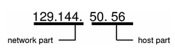

## ARP

* 주소 결정 프로토콜(Address Resolution Protocol, ARP)은 네트워크 상에서 IP 주소를 물리적 네트워크 주소로 대응(bind)시키기 위해 사용되는 프로토콜이다.
* 물리적 네트워크 주소는 이더넷 또는 토큰링의 48 비트 네트워크 카드 주소를 뜻한다.

1. IP 호스트 A가 IP 호스트 B에게 IP 패킷을 전송하려고 할 때 IP 호스트 B의 물리적 네트워크 주소를 모른다면
2. ARP 프로토콜을 사용하여 목적지 IP 주소 B와 브로드캐스팅 물리적 네트워크 주소 FFFFFFFFFFFF를 가지는 ARP 패킷을 네트워크 상에 전송한다.
3. IP 호스트 B는 자신의 IP 주소가 목적지에 있는 ARP 패킷을 수신하면 자신의 물리적 네트워크 주소를 A에게 응답한다.
4. 이와 같은 방식으로 수집된 IP 주소와 이에 해당하는 물리적 네트워크 주소 정보는 각 IP 호스트의 ARP 캐시라 불리는 메모리에 테이블 형태로 저장된 다음, 패킷을 전송할 때에 다시 사용된다. 

## CIDR

## Default Gateway

* 다른 네트워크로 나가는 경로를 알고 있는 라우터
* 일반적으로 호스트에 직접 연결된 라우터
* 외부의 단 하나의 입출구 만 있는 경우 또는 여러 입출구 중 기본 디폴트로 지정 된 것에 해당

## DHCP(Dynamic Host Configuration Protocol)

* DHCP 서버를 사용하여 IP 주소 및 관련된 기타 구성 세부 정보를 네트워크의 DHCP 사용 클라이언트에게 동적으로 할당하는 방법을 제공한다.

**동작 원리**

1. DHCP Discover
   * 메시지 방향: 단말 → DHCP 서버
   * 브로드캐스트 메시지 (Destination MAC = FF:FF:FF:FF:FF:FF) 
   * 단말장비가 DHCP 서버에게 아이피 주소를 할당을 요청하는것이다
2. DHCP Offer
   * 메시지 방향: DHCP 서버 → 단말
   * 브로드캐스트 메시지 (Destination MAC = FF:FF:FF:FF:FF:FF) 또는 유니캐스트
   * 요청에 대한 응답으로 아이피 주소 정보 와 단말의 MAC 주소 정보 등을 네트워크 정보와 함께 같이 전송한다
3. DHCP Request
   * 메시지 방향: 단말 → DHCP 서버
   * 브로드캐스트 메시지 (Destination MAC = FF:FF:FF:FF:FF:FF) 
   * 단말이 받은 아이피 주소 정보를 사용하겠다는 메세지를 서버로 보낸다.
4. DHCP Ack
   * 메시지 방향: DHCP 서버 → 단말
   * 브로드캐스트 메시지 (Destination MAC = FF:FF:FF:FF:FF:FF) 또는 유니캐스트
   * 단말의 MAC 어드레스에 매칭이 되는 IP 주소와 게이트웨이 주소를 확정하여 주는 것이다.

## IP Address(Internet Protocol address)

* 컴퓨터 네트워크에서 장치들이 서로를 인식하고 통신을 하기 위해서 사용하는 특수한 번호이다.
* 네트워크에 연결된 장치가 라우터이든 일반 서버이든, 모든 기계는 이 특수한 번호를 가지고 있어야 한다.

### IP version 4 주소

* 주소의 범위는 32비트
* IPv4의 주소체계는 총 12자리이며 네 부분으로 나뉜다. 각 부분은 0~255까지 3자리의 수로 표현된다
  * 이 표현 방식을 **dotted-decimal format**이라 한다.
* 아래와 같이 network part 와 the host part로 나뉜다.

**Network Part(Network ID/Network Address Portion)**

* 네트워크에 할당된 유니크한 주소를 나타낸다.
* 위 그림에선 네트워크 파트가 2바이트를 차지한다.

**Host Part(Host ID/Host Address Portion)**

* 네트워크 상에 특정한 엔트포인트를 나타낸다.
* 각각의 호스트에 부여되는 주소를 나타낸다.
* 한 네트워크 안에 각각의 호스트는 같은  `Network Part` 주소를 가지고 있지만 각기 다른  `Host Part` 주소를 가질 것이다.

**특별한 주소**

* Local Broadcast Address
  * 255.255. 255.255
  * 로컬 네트워크의 모든 디바이스에게 브로드캐스팅 할 때 사용되는 주소
  * 기본적으로, 라우터나 layer 3 스위치에서 드롭된다.
* Directed Broadcast Address
* Local Loopback Address
  * 127.x.x.x와 같이 127로 시작하면 Local Loopback Address이다. 
  * 대표적으로 127.0.0.1을 사용한다.
  * 이 주소의 도메인 이름은 `localhost`이다.

### IP version 6 주소

* 모든 단말에 주소를 부여하기에 32비트로는 부족해짐에 따라 IP의 새로운 버전인 버전 6에서는 주소 길이를 128비트로 늘렸다.

## Private IP address vs. Public IP adddress

**Private IP address**

* 같은 네트워크에서 커뮤니케이션을 위해 사용되는 주소

**Public IP adddress**

* 다른 네트워크와 커뮤니케이션을 위해 사용되는 주소
* 일반적으로 ISP (Internet Service Provider)가 할당해준다.

## PDU(Protocol Data Unit)

* 프로토콜 데이터 단위

* OSI Reference Models의 PDU

  * 1 물리계층(Physical Layer)
    * 비트(bits)
  * 2 데이터링크 계층(Data-Link Layer)
    * 프레임(frame)
  * 3 네트워크 계층(Network Layer)
    * 패킷 (packet)
  * 4 전송 계층(Transport Layer)
    * 세그먼트(segment)
  * 5-7 응용 계층(Application Layer)
    *  메시지, 데이터(data)

  

## Port Number

- System Ports
  - 0번 ~ 1023번: 잘 알려진 포트 (well-known port)
- User Ports
  - 1024번 ~ 49151번: 등록된 포트 (registered port)
- Dynamic or Private Ports
  - 49152번 ~ 65535번: 동적 포트 (dynamic port)

| 포트 | TCP  | UDP  |                             설명                             | 상태 |
| :--: | :--: | :--: | :----------------------------------------------------------: | :--: |
|  20  | TCP  |      | [파일 전송 프로토콜 (FTP, File Transfer Protocol)](https://ko.wikipedia.org/wiki/파일_전송_프로토콜) - 데이터 포트 | 공식 |
|  21  | TCP  |      | [파일 전송 프로토콜 (FTP, File Transfer Protocol)](https://ko.wikipedia.org/wiki/FTP) - 제어 포트 | 공식 |
|  22  | TCP  |      | [시큐어 셸 (SSH, Secure SHell)](https://ko.wikipedia.org/wiki/시큐어_셸) - [ssh](https://ko.wikipedia.org/wiki/시큐어_셸) [scp](https://ko.wikipedia.org/wiki/Scp), [sftp](https://ko.wikipedia.org/wiki/SSH_파일_전송_프로토콜)같은 프로토콜 및 포트 포워딩 | 공식 |
|  80  | TCP  | UDP  | [HTTP](https://ko.wikipedia.org/wiki/HTTP) (HyperText Transfer Protocol) - 웹 페이지 전송 | 공식 |
| 443  | TCP  |      | [HTTPS](https://ko.wikipedia.org/wiki/HTTPS) - [보안 소켓 레이어 (SSL, Secure Socket Layer)](https://ko.wikipedia.org/wiki/전송_계층_보안) 위의 [HTTP](https://ko.wikipedia.org/wiki/HTTP) (암호화 전송) | 공식 |
|      |      |      |                                                              |      |
|      |      |      |                                                              |      |

## Port Forwarding/Port Mapping

* 특정 포트로 들어온 요청을 다른 특정 IP의 특정 포트로 전달한다.
* 포트 포워딩은 원격 컴퓨터가 근거리 통신망(LAN) 내에 위치한 특정 컴퓨터나 서비스에 연결할 수 있게 한다.

> 포트 포워딩(port forwarding) 또는 포트 매핑(port mapping)은 컴퓨터 네트워크에서 패킷이 라우터나 방화벽과 같은 네트워크 게이트웨이를 가로지르는 동안 하나의 IP 주소와 포트 번호 결합의 통신 요청을 다른 곳으로 넘겨주는 네트워크 주소 변환(NAT)의 응용이다. 이 기법은 게이트웨이(외부망)의 반대쪽에 위치한 보호/내부망에 상주하는 호스트에 대한 서비스를 생성하기 위해 흔히 사용되며, 통신하는 목적지 IP 주소와 포트 번호를 내부 호스트에 다시 매핑함으로써 이루어진다.

## Private Network(사설망)

**사설 IPv4 주소 공간**

| RFC1918 이름 |         IP 주소 범위          | 주소 개수  | [클래스](https://ko.wikipedia.org/wiki/네트워크_클래스) 내용 | 최대 [사이더](https://ko.wikipedia.org/wiki/사이더_(네트워킹)) 블록 (서브넷 마스크) | 호스트 ID 크기 |
| :----------: | :---------------------------: | :--------: | :----------------------------------------------------------: | :----------------------------------------------------------: | :------------: |
| 24비트 블록  |   10.0.0.0 – 10.255.255.255   | 16,777,216 |                        클래스 A 하나                         |                    10.0.0.0/8 (255.0.0.0)                    |    24 비트     |
| 20비트 블록  |  172.16.0.0 – 172.31.255.255  | 1,048,576  |                     16개의 인접 클래스 B                     |                 172.16.0.0/12 (255.240.0.0)                  |    20 비트     |
| 16비트 블록  | 192.168.0.0 – 192.168.255.255 |   65,536   |                    256개의 인접 클래스 C                     |                 192.168.0.0/16 (255.255.0.0)                 |    16 비트     |

## Subnet Mask(부분망)

* IP 주소의 `Network Part`와 `Host Part`를 구분하기 위해 사용된다.
* 두개의 장치가 같은 서브넷에 있는지 아닌지 판별하기 위해 사용된다.
  * 네트워크 접두사를 비교해 같으면 같은 서브넷에 있다
  * Remote Network(다른 서브넷)
    * default gateway가 필요함
  * Local Subnet(같은 서브넷)
    * default gateway가 필요없다.

* 이진 형태로 1로 시작해서 연속적으로 1이 있어야한다.

**네트워크 접두사 결정**

|                 |               이진 형태               | 닷 데시멀 노테이션 |
| :-------------: | :-----------------------------------: | :----------------: |
|     IP 주소     | `11000000.10101000.00000101.10000010` |  `192.168.5.130`   |
|  서브넷 마스크  | `11111111.11111111.11111111.00000000` |  `255.255.255.0`   |
| 네트워크 접두사 | `11000000.10101000.00000101.00000000` |   `192.168.5.0`    |
|   호스트 부분   | `00000000.00000000.00000000.10000010` |    `0.0.0.130`     |

## NAT(네트워크 주소 변환)

* Network Address Translation

> NAT(네트워크 주소 변환)은 IP 패킷의 TCP/UDP **포트 숫자와 소스 및 목적지의 IP 주소 등을 재기록**하면서 라우터를 통해 네트워크 트래픽을 주고 받는 기술이다. 패킷에 변화가 생기기 때문에 IP나 TCP/UDP의 체크섬(checksum)도 다시 계산되어 재기록해야 한다. 그렇기 때문에 네트워크의 성능에 영향을 줄 수 밖에 없다.
>
> NAT를 쓰는 이유는 여러 대의 호스트가 하나의 공인 IP 주소를 사용하여 인터넷에 접속하기 위한 경우가 대부분이다. 예를 들어 인터넷 회선을 하나 개통하고 인터넷 공유기를 달아서 여러 PC 를 연결하여 사용 하는데, 이 것이 가능한 이유가 인터넷 공유기에 NAT 기능이 탑재되어 있기 때문이다.
>
> 중요한 자료가 들어있는 서버를 외부에 공개하지 않게 하기 위해서 중간에 방화벽을 두어서 보호한다. 하지만, 방화벽 내부의 컴퓨터는 인터넷에 접속할 수 있도록 해줘야 하기에 방화벽에 NAT를 탑재하여, 외부로 통신 가능하도록 열어 준다.

