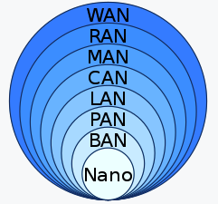

## 네트워크 분류(지리학적 규모)

* 지리학적 규모를 기준으로 위 그림과 같이 네트워크를 구분할 수 있다
* LAN, WAN 이라는 용어를 주로 쓴다

### LAN(Local Area Network)

* 제한된 구역의 컴퓨터와 기타 장치를 연결한 네트워크다
* 주로 집, 학교, 오피스 빌딩, 가까이 위치한 빌딩들을 단위로 구역을 지정한다
* 이더넷과 와이파이가 LAN을 위해 만들기 위해 많이 사용되는 기술이다
* LAN은 라우터를 통해서 WAN과 연결될 수 있다

>  참고
>
> * https://en.wikipedia.org/wiki/Local_area_network

### WAN(Wide Area Network)

* 넓은 구역의 컴퓨터와 기타 장치를 연결한 네트워크다
* 구역의 크기는 도시, 국가, 여러 국가들 걸쳐있다

> 참고
>
> * https://en.wikipedia.org/wiki/Wide_area_network

## 패킷

* 패킷의 구조는 헤더, 페이로드 풋터로 이루어짐
* 인캡슐래이션은 패킷을 보낼때 사용 페이로드를 감싸서 헤더를 붙인다고 생각
  * 상위 계층에서 하위 계층으로 캡슐화

* 디캡슐래이션은 데이터를 받는 쪽
  * 하위 계층에서 상위 계층으로 디캡슐레이션

* 계층마다 패킷의 모양이 달라 부르는 이름이 다르다
  * 이더넷 2 계층 프레임
  * IP 3계층 패킷
  * TCP 4계층 세그먼트

## 2계층

* 가까운 지역에서 통신하는 것(LAN)
  * 이것을 흐름제어라고 하고 또 하나의 역할이 오류제어
* 2계층 주소 체계는 MAC 주소
* 프로토콜은 이더넷

## MAC

* 물리적 주소
* LAN에서 통신할 떄 쓰이는 주소

## 이더넷

