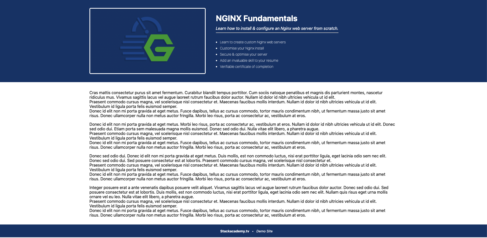

## Installing with a Package Manager

* ubuntu 20.04 기준

```bash
sudo apt-get update
sudo apt-get install nginx

# 프로세스 확인
ps -ef | grep nginx
root        2048       1  0 11:47 ?        00:00:00 nginx: master process /usr/sbin/nginx -g daemon on; master_process on;
www-data    2049    2048  0 11:47 ?        00:00:00 nginx: worker process
ubuntu      2181    1315  0 11:49 pts/0    00:00:00 grep --color=auto nginx

# nginx 종료
sudo nginx -s stop
ps -ef | grep nginx
ubuntu      2837    1315  0 12:21 pts/0    00:00:00 grep --color=auto nginx
```

* Centos 7.4 기준

```bash
yum install epel-release
yum install nginx
# 설치 확인
ls -l /ect/nginx/
# nginx 실행
service nginx start
```


## Configuration

* Nginx는 설정파일에 명시된 `directives` 에 의해서 작동한다.

* `directives` 에는 `simple directives` 와 `block directives`  가 있다.

* `simple directives`

  * 이름과 매개변수가 스페이스로 구분되며 세미콜론으로 끝난다.

* `block directives`

  * `simple directives` 와 구성은 같으나
  * `{` 와 `}` 로 열고 닫는다.
  * `block directives` 괄호 안에 다른 `directives` 를 포함하고 있을 때  `context`라고 부른다
    * 예: `events`, `http`, `server`,  `location` 

* 예시

  * location : `block directives`, `context`

  * root : `simple directives`

  * ```nginx
    location / {
        root /data/www;
    }
    ```


### Creating a Virtual Host

* `/etc/nginx/nginx.conf` 수정하기
* `listen`
  * 몇번 포트를 열 것인가?
  * 생략하면 80번 포트
* `root`
  * 로컬 파일 시스템의 `/home/ubuntu/demo` 에서 요청된 파일을 찾는다.

```nginx
events {}

http{
  server{
    listen 80;
    server_name 54.180.194.219;
    root /home/ubuntu/demo;
  }
}
```

```bash
# 설정 파일 테스트하기
nginx -t
# 변경사항 저장
systemctl reload nginx
```

`http://<IP>` 로 확인해보니 css파일이 적용이 안된 것 같다.


```bash
curl -I http://localhost/style.css
HTTP/1.1 200 OK
Server: nginx/1.18.0 (Ubuntu)
Date: Fri, 19 Feb 2021 11:28:17 GMT
Content-Type: text/plain
Content-Length: 980
Last-Modified: Fri, 19 Feb 2021 11:15:32 GMT
Connection: keep-alive
ETag: "602f9dd4-3d4"
Accept-Ranges: bytes
```

컨텐츠 타입이 `text/plain` 이라 css가 깨진다. 설정파일을 수정해 보자

```nginx
events {}

http{

  include /etc/nginx/mime.types;

  server{
    listen 80;
    server_name 54.180.194.219;
    root /home/ubuntu/demo;
  }

}
```

```
# 설정 파일 테스트하기
nginx -t
# 변경사항 저장
systemctl reload nginx
```

`/etc/nginx/mime.types` 은 어떤 파일일까? 아래와 같이 컨텐츠 타입을 미리 설정해놓았다.

```bash
cat /etc/nginx/mime.types

types {
    text/html                             html htm shtml;
    text/css                              css;
    text/xml                              xml;
    image/gif                             gif;
    image/jpeg                            jpeg jpg;
    application/javascript                js;
    application/atom+xml                  atom;
    application/rss+xml                   rss;

    text/mathml                           mml;
    text/plain                            txt;
    text/vnd.sun.j2me.app-descriptor      jad;
    text/vnd.wap.wml                      wml;
    text/x-component                      htc;

    image/png                             png;
    image/tiff                            tif tiff;
    image/vnd.wap.wbmp                    wbmp;
    image/x-icon                          ico;
    image/x-jng                           jng;
    image/x-ms-bmp                        bmp;
    image/svg+xml                         svg svgz;
    image/webp                            webp;

    application/font-woff                 woff;
    application/java-archive              jar war ear;
    application/json                      json;
    application/mac-binhex40              hqx;
    application/msword                    doc;
    application/pdf                       pdf;
    application/postscript                ps eps ai;
    application/rtf                       rtf;
    application/vnd.apple.mpegurl         m3u8;
    application/vnd.ms-excel              xls;
    application/vnd.ms-fontobject         eot;
    application/vnd.ms-powerpoint         ppt;
    application/vnd.wap.wmlc              wmlc;
    application/vnd.google-earth.kml+xml  kml;
    application/vnd.google-earth.kmz      kmz;
    application/x-7z-compressed           7z;
    application/x-cocoa                   cco;
    application/x-java-archive-diff       jardiff;
    application/x-java-jnlp-file          jnlp;
    application/x-makeself                run;
    application/x-perl                    pl pm;
    application/x-pilot                   prc pdb;
    application/x-rar-compressed          rar;
    application/x-redhat-package-manager  rpm;
    application/x-sea                     sea;
    application/x-shockwave-flash         swf;
    application/x-stuffit                 sit;
    application/x-tcl                     tcl tk;
    application/x-x509-ca-cert            der pem crt;
    application/x-xpinstall               xpi;
    application/xhtml+xml                 xhtml;
    application/xspf+xml                  xspf;
    application/zip                       zip;

    application/octet-stream              bin exe dll;
    application/octet-stream              deb;
    application/octet-stream              dmg;
    application/octet-stream              iso img;
    application/octet-stream              msi msp msm;

    application/vnd.openxmlformats-officedocument.wordprocessingml.document    docx;
    application/vnd.openxmlformats-officedocument.spreadsheetml.sheet          xlsx;
    application/vnd.openxmlformats-officedocument.presentationml.presentation  pptx;

    audio/midi                            mid midi kar;
    audio/mpeg                            mp3;
    audio/ogg                             ogg;
    audio/x-m4a                           m4a;
    audio/x-realaudio                     ra;

    video/3gpp                            3gpp 3gp;
    video/mp2t                            ts;
    video/mp4                             mp4;
    video/mpeg                            mpeg mpg;
    video/quicktime                       mov;
    video/webm                            webm;
    video/x-flv                           flv;
    video/x-m4v                           m4v;
    video/x-mng                           mng;
    video/x-ms-asf                        asx asf;
    video/x-ms-wmv                        wmv;
    video/x-msvideo                       avi;
}
```

`Content-Type: text/css` 정상적으로 응답을 받았다.

```bash
curl -I http://localhost/style.css
HTTP/1.1 200 OK
Server: nginx/1.18.0 (Ubuntu)
Date: Fri, 19 Feb 2021 11:34:51 GMT
Content-Type: text/css
Content-Length: 980
Last-Modified: Fri, 19 Feb 2021 11:15:32 GMT
Connection: keep-alive
ETag: "602f9dd4-3d4"
Accept-Ranges: bytes
```

`http://<IP>` 화면도 이쁘게 나온다.




### Location blocks

* `/etc/nginx/nginx.conf` 수정하기
* `location`
  * 요청 URI가 `/greet` 과 매칭되면 ``location`` 블록 안에 내용이 실행된다.
  * 요청 URI 예시 http:<IP address>/greet
  * location match modifiers
    * Prefix Match
      * 예시 `location /greet`
      * `/greet` 으로 시작되면 매칭된다.
    * Preferential Prefix Match
      * `^~`
      * 예시 `location ^~ /greet`
      * Prefix Match와 같지만 REGEX Match 보다 높은 우선순위를 가진다.
    * Exact Match
      * `=`
      * 예시 `location = /greet`
      * 정확히 /greet이어야 매칭된다.
    * REGEX Match
      * `~`
      * 예시 `location ~ /greet[0-9]`
      * 정규표현식을 사용해 매칭시킨다.
    * REGEX Match + case insensitive
      * `~*`
      * 예시 `location ~* /greet[0-9]`
      * 정규표현식 사용과 동시에 대소문자를 가리지 않는다.
* URI 매칭 우선순위
  1. Exact Match =
  2. Preferential Prefix Match ^~
  3. REGEX Match ~
  4. Prefix Match

```nginx
events {}

http{

  include /etc/nginx/mime.types;

  server{
    listen 80;
    server_name 54.180.194.219;
    root /home/ubuntu/demo;

    location /greet {
      return 200 'Hello from NGINX "/greet" location';
    }

  }

}
```


### Logging

* 글로벌 로그 파일 위치
  *  `/var/log/nginx/access.log` 
  *  `/var/log/nginx/error.log`

```bash
# 로그 파일 위치로 이동
cd /var/log/nginx
# 로그 파일 비우기
echo '' > access.log
echo '' > error.log
# http:<IP address>/thumb.png 요청 후 로그 확인하기
cat access.log
182.221.235.143 - - [19/Feb/2021:13:31:43 +0000] "GET /thumb.png HTTP/1.1" 304 0 "-" "Mozilla/5.0 (Macintosh; Intel Mac OS X 10_15_6) AppleWebKit/537.36 (KHTML, like Gecko) Chrome/87.0.4280.141 Safari/537.36"
```

* `access_log`
  * 특정 패스로 로그파일 지정하기
  * `access_log off` : 로그 비활성화 하기

```nginx
events {}

http{

  include /etc/nginx/mime.types;

  server{
    listen 80;
    server_name 54.180.194.219;
    root /home/ubuntu/demo;

    location /greet {
      return 200 'Hello from NGINX "/greet" location';
    }

    location /secure {
      access_log /var/log/nginx/secure.access.log;
      return 200 'Welcome to secure area'
    }
  }
}
```

```bash
# http:<IP address>/secure 요청 후 로그 확인하기
cat /var/log/nginx/secure.access.log
182.221.235.143 - - [19/Feb/2021:13:40:24 +0000] "GET /secure HTTP/1.1" 200 22 "-" "Mozilla/5.0 (Macintosh; Intel Mac OS X 10_15_6) AppleWebKit/537.36 (KHTML, like Gecko) Chrome/87.0.4280.141 Safari/537.36"
```


