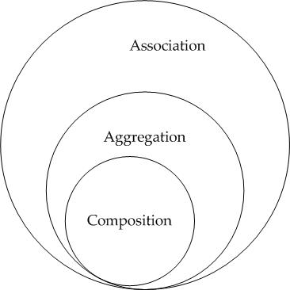

# 1 OOP란?

> 객체 지향 프로그래밍은 컴퓨터 프로그램을 명령어의 목록으로 보는 시각에서 벗어나 여러 개의 독립된 단위, 즉 "객체"들의 모임으로 파악하고자 하는 것이다. 각각의 객체는 메시지 를 주고받고, 데이터를 처리할 수 있다.

- 객체 지향 프로그래밍은 프로그램을 **유연**하고 **변경**이 용이하게 만들기 때문에 대규모 소프 트웨어 개발에 많이 사용된다.


# 2 OOP의 특성

* encapsulation
* inheritance
* polymorphism
* abstraction
* association
* composition
* aggregation


# 3 Encapsulation

* 객체의 상태가 외부로부터 숨겨진 상황에서 이 상태에 접근하는 일련의 공개 메서드만 노출하는 기법을 `캡슐화`라고 합니다.
* 캡슐화는 객체의 상태를 비공개로 유지할 때 성립한다.
* 캡슐화를 정보 은닉이라고 부른다.
* 자바에서는 접근 제어자를 통해 캡슐화를 달성할 수 있다
  * [Access-Modifier.md](../../Language/Java/Access-Modifier/Access-Modifier.md) 참고


## 2.1 캡슐화의 이점

- 느스한 결합
- 재사용성
- 보안 및 테스트를 하기 쉬운 코드


# 4 Inheritance

* 상속
* 이미 존재하는 객체(클래스)를 기반으로 확장된 객체(클래스)를 만드는 방법
* 확장된 객체란?
  * 기존의 개체에 속한 데이터와 동작을 모두 물려 받는다.
  * 여기에 다른 데이터와 동작을 추가할 수 있다.
* 상속은 `IS-A` 관계라고 한다.
* 상속된 객체는 `슈퍼클래스` 또는 `부모 클래스`라고 하고 상속 받는 객체는 `서브클래스` 또는 `자식 클래스`라고 한다.


## 4.1 상속의 이점

* 코드 중복을 막는다


## 4.2 상속의 단점

- 부모 클래스와 자식 클래스 간의 캡슐화를 깨뜨린다.
- 꼭 필요한 경우에만 상속을 사용하고 컴포지션을 대안으로 사용하는 것이 좋다.
  - [Item18.md](../../Language/Java/Effective-Java/Chapter4/Item18/Item18.md) 상속보다는 컴포지션을 사용하라 참조


# 5 Polymorphism

* 다형성은 다른 유형의 엔티티에 단일 인터페이스를 제공하거나 여러 다른 유형을 나타내기 위해 단일 기호를 사용하는 것이다.
* 여러가지 서로 다른 타입의 객체를 어떠한 하나의 타입에 담을 수 있다는 것이다.
* 따라서 한 타입으로 된 리스트에 다른 여러 타입의 객체를 담고 리스트의 원소에 모두 같은 지시를 내리면 다른 타입의 객체는 동작을 달리할 것이다.
  * 만약 절차적 언어 였다면 if 문을 사용해 각각 동작을 달리 했을 것이다.

* 다형성은 컴파일 타임 다형성과 런타임 다형성 두 종류로 구분된다.


## 5.1 컴파일 타임 다형성

- 컴파일 타임 다형성은 메서드 오버로딩으로 구현된다.
- 메서드 오버로딩은 이름은 동일하지만 매개변수가 다른 메서드를 말한다.
- 컴파일러가 오버로딩된 메서드 가운데 어떤 형식을 호출할지 컴파일 타임에 식별할 수 있으므로 `컴파일 타임 다형성`이라 부른다.


> **주의점**
>
> 객체지향 프로그래밍에서 다형성을 가장 중요한 개념으로 여기는 사람들이 있다. 특히 런타임 다형성을 유일한 다형성이라고 여기는 주장도 있다. 


## 5.2 런타임 다형성

* 어떤 함수 구현이 실행될지는 실행중에 결정된다.
* 런타임 다형성은 상속 또는 인터페이스 구현으로 달성할 수 있다


## 5.3 런타임 다형성 예시

- Shape 인터페이스와 이를 구현한 구현체 Circle, Rectangle, Triangle이 있다

```java
public interface Shape {
    public void draw();
}
```

```java
public class Circle implements Shape {
    @Override
    public void draw() {
        System.out.println("Draw a circle ...");
    }
}
```

```java
public class Rectangle implements Shape {
    @Override
    public void draw() {
        System.out.println("Draw a rectangle ...");
    }
}
```

```java
public class Triangle implements Shape {
    @Override
    public void draw() {
        System.out.println("Draw a triangle ...");
    }
}
```

**PolymorphismTest**

- `draw`라는 같은 지시를 했는데 다른 종류의 객체가 동작을 달리한다.
- Shape 타입의 리스트를 선언했지만 런타임에 포함된 실제 객체의 타입은 각각 Triangle, Rectangle, Circle이다.
- 따라서 소스 코드에서 draw라는 추상 메서드를 호출하면 draw 메서드를 오버라이딩한 메서드가 실행되는 것이다.

```java
public class PolymorphismTest {
    @Test
    void test1() {
        List<Shape> shapes = List.of(new Triangle(), new Rectangle(), new Circle());
        shapes.forEach(Shape::draw);
    }
}
```

```
Draw a triangle ...
Draw a rectangle ...
Draw a circle ...
```


# 6 Abstraction

* 문헌에 따라 `데이터 추상화` 또는 `추상화` 라고 한다.
* 추상화는 사용자와 관련 있는 내용만 노출하고 나머지 세부 내용은 숨기는 개념이다.
* 추상화를 통해 사용자는 일을 수행하는 방법이 아니라 일 자체에 집중할 수 있다
* 다형성을 얻기위해 추상화가 필요하다.
  * 추상클래스나 인터페이스를 사용해 추상화 하면 다형성을 사용할 수 있다.


**추상화의 이점**

- 클라이언트는 고수준의 공개 API만 알고 세부 구현 사항을 모르기 때문의 클라이언트와 서버 사이의 결합도가 낮아진다.
- 결합도가 낮기 때문에 서버는 API를 그대로 두고 세부 구현 사항을 변경해도 클라이언트의 영향이 없다.


# 7 Association

* 한 객체가 다른 객체에게 메세지를 보낼 수 있으면 두 객체를 `연관` 관계라고 할 수 있다.
* 한 객체가 다른 객체를 참조하므로써 연관 관계를 만들 수 있다.
  * 참조 변수
  * 메서드의 아규먼트

* 두 클래스는 독집적인 자체 수명을 가진다.
* 객체와 객체 사이에 **양방향** 또는 **단반향** 관계가 있다.


## 7.1 Association 예시

- 한 명의 Person이 여러개의 Team와 연관될 수 있으며 하나의 Team가 여러개의 Person과 연관될 수 있다
- Person과 와 Team 객체는 양방향 다대다 관계가 있다.
- Person는 와 Team 없이 존재할 수 있고 Team도 Person 없이 존재할 수 있다.
  - 독립적인 자체 수명을 가짐


**Person 클래스**

- Person 객체가 Team를 참조하여 메세지를 보낼 수 있다.

```java
public class Person {
    private String name;
    private List<Team> teams;
}
```


**Team 클래스**

- Team 객체가 Person를 참조하여 메세지를 보낼 수 있다.

```java
public class Team {
    private String name;
    private List<Person> people;
}
```


# 8 Aggregation

* Aggregation을 집약이라고 부른다.
* Aggregation은 단방향 연관 관계이다.
  * Association과 나머지 특성은 같지만 단 하나 다른점이다.
  * Aggregation 관계를 이루는 객체는 트리를 구성한다.
  * 부모에서 자식으로의 단방향 참조만 있기 때문에 사이클이 발생하지 않기 때문이다.
  * 반면에 Association은 양뱡향 참조가 있을 수 있기 때문에 사이클이 발생할 수 있다.


* 두 객체 사이에 소유 관계가 있으며 이를 `HAS-A` 관계가 있다라고 한다.
* 두 객체는 자체 수명 주기를 가지고 있다.


## 8.1 Aggregation 예시

- TennisPlayer는 Racket을 소유하고 있다.
- Racket이 TennisPlayer를 사용할 수 없으므로 단방향 연관관계다.
- TennisPlayer가 죽어도 Racket은 영향을 받지 않는다.
  - 두 객체는 자체 수명 주기를 가지고 있다.


TennisPlayer 클래스

```java
public class TennisPlayer {
    private String name;
    private Racket racket;

    public TennisPlayer(String name, Racket racket) {
        this.name = name;
        this.racket = racket;
    }

    public String getName() {
        return name;
    }

    public void setName(String name) {
        this.name = name;
    }

    public Racket getRacket() {
        return racket;
    }

    public void setRacket(Racket racket) {
        this.racket = racket;
    }
}
```


**Racket 클래스**

```java
public class Racket {
    private String type;
    private int size;
    private int weight;

    public Racket(String type, int size, int weight) {
        this.type = type;
        this.size = size;
        this.weight = weight;
    }

    public String getType() {
        return type;
    }

    public void setType(String type) {
        this.type = type;
    }

    public int getSize() {
        return size;
    }

    public void setSize(int size) {
        this.size = size;
    }

    public int getWeight() {
        return weight;
    }

    public void setWeight(int weight) {
        this.weight = weight;
    }
}
```


**Main 클래스**

```java
public class Main {
    public static void main(String[] args) {
        Racket racket = new Racket("Babolat Pure Aero", 100, 300);
        TennisPlayer player = new TennisPlayer("Rafael Nadal", racket);

        System.out.println("Player " + player.getName() + " plays with " + player.getRacket().getType());
    }
}
```


# 9 Composition

* Composition은 더 제한적인 Aggregation 관계를 의미합니다.
* Aggregation은 두 객체가 자체 생명 주기를 가지는 두 객체의 `HAS-A` 관계를 의미한다면, Composition은 단독으로 존재할 수 없는 객체를 포함하는 `HAS-A` 관계를 의미합니다.
* Composition 관계의 부모 자식이 있으면 자식의 라이프사이클은 부모에 의해 관리된다.
  * 자식을 생성하고 삭제하거나 자식을 책임질 다른 부모에게 넘겨주거나 


## 9.1 Composition 예시

- Car가 파괴되면 Engine도 파괴된다고 했을 때 Car와 Engine은 Composition 관계입니다. 


**Car 클래스**

```java
public class Car {
    private final String name;
    private final Engine engine;

    public Car(String name) {
        this.name = name;

        Engine engine = new Engine("petrol", 300);
        this.engine=engine;
    }

    public int getHorsepower() {
        return engine.getHorsepower();
    }
    
    public String getName() {
        return name;
    }    
}
```


**Engine 클래스**

```java
public class Engine {
    private String type;
    private int horsepower;

    public Engine(String type, int horsepower) {
        this.type = type;
        this.horsepower = horsepower;
    }

    public String getType() {
        return type;
    }

    public void setType(String type) {
        this.type = type;
    }

    public int getHorsepower() {
        return horsepower;
    }

    public void setHorsepower(int horsepower) {
        this.horsepower = horsepower;
    }        
}
```


**Main 클래스**

```java
public class Main {
    public static void main(String[] args) {
        Car car = new Car("MyCar");

        System.out.println("Horsepower: " + car.getHorsepower());
    }
}
```


# 10 비교

- Association, Aggregation, Composition을 비교해보자.
- 먼저 Association이 가장 큰 범위로 Aggregation과 Composition을 포함한다.
- Association과 나머지 둘을 나누는 기준은 객체 사이의 양방향 참조가 가능한지 여부다.
- 단반향 참조만 가능하다면 Aggregation, Composition 범주로 좁아진다.
- Aggregation과 Composition을 나누는 기준은 두 객체의 생명 주기다
- 두 객체가 각자의 생명 주기를 가지면 Aggregation parent 객체가 children 객체의 생명주기를 관리하면 Composition이다.
- 그림으로 나타내면 아래와 같다.




**참고**

- https://stackoverflow.com/questions/885937/what-is-the-difference-between-association-aggregation-and-composition
- https://groups.google.com/g/comp.object/c/_j4g-I9jqVg/m/rouCJeVXzR4J
- [자바 코딩 인터뷰 완벽 가이드](http://www.kyobobook.co.kr/product/detailViewKor.laf?ejkGb=KOR&mallGb=KOR&barcode=9791157688197&orderClick=&Kc=)
