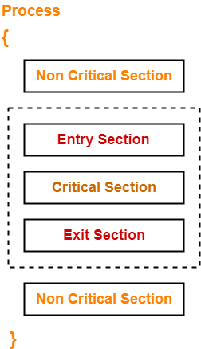
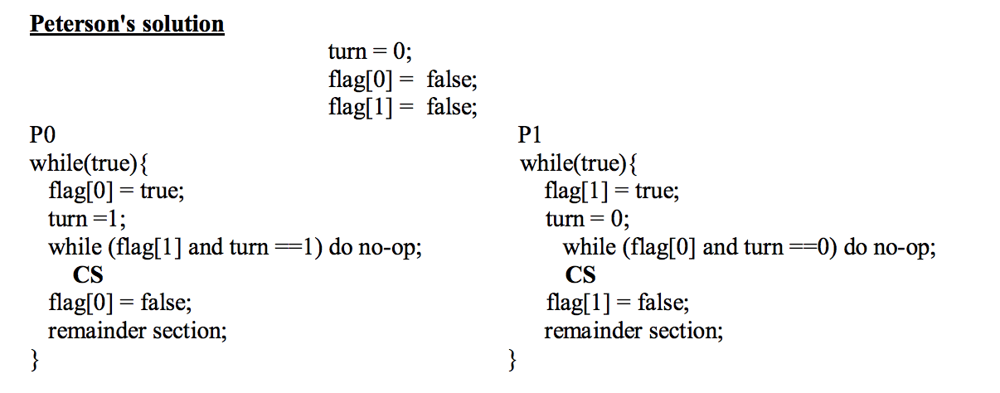
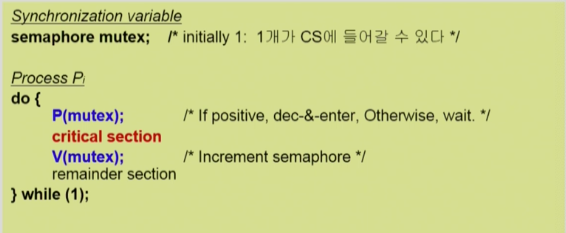

## Race Condition

* 동시에 여러 개의 프로세스가 동일한 자료를 접근하여 조작하고, 그 실행 결과가 접근이 발생한 특정 순서에 의존하는 상황을 의미한다.
* 일관성(consistency)을 유지하기 위해서 협력 프로세스간의 실행 순서를 정해주는 메커니즘이 필요하다
  * 이 메커니즘을 Process Synchronization이라 한다.

## The Critical-Section Problem

* 여러 프로세스가 공유 데이터를 동시에 사용하기를 원하는 경우 각 프로세스의 code segment에는 공유 데이터를 접근하는 critical section이 존재한다.
* 하나의 프로세스가 critical section에 있을 때 다른 모든 프로세스는 critical section에 들어갈 수 없어야한다.
* 각 프로세스는 critical section으로 진입하려면 진입 허가를 요청해야 한다.
* entry section
  * critical section으로 진입하려면 진입 허가를 요청하는 코드 부분
* exit section
  * critical section을 빠져나오는 코드 부분

## critical section 해결법의 충족 조건

* 다음의 세 가지 요구조건을 충족해야한다.

**Mutual Exclusion(상호배제)**

* 한 프로세스가 가지의 임계구경에서 실행된다면, 가른 프로세스들은 그들 자신의 임계구역에서 실행될 수 없다

**Progress(진행)**

* critical section에서 실행되는 프로세스가 없는 상태에서 critical section에 들어가고자 하는 프로세스가 있으면 critical section에 들어가게 해줘야 한다.

**Bounded Wating(한정된 대기)**

* 프로세스가 critical section에 들어가려고 요청한 후부터 그 요청이 허용될 때까지 다른 프세스들이 critical section에 들어가는 횟수에 한계가 있어야한다.

## Peterson's Solution(피터슨 해결안)

* Mutual Exclusion, Progress, Bounded Wating 세 가지 요구조건을 모두 만족한다.
* 단점
  * busy waiting(=spin lock): 계속 CPU와 메모리를 쓰면서 기다리기 때문에 비효율적이다.

## Synchronization Hardware(동기화 하드웨어)

* critical section 문제는 단일 처리기 환경에서는 공유 변수가 변경되는 동안 인터럽트 발생을 허용하지 않으면 해결할 수 있다.
  * 이 해결책은 다중 처리기 환경에서는 적욜할 수 없다.
  * 다중 처리기 상에서 인터럽트의 사용불가능화 메시지가 모든 처리기에 전달되기 때문에 상당한 시간을 소비해 시스템 효율을 떨어뜨린다.
* 현대 기계들은 한 워드(word)의 내용을 검사하고 변경하거나, 두 워드의 내용을 원자적으로 교환할 수 있는, 즉 인터럽트 되지 않는 하나의 단위로서 특별한 하드웨어 명령어를 제공한다.
  * test_and_set()
  * compare_and_swap()

## Semaphores

* critical section 문제를 해결하기 위한 추상적인 자료형
* Busy-wait 방식과 block/wakeup 방식이 있으며 아래는 block/wakeup방식을 설명하고 있다.
  * critical section이 짧은 경우 Busy-wait 방식이 적절할 수 있다. -> block/wakeup 오버헤드가 더 클 수 있으므로
  * 일반적으로는 block/wakeup 방식이 더 효율적이다.
* Semaphores를 아래와 같이 정의한다.

* Semaphores S는 정수 변수로 초기화를 제외하고 두가지 표준 원자적 연산만을 제공한다.
* 원자적 연산: 한 스레드가 세마포 값을 변경하면 다른 어떤 스레드도 동시에 동일한 세마포 값을 변경할 수 없다.
  * wait() 또는 P() : 
    * 자원을 획득할때 사용한다.
    * value를 1감소 시키고 value가 0보다 작다면 wait queue L에 추가하고 block된다.
  * signal() 또는 V() : 
    * 자원을 반납할때 사용한다.
    * value를 1 증가시키고 value가 0이하하면 wait queue에서 기다리고 있는 프로세스를 queue에서 제거하고 wakeup시켜준다.

## Deadlock

