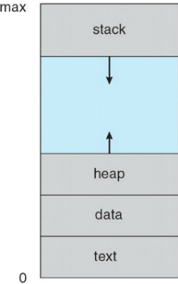
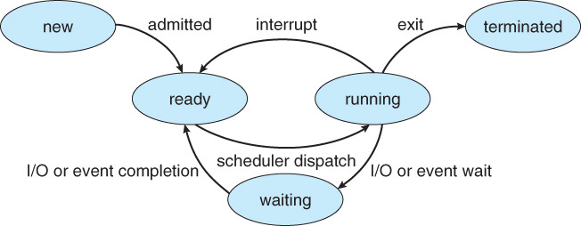
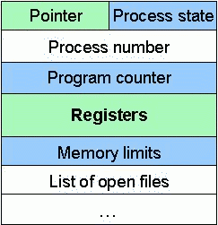
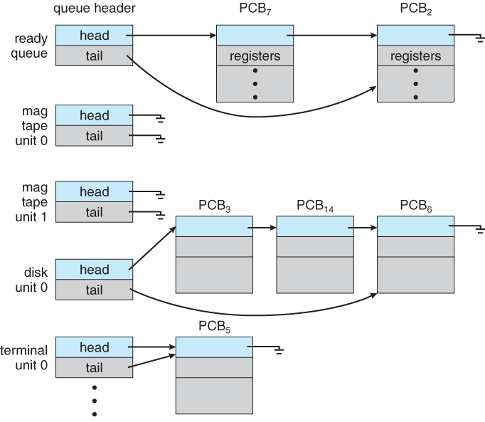

# Process

## 

## Process의 개념

> 프로세스란 실행 중인 프로그램이다. 프로그램은 명령어 리스트를 내용이로 가진 디스크에 저장된 파일과 같은 수동적인 존재이다. 이와 대조적으로 프로세스는 다음에 실행한 명령어를 지정하는 프로그램 카운터와 관련 자원의 집합을 가진 능동적인 존재이다. 실행 파일이 메모리에 적재될 때 프로그램은 프로세스가 된다.

## Process의 주소 공간

* stack
  * 임시적인 자료
  * 함수의 매개변수
  * 복귀 주소
  * 로컬 변수
* heap
  * 프로세스 실행중에 동적으로 할당되는 메모리
* data
  * 전역 변수
* code(text)
  * 프로그램 코드

## Process의 상태

* 프로세스는 실행되면서 상태가 변한다
* 프로세스는 다음 상태 중 하나에 있게 된다.

* new: 프로세스가 생성 중이다.
* running: 명령어들이 실행되고 있다.
* wating(blocked): 프로세스가 어떤 사건이 일어나기를 기다린다.
  * CPU에 할당되어도 명령어를 처리할 수 없는 상태
  * 입출력 완료 또는 신호의 수신을 기다린다
  * 예) 디스크에서 file을 읽어와야 하는 경우
* suspended(stopped): 외부적인 이유로 프로세스의 수행이 정지된 상태
  * 프로세스가 중기 스케줄러에 의해 메모리에서 디스크로 swap out된 상태
  * 외부에서 다시 재개를 시켜야지만 active한 상태가 된다
* ready:프로세스가 처리기에 할당되기를 기다린다.
* terminate: 프로세스의 실행이 종료되었다.

## PCB(Process Controll Block)

* 각 프로세스는 운영체제에서 프로세스 제어 블록에 의해 표현된다.

* 프로세스 상태
  * new, running, wating, ready, terminate
* 프로그램 카운터
  * 다음에 실행할 명령어의 주소를 가리킨다.
* CPU 레지스터들
  * 프로그램 카운터와 함께 이 상태 정보는, 나중에 프로세스가 올바르게 실행되도록 하기 위해서, 인터럽트 발생 시 저장되어야 한다.
* CPU 스케쥴링 정보
  * 프로세스의 우선순위
* 메모리 관련 정보
  * code, data, stack의 위치정보
* 회계 정보
* 입출력 상태 정보

## Context

* 프로세스의 현재 상태를 나타내기 위한 모든 정보를 context라 한다.
* 프로세스의 문맥은 아래와 같다
  * CPU 수행 상태를 나타내는 하드웨어 문맥
    * program counter, 각종 register
  * 프로세스의 주소 공간
    * code, data, stack
  * 운영체제의 커널이 프로세스를 관리하기 위해 사용하는 자료 구조
    * PCB
      * 커널의 데이터 영역에서 프로세스의 context를 관리하기위해 사용하는 자료구조
    * Kernel stack

## Context Switch

> CPU를 다른 프로세스로 교환하려면 이전의 프로세스의 상태를 보관하고 새로운 프로세스의 보관된 상태를 복구하는 작업이 필요하다. 이 작업을 문맥 교환(Context Switch)라고 한다. 문맥 교환이 일어나면 커널은 과거 프로세스의 문맥을 PCB에 저장하고, 실행이 스케줄된 프로세스의 저장된 문맥을 복구한다.

* 시스템 콜이나 인터럽트 발생시 반드시 Context Switch가 일어나는 것은 아니다
* 시스템 콜이나 인터럽트 발생시 커널 모드로 진입하는데 이는 Context Switch가 아니다
  * 이 경우에도 CPU 수행 정보 등 context의 일부를 PCB에 저장해야 하지만 두 사용자 프로세스의 문맥교환보다 비용이 적게든다.
* 사용자 프로세스 A를 실행중 시스템콜이나 인터럽트 발생시 커널 모드에 진입 이후 문맥 교환 없이 프로세스 A의 user mode로 복귀하는 경우 Context Switch가 일어난다고 할 수 없다.
* 허나 timer interrupt나 프로세스 A의  I\O 요청 system call인 경우에는 항상 문맥교환이 일어난다

## Process Scheduling

> 다중 프로그래밍의 목적은 CPU 이용을 최대하기 위해 항상 어떤 프로세스가 실행되도록 하는데 있디. 시분할의 목적은 각 프로그램이 실행되는 동안 사용자가 상호 작용할 수 있도록 프로세스들 사이에 CPU를 빈번히 교체하는 것이다. 이 목적을 달성하기 위해 프로세스 스케줄러는 CPU에서 실행 가능한 여러 프로세스중에서 하나의 프로세스를 선택하며 이를 프로세스 스케줄링이라고 한다.

## 스케줄링 큐

**Job queue**

* 현재 시스템 내에 있는 모든 프로세스의 집합

**ready queue**

* 현재 메모리 내에 있으면서 CPU 할당을 기다리는 프로세스의 집합

**device queue**

* I\O 장치의 처리를 기다리는 프로세스의 집합
* 각 장치는 그 자신의 `device queue`를 가진다

## Scheduler

> 프로세스는 일생 동안에 다양한 스케줄링 쿠들 사이를 이주한다. 운영체제는 어떤 방식으로든지 스케줄링 목적은 위해 프로세스들을 이들 큐에서 반드시 선택해야한다. 이 선택을 적절한 스케줄러가 하게 된다. 스케줄러는 아래와 같이 구분된다.

**Long-term scheduler(장기 스케줄러)**

* 시작 프로세스 중 어떤 것을 `ready queue`로 보낼지 결정한다.
* 프로세스에 memory 및 각종 자원을 할당한다.
* Degree of Mutilprograming을 제어한다.
  * 메모리에 올라가있는 프로세스의 수를 의미한다.
* 시분할 시스템에서는 보통 `Long-term scheduler`가 없어 프로세스가 시작되면 바로 `ready queue` 에 들어간다.

**Short-term scheduler(단기 스케줄러)**

* 어떤 프로세스에 CPU를 할당할지 결정한다

**Medium-term scheduler(중기 스케줄러 or swapper)**

* 메모리의 여유 공간을 마련하기 위해 프로세스를 메모리에서 디스크로 쫓아낼지를 결정한다.
* 이러한 기법을 swapping이라 한다.
* Degree of Mutilprograming을 제어한다.