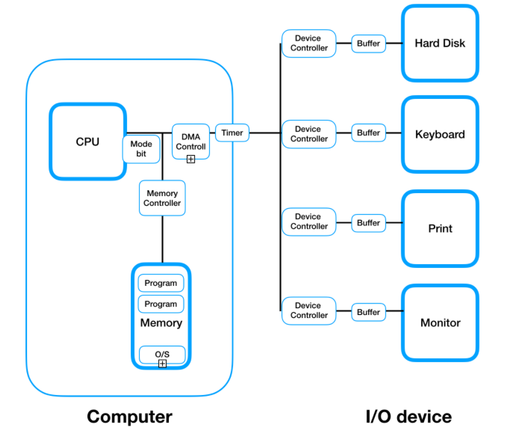
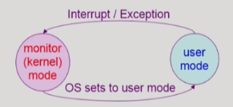

#   System Structure

## CPU

* 

**mode bit**

* 운영체제 코드를 실행중인지 사용자의 코드를 실행중인지 구별하기위해 사용되는 비트
* 유저 모드와 커널 모드로 구분된다.
* 악의적인 사용자로부터 운영체제를 보호하기위해 모드 비트를 사용한다.
  * 시스템의 해를 끼칠 수 있는 인스트럭션들은 커널 모드에서만 동작하게해서 운영체제를 보호한다.
  * 이러한 인스트럭션을 privileged instructions이라 한다.
  * 예) 유저 모드에서 커널 모드로 전환하는 인스트럭션

**registers**

* 

## Memory

* CPU는 실행할 인스트럭션을 오직 메모리에서만 가져올 수 있다. 따라서 어떤 프로그램이든 실행하기 위해선 메모리에 올라가야한다.
* 메모리는 휘발성 저장소로 전원이 꺼지면 모든 내용이 손실된다.

## Timer

* 특정 프로세스가 CPU를 독점하는 것을 막기위해 사용되는 하드웨어
* 타이머는 일정 시간마다 인터럽트를 발생시켜 특정 프로세스가 CPU를 독점하는 것을 막는다.
* 타이머에 할당 시간을 세팅하고 타이머의 시간은 매 클락마다 감소하면서 0이 되면 인터럽트를 발생시키고 커널 모드로 전환한다.

## DMA Controller

* direct memory access controller
* 입력 장치에 입력이 발생할 때 마다 인터럽트를 발생시키고 이를 CPU 너무 많은 인터럽트가 발생해 효율적이지 못하다.
* 이를 해결하기위해 DMA Controller가 사용된다.
* CPU 대신, DMA Controller는 데이터 블록 전체를 메인 메모리에 직접 올린다.
* 블록 전체를 메모리에 올리고 오직 한번만 인터럽트를 발생시킨다.

## I/O device

**device controller**

* 해당 I/O device를 관리하는 일종의 CPU라고 보면 된다.
* 제어 정보를 위해 control register, status register를 가진다.
* 실제 I/O는 device와 local buffer 사이에서 일어난다.
* **device controller**는 I/O가 끝났을 때 인터럽트로 CPU에게 그 사실을 알린다.
* 예) 하드 디스크의 헤드를 어떻게 움직일지 관리하는 것은 CPU가 아니라 하드 디스크의 **device controller**가 관리한다.

**device driver**

* 

**local buffer**

* CPU의 작업 공간인 memory가 있듯이 **device controller**의 작업 공간인 **local buffer**가 존재한다.

참조

* https://core.ewha.ac.kr/publicview/C0101020140311132925816476?vmode=f