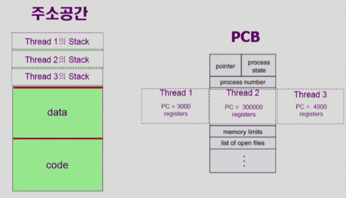

# Threads

## Threads의 개념

> 스레드는  CPU 이용의 기본 단위이다. 스레드는 스레드 ID, 프로그램 카운터, 레지스터 집합, 그리고 스택으로 구성된다. 스레드는 같은 프로세스에 속한 다른 스레드와 코드, 데이터 섹션 그리고 열린 파일이나 신호와 같은 운영체제 자원들을 공유한다.

* PCB에서 cpu 관련 정보는 쓰레드마다 별도로 관리되는 것을 볼 수 있다

## Threads의 장점

* 응답성(Responsiveness)
  * 대화형 어플리케이션을 다중 스레드화 하면 으용 프로그램의 일부분이 봉돼되거나, 또는 응용 프로그램이 긴 작업을 수행하더라고 프로그램의 수행이 계속되는 것을 허용해 사용자에 대한 응답성을 증가시킨다.
  * 한 쓰레드가 block되면 다른 쓰레드가 계속 진행 될 수 있기 때문이다.
  * 예) 멀티 쓰레드 웹 : 한 쓰레드가 네트워크 요청을 보내고 응답받기를 기다리고 있는 상태(blocked)일 때 다른 쓰레드가 다른 정보들을 화면에 그려주는 일을 수행함으로써 사용자 응답성을 높일 수 있다
* 자원 공유(Resource Sharing)
  * 스레드는 자동적으로 그들이 속한 프로세스의 자원들과 메모리를 공유한다.
  * 프로세스에 속한 다른 스레드와 코드, 데이터 섹션 그리고 열린 파일이나 신호와 같은 운영체제 자원들을 공유한다.
* 경제성(Economy)
  * 스레드는 자신이 속한 프로세스의 자원들을 공유하기 때문에, 스레드를 생성하고 문맥 교환하는 것이 프로세스를 생성하고 문맥을 교환하는 것보다 더 경제적이다.
  * 쓰레드간 동일한 주소공간을 사용하기 때문에 대부분의 context를 그대로 사용할 수 있기 때문에 경제적이다.
* 규모 적응성(Scalability)
  * 다중 스레드의 이점은 다중 처리기 구조에서 더욱 증가한다. 
  * 다중 처리기 구조에서는 각각의 스레드가 다른 처리기에서 병령로 수행될 수 있기 때문이다.
  * 단일 스레드 프로세스는 처리가가 많더라고 오직 한 처리기에서만 실행된다.