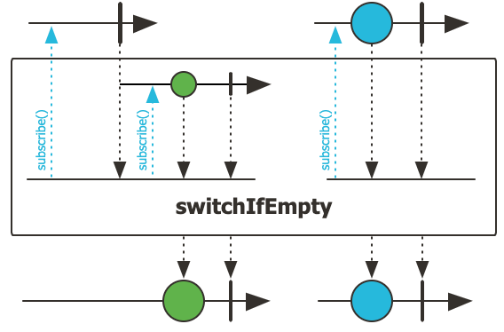
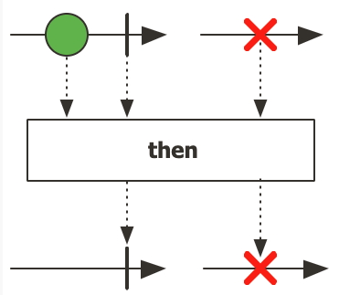
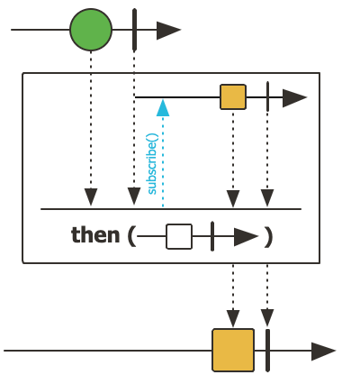

# 1 Project Reactor

* Project Reactor는 Reactive Streams specification의 구현체다
* 리액터를 사용하면 아래와 같은 특성을 갖는 리액티브 프로그래밍을 활용할 수 있다
  * 논블로킹, 비동기 프로그래밍 모델
  * 함수형 프로그래밍 스타일
  * 스레드를 신경 쓸 필요 없는 동시성

* 리액터는 핵심 타입인 `Flux<T>` 를 사용해서 수요 조절을 구현한다


# 2 [Mono](https://projectreactor.io/docs/core/release/api/reactor/core/publisher/Mono.html)


## defer

```java
public static <T> Mono<T> defer(Supplier<? extends Mono<? extends T>> supplier)
```


* defer 메서드를 통해 cold publisher를 생성할 수 있다
* defer 메서드는 Mono를 제공하는 Supplier를 인수로 받는다
* 다운 스트림에서 구독한 시점에 Lazy하게 Supplier를 통해 Mono를 반환한다

> 참고
>
> * https://www.baeldung.com/java-mono-defer


## switchIfEmpty

```java
public final Mono<T> switchIfEmpty(Mono<? extends T> alternate)
```



* this Mono가 onNext 시그널 없이 onComplete 시그널을 보내면 alternate Mono로 전환한다


## then

```java
public final Mono<Void> then()
```



* this Mono의 complete 시그널과 error 시그널을 리플레이한다


```java
public final <V> Mono<V> then(Mono<V> other)
```



* this Mono가 complete 시그널을 보내면 other Mono로 전환한다
  * 즉 this Mono가 방출한 요소를 무시한다
* this Mono가 error 시그널을 보내면 error시그널을 리플레이 한다


# 3 [Flux](https://projectreactor.io/docs/core/release/api/reactor/core/publisher/Flux.html)

* 결과가 아직 정해지지 않았고 미래 어느 시점이 되어야 알 수 있다는 점에서 Flux는 Future와 비슷하다
  * 하지만 Future는 이미 시작되었음을 나타내지만 Flux는 시작할 수 있음을 나타낸다
* Flux는 시작할 수 있음을 나타낸다것의 의미
  * 프로젝트 리액터에서 필요한 모든 흐름과 모든 핸들러를 정의할 수 있지만 구독하기 전까지는 실제로 아무런 연산도 일어나지 않는다


**Flux와 레스토랑 점원 비유**

> Flux<T>는 실제 물건을 전달해주는 플레이스 홀더로 쉽게 말해 레스토랑에서 일하는 서빙 점원과 비슷하다. 주방에 요리가 완성되면 점원이 주방에서 요리를 받아서 손님에게 가져다주고, 다시 제자리로 돌아와 다음 요리를 기다린다. 서빙 점원은 요리가 주방에서 언제 완성될지 알 수 없다. 점원은 `Flux<Dish>` 를 바로 받을 수 있는데 `Flux<Dish>` 에 포함된 요리는 아직 완성되지 않았지만 머지않아 완성될 것이다. 요리가 완성되면 서빙 점원은 행동에 나설 수 있다. 즉 요리 완성에 대한 반응 행동 리액트라고 할 수 있다. 리액터는 논 블로킹으로 동작하기 때문에 주방에서 요리가 완성될 때까지 점원이(서버 스레드) 다른 일을 못 한 채 계속 기다리지 않는다


## 3.1 Flux의 특징

* 하나 이상의 요소 포함 가능
* 각 요소가 제공될 때 어떤 일이 발생하는지 지정 가능
* 성공과 실패 두 가지 경로 모두에 처리 방향 정의 가능
* 결과 폴링 불필요
* 함수형 프로그래밍 지원


# 4 Hot Versus Cold

* Publisher의 종류로 Hot, Cold가 있다


## 4.1 Cold Publisher

* Cold Publisher는 비동기 데이터 시퀀스를 나타내며 구독이 일어나기 전에는 아무런 일이 일어나지 않는다
* 각각의 구독마다 새로운 데이터를 생성한다
* 구독이 일어나지 않으면 데이터는 생서되지 않는다


## 4.2 Hot Publisher

* Hot Publisher는 Subscriber의 수와 관련이 없다
  * Subscriber가 하나도 없어도 데이터를 생성해낸다는 것
* Hot Publisher 즉시 데이터를 생성할 수 있다
* 새로운 Subscriber가 Subscribtion을 하면 Subscriber는 Subscribtion 이후 방출된 요소만 볼 수 있다
* Cold Publisher는 Subscribtion을 하지 않으면 아무일도 발생하지 않지만 Hot Publisher는 내가 Subscribtion을 하지 않아도 어떠한 일이 일어나고 있는 것이다


## 4.3 비교

* Cold Publisher와 Hot Publisher를 비유해보자면 Cold Publisher는 넷플릭스에서 영화를 스트리밍으로 보는것이고 Hot Publisher는 TV에서 방영되는 영화를 보는것이며 영화 시작 이후 TV를 켜면 이후 내용만 볼 수 있다


> 참고
>
> * https://projectreactor.io/docs/core/release/reference/#reactor.hotCold


# 5 Testing


> 참고
>
> * [StepVerifier Docs](https://projectreactor.io/docs/test/release/api/reactor/test/StepVerifier.html)


참고

* https://projectreactor.io/docs/core/release/reference/
* https://projectreactor.io/docs/core/release/api/