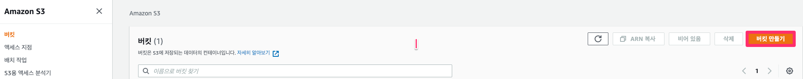
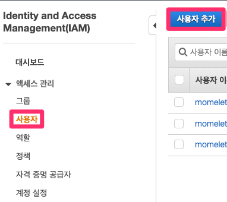
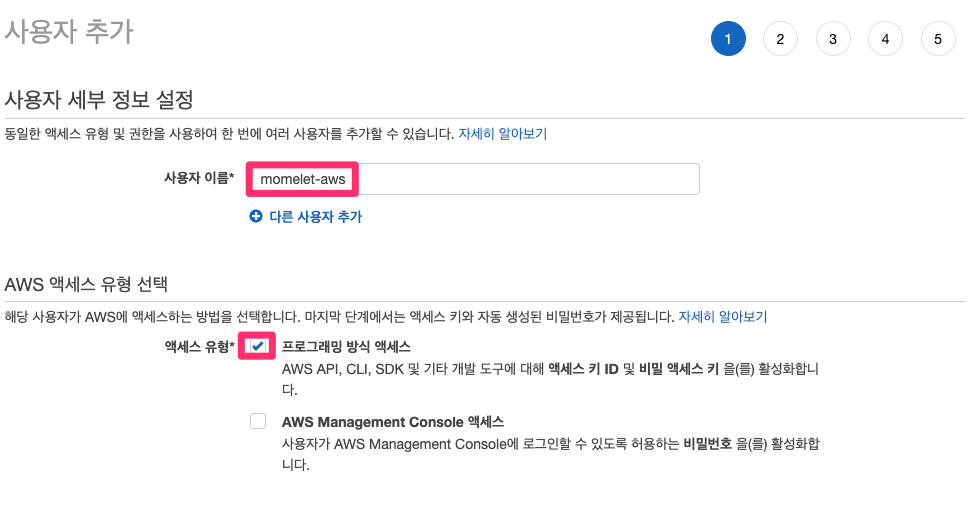
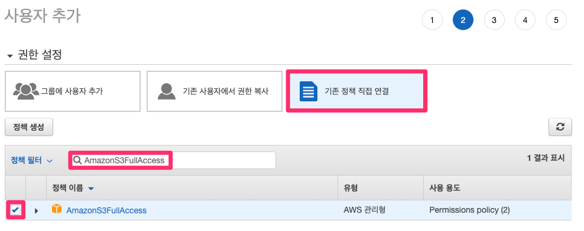
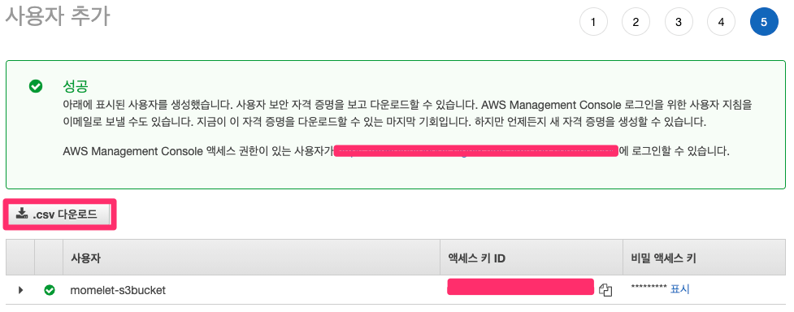

# SpringBoot & AWS S3 연동하기


## 버킷 생성

### 


## 로컬에서 연동하기

### IAM 사용자 만들기

* S3 버킷에 접근할 수 있도록 `accessKey` 와 `secretKey` 를 발급받겠습니다.
* 우선 IAM 사용자를 생성합니다.









```
cloud.aws.s3.bucket=momelet-bucket
cloud.aws.region.static=ap-northeast-2
cloud.aws.stack.auto=false
cloud.aws.credentials.instanceProfile= true
```


