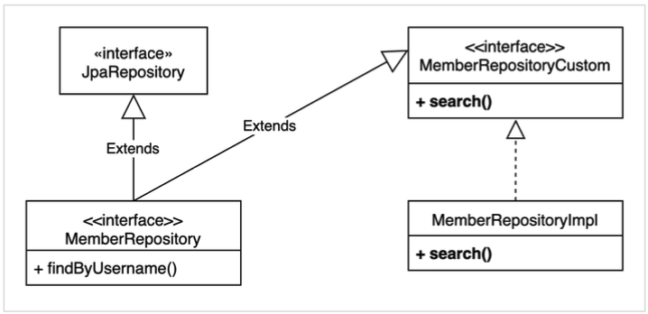

# 1 사용자 정의 리포지토리

* 스프링 데이터 JPA 리포지토리는 인터페이스만 정의하고 구현체는 스프링이 자동 생성
* 스프링 데이터 JPA가 제공하는 인터페이스를 직접 구현하면 구현해야 하는 기능이 너무 많음
* 인터페이스의 메서드를 직접 구현하고 싶다면 사용자 정의 리포지토리를 구현한다
* 실무에서는 주로 QueryDSL이나 SpringJdbcTemplate을 함께 사용할 때 사용자 정의 리포지토리 기능 자주 사용


**구성**




# 2 사용자 정의 인터페이스

* 직접 구현할 메소드 정의

```java
public interface MemberRepositoryCustom {
      List<MemberTeamDto> search(MemberSearchCondition condition);
}
```


# 3 사용자 정의 인터페이스 구현 클래스

* 구현 클래스의 이름 = `리포지토리 인터페이스 이름` + `Impl` 또는 `사용자 정의 인터페이스 이름 + Impl`
  * `MemberRepositoryImpl` 또는 `MemberRepositoryCustomImpl`
* 사용자 정의 인터페이스를 구현한다.

```java
@RequiredArgsConstructor
public class MemberRepositoryImpl implements MemberRepositoryCustom {
    private final JPAQueryFactory queryFactory;

    public List<MemberTeamDto> search(MemberSearchCondition condition) {
      return queryFactory
        .select(new QMemberTeamDto(
          member.id,
          member.username,
          member.age,
          team.id,
          team.name))
        .from(member)
        .leftJoin(member.team, team)
        .where(usernameEq(condition.getUsername()),
               teamNameEq(condition.getTeamName()),
               ageGoe(condition.getAgeGoe()),
               ageLoe(condition.getAgeLoe()))
        .fetch();
      
      private BooleanExpression usernameEq(String username) {
        return isEmpty(username) ? null : member.username.eq(username);
      }
      
      private BooleanExpression teamNameEq(String teamName) {
        return isEmpty(teamName) ? null : team.name.eq(teamName);
      }
      
      private BooleanExpression ageGoe(Integer ageGoe) {
        return ageGoe == null ? null : member.age.goe(ageGoe);
      }
      
      private BooleanExpression ageLoe(Integer ageLoe) {
        return ageLoe == null ? null : member.age.loe(ageLoe);
      } 
   }
}
```


# 4 사용자 정의 인터페이스 상속

```java
public interface MemberRepository extends JpaRepository<Member, Long>, MemberRepositoryCustom {
	List<Member> findByUsername(String username);
}
```

> 항상 사용자 정의 리포지토리가 필요한 것은 아니다. 그냥 임의의 리포지토리를 만들어도 된다. 예를들어 MemberQueryRepository를 인터페이스가 아닌 클래스로 만들고 스프링 빈으로 등록해서 그냥 직접 사용해도 된다. 물론 이 경우 스프링 데이터 JPA와는 아무런 관계 없이 별도로 동작한다.

**실제 사용**

```java
@Test
public void searchTest() {
      Team teamA = new Team("teamA");
      Team teamB = new Team("teamB");
      em.persist(teamA);
      em.persist(teamB);
      
    	Member member1 = new Member("member1", 10, teamA);
      Member member2 = new Member("member2", 20, teamA);
      Member member3 = new Member("member3", 30, teamB);
      Member member4 = new Member("member4", 40, teamB);
      em.persist(member1);
      em.persist(member2);
      em.persist(member3);
      em.persist(member4);
      
    	MemberSearchCondition condition = new MemberSearchCondition();
      condition.setAgeGoe(35);
      condition.setAgeLoe(40);
      condition.setTeamName("teamB");
      
    	List<MemberTeamDto> result = memberRepository.search(condition);
      assertThat(result).extracting("username").containsExactly("member4");
}
```

