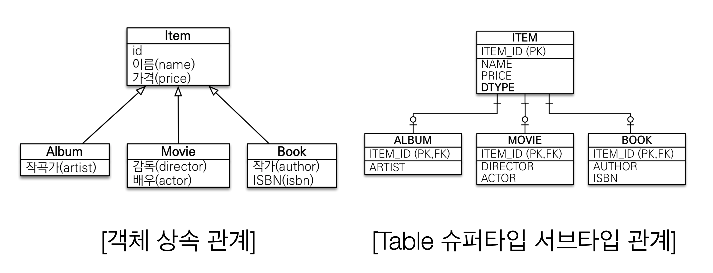

# JPA

> JPA(Java Persistence API)는 자바 진영의 ORM 기술 표준이다. ORM은 이름 그대로 객체와 관계형 데이터베이스를 매핑한다는 뜻이다. ORM 프레임 워크는 객체와 테이블을 매핑해서 패러다임 불일치 문제를 개발자 대신 해결해준다.

* 지루하고 반복적인 CRUD SQL을 알아서 처리해준다.
* 객체 모델링과 관계형 데이터베이스 간의 차이를 중간에서 해결해준다.
* 애플리케이션을 SQL이 아닌 객체 중심으로 개발하게 해준다.
* JPA는 애플리케이션과 JDBC 사이에서 동작한다.
* JPA는 인터페이스의 모음
  * JPA 2.1 표준 명세를 구현한 3가지 구현체 하이버네이트, EclipseLink, DataNucleus


## JPA를 사용해야 되는 이유

* SQL 중심적인 개발에서 객체 중심으로 개발
* 생산성
* 유지보수
* 패러다임의 불일치 해결
* 성능
* 데이터 접근 추상화와 벤더 독립성 
* 표준


## SQL 중심적인 개발의 문제점

* 반복되는 지루한 CRUD SQL

  * 자바 객체를 -> SQL / SQL을 자바 객체로

* SQL에 의존적인 개발

  * 서로 의존하기 때문에 변경사항이 발생하면 서로에게 영향을 준다.

  * 요구사항의 변경으로 회원의 연락처를 추가로 저장해야한다면?

  * 여러 SQL을 찾아 일일이 변경해줘야한다!

  * ```java
    public class Member {
      private String memberId;
      private String name;
      private String tel; //추가
    ...
    }	
    ```

  * ```sql
    # TEL 컬럼 추가
    INSERT INTO MEMBER(MEMBER_ID, NAME, TEL) VALUES
    # TEL 컬럼 추가
    SELECT MEMBER_ID, NAME, TEL FROM MEMBER M 
    # TEL 컬럼 추가
    UPDATE MEMBER SET ... TEL = ?
    ```


## 패러다임 불일치

> 관계형 데이터베이스는 데이터 중심으로 구조화되어 있고, 십합적인 사고를 요구한다 그리고 객체지향에서 이야기하는 추상화, 상속, 다형성 같은 개념이 없다. 애플리케이션을 자바라는 객체지향 언어로 개발하고 데이터는 관계형 데이터 베이스에 저장해야 한다면, 패러다임 불일치 문제를 개발자가 중간에서 해결해야 한다.

### 상속

* 객체는 상속이라는 개념이 있지만 테이블은 상속이라는 기능이 없다.
* 슈퍼타입 서브타입 관계를 사용하면 객체 상속과 가장 유사한 형태의 테이블을 설계할 수 있다.



**Album 객체를 데이터 베이스로 저장하는 과정**

1. 객체 분해
2.  INSERT INTO ITEM ..
3.  INSERT INTO ALBUM ...

**Album 객체를 데이터 베이스에서 조회하는 과정**

1. ITEM 과 ALBUM JOIN SQL 작성
2. 각각의 객체를 생성
3. 복잡한 과정..
4. 그래서 DB에 저장할 객체에는 상속 관계를 사용하지 않는다.

**Album 객체를 자바 컬렉션에 저장하는 과정**

1. list.add(album)

**Album 객체를 자바 컬렉션에 조회하는 과정**

1. Album album = list.get(albumId);

다형성 활용

1. Item item = list.get(albumId)


---


### 연관관계

* 객체는 참조를 사용해서 다른 객체와 연관관계를 가지고 참조에 접근해서 연관된 객체를 조회한다.
* 반면 테이블은 외래키를 사용해서 다른 테이블과 연관관계를 가지고 조인을 사용해서 연관된 테이블을 조회한다.


**객체를 테이블에 맞추어 모델링**

* 객체 그래프 탐색을 할 수 없다.
* 객체 모델링은 기대하고 어렵고 결국 객체지향적인 특징을 잃어 버리게 된다.
* 객체를 데이터 베이스에 저장하고 조회하기 쉽다.

```java
class Member {
  String id; //MEMBER_ID 컬럼 사용
  Long teamId; //TEAM_ID FK 컬럼 사용 
  String username;//USERNAME 컬럼 사용
}

class Team {
  Long id; //TEAM_ID PK 사용
  String name; //NAME 컬럼 사용
}
```

**테이블 모델링 저장**

* 쉽다

```sql
INSERT INTO MEMBER(MEMBER_ID, TEAM_ID, USERNAME) VALUES ...
```


**객체다운 모델링**

* 객체 그래프 탐색이 가능하다.
* 객체를 데이터 베이스에 저장하고 조회하기 어렵다.
* 객체 모델링을 할수록 패러다임 불일치 문제가 더 커진다.

```java
class Member {
  String id; //MEMBER_ID 컬럼 사용
  Team team; //참조로 연관관계를 맺는다.
  String username;//USERNAME 컬럼 사용
 
  Team getTeam() { 
    return team;
  }
}

class Team {
  Long id; //TEAM_ID PK 사용
  String name; //NAME 컬럼 사용
}
```


**객체 모델링 저장**

* 테이블 모델링 저장보다 할일이 늘었다?


```sql
member.getTeam().getId(); //TEAM_ID를 얻는 과정
INSERT INTO MEMBER(MEMBER_ID, TEAM_ID, USERNAME) VALUES ...
```


**객체 모델링 조회**

* SQL을 실행하고 결과물로 객체를 만들어 정보를 입력하는 일을 개발자가 하고있다.

```sql
SELECT M.*, T.* FROM MEMBER M
JOIN TEAM T ON M.TEAM_ID = T.TEAM_ID
```

```java
public Member find(String memberId) {
      //SQL 실행 ...
      Member member = new Member();
      //데이터베이스에서 조회한 회원 관련 정보를 모두 입력
      Team team = new Team();
      //데이터베이스에서 조회한 팀 관련 정보를 모두 입력
      //회원과 팀 관계 설정
      member.setTeam(team);
      return member;
}	
```


**객체 모델링, 자바 컬렉션에 관리**

* 데이터 베이스에 저장하고 조회하는 과정과 비교하면 훨씬 간편하다.
* `Member`를 조회하고 객체 그래프 탐색을 할 수 있다.

```java
list.add(member);
 
Member member = list.get(memberId);
Team team = member.getTeam();
```


**객체 그래프 탐색**

* SQL을 직접 다루면 처음 실행하는 SQL에 따라 객체 그래프 탐색 범위가 정해진다.

```sql
SELECT M.*, T.* FROM MEMBER M
JOIN TEAM T ON M.TEAM_ID = T.TEAM_ID
```

* 위에 SQL을 실행 후 
  * `member.getTeam();` -> OK
  * `member.getOrder();` -> null
* 그렇다고 모든 객체를 미리 로딩할 수는 없다.
  * 결국 메소드를 상황에 따라 여러개 만들어서 사용해야 한다.
  * memberDAO.getMember()
  * memberDAO.getMemberWithTeam()
  * .....

**객체 그래프 탐색 with JPA**

* JPA는 앞서 언급한 SQL을 직접 다루면 발생하는 문제를 해결한다.
* JPA를 사용하면 자유롭게 객체 그래프 탐색이 가능하다.
* JPA는 연관된 객체를 사용하는 시점에 적절한 SELECT SQL을 실행하게 된다. 이를 `지연 로딩`이라고 한다.
* `지연 로딩`
  * 실제 객체를 사용하는 시점까지 데이터베이스 조회를 미룬다.
* `즉시 로딩`
  * JOIN SQL로 한번에 연관된 객체까지 미리 조회

---


### 비교

* 데이터베이스는 기본 키의 값으로 로우를 구분한다.
* 객체는 동일성 비교와 동등성 비교라는 두가지 방법이 있다.
  * 동일성: `==` 비교, 객체 인스턴스의 주소 값을 비교한다.
  * 동등성: `equals()` 메소드를 사용해서 객체 내부의 값을 비교한다.
* 데이터베이스와 객체에서의 비교는 서로 다르다


**비교하기**

* 같은 로우를 조회했지만 객체의 동일성 비교에는 실패했다.

```java
String memberId = "100";
Member member1 = memberDAO.getMember(memberId); 
Member member2 = memberDAO.getMember(memberId);
member1 == member2; //다르다. 

class MemberDAO {
  public Member getMember(String memberId) {
    String sql = "SELECT * FROM MEMBER WHERE MEMBER_ID = ?";
    ...
    //JDBC API, SQL 실행
    return new Member(...);
  }
}
```

**JPA와 비교**

* JPA는 같은 트랜잭션일 때 같은 객체가 조회되는 것을 보장한다.

```java
String memberId = "100";
Member member1 = jpa.find(memberId); 
Member member2 = jpa.find(memberId);
member1 == member2; //같다. 
```


## 패러다임 불일치 해결

* JPA가 패러다임 불일치 해결


### JPA와 상속

**Album 객체를 데이터 베이스로 저장하는 과정**

* 개발자가 하는 일
  * jpa.persist(album);
* JPA가 하는 일
  *  INSERT INTO ITEM ..
  *  INSERT INTO ALBUM ...

**Album 객체를 데이터 베이스에서 조회하는 과정** 		

* 개발자가 하는 일

  * Album album = jpa.find(Album.class, albumId);

* JPA가 하는 일

  * ```sql
    SELECT	I.*, A.*
    FROM		ITEM I
    JOIN		ALBUM A ON I.ITEM_ID = A.ITEM_ID
    ```


### JPA와 연관관계

**연관관계를 가진 객체를 데이터 베이스로 저장하는 과정**

* 개발자가 하는 일

  * member.setTeam(team);
  * jpa.persist(member);

* JPA가 하는 일

  * ```
    member.getTeam().getId(); //TEAM_ID를 얻는 과정
    INSERT INTO MEMBER(MEMBER_ID, TEAM_ID, USERNAME) VALUES ...
    ```

**객체 그래프 탐색하는 과정**

* 개발자가 하는 일

  * Member member = jpa.find(Member.class, memberId);
  * Team team = member.getTeam();

* JPA가 하는 일

  * ```sql
    SELECT M.* FROM MEMBER M
    SELECT T.* FROM TEAM T
    ```

### JPA와 비교

* 동일한 트랜잭션에서 조회한 엔티티는 같음을 보장한다.

```java
String memberId = "100";
Member member1 = jpa.find(Member.class, memberId); 
Member member2 = jpa.find(Member.class, memberId);
member1 == member2; //같다.
```


## JPA의 성능 최적화 기능

1. 1차 캐시와 동일성(identity) 보장
2. 트랜잭션을 지원하는 쓰기 지연(transactional write-behind) 
3. 지연 로딩(Lazy Loading)


참조

* [자바 ORM 표준 JPA 프로그래밍](http://www.acornpub.co.kr/book/jpa-programmig)
* 인프런 자바 ORM 표준 JPA 프로그래밍

