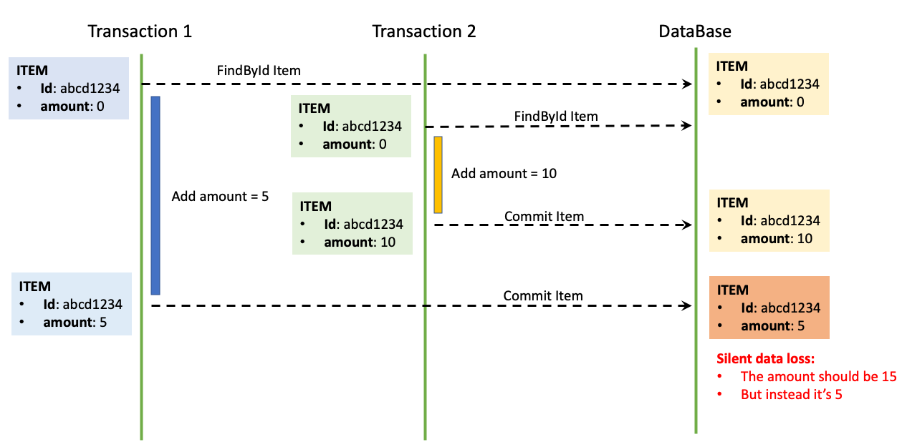
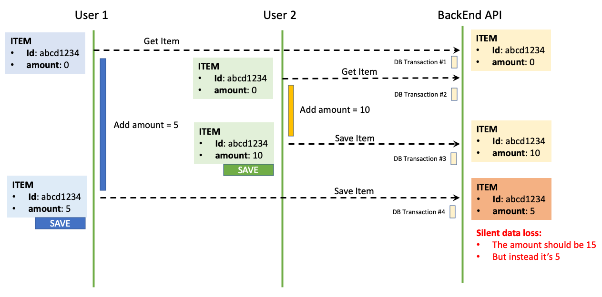
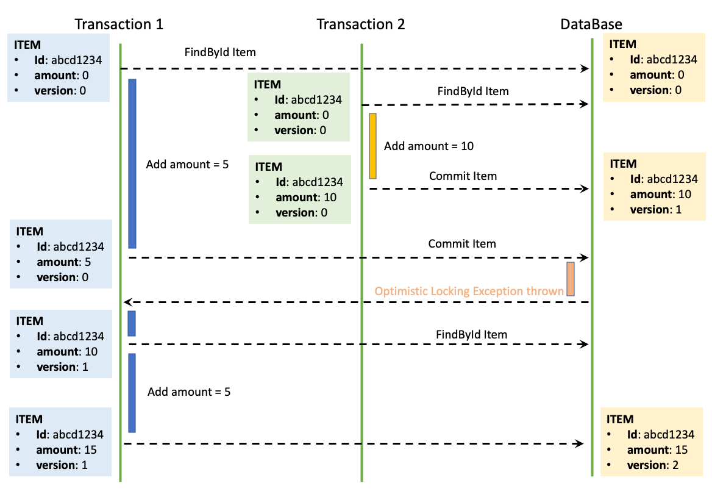
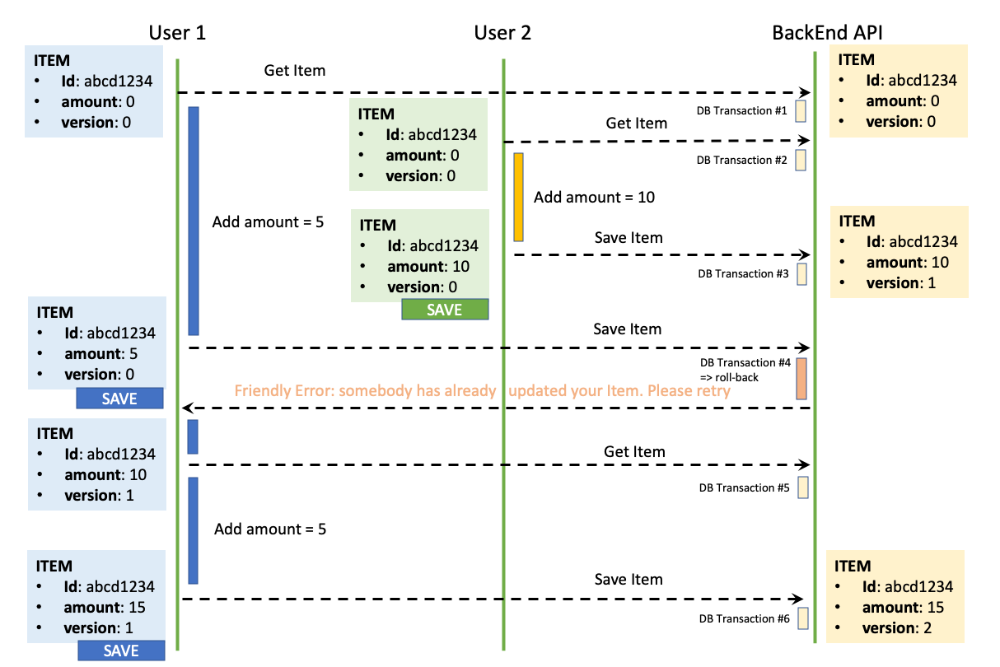

# 1 Silent Data Loss

* Second Lost Update Problem라고 불리기도 한다
* Silent Data Loss는 데이터베이스 트랙잭션 범위를 넘어서는 문제이다
* Optimistic Locking과 Pessimistic Locking을 통해 Silent Data Loss 문제를 해결할 수 있다
* 두 가지의 케이스를 보면서 Silent Data Loss 문제가 무엇이고 어떻게 발생하는지 알아보자


**Case1: Concurrent Database Transactions Problem**



[이미지 출처](https://blog.mimacom.com/en/media/09e2d94ce0bf9dbf72095d11944224b1/case-conc-transactions-problem.png)

* Transaction 1과 Transaction 2가 같은 상태의 아이템을 읽는다
* 두 트랜잭션이 한 아이템에 대해서 다른 수정작업을 한다
  * Transaction 1은 아아템의 amount를 5 증가시킨다
  * Transaction 2은 아아템의 amount를 10 증가시킨다
* Transaction 2가 먼저 커밋하고 수정 사항을 데이터베이스에 영속화한다
* 잠시 뒤 Transaction 1이 커밋하면서 Transaction 2의 수정사항을 덮어쓴다
* 아이템의 amount 15가 되는 것을 기대했지만 최종적으로 Transaction 2의 수정사항이 없어져 amount가 5가 되었다
* 이러한 문제를 Silent Data Loss 또는 Second Lost Update Problem이라고 한다


**Case2: Concurrent Long Conversations Problem**



[이미지 출처](https://blog.mimacom.com/en/media/efd318a9c771a396c89c05f3eeaa6bcf/case-conc-long-conversation-problem.png)

* 두 명의 사용자가 똑같은 아이템을 수정하고 있다([SAVE] 버튼이 있는 GUI 폼을 통해서)

* 두 명의 유저 모두 같은 상태의 아이템을 가지고 있다

  * 유저 1은 Transaction1을 통해 아이템을 가져온다
  * 유저 2은 Transaction2을 통해 아이템을 가져온다
  * Transaction1과 Transaction2가 종료된 상태에서 수정 작업을 진행한다
  * 즉 수정 작업은 트랜잭션 밖에서 진행된다

  * 트랜잭션을 계속 유지한다면 성능상 좋지 않기 때문

* 유저2가 SAVE 버튼을 눌러 수정을 완료하면 유저2의 수정 사항이 Transaction3을 통해 데이터베이스의 영속화된다

* 잠시 뒤 유저1이 SAVE 버튼을 눌러 수정을 완료하면 Transaction4를 통해 유저 2의 수정 사항을 덮어쓴다

* 아이템의 amount 15가 되는 것을 기대했지만 최종적으로 유저 2의 수정사항이 없어져 amount가 5가 되었다

* 이러한 문제를 Silent Data Loss 또는 Second Lost Update Problem이라고 한다


## 1.1 Silent Data Loss 해결책

* 해결책으로 3가지 선택 방법이 있다
  * 마지막 커밋민 인정
  * 최초 커밋만 인정
  * 충돌하는 갱신 내용 병합
* JPA가 제공하는 버전 관리 기능을 사용하면 손쉽게 최초 커밋만 인정하기를 구현할 수 있다


# 2 Optimistic Locking

* Optimistic Locking은 기본적으로 각 트랜잭션이 같은 레코드를 변경할 가능성이 희박할 것이라고 가정한다
  * 따라서 우선 변경 작업을 수행하고 마지막에 잠금 충돌이 있었는지 확인해 문제가 있다면 ROLLBACK 처리한다

* 데이터베이스가 제공하는 Lock 기능을 사용하는 것이 아니라 JPA가 제공하는 버전 관리 기능을 사용한다
  * 쉽게 말하면 애플리케이션이 제공하는 락
* 낙관적 락은 트랜잭션을 커밋하기 전까지는 트랜잭션의 충돌을 알 수 없다
* JPA의 @Version을 사용하면 트랜잭션이 출동하면서 발생하는 Silent Data Loss 문제를 해결할 수 있다
  * 엔티티에 버전 필드를 두어 이 문제를 해결하는데 자세한 과정은 아래를 참고하자


**Case1: Concurrent Database Transactions Solution**



* Silent Data Loss 문제를 위해 Item 엔티티에 version이라는 필드를 추가했다

  * 이 필드는 충돌이 있는지 확인하기 위한 용도이다

* Transaction1이 Item을 읽었다 이 때 Item의 version은 0이다

* Transaction2이 Item을 읽었다 이 때 Item의 version은 0이다

* Transaction2이 Item의 amount를 10 증가시키고 version을 1 증가시키는 UPDATE 쿼리를 보낸다.

  ```sql
  update 
      item 
  set 
      version=1, 
      amount=10 
  where 
      id='abcd1234' 
  and 
      version=0
  ```

* Transaction1이 Item의 amount를 5 증가시키고 version을 1 증가시키는 UPDATE 쿼리를 보내지만 예외가 발생한다

  * Transaction1이 Item을 조회할 당시 version이 0이기 때문에  version=0이라는 조건을 where절에 추가했지만 현재 Item의 버전이 version이 1로 증가 했기 때문에 이 조건을 만족하는 Item을 찾을 수 없다 이 때 JPA는 버전이 이미 증가한 것으로 판단해서 예외를 발생시킨다

  ```sql
  update 
      item 
  set 
      version=1, 
      amount=5 
  where 
      id='abcd1234' 
  and 
      version=0
  ```

* Transaction1은 예외 발생 이후 다시 Item(version1)을 읽어와 amount를 5 증가시키고 version을 1 증가시키는 UPDATE 쿼리를 보낸다

  ```sql
  update 
      item 
  set 
      version=2, 
      amount=15 
  where 
      id='abcd1234' 
  and 
      version=1
  ```

* 우리가 원하는대로 최종 amount가 15가 되었다


**Case2: Concurrent Long Conversations Solution**




# 3 @Version

* JPA가 제공하는 Optimistic Locking을 사용하려면 엔티티에 @Version 애노테이션이 붙은 필드가 필수적으로 필요하다
  * 이 필드를 버전 애트리뷰트라고 한다
* 버전 애트리뷰트가 있는 엔티티를 수정할 때 마다 버전이 하나씩 자동으로 증가한다
* 그리고 엔티티를 수정할 때 조회 시점의 버전과 수정 시점의 버전이 다르면 예외가 발생한다
  * 예: 트랙잭션1이 조회한 엔티티를 수정하고 있는데 트랙잭션2에서 같은 엔티티를 수정하고 커밋해서 엔티티의 버전이 증가한다. 이후 트랜잭션1이 커밋할 때 버전 정보가 다르므로 예외 발생


**Item.java**

* 엔티티 클래스 Item의 버전 애트리뷰트  `version`

```java
@Entity
public class Item {
  @Id
  private Long id;
  private Long amount;
  @Version
  private Long version;
}
```


## 3.1 버전 애트리뷰트 규칙

* 각각의 엔티티 클래스는 오직 하나의 버전 애트리뷰트만 가져야한다
* 버전 애트리뷰트의 타입은 *int*, *Integer*, *long*, *Long*, *short*, *Short*, *java.sql.Timestamp*만 가능하다


## 3.2 JPA Optimistic Locking 동작 방식

* 엔티티를 수정하고 트랜잭션을 커밋하면서 영속성 컨텍스트를 플러시한다
* 버전이 1인 엔티티를 수정하는 경우 아래와 같은 UPDATE 쿼리를 실행한다

```sql
UPDATE BOARD
SET
	TITLE="제목",
	VERSION=2
WHERE
	ID=1
	AND VERSION=1
```

* 데이터베이스 버전과 엔티티 버전이 같으면 데이터를 수정하면서 동시에 버전도 하나 증가시키는 것을 볼 수 있다
* 만약 데이터베이스에 버전이 이미 증가해서(1이 아니라 2라면) 수정 중인 엔티티의 버전(1)과 다르다면 수정할 대상이 없다 이 때는 버전이 이미 증가한 것으로 판단해서 JPA가 예외를 발생시킨다


## 3.3 Lock Modes


**LockModeType.java**

```java
package javax.persistence;

public enum LockModeType{
  READ,
  WRITE,
  OPTIMISTIC,
  OPTIMISTIC_FORCE_INCREMENT,
  NONE
}
```


### 3.3.1 NONE

* 락 모드를 적용하지 않아도 엔티티에 버전 애트리뷰트가 있으면 Optimistic Locking이 적용된다
* Second Lost Update Problem을 예방할 수 있다

**동작방식**

* 조회한 엔티티를 수정할 때 버전을 체크하면서 버전을 증가한다(UPDATE 쿼리 사용) 
* 이때 데이터베이스의 버전 값이 현재 버전이 아니면 예외 발생


### 3.3.2 OPTIMISTIC

* `NONE` 을 사용하면 엔티티를 수정해야 버전을 체크하지만 `OPTIMISTIC`을 사용하면 엔티티를 조회만 해도 버전을 체크한다
* 쉽게 얘기하면 한 번 조회한 엔티티는 트랜잭션을 종료할 때까지 다른 트랜잭션에서 변경하지 않음을 보장한다
* dirty read와 non repeatable read를 방지한다


### 3.3.3 OPTIMISTIC_FORCE_INCREMENT

* Optimistic Locking을 사용하면서 버전 정보를 강제로 증가한다
* 논리적인 단위의 엔티티 묶음을 관리할 떄 사용한다

**동작방식**

* 엔티티를 수정하지 않아도 트랜잭션을 커밋할 때 UPDATE 쿼리를 사용해 버전 정버를 강제로 증가시킨다
* 이때 데이터베이스의 버전이 엔티티 버전과 다르다면 예외가 발생한다
* 추가로 엔티티를 수정하면 수정 시 버전 UPDATE가 발생한다 따라서 총 2번의 버전 증가가 나타날 수 있다

> OPTIMISTIC_FORCE_INCREMENT는 Aggregate Root에 사용할 수 있다. 예를 들어 Aggregate Root는 수정하지 않았지만 Aggregate Root가 관리하는 엔티티를 수정했을 때 Aggregate Root의 버전을 강제로 증가시킬 수 있다


**동작방식**

* 트랜잭션을 커밋할 때 버전 정보를 조회해서(SELECT 쿼리 사용) 현재 엔티티의 버전과 같은지 검증하고 같지 않으면 예외가 발생한다


## 3.4 JPA Lock 사용


### 3.4.1 EntityManager

* 조회하면서 즉시 락 걸기

```java
entityManager.find(Student.class, studentId, LockModeType.OPTIMISTIC);
```

* 필요한 시점에 락 걸기

```java
Student student = entityManager.find(Student.class, id);
entityManager.lock(student, LockModeType.OPTIMISTIC);
```

```java
Student student = entityManager.find(Student.class, id);
entityManager.refresh(student, LockModeType.OPTIMISTIC);
```


### 3.4.2 Query

```java
Query query = entityManager.createQuery("from Student where id = :id");
query.setParameter("id", studentId);
query.setLockMode(LockModeType.OPTIMISTIC_INCREMENT);
query.getResultList()
```


### 3.4.3 NamedQuery

```java
@NamedQuery(name="optimisticLock",
            query="SELECT s FROM Student s WHERE s.id LIKE :id",
            lockMode = OPTIMISTIC_INCREMENT)
```


## 3.5 주의사항

* 버전 애트리뷰트는 엔티티를 통해 읽을 수 있지만 절대 개발자가 직접 업데이트하거나 증가시켜선 안된다
  * 벌크 연산은 버전을 무시하기 때문에 벌크 연산을 할 경우 버전 필드를 직접 증가시켜야한다
* 버전 애트리뷰트가 없어도 Optimistic Locking를 지원해주는 JPA 구현체도 있지만 항상 명시적으로 버전 애트리뷰트를 작성하자
* 위처럼 자동 지원하지 않는 구현체를 사용했을 때 버전 애트리뷰트가 없는 엔티티의 락을 얻을려고 한다면PersitenceException 발생


# 4 Pessimistic Locking

* 비관적 락은 이름 그대로 트랜잭션의 충돌이 발생한다고 가정하고 우선 락을 걸는 방식이다
* 데이터베이스가 제공하는 락 기능을 사용한다
* 대표적으로 `select for update` 구문이 있다


## 4.1 Lock Modes

* JPA에서 사용할 수 있는 3가지 모드
* `PESSIMISTIC_READ`: shared lock을 획득해서 다른 트랜잭션이 데이터를 업데이트 하거나 삭제하는 것을 막는다
* `PESSIMISTIC_WRITE`: exclusive lock을 획득해서 다른 트랜잭션이 데이터를 읽기/업데이트/삭제하는 것을 막는다
* `PESSIMISTIC_FORCE_INCREMENT`: `PESSIMISTIC_WRITE`와 똑같이 작동하며 추가적으로 versioned 엔티티의 version 애트리뷰트를 증가시킨다
  * versioned 엔티티란 @Version 애노테이션이 붙은 엔티티를 말한다


**LockModeType.java**

```java
package javax.persistence;

public enum LockModeType{
  ...
  PESSIMISTIC_READ,
  PESSIMISTIC_WRITE,
  PESSIMISTIC_FORCE_INCREMENT,
  ...
}
```


### 4.1.1 PESSIMISTIC_WRITE

* Pessimistic Locking이라고 하면 일반적으로 이 모드를 뜻한다


### 4.1.2 PESSIMISTIC_READ

* 일반적으로 잘 사용하지 않는다
* 데이터베이스 대부분은 방언에 의해 PESSIMISTIC_WRITE로 동작한다


### 4.1.3 PESSIMISTIC_FORCE_INCREMENT

* Pessimistic Locking 중 유일하게 버전 정보를 사용한다
* Pessimistic Locking이지만 버전 정보를 강제로 증가시킨다


## 4.2 타임 아웃

* Pessimistic Locking을 사용하면 Lock 획득할 때까지 트랜잭션이 대기한다
* 무한정 기다릴 수는 없으므로 타임 아웃 시간을 지정할 수 있다
* 대기시간 동안 응답이 없으면 javax.persistence.LockTimeoutException이 발생한다
* 데이터베이스 특성에 따라 타임아웃이 동작하지 않을 수 있다


참고

* [Pessimistic Locking in JPA - Baeldung](https://www.baeldung.com/jpa-pessimistic-locking)
* [Optimistic Locking in JPA - Baeldung](https://www.baeldung.com/jpa-optimistic-locking)
* [Testing Optimistic Locking Handling with Spring Boot and JPA - mimacom](https://blog.mimacom.com/testing-optimistic-locking-handling-spring-boot-jpa/)
* [Testing Pessimistic Locking Handling with Spring Boot and JPA - mimacom](https://blog.mimacom.com/testing-pessimistic-locking-handling-spring-boot-jpa/)
* [자바 ORM 표준 JPA 프로그래밍](http://www.kyobobook.co.kr/product/detailViewKor.laf?mallGb=KOR&ejkGb=KOR&barcode=9788960777330)

