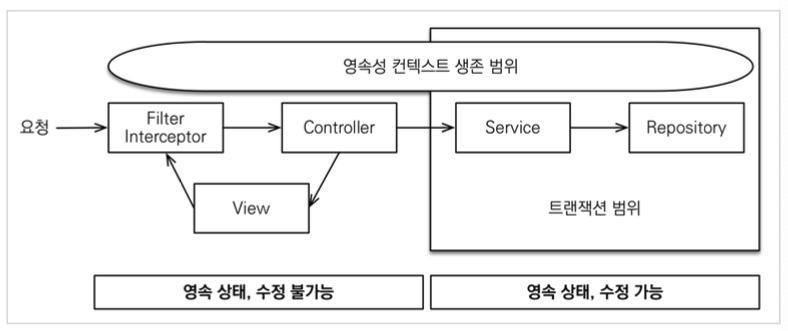
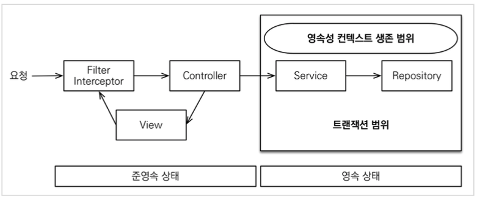

# 1.OSIV

* Open Session In View(하이버네이트에서 사용하는 용어)
* Open EntityManager In View(JPA에서 사용하는 용어)
* OSIV란 영속성 컨텍스트를 뷰까지 열어둔다는 뜻이다
  * 따라서 뷰에서도 지연 로딩을 사용할 수 있다.

# 2. OSIV 활성화



* 트랜잭션 시작처럼 최초 데이터베이스 커넥션 시작 시점부터 API 응답이 끝날 때 까지 영속성 컨텍스트와 데이터베이스 커넥션을 유지한다.

**장점**

* View Template이나 API 컨트롤러에서 지연 로딩이 가능하다
* 지연 로딩은 영속성 컨텍스트가 살아있어야 가능하고, 영속성 컨텍스트는 기본적으로 데이터베이스 커넥션을 유지한다.

**단점**

* 너무 오랜시간동안 데이터베이스 커넥션 리소스를 사용하기 때문에, 실시간 트래픽이 중요한 애플리케이션에서는 커넥션이 모자랄 수 있다.
* 예를 들어서 컨트롤러에서 외부 API를 호출하면 외부 API 대기 시간 만큼 커넥션 리소스를 반환하지 못하고, 유지해야 한다.

**application.properties**

```properties
# OSIV 활성화 기본값 true
spring.jpa.open-in-view = true
```


# 3.OSIV 비활성화



* OSIV를 끄면 트랜잭션을 종료할 때 영속성 컨텍스트를 닫고, 데이터베이스 커넥션도 반환한다. 따라서 커넥션 리소스를 낭비하지 않는다.
* OSIV를 끄면 모든 지연로딩을 트랜잭션 안에서 처리해야 한다.
* View Template이나 API 컨트롤러에서 지연로딩이 동작하지 않는다.

**application.properties**

```properties
# OSIV 비활성화
spring.jpa.open-in-view = false
```

 

## 3.1 OSIV를 끈 상태로 복잡성을 관리하는 좋은 방법

* 보통 비즈니스 로직은 특정 엔티티 몇개를 등록하거나 수정하는 것이므로 성능이 크게 문제가 되지 않는다.
* 그런데 복잡한 화면을 출력하기 위한 쿼리는 화면에 맞추어 성능을 최적화 하는 것이 중요하다
* 크고 복잡한 애플리케이션을 개발한다면, 이 둘의 관심사를 명확하게 분리하는 선택은 유지보수 관점에서 충분히 의미 있다.

**예시**

* OrderService
  * OrderService: 핵심 비즈니스 로직
  * OrderQueryService: 화면이나 API에 맞춘 서비스 (주로 읽기 전용 트랜잭션 사용)


# 4. OSIV를 켜야할까?

* 성능상 OSIV를 끄는 것이 좋다
* 고객 서비스의 실시간 API는 OSIV를 끄고, ADMIN 처럼 커넥션을 많이 사용하지 않는 곳에서는 OSIV를 키는 편이 좋다